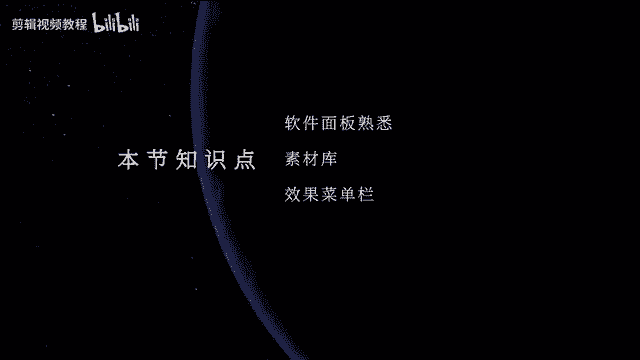
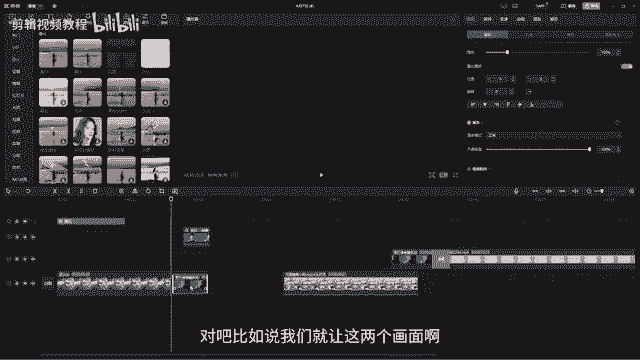

# 【剪映教程】： B站最良心的2024剪映电脑版全套教程（适合零基础小白学习） - P9：【电脑版】素材库和效果菜单 - 视频号运营新手教学 - BV1xm21YhE1E

嗨大家好，欢迎来到我们的剪映PC教程。好，那今天这节课的话呢，我们就要进入到剪映的软件里面去进行它的学习。那么今天这节课我们就直接进入到剪映的面板里面去点击开始创作。那这个时候稍微等一下。

它就会进入到它的这个面板里面。那剪映的一个面板工程的话，相对来说是比较简洁的，大概的话呢就分为我们的这四大块。首先我们先来看一下我们左上角的这一块素材效果面板。好，为什么呢？因为我们的很多素材导入进来。

是需要放在这里面的，同时呢我们可以看到上面有很多的一些功能小按钮。那这些就是我们的特效小按钮啊。那还有下面就是我们的一些素材库。那我们导入素材的话都是会放在我们的这个空白的这个地方啊。

所以这个界面的话呢，我们可以称之为是我们的素材效果面板。好，中间这一块的话呢是。播放器，那就是我们在时间线上去剪辑什么样的内容，它就会在这里播放什么样的画面。那旁边的这个的话呢。

是我们的就是我们的整个项目的一些参数。那如果我们时间线上有内容的话呢，这个区域也会成为我们的效果控件面板。哎，就是我们要来调整视频的一些参数的面板。那我们可以在这里面去调节。

最大的这个的话呢就是我们的时间线。那我们要剪辑视频，要剪辑音乐，那都需要在这一块里面去完成。那我们的时间线跟我们的播放器的话，它们两个是实时对应的啊。O那对我们的剪映整个面板做一个简单的了解之后呢。

那我们开始进入到各个面板的详细学习当中来。首先我们先来看一下我们的效果素材面板，就是我们在做任何事情的时候，都是需要先有素材后才会去添加它的这些特效啊，因此我们先来学习它纵向的这个菜单。然后呢。

就是我们的素材库。O首先我们可以先看一下，它这里它就分为我们的两这三类，一类是本地一类是是这个云素材，一类是我们的素材库。那本地是什么呢？本地的话呢，其实就是我们要自己导入的素材。比如说我们这边啊。

之前我们打开的这个漫画啊，然后呢这边有很多的素材，那我们就可以把我们需要的素材直接按着不动给它拖进来收走。然后这样的话呢，我们的这个素材呢就导入进来了。或者是你可以在这里面去啊去给它这里有一个按钮。

然后点击导入。那这个时候呢，我们也可以直接到我们的这个页面里面啊，比如说进入到这里，然后呢去导入对吧？那这样的话我们的素材也是啊也是直接就导入进来了，O那下面这里云素材是什么意思呢？那云素材的话呢。

大家还记得吗？我们刚刚前面讲到我们的这一个剪映的主页面吧的时候呢，它那里面有一个功能啊，就是我们这里有一个叫做我的云空间。那当时我们还给它丢了一个素材进去啊。那这个的话呢就对应到我们的云素材那边来。

比如说我们现在啊。好，进入到哦刚刚我们的这个面板里面。那么我们刚刚导入的一些素材，就是在我们的云空间里上传了什么素材。然后这个时候呢，你就可以在云素材这个地方去找到，这个是不就是我们之前导入的。

还有一些是我之前导入的，对不对？然后呢，我们需要调过来用，那我们直接点击这个地方叫做下载，然后呢就去点击，就是大家要知道它的一个工作流程。可能有同学就说来了，那我在这里还要下载。

那为什么我不直接导入素材呢？这里面的话呢，就我们要去理解它的一个剪映的一个云空间的工作模式啊，比如说我在这里画三个三个框框啊，三个框框。OK然后呢，第一个框框我话呢是我们自己本地的。

就是我们自己的磁盘啊，自己的磁盘。然后呢，这个是云磁盘啊，云空间。然后呢，这个是我们的电脑，啊，就是我们工作的这个电脑。对不对？那么我们在电脑上去操作的时候，导入素材无非就是两种。

OK我们把这个本地的素材好，导入到我们的电脑上去操作，对不对？那这个时候我们就需要连接在我们这个电脑上去连接我们的硬盘啊，打个比方，比如说我的硬盘，我忘记带了的情况下。

我是不是就没有办法去制作我们的这个视频了，对不对？是不是就会出现这种情况，或者是我们的硬盘损坏了，丢失了，或者是我们的素材不小心被删掉了，那这个时候是不是就会影响我们的工作进度啊？

那如果我们把这个素材导入到云空间里面去，然后呢，我们在制作的时候，再从云空间里把素材啊，然后呢导入到我们的电脑上。那这样的话，我们当我们的本地素材出现丢失，或者是出现异常的时候。

我们是不是可以直接在云空间里面去操作。并且云空间的话呢，它。跟你的这一个账号，他们两个是一起的，只要你的这个账号一直在啊，就跟你的账号对不对？好，他跟你的账号是一起的，只要你的账号不被注销。

只要你的账号一直在，那它云空间里面的素材它就不会丢失啊。哪怕你的这一台电脑出现了问题。比如说蓝屏。哎，郎屏啊或者是崩溃了，对吧？或者崩溃了，或者是损坏了啊，或者是损坏了啊，不管它发生了什么事情。

只要我们的账号在，那么我们的素材就不会有问题啊。因此云空间的话，它就像是一个虚拟的储存素材，我们把素材放到这里面是为了保护我们的项目能够顺利进行。那我们的电脑和硬盘啊，电脑和硬盘。

它们毕竟是我们的实物的东西，那它多少会受一些物理伤害，或者是一些物理问题，可能会出现崩溃的这种情况啊，那这个时候就可能会比较影响我们的一些工作进度。因此啊这个云空间的话呢。

我们可以把一些常用的素材给它放到这里面来。那这样的话我们就不用每一次剪辑的时候都要打开硬盘来操作了。哎，它的一个工作原理，是这样。好，那了解了它的一个工作原理以后，那我们可以看到云素材里面，对不对啊。

它有这些素材。比如说我放了这些，那我们传到云素材以后，它就已经不属于我们本地的磁盘的内容了。因此我们需要要调用它的时候，我们需要去怎么样要去下载它啊，因此它这里面会有一个下载，对不对？好。

然后呢我们去点击一下去下载。等它这个圈圈转完了以后，那么我们就可以把素材怎么样直接拖到我们的时间线上。然后呢，是不是就可以去剪辑它了？O那这个是我们的云素材。好，我们再来看一下这里面的素材库。

那这个素材库跟我们上面这两个是什么意思呢？就是这个素材库是软件本身自带的素材库，你不用登录你的账号，它都有，只要你安装这个软件它都会有，并且这些素材的话呢，跟当下抖音比较火的一些视频素材呢都会有。

比如说我们可以看到像这个nice呢这个老头，对不对？还有这个what啊，这个O然后呢这些素材啊，我们。视频的时候是不是最常用，对不对？除了这些，它下面还有很多，比如说有背景啊背景。

那我们在制作片子的时候没有背景，我们就可以直接下载它这些背景，然后呢直接来使用。好，比如说我们就随便下一个，然后点击这个加号或者是我们直接拖都可以啊，点击加号，它就会自动的进入到我们的时间线上。

是不是就有这个背景啊，那还有一些是片头，那这个片头的话呢，就是它做一些倒数的呀，或者比较炫酷的一些特效啊，这些特效。好，然后呢我们直接用就行了啊。比如说我们就下载一个小新的。Yeah。🎼嗯。对不对？

然后是不是就比较有意思哈，也是一样哎拖进来好，拖进来以后，是不是就哎呀我们是不是就可以直接引用，就不需要我们自己再去操作一遍然后再去设计我们的片头啊，那还有片尾，对不对？那影片结束以后。

我们是不是会加一个片尾。好，这上面也有很多啊，有很多。好，然后像这种点赞收藏哦，或者是拜拜等等之类的啊，O转场对不对？还有很多这种转场的效果啊，这种nice啊，或者是很多啊，还有故障动画嗯。😊，🎼好。

这一些素材啊，这些素材还有空镜。哎，那像是一些商窗啊、花呀、树呀、水呀，然后或者是一些天空云啊等等城市空镜，然后这些素材的话呢，都是有我们都不需要自己去下载啊。比如说像这个它就是一个城市下雨的这个玻璃。

然后呢就比较有质感。那我们如果你要自己到网上去找这个素材是不是很麻烦，对不对？好，那我们就把它。OK然后我们要给它哎拖到时间线上，那这个时候它是不是就哎就直接就可以引用。好，然后下面还有很多啊。

它这个素材库里面的素材类型非常非常的多，然后呢还有氛围的。对吧还有绿木，哎这个绿木就比较常用了啊，那我们的一些绿木素材。比如说像刚刚的这个呃小人对不对？那我想把它哎跟我的这个画面放在一起。

那我是不是把它的这个背景给它呃处理掉就可以了，对不对？好，这里面我大概给它呃给大家这么去啊测试一下，就是去演示一下，那么我们待会儿啊我会详细的讲这个面板，好，我们有专门抠抠像的这个面板，对吧？

那这样的话是不是我的这个小人跟我的这个背景是不是就合在一起了。好，那后甚至你可以把这个小人跟你的哎任何一个背景，你喜欢的背景都可以给它放在一起，O那这个是我们的绿木素材啊，它下面也有非常非常的多啊。

然后大家可以去选自己喜欢的O那素材库的话呢，我们就先讲到这里。然后呢我们大家可以对应的看一下，对吧？当我们选中素材时候，我们这边的话呢，我们的效果控制面板，还有。的一些参数的话，它就已经出来了。

我们就可以在这边去调节啊。好，然后呢那这个面板的话啊，就是当我们没有选素材的时候，那它就会变成我们草稿的参数啊。所以我们要去调整视频的参数。我们需要选中时间线上的内容。然后呢我们才能去调节。

那这一个的话呢，我们之后会有专门的课程，然后详细的把每一个步骤都给大家去进行讲解啊。那今天的话呢我们先来学习我们这边的一些效果。O把目光移动到我们这个项目窗口的最上面这一块啊。

那这上面的话呢就是我们的一些贴纸，还有特效面板，我们称之为效果菜单栏。好，那我们先来看一下贴纸啊，那贴纸的话呢，就可以用来加一些可爱的小动画。比如说哎点击下方链接，关注点赞和加评论等等之类的，都会有。

对不对？比如说这个是点赞啊。好，点击一下。🎼今？对吧它就可以在我们的画面中，然后呢就可以加一些比较可爱的小动画来进行包装啊。它有非常多啊，有热门的就有线下网络上比较火的一些效果。

同时呢也有VIP就是需要你购买VIP以后，这上面有一些VIP的话，就说明你只有啊你那个你只有购买VIP了以后，你才能把这个效果导出出去啊，那这个是VIP啊，有很多啊，还有一个是爱心，对不对？

一些小爱心啊，各种不灵不灵的效果。那这上面它的类型呢也是非常非常的多啊，它针对不同的影片类型，然后呢会有不同的一些对应的小贴纸，然后呢去满足我们制作影片的各种需求啊。然后呢那这一个的话呢。

大家可以自己去尝试一下啊。好，那这是贴纸。那我们再来看一下。第二个就是我们的特效。那特效面板的话呢，我们在制作视频的时候呢，少不了是要给我们的视频去添加特效的。比如说我们可以看一下我们这一朵花。对不对？

这朵花，然后这朵花我们现在看的时候，它就平平无奇啊。那我们可以在上面去加什么特效呢？好，比如说它这里分为画面特效，还有我们的人物特效。我们先来看第一个画面特效，那画面特效里面它也是有非常非常多的内容。

哎，你可以加这种哎，闪一闪的这种效果，对不对？好，点击一下，那这样的话你的视频是不是就会加了一些这种很很可爱的这种视频，或者是比较有动感的这种视频。好，在我们做一些卡点视频的时候呢，就可以用。好。

还有这种对不对？哎，就发光啊，就让我们的画面就更加有这种更加有感觉啊，有氛围，好，还有一些是这种对不对？哎慢慢的模糊啊，从虚化到模糊啊，还有非常多啊，这上面哎扫一遍，对不对？哎，这种去扫就很帅气啊。

做那种赛博朋克风的时候呢，也可以去用啊，好，还有这一些啊撒花啊，撒这种花瓣，对不对？哎，就比较有有感觉啊。那除了热门。还有很多啊，也是一样，有VIP对不对？它可以针对你不同的影片类型。

然后给你出了很多很多的这些效果。那这些效果的话呢都是非常酷的啊。然后呢，同时也是呃非常的这种常用，那我们要如何把它加入到我们的视频当中呢，比如说我现在要给他啊，比如说我就加给我们的这个小人。对不对？

加给这个小姐姐这个视频。那我们怎么去加呢？我们可以直接怎么样？好，直接给它拖下来，让它放在我们的时间线上。那这样的话，我们时间线上所有的素材，它都会有怎么呀？哎，它都会有这个发光的这个效果啊。

那这个是第一种添加方法。那还有第二种添加方法是什么呢？就是你可以直接给它拖到我们的视频里面，O比如说我们选中它，哎，到时间线上的时候，你不要松手，然后直接放在我们的视频上，对不对？

当你的鼠标放在视频上的时候，画面就会有呈现这种灰色的情况下，那这样的话，你的这个效果它只作用在你选中的这一段视频上，哎，其他的就没有效果了。那刚刚拖到时间线上，是不是只要我时间线上，就是这个效果。

下面有内容，哎，我都可以作用到我们这个视频里面，对不对？那如果你拖到我们的视频上啊。拖到视频上，那现在是不是就只有我们的这个视频有效果，对不对？OK然后那我们这种添加了这个特效以后呢。

我们可以在我们的效果面板这边去调它的一些参数啊，比如说我们觉得这个发光，它的这个滤镜太大了，你可以唉你可以调小一点，对不对？好，发光呢你可以调小一些啊，好，数量呢调小一点，那就不要那么明显。好。

大小的话也可以调小。那这样的话我们的怎么样，哎就它的这个光晕就没有那么强烈啊。那这个就是我们的特效。好，这下面也是有非常非常的多啊，就特别特别多，不同的影片，然后你想做多少都可以啊，那你可以用，对不对？

好，做一辈子的视频呢，可可能你都不一定能用得完啊，那这个是我们的特效也是一样，大家有时间的话呢，可以自己每一个每一个选项你都去使用一下啊。那我们的特效里面呢，它还有一个是这个叫做人物特效。

那这个人物特效，刚刚我们就。这个画面特效的话呢，它是针对的是我们所有的视频啊，所有的视频都可以添加。那我们的人物特效的话呢，它会自动去识别人物的五官，然后呢会去给它添加一些更加炫酷的效果。

OK比如说我这边导入一个这个人物对不对啊，导入这种人物视频啊，那这样的话我们在选特效的时候，选择人物面板，这里面它会自动去识别人物的五官，然后呢，根据人物的五官呢去做特效啊。

比如说啊比如说我们这个面部扫描，对不对？O是不是它会自动的去扫描人物的面部，那我们在做一些比如说那种赛博朋克风啊或者是宣传片的时候，是不是就可以很方便啊，很快捷的去做出这种有科技感的效果。

O除了这个还有这个啊，它也会根据人物的。对吧它会在人物的身上去做一个这种像电流的扫描这种效果。OK那像这个哎可以做这种效果。哎，那这个的话它只针对于人物，对不对？它会去自动识别人物的五官啊。好。

还有这种。哎，就做点咯。对吧还有这种来让人物的脸做一个变形，对不对？并且呢哎还还挺有意思的啊？好，这个是我们的人物特效。就是呃大家注意就是画面特效，它针对的是所有的画面啊，它不管你是人事物，对不对？好。

有有人还是没有人动录还是什么都可以啊。然后呢那我们的人物特效，更多针对的是人物有五官的情况下，它会自动识别人物的五官，然后呢就给它针对它的五官呢去做一些特效啊。那这个的话呢就是我们的好特效面板。

O然后呢我们再来看一个就是我们的转场面板。O转场面板的话，我们在剪辑的时候，少不了要给视频去加一些转场，对不对？哎，尤其是在我们的视频啊，两段视频。好，比如说我们现这这个视频跟下面这个视频。好。

我们在剪辑的时候如果没有这个转场的话呢，就会缺少一些动感和特效。那这个时候我们就可以用这些转场啊，你可以直接比如说你选中这两个画面直接点击加号。哎，然后呢这个时候它就会自动的加上来了，看到没有？好。

然后呢现在我们的这个画面。对不对？是不是就有这种这种涨场效果，那你也可以自己手动的拖啊，直接拖上来，对不对？好，直接拖上来啊，那它的添加方法的话呢就有两种嘛，对吧？拖进来好，像这一些啊。

比如说我呃我现在大概把这个。好，这些做一个剪辑啊。对吧好，像这个我也做一个剪介啊，像下面这两种对吧？像这两种也是一样啊。好，我们把这个音量可以调小一点。OK那像这两个也是一样啊。

我们再找一个啊找一个对吧？好像这种呃转动的啊，下载一下，哎，给它拖下来。OK然后它是不是就可以做这种旋转的效果呢？比较有意思啊，那这里面也是有非常多啊，除了热门的，就是当下比较流行的。

还有啊VIP的叠画，对不对？叠画转场啊，就是有这种荡入当出的这个效果啊。好，比如说我们现在看到这两个做淡入淡处啊，我觉得这张图不是很好看啊。对吧比如说我们就让这两个画面啊做一个这种。

对吧好，然后呢做一个当出啊荡入荡出的这个效果叠画。好，然后呢好直接拖进来。对吧它就会有这种唉这种这种转场是不是会更加有感觉啊，同时呢也会让我们的画面更加有高级啊？还有这种岁月的痕迹，对不对？

OK然后转一下，然后呢，还有一些还有非常多啊，这上面还有非常多，哎，它会做很多多种分类啊。还有一个是运镜，就是运动镜头啊，这种比较炫酷旋转啊，拉近啊，拉远啊等等，它这都有名称啊，O幻灯片还有光效拍摄呃。

扭曲故障对吧？眨眼分割自然MG动画啊，比如说这种好嗯MG动画对吧？好拖进来。对不对？啊它就会唉有这种效果啊，你可以拉远一点，就是你把你的鼠标放在你的这个特效上啊，选中特效，然后呢把它的时长可以拉远。

那这个时候你会发现在我们的效果面板这边呢，它的时长呢也会发生对应的改变。所以你要改变时长，你可以直接在这里面去拉它的长度，你也可以在这边去调整它的时长啊，OK然后呢，现在它就会哎就会更加清晰。

比较缓慢一些啊，这是MG，还有一个是这种互动的，对不对？哎，互动的。哎，比如说有这种小妖怪的这种小恶魔啊。对对，好，拖过来啊，小恶魔。对，哎，时长太短了，好，拉长一些啊。对不对？哎，过来哦好。

还有这种综艺比较常用的，比较可爱的啊，比较搞笑的那我们的转场的话呢就有这么多个啊，那也是一样，大家在课下的时候可以自己去整理一下。然后呢自己去熟悉一下。ok那学习完我们的这个特效的话。

那我们这上面的所有的这一些啊，还有我们其实我们这还有很多，但是呢我们之后会有不同的课程内容，然后呢会详细来讲解啊。好，今天的话我们就先到这里，那我们就下节课再见。

