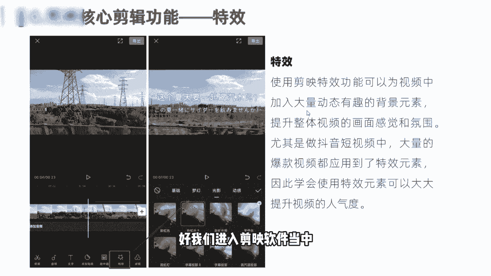
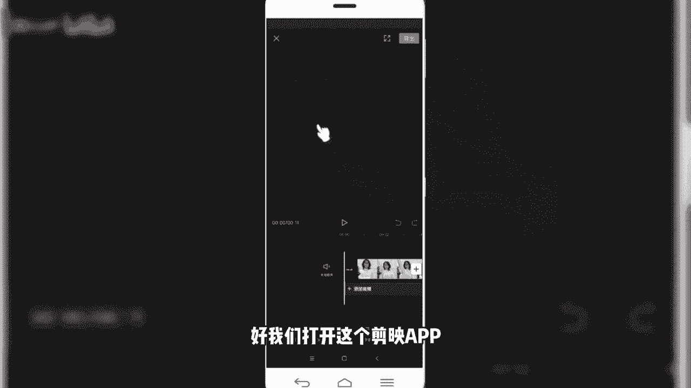
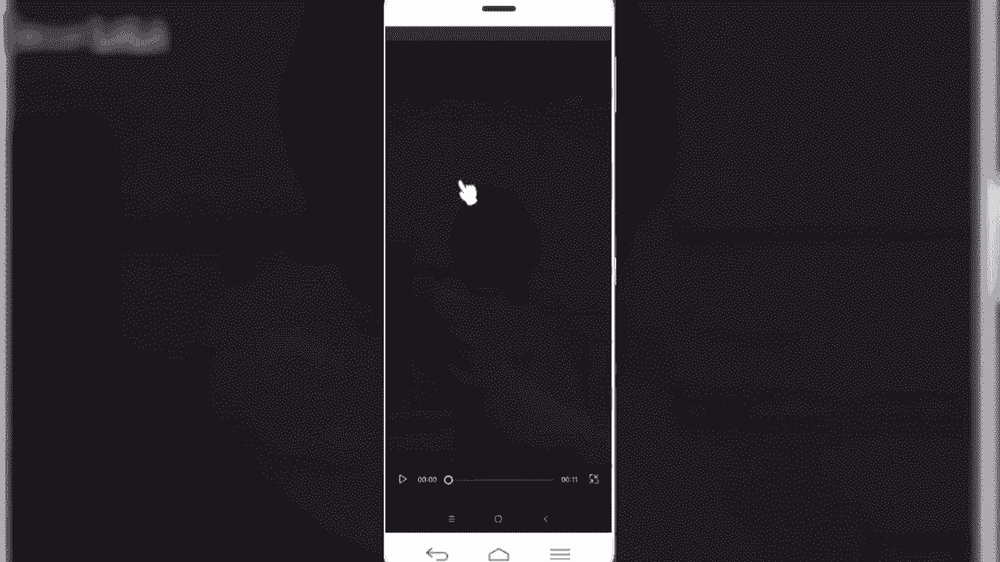
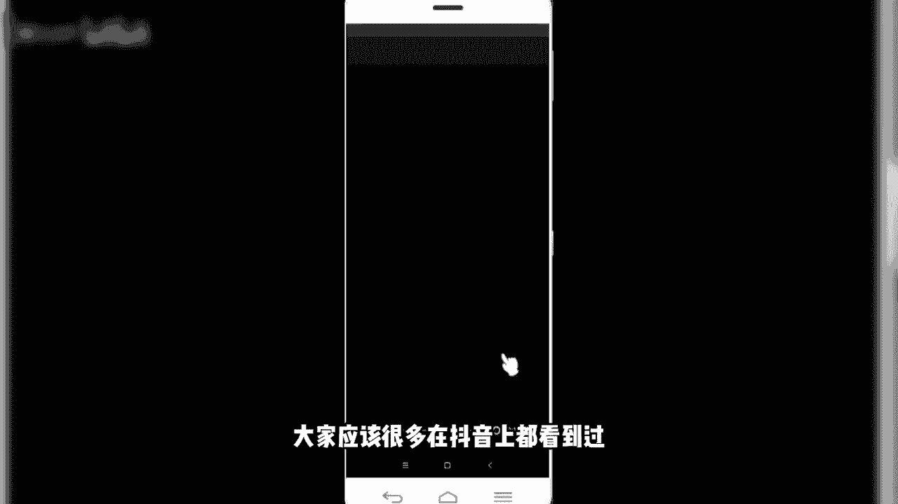
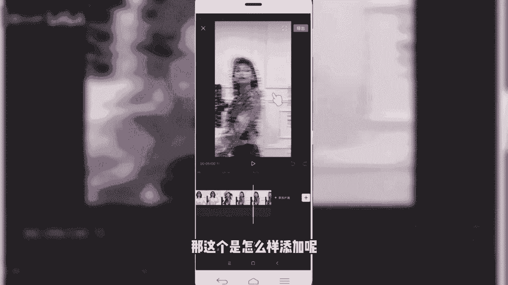
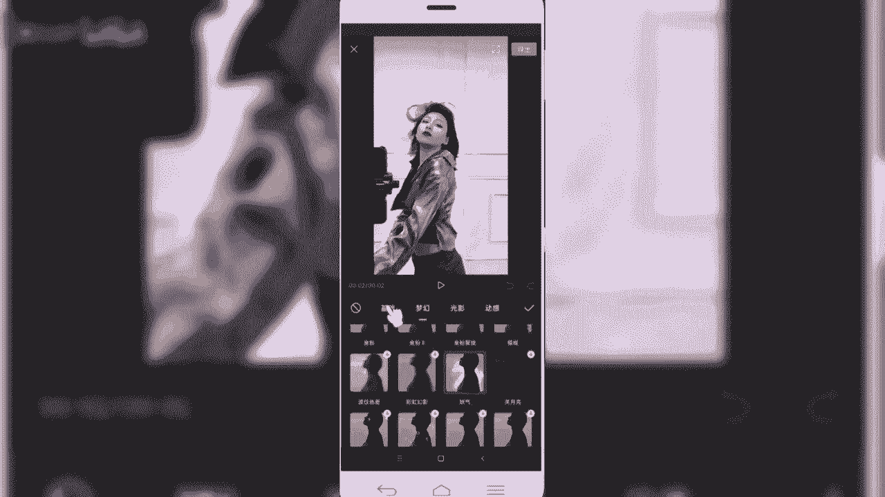
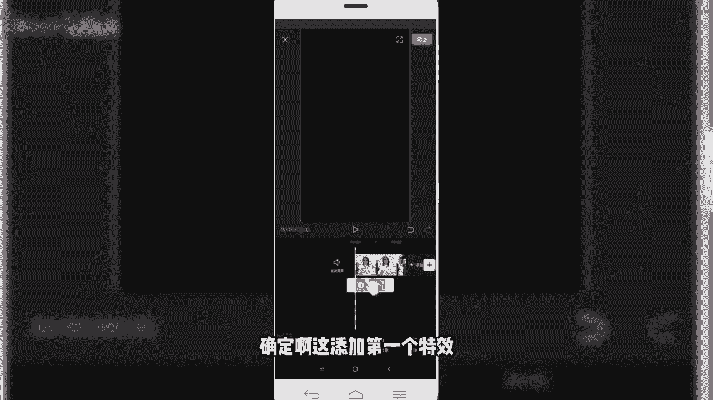
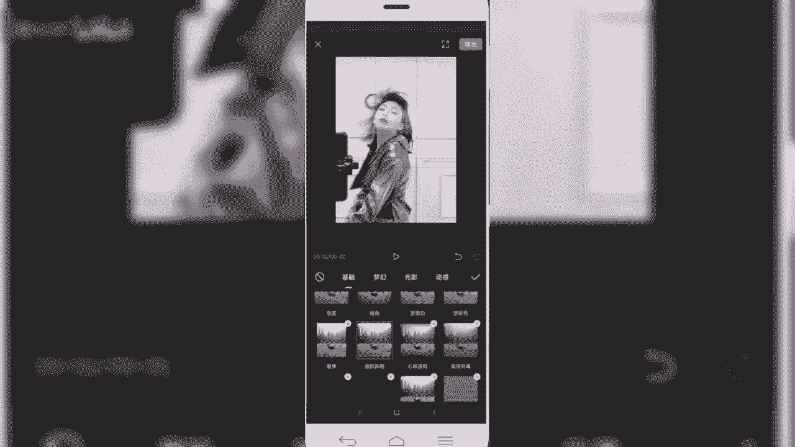
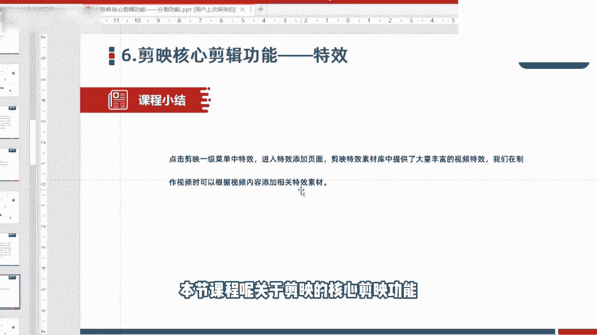

# 【剪映电脑版全289集】比付费还强10倍的自学剪辑全套教程，全程通俗易懂，别再走弯路了，小白看完速通剪映短视频剪辑！ - P17：15.抖音核心剪辑功能—特效 - 巴嘎布拉克 - BV1B9xreMEMH

咱们今天呢接着给大家分享的是，剪映的核心剪辑功能特效，其实早期在玩抖音视频的小伙伴啊，都会知道啊，在抖音当中啊，拍视频的有很多拍视频的道具，那么我们在拍视频的时候，借用这些道具。

可以拍出来很多搞笑有意思的这种视频，那么在剪映当中的特效也正是借鉴了这一元素，通过在视频当中植入一些特效的效果，让我们的视频呢变得更加的生动有趣好，那么今天呢就给大家分享的是。

关于如何使用特效的这个功能。

在剪映的特效功能当中啊，他加入了大量的一个特效素材库，那我们通过在视频当中植入相应的特效，视频元素，可以大幅度提升我们视频的整体的一个，画面感觉和氛围，尤其是在做一些变装类啊，或者是反转类的视频当中了。

可能会大量的用到一些特效的元素，有有些专门做那种美妆类的，可能用的特效因素会非常多啊，因此对于我们想要学习剪映剪辑的来，小伙伴来说的话，学会运用特效，对我们后期提升整体的一个视频效果来说，帮助非常大。

拿我们前段时间特别火的那个视频，变装甩头发来例，美丽当时这个视频也是非常简短，短短十几秒一个换装的视频，然后呢给人的效果耳目一新，在这个视频当中，就用了大量的一个特效的元素好，那关于特效介绍这块。

我们就先到这块，然后呢，接下来是跟大家一块儿进行一个实操的演练，好我们进入剪映软件当中。

好我们同样首先呢是先看一下这个成品。

好我们打开这个检验app。

然后呢先播放预览一下成品，看看。

每日来到瓦伊玛，Lla lla li like you，呃相信这个视频呢，就前段时间大家应该很多在抖音上都看到过。

像这个视频当中啊，就运用了大量的特效元素啊，我们首先看开场这块，那开场这块他是借用到了一个什么模糊变清晰，这样一个特效元素，那紧接着第二个的话是他在这个跳舞的时候，背景运用了一个什么啊。

也是一个紫色这样一个特效元素，那包括最后啊出现这个抖动的模糊智障啊，这也是一个特有元素，那这个是怎么样添加呢。

啊大家不要着急，我们待会给大家演示一下，好我们首先呢是打开开始新建。

然后呢我们选择一个相应的素材，好导入到项目当中，好我们先预览一下，原素材呢可能是这种效果，那么我们怎么样给他添加特效呢，首先是开场那块有一个模糊变清晰啊，点击底部的特效，好然后我们选择这会看到了没有。

有一个基础类的特效变清晰，我们点击好，那么就相当于给视频添加上这样一个模糊，变清晰的一个特效，是第一个，然后我们接着再看，第二个就是我们看到的在跳舞的时候，背景又添加了一个什么紫色的啊，妖起特效。

我们同样选中，啊这第二个特效好，我们挨个先添加第一个。

变清晰，确定啊，这是添加第一个特效。

然后呢紧接着再给它再添加另外一个特效，返回到我们的上一层菜单，然后新增特效再给它添加一个啊，添加一个什么梦幻类别啊，有一个叫妖气，就是他跳舞那一段好，我们来听下第二个特效。

那第三个特效呢我们同样啊把这个时间轴拉长，第三个是在上甩头发这一块还有一个特效，我们再新增一个特效，那甩头发这块是用了一个什么动感的啊，横纹制造，我选择这个制造，好我们调整一下，调整一下时长。

来看一下基本的效果，啊基本上就是我们想要的这种效果，当然我们这块还有一个少的，缺少了一个什么呢，缺少了一个背景音乐，如果我们添加上背景音乐的话，那这个效果看起来就会更加的明亮。

那那这一块的话就是我们看到的视频当中，借用了大量的这种特效，而且这个特效呢它是支持叠加的啊，我们可以反复的添加特效，你看新增特效还可以添加啊，这块有很多特效，我们可以在创作视频的时候可以多尝试啊。

尤其是我们看到的，比如说基础类的开幕啊，变清晰变模糊，聚光灯，电影感放大抖动，这些都是我们看到的最常用的用的，在抖音视频当中用的比较广泛的，像闭幕录像机噪点，相机方格等等，这些用都是非常广泛的，啊。

OK那这块关于视频特效我们就介绍到这块。

那接下来的话，我们同样是点击剪映的一级菜单中特效，那么我们进入特效的添加页面，剪映app啊，本身关于特效素材这一块，提供了大量的素材内容，我们可以根据相应的要求，或者是根据我们视频创作中的需求。

直接选用相关的特效素材，添加到我们的视频当中即可，这块呢建议大家小伙伴在后期创作过程中，可以多尝试，多练习，因为抖音本身也是在推不同的新的视频形式，那么我们在创作的时候也可以进行大胆的尝试。

和不同不同的风格这样一个练习啊，对于我们后期的创作视频来说，是一个非常大的帮助好了，本节课程呢关于剪映的核心简易功能。

特效功能就给大家分享到这里。