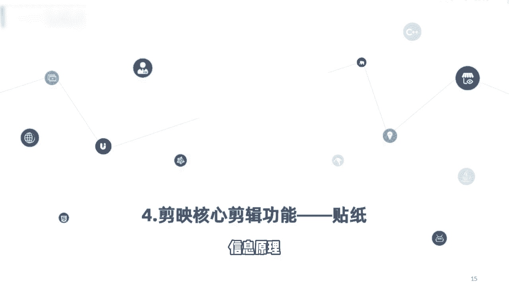
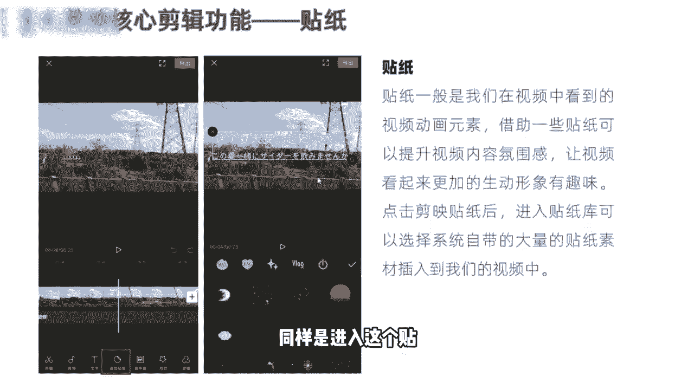
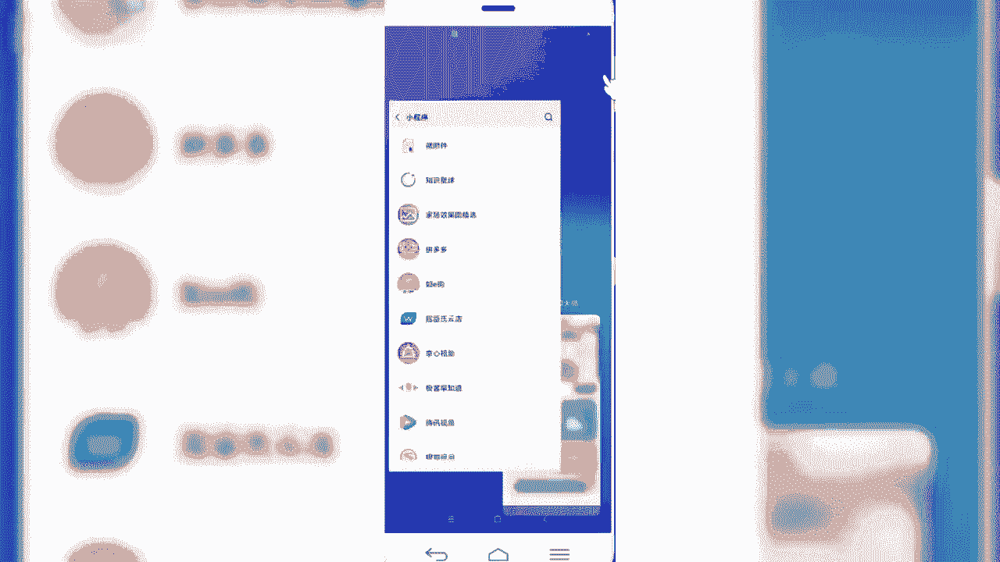
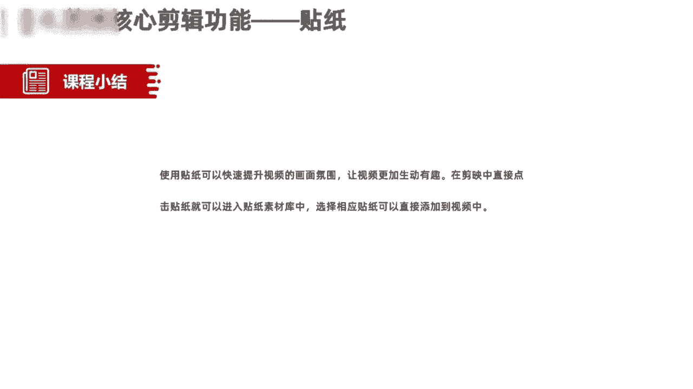

# 【剪映电脑版全289集】比付费还强10倍的自学剪辑全套教程，全程通俗易懂，别再走弯路了，小白看完速通剪映短视频剪辑！ - P18：16.抖音核心剪辑功能—贴纸 - 巴嘎布拉克 - BV1B9xreMEMH

那么我们今天呢接着给大家讲解的是，剪映的核心剪辑功能，贴纸，第四个功能，我们在日常制作VLOG视频或者美食，视频以及旅拍的视频当中啊，经常会看到，在视频当中会插入各种各样的好看的贴纸。

那过去贴纸是我们用来做照片修图的时候，经常用的一个元素和道具，那么接着我们在今天的视频制作过程当中呢，同样通过添加切纸之后呢，也是可以大大提高我们一个视频的画面质量。

和我们想要表达的一个信息源地信息传递。

那在剪映视频当中呢，同样拥有这个贴纸添加功能，我们添加完贴纸之后啊，视频库里面会带有很多大量的这个贴纸元素，我们可以选择一些平台热门的贴纸，添加到我们的视频当中，可以提升我们视频的一个呃炫酷的程度啊。

尤其是做那种比如换装呀啊，或者说变身的那种视频啊，通过添加一些这个贴纸，可以大大提升我们的一个视频画面感啊，还有的就是我们看到的那些做日常VLOG类的，通过添加贴纸。

也是可以提升我们视频的一个形象和趣味性，那这块关于贴纸的介绍就进到这里，我们接下来的话同样是进入这个贴纸的一个。

实操环节当中。

好我们首先新建项目导入素材，世界上有很好，这是我们刚才创作的那个视频，然后呢我们可以选择相应的贴纸啊，做一个日常VLOG的贴纸，添加的话，直接在我们的一级菜单左下方有一个添加贴纸，点击好。

可以看到有很多平台上的贴纸啊，只有这种寂寞表情啊，还有一些热门的，也可以添加到我们的视频当中，好我们随便选一个贴纸添加到里面，太阳，还可以选择其他的，彩虹，I vlog lad。

其他的啊文字类的这个贴纸也有很多，当然我们自己在创作视频过程当中啊，可以结合我们的视频题材的类型啊，来选择相应的贴纸添加到我们的视频当中啊，可以大大提升我们视频的一个画面感，啊饰品有很多啊，边框啊。

还有我们看到的蝴蝶呀，花儿啊，文字呀等等，有很多啊，这些都是属于贴纸，都可以添加到我们的视频当中，然后添加完之后呢，我们可以设置贴纸的时长，可以让他通篇保持整个视频，也可以给它单独设置一个时长，设置完。

然后预览，生不带来，死不带去，好，同样还可以给贴纸呢设置一个动画啊，是什么样的形式出现的一个动画，好那这一块的话是给大家讲的，关于我们在视频当中如何使用贴纸功能。

好我们一块来小结一下，在本节当中主要给大家分享的是，使用剪映当中的贴纸功能，可以快速的提升我们一个视频的画面氛围，让视频更加的生动有趣，在剪映当中直接点击我们的贴纸，就可以进入贴纸的素材库当中。

选择相应类别下的贴纸内容，直接插入到我们的视频当中，可以设置这个贴纸的一个时长，和他一个什么动画特效，好本节课程就给大家分享到这里。

