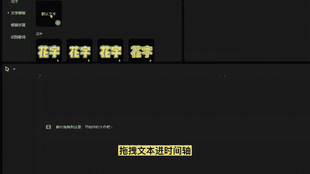
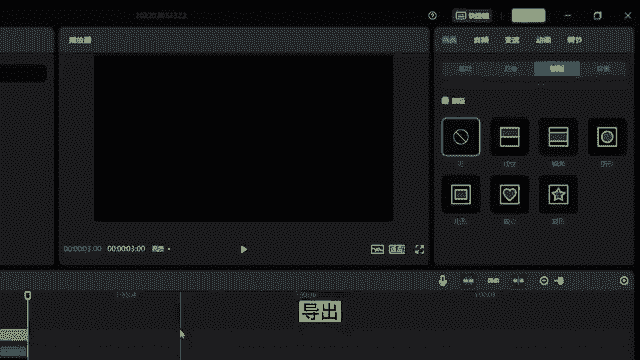

# 【剪映电脑版全289集】比付费还强10倍的自学剪辑全套教程，全程通俗易懂，别再走弯路了，小白看完速通剪映短视频剪辑！ - P2：剪映教程片头 - 巴嘎布拉克 - BV1B9xreMEMH

许多朋友问到像这样这样这样的文字出现效果，在剪映里能完成吗，今天就来分享，如何在剪映PC版里实现这种文字出现效果，首先拖拽文本进时间轴输入想要的文案。

调整下字体大小导出，接着拖拽素材，放在要做文字出现效果的素材上方，选择混合模式里的绿色，调整下文字出现的位置，选择蒙版，选择线性蒙版，在文字结束的位置打上位置的关键帧。

在后面指针的位置拖动线性蒙版到开始的位置，接着拖拽文本进时间轴输入文字，一调整下角度和颜色，根据上面文字素材所做的关键帧，做出文字一的关键帧是出现从右到左，完成移动效果，这样一个文字出现效果就完成了。

