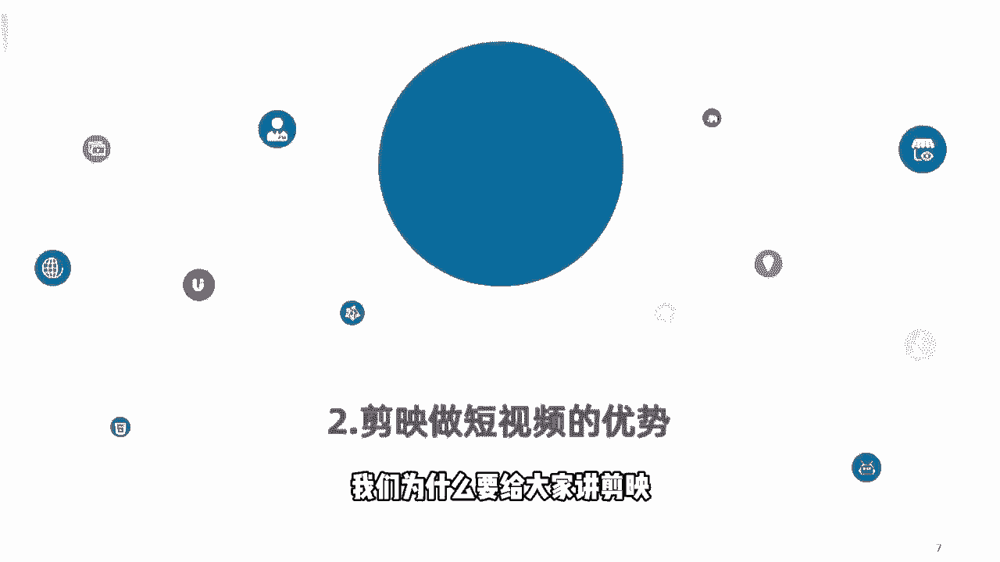
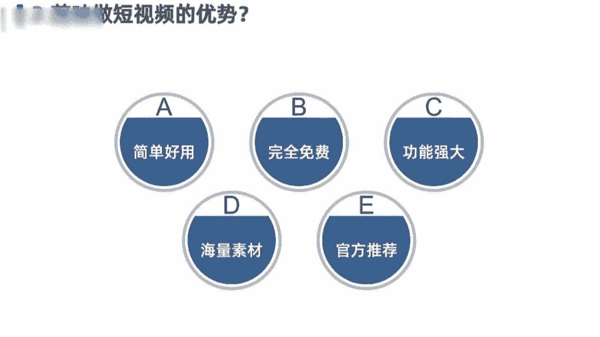
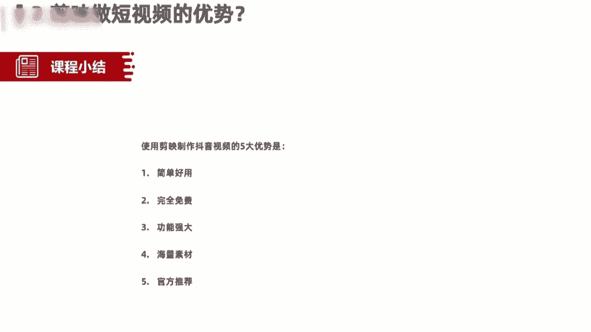

# 【剪映电脑版全289集】比付费还强10倍的自学剪辑全套教程，全程通俗易懂，别再走弯路了，小白看完速通剪映短视频剪辑！ - P4：2.剪映做短视频的优势 - 巴嘎布拉克 - BV1B9xreMEMH

那接下来的话要跟大家讲的是第二个小点，剪映做短视频的优势有哪些，我们为什么要给大家讲剪映。

在这一块的话，我们总结了一共是五点，关于简易做短视频的优势，简单来跟大家分享一下，第一个呢是简单好用，检验它是一个对零基础或小白来说，非常nice的这样一个神器，就它的操作界面或它的操作功能非常简单。

我们一学就会不用有很复杂的一个剪辑逻辑，在里面，非常简单，第二个的话是它是一个完全免费的剪辑神器，不需要我们开通会员啊，或者说我们花钱买什么样的一个素材呀等等，完全是免费的。

你像早期的时候video leap呀，巧影啊，还有爱剪辑呀，包括自说啊之类的，这些剪辑app，他们啊都是打着所谓的免费剪辑神器，这样一个噱头呢，吸引用户去下载，但是呢我们想要制作出一些比较好的视频。

或者是使用一些特效的时候呢，都会需要要让我们付费，所以这一块的话检验是非常不错的，完全免费，第三个呢是功能强大剪映，虽然它现在啊还只有2。7的版本，但是呢他还在陆续的更新当中。

简易目前拥有的功能是非常强大的，几乎可以说满足于我们在抖音上，做小视频的各类需求，好像文本呀，音频呀，贴纸呀，特效啊，包括最近刚刚上映的色图，包括最近刚刚上线上映的，色度抠图啊。

把我们一些绿幕素材呢放入到其中啊，通过画中画贴特效功能，可以实现我们一个色度抠图，把我们绿幕素材植入其中啊，实现我们合成的那种所谓的特效视频啊，这是它的功能非常强大，第三个的话是海量素材。

第四个的话是海量素材，抖音上提供了大量的音视频素材库，那么我们在剪映当中剪辑视频的时候，可以直接拿过来这些视频的素材，或者说拿过来这些热门的BGM，然后呢剪辑到我们的视频当中，做出同款的热门视频啊。

除此之外呢，剪映本身也自带了大量抖音当中，经常用到的一些竖屏素材，那我们在剪辑的时候可以完全拿过来，非常的方便快捷，不用我们自己去寻找，对于小白或新手来说是非常好用的，一个这样的特点，那最后一个的话。

不得不强调和再次重新声明一下，就是官方推荐啊，抖音和剪映他是一个什么都是一个兄弟，他都属于字节跳动这个公司，那么我们通过剪映剪辑的视频，在发布到抖音的过程当中呢。

抖音默认情况下是给到流量推荐和流量扶持的，这是为什么我们在抖音上看到很多视频的下方，它带有小的字幕，标明剪映分享或者是剪映制作，他就是告诉我们是通过这个视频呢，是通过剪映制作完成之后呢。

一键分享到抖音上的，那么我们想要在抖音这个频道啊，平台深耕发展的话，那么剪映就是一个非常好的推荐渠道和流量啊，因为官方是自动会给到我们流量的。

OK那这一块的话是给大家总结的，关于剪映做短视频的五项优势，好我们也拉一块来小结一下，使用剪映来制作短视频的五大优势，第一个简单好用，第二个呢完全免费，第三个功能非常强大，第四个呢海量素材。

