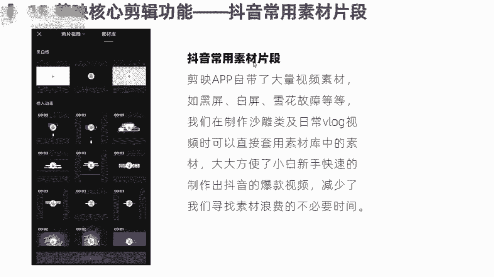
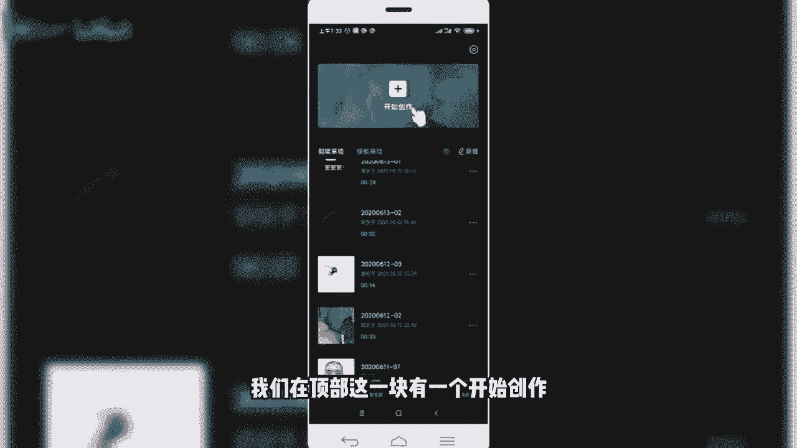
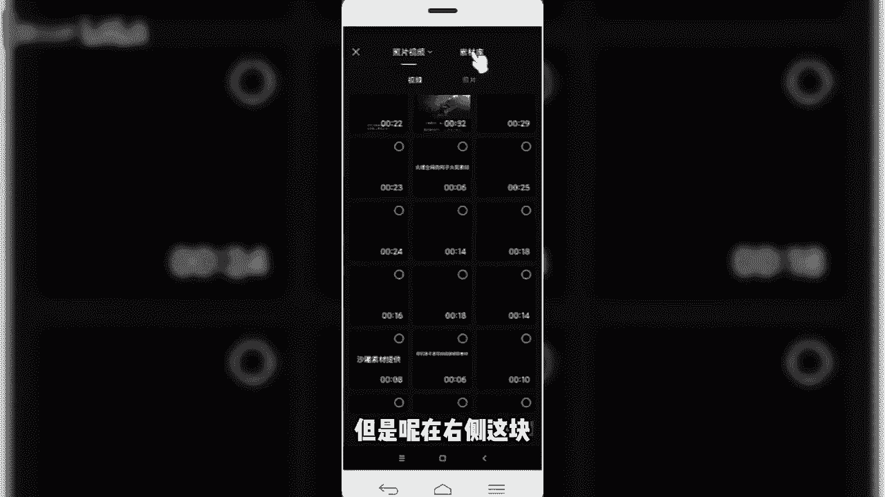
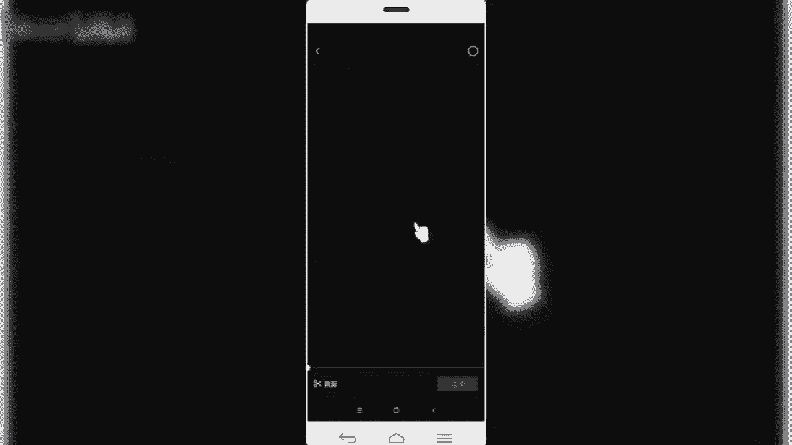
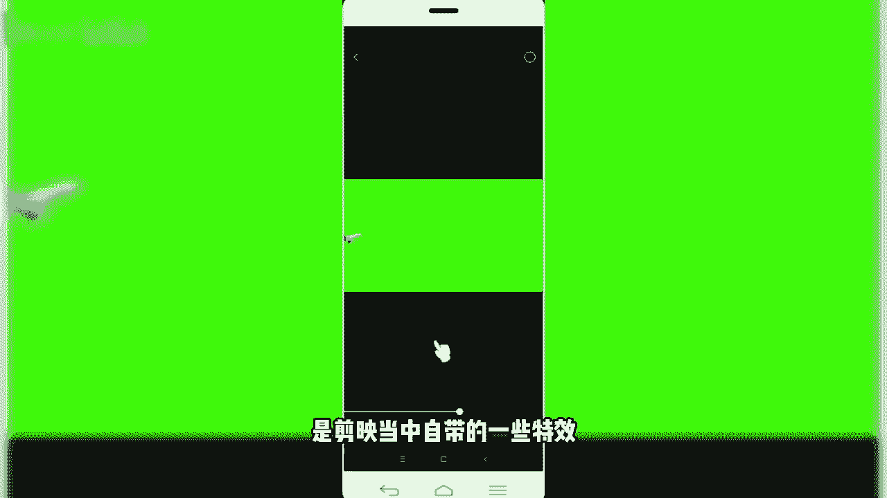
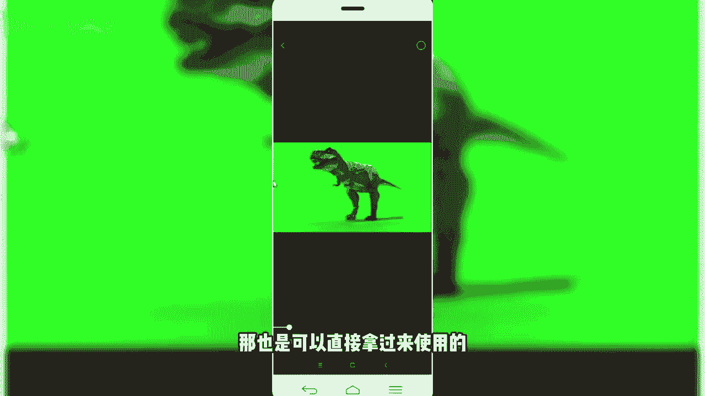
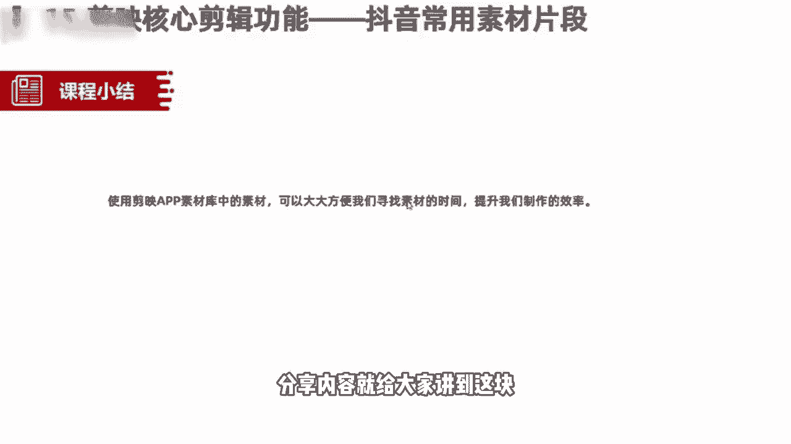

# 【剪映电脑版全289集】比付费还强10倍的自学剪辑全套教程，全程通俗易懂，别再走弯路了，小白看完速通剪映短视频剪辑！ - P9：7.抖音常用素材片段 - 巴嘎布拉克 - BV1B9xreMEMH

咱们今天这节课呢还是给大家分享的，我们剪映的核心剪辑功能，最后的一个功能，第15个功能，抖音的常用片段素材，这些片常用的片段素材呢，很多小伙伴在刚开始特别是新手制作的时候啊，经常苦恼这些素材从哪来的。

我怎么用呢，我从哪找呢，其实啊在我们的剪映app当中啊，自带了大量的视频素材啊，比如说黑屏啊，白屏啊，雪花故障等等啊，在我们制作一些沙雕类，搞笑类段子或者日常VLOG视频当中啊。

可以直接套用素材库当中的一些视频素材，大大方便了我们新手小白，或者是说我们刚开始的初学者呢找素材，这个时间成本啊，提高了我们一个制作的效率，减少了我们寻找素材当中，不必要的一些时间浪费。

那么这个剪映当中的素材库在哪呢，啊我们一块来看一下啊。

啊同样是回到我们的这个app档当中啊，然后呢我们在顶部这块有一个开始创作。

我们开点击开始创作，然后呢在导入视频素材库这一块，可以看到左侧呢是照片和视频这一块，我们看到的照片和视频呢，是我们手机上自带的像素，是我们手机上当中的自带的一些什么素材。

视频素材，图片素材，但是呢在右侧这块。

细心的小伙伴会发现有一个素材库啊，对就是这个地方我们在这个地方呢。

同样也是可以添加相关的视频素材，那这些地方添加的视频素材，那就是我们刚才给大家讲到的，剪映app当中自带的一些视频素材，那我们在制作一些视频，比如说像在那个雪花啊，还有像这种是这种雪花。

都是我们比如在制作一个日常的沙雕视频当中，经常会看到的，那还有比如说绿幕，那这些地方当中也提供了很多绿幕，那比如说我们看到的像这个小鱼啊，飞机啊对吧，比如说我们可以看一下。

可以预览一下，那就是简易当中自带的一些特效。

再比如动物，恐龙，那也是可以直接拿过来使用的。

这些视频素材就特别方便我们啊，这块说视频素材非常多啊，喜欢的或者感兴趣的小伙伴呢，我们可以呢在这块多看一些，或者多使用一些反复调试一下啊，里面有非常多，比如说我们遇到一些搞笑的视频片段，像这个。

那很多小伙伴可能在视频当中，经常会看到这个视频接头，哈哈哈哈哈啊，这都是剪映当中视频库自带的啊。

啊我们同样点击加号回到添加素材库。

然后我们可以再往下滑，有很多啊，那这块有很多，啊比如新闻类的，春节类的，他会发挥很多类别啊，我们可以直接选择啊，新闻类的，比如说我们在选择一个，搞笑类的看一下。

And no jordan most collection，plate is never rebe啊，这是我们在视频当中，经常会看到这些视频片段啊，他就是进入了我们这个剪映app当中，自带的素材库。

那我们可以在这些素材库当中呢，直接把这些素材呢拿过来调用就可以了。

非常的方便，各位小白，我们不需要在自己再寻找其他素材了，直接可以在这块调用就可以，OK那么本节课程给大家讲解的关于抖音当中，常用的素材片段啊，或者说我们剪映当中的视频素材库呢，分享内容就给大家讲到这块。

