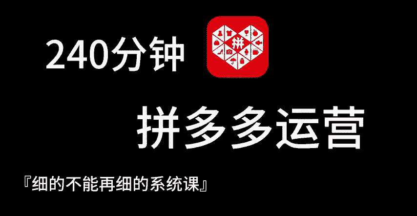
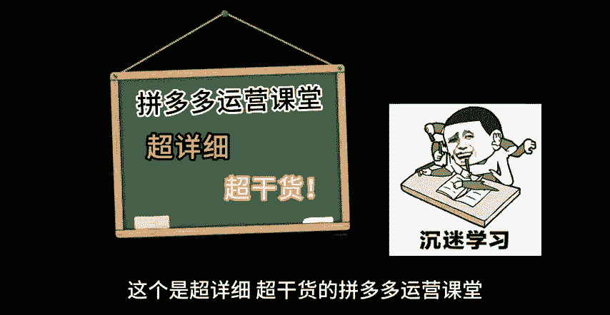
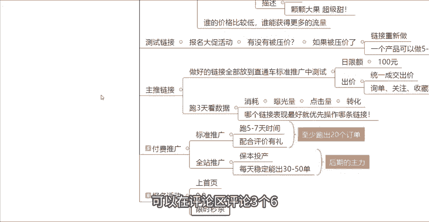

# 【吊打付费】目前B站最完整的拼多多运营实操教程，包含所有新手拼多多开店干货内容！这还没人看，我不更了！ - P1 - 拼多多运营思路 - BV1A2sqeeETC

🎼240分钟玩转拼多多运营，细的不能再细的拼多多运营系统课。大家好，这个是超详细超干货的拼多多运营课堂。从今天开始，我会给大家带来一套完整的全新拼多多运营系统课程。那么在做这套课程之前。

我做了多方位的思考，以一个初学者的角度去构建这套大家真正需要的教程。

🎼从注册拼多多店铺开始到选品、商品上架、推广、物流发货。店铺数据复盘等全套运营教程。最后呢会给大家一个小福利，整理了拼多多运营实操资料，可以评论区私信的方式领取，带着大家实操坐店。

也可以免费帮大家诊断店铺，现在的拼多多啊其实没有什么技术可言的。平台规则的更新的频率非常非常的快啊，都赶上母鸡下蛋的一个频率了。不过呢大家也不用担心，现阶段开店，你只需要学会了我这一套方法。

直接去照做石头呢也能够给你卖报。给大家看一下，最近我带来一些徒地的一个店铺数据啊，都是上升表现非常非常快的。像这个店铺啊，从4月中旬开始跟着我做。现在每天啊能够卖个几百单。

然后这是数据基础整体稍微比较低的啊，像这个店铺呢，大家也可以看到，也是从4月中旬，然后到现在啊5月份以来都是一个非常。快速增长的一个趋势。还有像这个店铺，从4月中旬。

零基础完全什么都没有的一个新店开始跟着我做。现在每天也能够卖个1000多单。所以说大家只要学会了这套方法，我相信你们那个店铺也能够卖爆。为什么现在很多新手商家，你们做店的时候，做店没有效果。

就是因为你们学的太乱，学的太杂了，今天学习怎么去改销量，明天学习怎么做评价，后天学习怎么去开直通车，根本就不连贯，知道吧？所以你们这样去做的话，链接反而效果非常的差。而开车的话呢，投产也很低，钱花了。

但是没有任何的效果，甚至还会亏钱。所以这一期视频我会从头到尾把新品打爆的方法和知识点一次性的跟你们讲清楚，好吧，希望大家点赞关注啊，支持一下。那首先第一步呢，我们想要打造一个爆品，想要打造一个新品。

就得知道流量是怎么来的，有哪些流量途径，对不对？在拼多多这个平台。上面呢它分为很多种流量，第一个是类目流量，第二个是搜索流量，然后是活动流量，还有付费流量，最后是站外流量。那什么是这个类目流量呢？

比如说你是一个做服装的对吧？那前期呢你把男装女装童装，这三个不同的这个类目放在一个店铺里面去卖，假设啊今天有一个消费者，他想买一个男装，然后进到了你的店铺，那他会不会去购买女装和童装呢，肯定是不会的。

对不对？那他就会拉低你的转化率，你这个店铺整体的转化率就会比较的低。所以说我们前期想要店铺的转化率高的话，那么你记住一个核心，就是一个产品就是一家店铺，把你的这个店铺的标签，把你店铺的类目做垂直。

做精准，你的转化率才会更高。好吧，那这个就是类目流量。那什么是搜索流量呢搜。流量就是消费者通过产品的关键词找到了我们的产品，或者找到了我们的店铺。我们大家都知道，有一些品牌它是会有品牌效应的。

会有品牌的搜索热度的。比如说我们是一个卖鞋子的对吧？那么鞋子当中，它比如说有三叶草啊，有阿迪达斯啊，有耐克啊，那如果说我们是做这种品牌的我们把品牌关键词放在我们的标题当中，那当消费者搜索品牌词的时候。

找到点击进来了我们的产品，我们就会获得一部分的搜索流量。还有核心词也是一样的道理。我们的产品比如说是做连衣裙的，比如说是做牛仔裤的。那么当消费者去搜索连衣裙或者搜索牛仔裤，找到我们的产品。

然后点击进来了，这样的流量，也是搜索流量啊，这个就是搜索流量。那第三个什么是活动流量呢？活动流量。比如说啊我们去报名了上首页活动或者大促活动或者584啊，或者说9。9块特惠，或者说限时秒杀活动。

这样通过活动页面点击进来了我们的产品或者进入我们的店铺的流量，它就是它就叫做活动流量。那什么是付费流量呢？比如说我们的店铺，我们在后台开了啊标准推广也好，或者说开了咱们的这个全站推广也好。

那么开了付费流量之后，产生的曝光产生的点击流量，它就是付费流量啊，那么最后什么是这个站外流量呢？比如说我们作为商家也好，或者说作为消费者也好，当我们把产品的链接分享给了其他人。

然后其他人通过了你的这个链接点击进来了产品点击进来了店铺，这个就属于站外流量了，知道吧？那么我们知道了流量的渠。到之后呢，我们如何去做好这个链接呢？首先我们要学会怎么去做链接。

做链接我们需要去做关键词啊，需要去做图片，需要去做标签，需要去做基础权重啊。那首先第一个我们需要去做关键词啊。什么是词呢？就是咱们的这个标题，标题一定要做好标题当中，首先你要去满足30个字。

并且你要保证它是通顺的，然后这30个字当中呢，你需要去包含热门的关键词，需要去包含核心的关键词啊，知道吧？你要去把这两个点做好。然后什么是图呢？图片就是一个是我们的这个主图，一个是我们的详情页。

这两个点呢你都要去保证啊跟同行要做到差异化。然后主图你要保证它是高点击率。然后你要围绕着咱们的主图，围绕着咱们的详情页展示我们产品的这个细节和卖点，知道吧？关键词对应的是我们的这个搜索流量。

那么还有这个标签啊，标签就是人群标签，人群标签它对应的是咱们的这个类目流量，知道吧？他们是有对应的啊，他们是有对应的。然后类目呢就是一定要统一人群要精准。那么基础权重当中呢。

它就包含了这个基础的销量和基础的评价了，这个就非常的简单的啊。基础销量你可以去找朋友做啊，也可以找资源做，然后也可以直接的去改销量啊，销量是可以改的。然后评价的话呢也可以去找朋友做啊。

找资源做都是可以的。评价啊。然后如果说不会的话，如或者说没有资源的话，可以在后台在评论区找到我，我可以分享给你一些啊非常好用的一些资源都是可以的。然后还有这个店铺层级啊，店铺层级可以自己去做做大单。

我们在店铺后台首页的位置，可以在这个地方看到有一个店铺层级。如果说你开的是新店的话，你的店铺层级就是第一层级。然后如果说我们是一个新店，我们至少要把我们的店铺层级做到第三层级以上，知道吧？

要做到第三层级以上，因为店铺层级的高低，决定了你能获得流量的一个上限。在同样的情况下，第三层级越高，你获得的这个流量的能力就越强，知道吧？如果说你的店铺是在第一层级的话，就算你去做其他的操作。

你能够拿到的流量也是非常非常非常少的，好吧？然后你们自己去你们的店铺后台看一下啊。看一下，比如说你们第三层级呃的这个金额的要求是多少。比如说你们的像这一个店铺，第三层级。

它的一个要求是日交易额达到282元。那么你们就通过你们店铺后台这个地方这个数字，然后给它去乘以30，就是你们要做到的这个金额，知道吧？然后这个是店铺层级的一个问题。然后店铺DSR也是一样的。

你可以去找朋友做，也可以直接的通过多多进宝去做好吧，然后这是技术权重方面的一个问题。然后我们这些是我们前期做链接需要去做到的几个点啊，做到的这几个点，然后你们一定要注意啊，要去做好差异化。

什么是差异化呢？因为拼多多平台，它是一个比价的平台。它会通过图片通过规格，通过描述，通过这三个点啊来确定你的产品和你的同行，他们卖的是不是同样的一个产品，会通过这三个点来进行区分啊。

通过这三个点来进行区分。然后假设你的这三个点，比如说你的图片，你的规格，你的描述跟你的同行做的都差不多，但是你的同行价格比你低，它就能够获得比你更多的流量，知道吧？拼多多它是一个比价的一个平台。

比价是非常非常严重的。谁的价格比较低，谁就能够获得更多的流量。所以说前期我们一定要去做好差异化。就是我们我经常跟大家讲到的这个仿比价。那么图片的话呢，我们可以通过一些手段，比如说我们加上一些字体，对吧？

或者说我们去做图中图做一些差异化的图片，那么规格的话呢，我们可以去打上一些比如说开业特会，比如说新店立减啊，新店立减这样的一些字眼啊，这样一些字眼。比如说我们是卖水果的。

那同行它的一个规格描述是水果一斤，然后20块钱，对吧？那在同。一样的情况下呢，我们可以我们的SQ可以怎么去做？我们可以写新客立减水果1斤20块钱。那我们就跟同行是有差异化的这个就是仿比价SQ知道吧？

那描述的话，我们可以在我们的这个图片上面的一些字体啊，加上一些比如说填啊同行它可能说加一个填。那我们可以加一个什么加科科大果超级甜或者爆填，知道吧？我们加上这些字体之后呢。

平台大家就会认为你的产品跟你的同行它是有区别的，它是不一样的。那么在这种情况下，你的这个价格卖的稍微贵一点，也能够获得流量。这是我们的第一步啊差异化它是非常非常重要的。当我们做完这个链接之后呢。

第二步我们要去测试链接，怎么测试链接，就是我们去报名大促活动，报名大促活动的目的啊，就是看。我们的这个链接有没有做好？如果说你的这个链接去报名的大促活动，去看一下它有没有被压价。如果被压价了。

证明你这个链接有问题，做的有问题，你就需要去重新做链接，知道吧？重新做链接。如果说你发现哎你的链接没有被压价啊，你的价格是没问题的，甚至说你可以原价上活动，那就证明你的这个链接是okK的，是没问题的那。

我们做好了这一个点之后啊，我们报名完了大促活动之后，我们就可以继续的去做链接。因为你一个店铺当中，你只做一个链接肯定是不行的。我们要多做几个链接，知道吧？所以说这一步做好了之后，你可以继续的去上新链接。

一个产品就是同样的产品，我们是可以做出5到10个链接的，知道吧？做5到10个链接的，当然你这5到10个链接，它们之间呢也要有差异化啊，也要有差异化。你这5到10个链接，你的标题要不一样。

你的图片也要有区别。你的这个这个什么SQQ的规格，SQ的图片跟描述也要有所区别，知道吧？这样的话，你才不会被平台给判定为重复铺货，好吧，那这一步做完了之后啊，我们就可以去什么去测试链接。

去找到表现比较好的啊，表现比较好的链接。我们把做好的链接全部放到我们直通这个店铺后台的直通车当中。去测试怎么去测试呢？我们在推广平台当中去找到标准推广，然后我们去新建一个推广计划。

把你做好的这些链接全部的添加进来，知道吧？全部的添加进来之后，然后我给大家看一下，在这个地方你需要去设置几个东西啊。一个是你的日限额，一个是你的出价。那么日限额呢。

我们统一的就是你把你添加进来的这些产品，在这个地方，日限额统一的给它设置100块钱啊，设置100块钱就可以了啊，然后出价这个点我们只需要去出成交出价，询单收藏关注这三个出价都是不出的，都是不开的。

知道吧？只需要去出成交出价，然后成交出价这边有一个公式啊，有一个公式大家记一下，就是如果说你的产品客单价是在50块钱以内的。那么你就按照你的热销SQ的这个客单价去出价就可以了。

如果说你的这个产品的客单价是在50块钱以上的，你就按照你卖一单的这个利润，就是卖一单赚多少钱，你就出多少价就可以了。好吧，就分为这两种情况。然后这两个点设置完之后呢，我们就可以开始推广。开始推广之后。

我们需要。跑三天跑三天完了之后来看数据，看哪些数据呢，需要去看消耗，然后看曝光量，看点击量跟看转化，看这四个数据，哪一个数据能够烧出去前，能够产生消耗。哪一个数哪一个链接它的曝光量点击量转化量比较好。

我们就优先的去操作哪个链接，知道吧？因为。他的这个呃链接表现比较好，就证明你他的这个链接是被平台认可的。平台认可了你的这个链接，认可了你这个链接里面的价格跟内功，它才会更多的给到你流量，知道吧？

那当我们做完这一步之后啊，啊就是我们找到了这个主推链接之后啊，我们就需要去给他去做一点投资，我们要去给他做做这个销量给他做评价，知道吧？做销量做评价。然后销量跟评价这一个点做好了之后。

我们再去考虑开车啊，再去考虑给单独给这一个链接去做付费推广。那么付费推广呢，它分为全站推广和标准推广啊，分为这两个点。前期的话大家注意一定要去先开标准推广。因为标准推广。

前期它的这个流量是比较精准的它的一个。推送的流量都是精准流量。然后我们前期开5到7天的这个标准推广，然后我们可以去配合这个营销工具当中的评价有理啊，配合起来。然后开7天开5到7天。

至少要有20个真实成交，知道吧？就是这一个推广计划当中一定要跑出20个订单啊，跑出20个订单，因为跑出了20个订单之后，你的这个计划才会被打上标签，才会就是我们俗称的才会度过学习期。

那么度过的学习期之后，我们再去开全站。全站的话呢，只要是盈利的，你就可以一直开，知道吧？当我们开车每天能够做到50单以后，就是每天能稳定的出30到50单之后啊，那这个时候呢，我们就可以去报名活动的。

知道吧？去报名活动的。活动的话，主要因为报名活动它都是有门槛的。如果说你店铺每天连订单都没有，或者是订单非常。少的话，那么很多活动你是上不了的你的门槛是达不到的那我们稳定能出30到50单之后。

我们就可以去报一些简单的入门级的活动。然后比如说上首页啊，我们去可以去报一个上首页的活动，或者我们可以去报一个9。9块的活动，或者报一个限时秒杀的一个活动，知道吧？报名完活动之后，通过活动加推广。

我们就可以达到一个爆发的一个效果啊，这个时候你的这个店铺的一个出单的情况，基本上就会非常非常的好，并且非常的稳定了，知道吧？那么看到这里啊，如果说你对于坐店还是很迷茫，不知道怎么去运营的话呢。

可以在评论区评论3个6，然后找我领取一份我给大家整理的这个店铺的运营资源表格，好吧，那看到这边呢也别忘了一键三连支持一下啊，你的支持才是我后续更新的最大的动力，感谢大家的一个观看。

