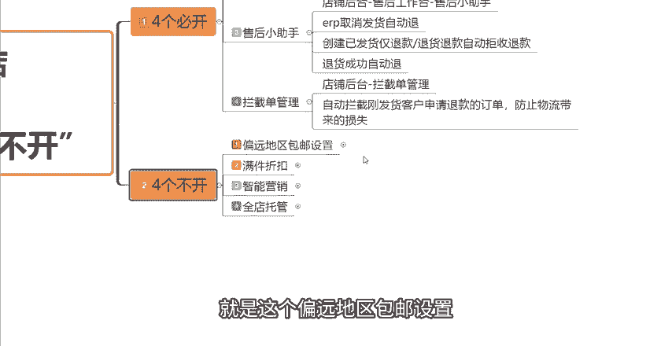
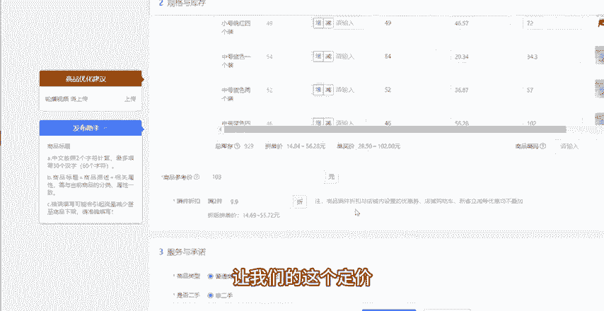
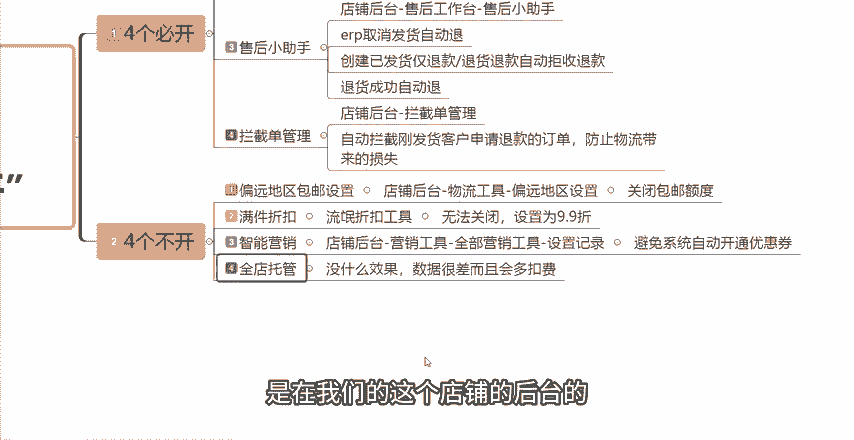

# 【吊打付费】目前B站最完整的拼多多运营实操教程，包含所有新手拼多多开店干货内容！这还没人看，我不更了！ - P10：10.4个“必开”和4个“不开” - 拼多多运营思路 - BV1A2sqeeETC

现在做拼多多店铺啊，想要店铺流量大，并且流量稳定。那么这几个工具呢一定要去设置好，否则出了单，你不注意店铺就没了。今天给大家详细的分享一下这一期视频，给大家讲解一下几个必须要打开的设置。

最后呢会再给大家讲解一下几个必须要关闭的设置。如果说这几个设置不关闭的话，你的钱怎么没的，你都不清楚。大家可以先点关注再点赞，耐心的看完这期视频，我相信你会有所收获。

那么首先先跟大家讲一下四个必须打开的设置。第一个呢是我们的商品答疑。商品答疑在我们的店铺后台，然后可以找到商品管理商品管理当中有一个商品工具，点击商品工具之后，点击商品答疑就可以在这边啊。

点击立即使用了。那么商品答疑这个工具呢，它跟我们的这个某宝的问大家是一样的。以提问答疑的方式，让消费者可以快速了解过购买过的这个用户体验。

不管说质量、色差，还有物流功能等等，这些消费者关心的问题，都能够快速的去解决消费者的疑虑。那么可以大大的提升下单的这个概率。转化率提高了，我们店铺的自然流量自然而然也就高了，这是第一个工具。

那么第二个工具是我们的这个禁用词的设置，我们需要打开禁用词的设置，在店铺的后台找到可以找到这个客服工具。我们在店铺后台往下滑，在多多客服当中有一个客服工具。然后点击客服工具点击禁用词设置。

在这个里面我们需要把我们需要规避的这些词汇关键词全部的添加进来。因为在拼多多平台上啊，如果说客服聊天的时候，只要出现和客服对骂，或者说在聊天当中发送一些联系方式啊。

或者一些敏感词汇以及好评返现等等这些情况，都会被拼多多那个罚款，并且罚款的金额还不低啊。拼多多平台对于这方面的一个管控是非常的严格的。那么我们只要说设置好了这些禁用词就能够完美的规避掉这些问题。

你想发客这个系统，它都不让你发设置好这个呢我们的客服。

服就可以放心大胆的去跟这个客户聊天了啊。然后第三个呢是我们的这个售后小助手。我们在店铺的后台找到售后工工作台，在店铺的后台，然后往上滑，有一个这个售后管理，售后管理当中有个售后工作台，点击售后小助手。

那么在这个里面呢，我们主要是需要设置一个。第一个是这个ERP的取消发货自动退。要创建这几个策略啊。这个ERP取消发货自动退呢，就是当消费者申请退仅退款的时候，我们可以取消发货后实现自动退款。

然后我们需要创建一个已发货仅退款和这个退货退款自动拒收退款这一个策略啊。那么创建这一个呢是已发货且发货物流未签收时啊，消费者申请的仅退款或者退货退款，将自动同意拒收退款。

那么当系统啊识别到物流有拒收的信息之后，将自动的为消费者退款。那么在配合这个退货这个商退货成功自动退这一个策略，也就是消费者申请退货退款后，仓库验收退货商品成功之后呢，或者说识别到了物流轨迹。

有这个拒收或者退回的这个标签之后，它才会这个自动的同意退款。那么我们只需要把这三个策略啊，一个是ERP取消发货自动退，一个是创建已发货仅退款，退货退款，自动拒收退款，一个是退货成功自动退创建好。

这三个策略啊就能够有效的去避免这个仅退款好吧。呃，因为在拼多多平台上面仅退款这个问题还是让人非常的头疼啊。很多这种薅羊毛的这种羊毛党啊，那么我们需要把这三个策略给创建好，这是第三个必须要设置好。

必须要打开的这个工具啊，然后第四个呢是我们需要开启拦截单拦截单的管理，我们在店铺后台可以找到拦截单管理。那么这一个功能呢，就是可以有效的去帮我们自动的拦截，我们比如说刚刚发货。

然后客户就申请了退款的这种订单，我们就不需要手动的一单一单去拦截了。这个呢可以防止我们呃比如说物流方面啊给我们带来的一些运费上的损失啊，那么四个店铺当中四个必须打开的这个设置工具呢，就是这四个。

那么你们可以去你们自己的店铺后台看一下这四个工具有没有设置。

好，如果说没有设置好的话，可以按照我上面讲的去设置一下啊。那么这几个呢都是对于你们在运营店铺过程当中呢，是有一定帮助的。那么这四个必须要打开，讲完了之后再给大家讲一下四个必须要关闭的设置啊。

那么首先第一个呢就是这个偏远地区包邮设置。

这个呢我们可以在店铺的后台，然后找到这个物流工具。在物流工具当中呢，它会有一个这个偏远地区的一个设置啊，偏远地区的一个设置。然后。

具体的我们需要设置什么呢？就是我们要点击关闭包邮额度，然后确认关闭即可。这个呢就只能说规避掉，不然的话它就会按照订单10%的比例去扣费，到时候裤衩子都会给你们亏没掉。

因为偏远地区它的邮费一般来讲是特别高的。所以说我们正常来讲呢，我们卖的这些东西，偏远地区它都是不包邮的，需要收取一定邮费的。所以我们要把这个偏远地区包邮给它关闭掉。然后第二个呢就是我们的满件折扣啊。

满件折扣。这个具体位置在哪里呢？就是一般来讲啊，我们在创建一个商品或者发布一个商品的时候啊，我们在这个商品的编辑页面，我给大家看一下在哪里啊，因我相信你们应该也有看到过啊。

比如说这是我们的一个商品的编辑页面。

然后我们在下方这个规格与库存，然后下面这个价格与库存。当我们把这个规格跟价格设置好之后，在这个地方它就会有一个满件折扣。这个其实是没有办法关闭的，也算是这个拼多多的一个流氓软件啊，这个是系统默认的。

就算你的定价按我之前跟大家讲的定价公式去做的话，这里一不注意的话，你一样会没有利润空间。所以说这个地方没有关闭，但是没有办法关闭。但是我们一定要把它的这个折扣默认的调到最高。一般来讲就是调到9。9折。

这样的话呃就基本上跟没有打折差不多啊，差不多。

所以说你只能尽可能的设置的高点，让我们的这个定价，让我们的这个利润不亏。好吧，这个点大家需要注意一下。那么第三个必须要关闭的工具呢，就是我们的智能营销。这个我们可以在店铺的后台找到营销工具。

然后有一个全部营销工具。当中我们可以看一下设置记录。这个工具呢就主要是因为系统它有的时候呢会给我们自动的去开一些优惠券，我们自己都不清楚说哎，怎么消费者下单这么便宜，它使用了什么样的一个优惠券，对不对？

所以说这个我们把它关闭掉呢，就可以避免系统自动的给我们去开通，去设置一些啊我们不知道的一些优惠券。这是第三个然后第四个呢是全店托管。这个呢是在我们的这个。

店铺的后台的付费推广当中。我们在开全站的时候啊，在开全站的时候，它会有一个这个呃默认的这个全链托管啊，全电托管很多新手你们没开车的时候，如果说没注意啊，就默认的打开的话。这一个它其实是会给你带来。

负面的影响的。他会额外的多花一些钱，但是呢它又没有什么效果。我们在全店托管当中呢，在这个地方就可以看到，看到没有？全店托管。

他会给你多花钱，然后又没有什么效果，也就是无效的花费。所以说我们要节省成本的话，这个地方我们一定要注意看一下你们店铺的这个全店多管有没有打开。如果说没有打开的话，就不用管它。如果说已经打开了的话。

你们就一定要给他去关闭掉。好吧，一定要去关闭掉。那么这四个点呢就是我们一定要关闭的，就是四个不开，大家需要注意一下。那么以上这8个点啊，不管说你是新手还是老手都要注意一下，能够帮助你提升一些流量。

给你省一些麻烦，也能够给你减少一些不必要的麻烦，大家都可以去店铺的后台自查一下啊。那么看到这里还有什么不懂的，或者说需要一些表格资源的小伙伴呢，大家可以在评论区评论666。

然后找我领取一份这个运营综合的这个资源大礼包。那么关于你们在自己坐店的过程当中，如果说有任何不懂的问题呢，大家也可以在评论区找到我，那么我给你们诊断一下店铺啊，都是没有任何问题的。好吧，感谢大家的一个。

观看。