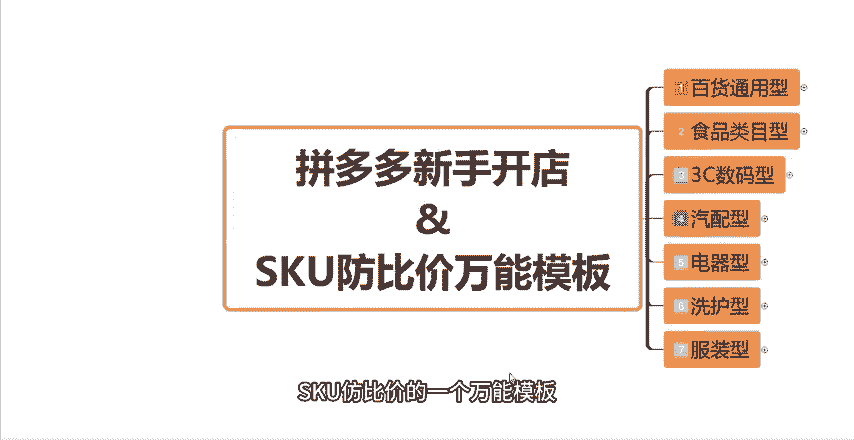
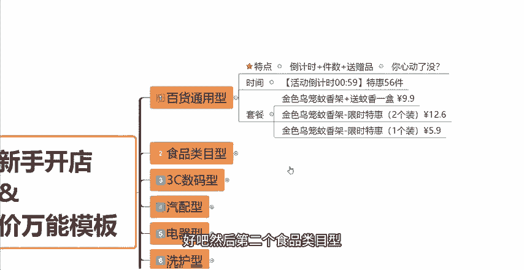
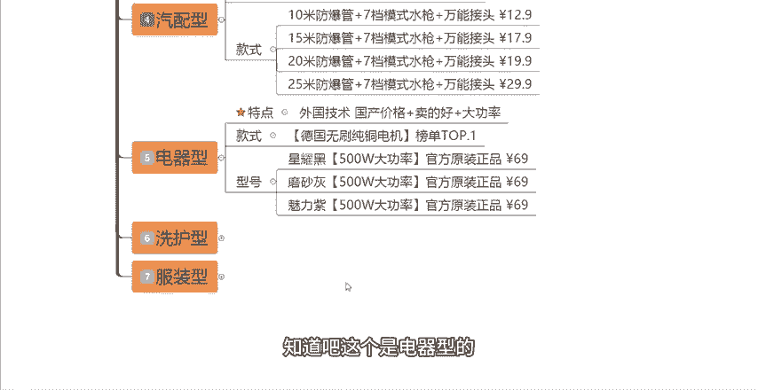

# 【吊打付费】目前B站最完整的拼多多运营实操教程，包含所有新手拼多多开店干货内容！这还没人看，我不更了！ - P12：12.SKU防比价万能模板 - 拼多多运营思路 - BV1A2sqeeETC

很多拼多多新手小伙伴呢在学习了我的SQU防比价的课程之后呢，还是找到我说啊这个呃我的这个产品SQU的规格名称到底应该怎么去写，还是不太会，对吧？那有没有根据不同的产品。

根据不同的类目更加详细一点的这种呃模板，那么今天这期视频呢就给大家带来了SQU仿比价的一个万能模板。那么我通过不同的这个类目，不同的产品类型给大家总结了一些东西啊，总结了一些SQU到底应该怎么去写。

他们有什么样的一个特点，要写哪些东西，那么今天这期视频它就来了，大家可以对号入座，找一下有没有你们正在做的产品，有没有你们正在做的类目。有的话，那么你们都可以去造葫芦画瓢啊，听了我这一期视频之后。

我相信你们一定会有所启发，会有所领悟的。OK那么今天给大家带来了7种类目啊，7种类型。

首先第一个呢是我们的百货通用型。百货通用型它的特点呢就是倒计时加件数加送赠品的一个形式去写我们的SQU名称。那么它主打的就是你心动了没？给大家举个例子啊。

每一个类目啊每一个类型我都会给大家举例子到底应该怎么写啊。比如说我们创建两个SQU的规格。第一个是时间。在SQU当中，我们可以写一个活动倒计时啊，活动倒计时多久多久，然后特惠多少件。

这个你们自己去编辑不是固定的模板啊，自己去编辑。然后第二个我们的套餐呢，套餐，比如说我们是做蚊香的那这个时候有了上面这个活动倒计时之后，下面具体的规格我可以写比如说什么金色鸟笼蚊香价。

然后加上啊我送蚊香一盒，然后多少钱对吧？多少钱。然后第二个金色鸟笼蚊香价限时特惠对吧？两个装啊，两个装，然后下面一个装。这个时候呢这个SQU的规格布局啊，这个一个装。

它是作为引流的SQ就是它的一个价格会比较低一点。当然这个价格。

你们根据你们实际的一个情况来，你甚至说可以设置的更低一点。比如说5。9块，对吧？通过这个价格呢，先把消费者吸引进来，吸引进来了之后呢，那么消费者看到哎这个蚊香价他还送一盒蚊香，对吧？才9。9块。

然后上面还有什么特活动倒计时特惠56件啊，说定说说明这个活动可能说马上要结束了啊，对吧？东西库存也不多了，那么一般来讲消费者会去拍，要么拍这个SQU，要么拍这个SQU知道吧？

这个呢就是我们做一些日用百货啊，那么可以看参考这个去写。首先倒计时，然后加上特惠多少多少件，加上送什么赠品，按照这个结构去写你们的SQU名称，好吧？然后第二个食品类目型食品类幕型它的一个特点呢。

就是我们需要去琢磨买家的一个心理啊，就是我们如果说是买买吃的，买食品的，第一个关心的是它是什么口味，对吧？

第二个是他多不多啊，数量啊，他送的多不多，对吧？我们希望买到性价比高的啊，我们花这点钱买到了这么多吃的，这个是很划算的对吧？那所所以说我们来第一个我们设置一个口味，比如说我们做这个奶糕的啊。

我现在有芒果味，有草莓味，那我还做一个芒果加草莓味的一个混合装。那第一个规格呢就是口味的规格啊，这三种。那套餐该怎么去煮。比如说。

呃，我做第一个SQU规格，我一大袋一大袋就是20包，对吧？我这边写我一大袋20包送4包，共计24包，然后多少多少钱。然后第二个规格，一大袋20包，送8包，共计28包多少多少钱。这个呢。

它是它是什么样一个特性呢？就是一般来讲，你去写SQU。一包对吧？你打算卖多少包，你可能写啊一大袋28包对吧？多少多少钱。那你这么写，第一个它没有办法有差异化，对吧？可能是你这么写也是这么写。同行呢。

他也是这么写，只是把你的规格写出来了。但是你的规格跟同行差不多，你就会被比价，知道吧？那你这样写的话，一大袋20包，哎，我还送四包啊，一共24包，对吧？首先名称上必开就是可以做到仿比价。

第二个我还有送的，就给买家从心理上觉得哎非常的划算，对吧？所以说这是你们做食品类目的，可以去参考一下，这么去写。然后第3个3C数码的，3C数码它的一个特点是。

好话加发货快加18个字，特点写满啊，好像很牛逼的样子。我给大家的总结就是好像很牛逼的样子。那具体的这个SQU怎么写呢？首先第一个比如说功能功能我可以写2024年新款全新升级，然后加上急速发货啊。

通过新款通过急速发货来打动消费者的一个心理啊，就感觉好像很牛逼的一个样子，而且发货特别特别的快。然后尺寸方面呢，我可以写比如说我是做这个闹钟的对吧？我写第一个13种灯。

加上音箱加上闹钟加上无线充加上大尺寸，我把我这个产品有的这个卖点，有的这个功能，我全给它写清楚，我先把它拆解开，然后我全部给它写上去，知道吧？然后多少多少钱。然后第二个规格可能说比较啊比较。

呃，低档一点的，然后9种灯加闹钟加无线充加音箱加小身材，一个是大尺寸，一个是小身材，一个是13种灯，一个是9种灯，对吧？然后把它的一个顺序变一下，像闹钟啊，无线充啊，音箱啊，这三个卖点是都有的对吧？

我把它的顺序位置变一下，然后多少钱多少钱，对吧？我的SQ具体的规格，我可以这样去写，是不是？然后如果说你做的是这种功能性的3C数码特点怎么写呢？

比如说今年新款加买一个收5个，超级划算加限时。对吧比如说我这个时候我是做这个什么线头保护套的充电这个充电线的这个保护保护套，对吧？那型号呢我就可以写新款线头保护套全面升级防护，那到底是不是全面升级的。

我也我也不知道对不对？我就这么去写啊，我就是全面升级保护消费者他也不知道啊，他就觉得哎好像很牛逼的一个样子。然后具体的套餐呢，我可以写，比如说第一个。

引流的特价中拍一发5，抢完为止，仅抢一天啊，然后3。3块。好像很划算的一个样子。然后第二个我写防折防断，然后充电线头保镖啊，充电线头保镖加厚10个装啊，对吧？规格我写清楚了，然后加厚，然后防折防断。

我把卖点也写进去了啊。好，就是18个字的一个特点，卖点，对吧？然后第三个也是一样的，防折防断充电线头保镖加厚8个装，他们之间呢就是功能不太一样，对吧？就是你们这么去写，这个是3C数码型的。

然后第四个呢是汽配型的。如果说有做汽配的小伙伴，它的一个特点，亏大了售后保障让人放心，加工厂直销，真是赚到了，这是它的一个特点，型号具体呢怎么写？型号我可以写。比如说你们如果说有质保的话。

质保多少多少年，对吧？写上去，然后工厂冲榜亏量啊，就是表明我是为了销量，我不计成本啊，我是在做活动。

然后加上加急发货啊，因为买这个东西的人呢，他肯定也会有一个比较着急的一个心理。那这个时候我们写上加急发货呢，就是给他一种发货很快的一个感觉了，对吧？然后款式我们可以具体怎么写呢？

比如说我是做这个洗车枪的水枪的对吧？首先我可以写第一个啊，是多你要有那个水管嘛，对吧？多少米的这个防爆管加及七档模式水枪加万能接头多少钱，15米防爆管加七档水枪加万能接头，然后20米，然后25米。

就按照这样的一个规格去写。

知道吧？按照这样的一个规格去写。

当然你们。比如说你们不是做水枪的，做其他的型号，做其他的产品的，做其他类型的也可以按照这种这种模式去写，知道吧？我教给大家的只是一个参考的模式。如果说你做的是一样的产品，你可以直接去套用。

如果说你是做不一样的，有猜异的，你去把它改动一下就好了，知道吧？然后第5个，如果说你们是做这种电器的，电器的一个特点是什么呢？

外国技术国产价格加卖的好，加大功率。比如说款式我可以写。德国无刷纯铜电机榜单top一啊，我可以表明我是德国的对吧？我的电机是纯铜的，是无刷的，是德国的。那么消费者下单的一个这种转化率会也会提升很多的。

然后型号具体怎么写呢？比如说你什么颜色对吧？然后多少功率，然后官方原装正品69，做3C数码的做这种电器的，做这种产品的？

买家非常关注的一个点就是官方原装正品这几个字。所以说你们尽量的把这几个字写进来。知道吧？然后多少功率啊，什么颜色啊，什么型号啊，你们就自己根据你们的产品去写就好了。好吧。

就给人一种非常官方非常非常有保障的，非常好的一种感觉，知道吧？这个是电器型的，然后洗护型的这这种各户洗护的啊。

你们可以按照这个特点去写先进词加强调天数加高端的形容词。比如说款式我可以写AI自控喷香机。比如说我是做这种香薰机的，做这种喷香机的对吧？AI自控喷香机持续留60天留香啊，留香的时间非常的久。

然后第二个呢。

专用香薰精油无香薰机，这个SQU它的价格是很低的，是我用来做低价引流的SQU知道吧？第一个卖的是香薰机，第二个是香薰精油，它们是不一样的产品。但是我把它做在一起。

那么消费者可能会通过这个低价的香薰精油的这个价格被吸引点进来。知道吧？然后香型方面呢，我可以写，比如说聚划算5款香水各一瓶共5瓶，然后多少多少钱。然后第二个呢，我我写一个人气。

然后这个香型是希尔顿高端酒店香型三瓶装，然后还有香格里拉酒店花香型，对吧？写的都非常的有逼格与非常的高端啊，都是这种高端酒店的这种香型，那么消费者他下单的一个意愿是不是也会更强，也会被吸引到，对吧？

你如果写一个普通的啊什么什么什么香香型或者说什么什么花香型啊，买家看着太普通的，你把酒店给带上来，希尔顿高端酒店跟香格里拉高端酒店，对吧？这样去写，这个是洗护型的，包括你们做什么洗发水的啊。

做什么洗衣液的呀，也可以这样去写，知道吧？也可以这样去写。然后最后一个呢就是服装型服装型的一个特点，就是比较常见的。

啊，件数加字母加颜色词加另类的这个码数。比如说款式我写呃三件CH黑加SE卡加鸟声色XXK这什么意思呢？其实它没有什么特定的意思。你可以把它理解为你固定的这个型号，你固定的一个参数。但是我们把这些型号。

加到了SUSQU当中之后呢，有两个好处。第一个，我们在做服装，服装最重要的一个就是核销库存，对吧？因为它的码数特别多，颜色特别多，件数特别多。我们去核核销库存的时候，就非常的头疼。

我们加上了这样的一些这种编码，那么我们在后台核对库存的时候就非常的方便，非常的这个简单省事了。第二个呢就是我们可以通过这些编码去做到防比价。因为同行如果说同行它只写黑色或者说卡其色啊，什么码子。

那么我们也这么去写的话，就会被比价了。我们加上这些编码之后呢，就会可以做到防比价，知道吧？这个就是款式，我们可以这样去写。然后尺码呢，就是常规的尺码这个没什么好说的。仿比价主要是就是做在款式这个点尺。

的话就按照你们的这个服装啊，MLX啊，加大码两个加这么多少多少斤，这么去写就可以了，知道吧？那么以上呢就是这7种类目，7种产品，他们的特点跟他们的这个SQ规格名称到底怎么去写啊，就是这样的一个模板。

大家可以去对应。那么看到这里呢，如果说还有不会写的小伙伴，或者说这一期视频当中没有你所做的这个类目，没有你的产品的小伙伴呢，也可以在评论区评论3个6，然后再找到我啊，我可以给你分享其他更多的一些模板。

好吧，那看到这里呢，也别忘了一键三连啊，支持一下主播，感谢大家的一个观看。

这边呢给大家准备了将近100份的一个文档，可以帮他更好的了解我们拼多多运营拼多多，能够提高大家运营水平。如果大家需要的话，评论区找我领取。

