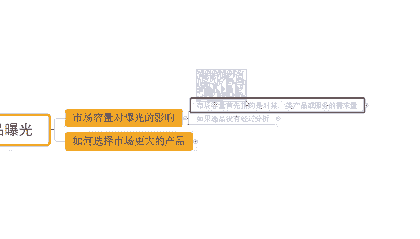
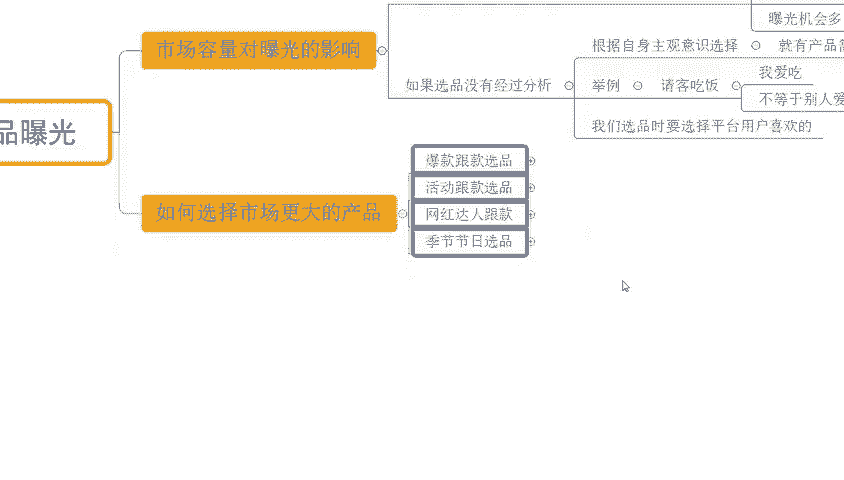
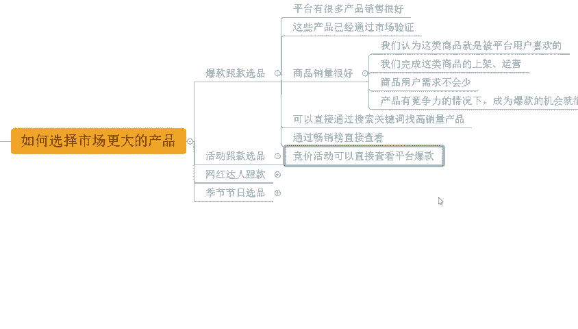

# 【吊打付费】目前B站最完整的拼多多运营实操教程，包含所有新手拼多多开店干货内容！这还没人看，我不更了！ - P19：04 市场容量决定产品曝光 - 拼多多运营思路 - BV1A2sqeeETC

hello，大家好，我是西楼。今天给大家分享的内容呢是我们拼多多店铺运营新品请流量方法中的市场容量决定产品曝光的内容啊。在分享之前呢，老规矩啊，先给大家看一下近期跟着时3小伙伴他们的店铺数据，好吧。

可以看到像这个店铺呢，原本访客在2000多，3000不到啊。那么跟着实操之后呢，首先我们针对到产品的商品结构，以及我们产品的SKU呢做出了一些调整。优化之后，产品的转化呢在不断的提高。

那么当转化提高之后呢，商品的权重也会不断的增长啊，那么这个时候呢，你可以看到访客也会在不断的提升。那么这个店铺呢在早期的时候呢，访客2000多，对吧？优化之后调整之后啊，那么后面呢。

整个访客不断的提高到后面是成长到了2万多。那么一天的订单呢是1900多单，转化率呢9。37%啊，也是非常不错的。当然呢，除了像这一种有基础有数据店铺之外呢，一些您访客的新店啊。

那么同样也可以得到非常好的提升。可以看到像这个店铺啊，原本是一个零访客的新店啊，没有任何数据的。那么通过我们完成市场分析竞争分析之后啊，进行了产品的选品。那么开始上架商品之后呢。

不断的去操作优化商品权重。那么经过一段时间的数据累积之后，产品权重增长，访客也在不断的提高。那么到后期呢一天的访客呢做到了19000将近2万啊。那么一天的订单呢是2300多单，转化率呢12。07。

当除了这个店铺之外呢，还有像这个店铺也是一个你访客的新店啊，最早呢是你访客的。那么不断优化之后呢，到后面一天访客呢做到了29000啊，一天订单呢是1700多单，转化率呢5。99%啊。

那么这些店铺呢也都是通过自然流的方式来操作的。如果说你想要通过自然流操作店铺。你想要知道自然流如何打造爆款。OK建议可以仔细观看我分享视频。那么店铺运营呢对于很多的新手小白来说呢，会有到很多的困难啊。

如果说店铺操作有问题啊，需要资料的呀，OK的可以找我啊。有时间的话呢，我也可以带着你一起去实操坐店啊，就像这些小伙伴一样呢，我们一起能够有到更好的方法之后，让我们店铺呢快速提升，达到更高水平，好不好？

OK。

那么回到我们主题中来，市场容量决定产品曝光呢。那我们首先搞清楚啊，市场容量对曝光的影响是怎么产生的。好吧，可以看到。那么首先呢市场容量指的是某一类产品或者服务的需求量啊，这个大家应该是很清楚的对吧？

当这一个产品啊，它的市场需求量比较大的时候，那我们就说它的潜在消费者会更多，也就意味着我们产品的曝光机会会更多。

那如果说我们在进行店铺商品发布的时候，没有经过选品的一个系统分析啊，只是根据自身的主观意识去选择商品的话，那么这个时候呢就会导致我们有可能存在这种情况，就是产品的需求量很小啊。

从而导致呢我们产品呢它没有办法获取曝光，没有办法产生一个很好的销售数据，有这样的一个风险啊。那么这呢就对我们来说。

很尴尬啊，花费了大量的时间和精力去操作店铺之后呢，卖不出去货，对吧？那举个例子啊，这个需求分析我们来举个例子啊，那我请客请人吃饭，我请客对吧？我爱吃什么，我请人吃，这个只是我的主观意识，对不对？

那么我喜欢吃的并不代表说别人喜欢吃的对吧？并不等于别人喜欢吃的。而我们选品也是一个道理的。我所认为好卖的。我所以为我觉得好卖的，只是我以为的它并不是市场，并不是我们其他用户所需要的。

所以说我们在选择商品的时候呢，要选择平台用户需要的平台用户喜欢的这样呢我们这产品上来之后才可以得到更大曝光，才能够有到更多的潜在消费者才能带来更好的数据，好吧？那如何去选择市场更大的产品呢？来看一下。

首先呢有几种方式啊，给大家详细介绍一下。😊。

那么包括我们的爆款更款选品、活动更款选品、网红达人更款，还有季节节止选品啊，几种这几种呢是非常非常常见的几种方式。当然还有更多方式啊。那么今天呢我们主要分享这四种啊，那么首先来看一看爆款更款选品啊。

那么它呢能不能帮我们来带来一个更好的市场体量的产品呢，当然可以的对吧？首先那么爆款更款选品呢，它找的就是平台有很多这种啊有很好销售数据的产品，对吧？那么这些产品呢，它本身已经经过市场验证了，对吧？

它商品的销量就很好的那我们认为呢这一类的商品呢就是被用户喜欢的那我们完成这类商品的上架运营，自然而然我们的客户也不会少。我们的用户需求也不会少。而这种产品呢在有竞争力的情况之下呢。

成为爆款的几率就很大啊。😊。

那怎么去完成这个爆款更换选品呢？OK那么我们可以干嘛呢？直接通过搜索关键词去找到一些高销量的商品，对吧？那么这些高销量商品呢一定是平台的爆款。那么根据它的商品属性。

根据它的商品特性来完成我们自身选品O的。那么当然要注意点啊，那我们在做这类商品的时候呢，我们自身产品要有足够的竞争力。而这个竞争力呢，就在于我们有到一定的呃价格优势。

或者是我们能够去有到更好的商品品质啊，等等，对吧？当然呢，也可以直接干嘛呢？通过我们的超销榜去查看啊，那么这是第一种方式。那么再来说一说我们的网这个呃活动更换选品啊。

活动更换选品呢也是一个非常非常有意思的一个方式啊，为什么这样说呢？来可以看到。

在拼多多平台呢，它有一个活动啊叫做竞价活动啊。那么竞价活动呢是为数不多。我们可以看到近期我们的竞争对手在活动渠道在资源位，它产生销售数据的一个方式。当然这个销售数据呢，它是一个区间的一个数据。

比如说1到500单500到1000单，对吧？100到1500单，1500单到2000单等等啊。当然这个数据呢也是前一天的啊。那通过这种方式呢，我们可以找到当下的一些卖的很好的产品。如果我产品有竞争力。

我价格有优势。O那我上架之后呢，直接通过竞价的模式来和竞争对手直接竞争就可以了。那么同样的可以快速拿到曝光并且带来很好的销售数据呃，所以说这方面的话，大家可以去尝试操作，对吧？

那么再一个呢就是我们的网红达人等款。

说到这个网红达人跟款的话，其实用的人可能相对来说会比较少一点啊。当然呢这个东西呢这种方式呢它的要求也会比较高点。需要我们对产品对市场对资讯啊，有到一个比较敏感的一个这样的一个洞察力啊。

那么什么是网红达人跟款呢，我们首先搞清楚啊一些头部的网红达人啊，他在整个的市场里面呢是比较有影响力的。可以说呃是非常非常大的一个市场号召力，对吧？用户呢也非常喜欢他们推荐的商品啊。

那么这个时候呢我们就可以关注到跟我商品经营同类型的一些达人啊，来关注他们平时推荐产品的一个情况啊，并且呢去完成对应产品上架。当我们上架这种产品之后呢，那么这些产品经过达人的一个推荐。

在短时间内会完成一个非常高的热度的一个产生。从而呢带来非常庞大的一个。

市场需求。当然这个需求呢在某种意义上来讲啊，可能受到达人推荐的影响呢，它也是有时效的。所以越早去满足我们的用户需求，越早去完成产品上架。OK那么我们越早获取流量，也能够越早去达成销售数据。

而过了这个时间之后，可能后期呢产品之都会逐渐下降，那么可能就没有什么太大的市场了啊，所以这点大家注意一下，那最后一个呢就是我们讲的季节节日选品了啊，这个呢不管你是有季节性的商品呢。

还是没有季节性商品其实都可以用的啊。

当然用的方法不同啊。那么首先我们搞清楚啊，在平台上其实有很多商品或者服务呢，它是有明显的季节性特征的，对不对？那用户呢，比如说春季他要买春装，夏天要买夏装，冬天要买冬装，对吧？对吧？夏天要买防晒。

冬天要买这个防寒的用品啊，它都是需求，也是根据季节性来的，而除了季节性之外，我们还有到一个节日的特性。这里刚刚提到过，对不对？那不同节日呢，其实也会有到不同的需求，我们同样的产品在不同的节日。

也可以是不同的节日产品，对吧？比如说我做服装的，那么在母亲节的时候，我可以是送给母亲节的礼物，对吧？我可以是这个教师节的时候送给老师的礼物，对吧？我也可以是其他的一些更各节日的时候的一个节日礼物。

只看我们如何去定位它而已啊，所以这点大家注意一下啊，当然呢这个方式呢重点还是说这个季节的一个影响啊，那么季节的变化呢会影响我们消费者的购买行为，这个是毋庸置疑的，对不对？😊。

那么不同的季节情况之下呢，有季节因素的产品呢，它会有到不同的用户需求量啊。那么对应的商品在应急情况之下呢，需求就会增加。而过了这个季节时效的时候呢，它的用户就会减少。

所以说我们如果说经验的商品是季节性商品的时候，okK那么一定记得提前。半个月到一个月完成商品布局，并且去操作起来，对吧？这样子真正意义上。到了这个季节的时候。

OK那我们产品呢才能够有到一个相对比较不错的排名，才能有到更好的销售数据。如果说你真正意义上到了应季，到了这个产品在呃销售的时候再去做的话，其实已经慢人一步了啊。

当你的同行已经步入这个市场进入正轨的时候，你再去做的时候呢，O那么这个时候你会发现你的操作难度会大的增加。因为你是在追同行同行已经开始不断的每天有正式数据了。而你还是自己操作，就会很麻烦。

所以说我们讲店铺操作的话，以早不已晚啊O啊，那么以上呢就是我们分享的关于市场容量决定产品曝光的一个内容啊，那么如何去选择更好的更大的市场，也是我们需要去重点研究的一个方向啊。

那么如果在操作过程中有任何不清楚的地方，有不懂的，欢迎大家跟我交流沟通，有需要运营资料的，O也可以直接找我还是那句话，如果说有时间的话，我也可以带大家一起去实操，对吧？完成我们店铺运营能力的提升。😊。

当我们店铺呢像这些小伙伴一样做的更好，好吧。OK那么今天的视频到这里结束，我们下期见，各位，拜拜。😊。

