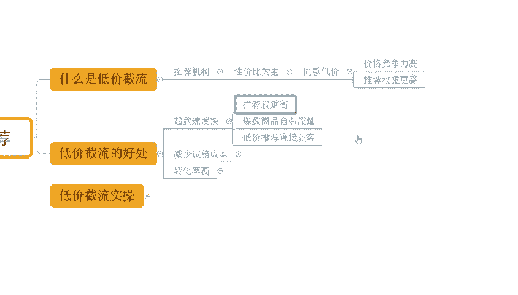

# 【吊打付费】目前B站最完整的拼多多运营实操教程，包含所有新手拼多多开店干货内容！这还没人看，我不更了！ - P20：05 低价截流快速获取推荐 - 拼多多运营思路 - BV1A2sqeeETC

hello，大家好，我是西楼。今天给大家分享内容呢是我们拼多多店铺运营新品请流量方法中的低价节流，快速获取推荐。那么在非常之前呢，还是老规矩啊，先给大家看一下近期跟着实操小伙伴他们的店铺数据。好吧。

那么可以看到啊像这个店铺最早呢是一个完全没有任何数据的新店，零访客的一个店铺。那么经过实操对吧？我们完成了市场分析，完成了竞争分析，完成了产品选品之后，上架商品呢在不断的进行产品群众获取。

那么产品权众提升之后呢，访客也在不断的提升，到后期呢一天的访客呢做到了19000将近2万。那么一天订单呢是2300多单啊，转化率呢12。07啊，非常不错啊。当然除了这个店铺之外呢。

还有像这个店铺也是一样啊，通过实操从零开始的一个店铺，对吧？最早呢是零访客的啊可以看到啊，那么到后期的话，一天是做到了29000的一个访客啊，一天订单是1700多单，转化率呢5。99%啊。

当然呢除了这种零访客的新店之外，其实有一些遇到瓶颈的店铺啊，有数据的店铺同样跟着实操也可以得到一个很好。

提升啊，可以看到像这个店铺，那么原本呢访客在2000多300不到啊。那么遇到瓶颈之后呢，没有办法突破。后来呢可实说那么我们首先完成了产品的结构调整，通过SQ呢进行了优化之后呢，转化提升了之后。

访客也在不断的提升啊，到后面的话，一天的访客呢做到了2万，一天的订单是1900端转化率呢9。37啊，那么这些店铺呢也都是通过自然流操作的啊。如果说你想知道如何通过自然流提升店铺数据。

那么建议呢可以仔细观看我分享视频，好吧。

那店铺运营呢对于很多的新售小白来说呢，会有到很多很多的困难啊。如果说店铺操作有问题啊，需要资料的呀，可以找我啊，那么也非常乐意为大家解决一些问题啊。那么当然了，有时间的话呢。

也可以带着你一起去实操做店啊，就像这些小伙伴一样呢，我们一起能够到更好的方法，让我们店铺呢做的更好好吧，O那么关于我们这一个低价节流快速获取推荐啊，那么到底什么是低价节流，那我们搞清楚对不对？

来看一下啊，首先这个是我们平台的一种推荐机制啊，平台呢对于我们商品的推荐呢是以性价比为主的。这个是我们在近两年啊平台的一个主推的一个方式啊，那么这个什么意思呢？假如说我们有同款商品。

而我们的同款商品的价格会更低的话，好，那么平台就会判定我的价格更具竞争力。那同时呢我的推荐权重也会更高。所以它就形成了我们所谓。

的低价金流啊，我们可以想象一下，同样的两个商品对吧？一个产品是爆款，那么这个时候出现了一个低价商品，这个时候低价商品就可以得到非常大的推荐展现啊。OK那么低价截流的好处有哪些呢？我们来看一下啊。

首先第一个取款速度快。

为什么这样说呢？因为本身低价进流的方式呢，它的推荐权重就会很高，而爆款商品呢，它本来就自带流量的。而低价推荐呢是直接根据我们这些爆款商品来直接获客的，所以它的一个速度就会很快的。就我刚讲的对吧？

如果说我们已经是有一个爆款的，在平台上进行销售的同时呢，我做了一个低价商品跟它是一样的。那么这个时候呢我会直接得到推荐啊，而且推荐的话是我们这个爆款店铺爆款商品的一个访客啊，所以它的一个效果是很好的。

而且速度很快，那么同时呢它的试错成本会很低啊，可以减少我们的收售成本。什么意思呢？因为这个产品它是爆款的情况之下呢，就等于说已经经过市场的验证了，对吧？它已经是一个爆款了，它的用户需求是有的，我们去做。

不用担心说这个产品没有需求或者其他原因导致我们产品进营之后卖不动啊，不至于对吧？所以说我们会有到非常好的市场需求的同时呢，产品的销售不愁啊，那么。

再一个就是我们的转化会很高啊，那么转化高是为什么呢？首先产品的性价比高，对吧？而我们产品的流量呢来源于推荐，而推荐的东西呢是我们的高价的同款爆款啊。那么所以这个时候呢，当用户推荐过来之后呢。

它的转化是有保障的。

是不是？所以说低价金牛好处多不多多，而且它的效果其实可以说是在众多的运营方式里面啊啊算是一个最最直观的一个方式了啊，可以说是立竿见影的啊，当然了，这个东西不是说我去做了之后啊，我能够去比同行的价格低。

我就卖的更好，对吧？也有很多人对吧？也是也去尝试过这个事情啊，做了很低的价格，但是还是没有访客没曝光，对吧？这个也是有原因的啊，那我们来看一看具体低价金流的时效怎么去做。

首先第一件事情干嘛呢？确认爆款链接。

那么我们去做低价节流，并不代表说是所有的商品，我们都能去低价节流啊，也是要去挑选的对吧？那么俗话说的好呢，我们这个列式子呢，要照着软的捏对吧？不能说上来就去干那些大爆款是吧？可能干不动。

所以说我们做的时候呢，小爆款优先啊，那么这些小爆款呢找那些新链接啊，那么他们是我们的首选。那怎么去确认新链接呢？好，当我们找到一个产品之后，对不对？我们去打开网页啊，通过网页打开商品链接。

在这个网址里面呢就会有到一个时间信息。那么这就是发布信息了，如果说这些链接发布时间就很久很久的，O不要去找这些产品，不要去做这些产品啊意义不大啊，那么如果说我们这一个品类里面都是一些老链接的话。

那么很有可能这个平台，这个品类已经被垄断掉了。你做新链接很难起来，对吧？所以这里大家要注意一下啊。

那么找的时候呢，找到这些新链接的同时呢，要找那些好评占比高的啊。如果说有差评或者好评占比比较低啊，那么评论不是很好的情况之下呢，尽量不要做。因为这种产品可能它确实啊质量会存在一些问题。

或者是用户会有一些对吧？问题导致我们后续在经营过程中呢，为我们店铺带来很多的隐患啊，所以这也是我们需要注意一个事情啊。当然呢，如果说我们对我们产品质量有信心啊，确实有去检查过，那么好评其实也无所谓啊。

也可以忽略。因为大部分的差评其实都来源于这个用户对于产品的这个认知，觉得这个价格不值，或者是觉得这个质量有问题啊，导致的一个结果啊。

那么这是第一个点啊，确认链接啊。当我们确认链接之后进入第二个部分，就是确认大盘的走势啊，那我们要去做一个产品的话，对不对？花了很多的时间跟精力去做一个事情，我总不可能说呃就是做的完吧，我一定要有回报。

对不对？所以说我们选择商品的时候，一定要看这种大盘趋势呢是向上的这种品类。

啊，那么尤其是涉及到时间的啊，那么这个时间趋势，季节趋势的时候呢，我们一定要去找到一些啊能够往上走的，而不是往下走的这种情况。比如说嗯这个马上就要过过冬天了，对不对？哎，你给我去来一个夏装来去操作。

对吧？这不扯淡嘛，是不是？那如果说马上要到冬天的时候，那我肯定要去做冬装啊，对不对？冬装是往上走的一个趋势啊，而不是说我去做一些收尾的秋装冬这个夏装来进行一个收尾动作，对吧？这个没有意义啊。

你也不可能说卖很多的量啊。那么再一个呢就是我们第三个点啊，那如何去发布？

同款链接，这个很关键啊。

那怎么做呢？来看一下。首先第一步，我们在发布商品的时候呢，一定是通过机会商品入口去发布的啊，哪怕发布的时候呢，不是同款商品，也可以发布发布的时候呢，点击发布同款。

然后去编辑这些图片信息和文字信息就可以了。那么同时呢我们的图片啊主图啊Q图SQ名称呢一定是要跟我们去对标的这个爆款呢做的一模一样啊，一比一复刻啊，一笔复刻。同时我们在做的时候呢。

最终的售价呢要比同行的爆款要低啊，怎么个低法呢看一下啊，所以最终的售价呢是以我们的拼单价乘以时间乘以这个活动折扣再减去优惠券的一个形式来的啊。所以说我们在做的时候呢，前期一开始的拼单价可以做高一点。

但是我们要保证我们活动提报之后在设置优惠券的同时，它的价格比同行低体现出这个竞争力。而这个时候的话报名活动的时候呢，我们可以直接通过竞价活动去报。😊。

啊，因为我们要跟同行去打，跟同款去打，对不对？所以这个时候呢我们复制一比1的一个复刻的一个链接就非常非常重要了啊。那么直接去做的时候呢，我们产品也能够拿到更多的推荐流量，也能拿到更好的产品展示啊。

同时这个时候一旦我们通过进价完成活动提报的话，我们商品呢是可以直接继承同行的一个销量和评价的，就不会说我们还要去做一些额外的什么出评啊，对吧？做销量这些动作，不需要啊。那么这里呢可能有一个疑问。

就是很多小伙伴说哎，徐，我也很想去把这个事情做出来。我也很想这样去做。但是有一个问题啊，那如果我去做的话，要我产品比同行价格低。那么我没有这么低的价格怎么办？😊。

对吧我如果这么低的话，我亏本怎么办？O这里呢我也顺便提一下啊，其实呢我们在拼多多上去做一些低价的一个套路的话，有很多玩法，包括像同款不同制啊，包括像以次充好啊，对吧？包括像这个AB款的一个操作呀。

都有啊。当然呢这具体的玩法啊，后面呢我也会抽时间给大家专门做分享啊，大家不用担心，好吧，好了啊，那么以上呢就是我们如何通过低价节流完成流量获取的一个方式啊，大家可以去了解了解。

那么还有什么不清楚的地方呢，也可以跟我进行交流沟通，好吧，还是那句话啊，如果说有需要资料的，对吧？可以找我，当然呢有时间的话呢，我也可以带着你一起去实操坐店，就像这些小伙伴一样呢。

我们一起能够有到更好的方式，对吧？完成店铺的运营提升，完成我们店铺的数据提升，得到更好的一个结果，好吧？O那么今天的视频呢，就到这里，我们下载见各位拜拜。😊。

