# 【吊打付费】目前B站最完整的拼多多运营实操教程，包含所有新手拼多多开店干货内容！这还没人看，我不更了！ - P23：08 价格指引SKU布局引导成交 - 拼多多运营思路 - BV1A2sqeeETC

hello，大家好，我是谢楼。今天给大家分享的内容呢是我们拼多多店铺运营新品请用方法中的价格指引SQ布局引导成交的一个玩法。那么在这样之前呢，先看一下近期跟的其他小伙伴他们的店铺数据，好不好。

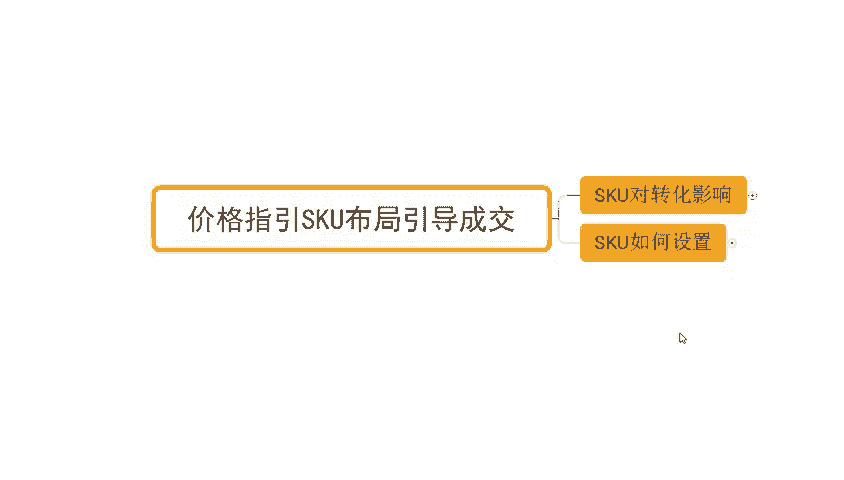

O可以看到像这个店铺啊，原本的访客在2000多3千不到啊，那么跟着实操之后呢，整体的访客可以看到有在不断的增长，对不对？为什么呢？因为我们针对到商品的结构和我们的SQ结构呢进行调整啊，调整之后呢。

整体转化在不断的提升。当整个商品转化提升之后呢商品权重也会不断的增加。那么整体的推排名会得到提升。那所以呢访客也会不断增长。像这个店铺呢早访客只有000多？

后一天访客做了2万多一天订单呢是1900多单转化率呢9。37啊非常不错的。还像这个店铺可以看到啊，原本的访客只有几百个对不对？那么跟着实之后呢的那同样的完成品结构调整呢，不断的提升商品权重。

访客也不断增加到后期一天访客呢是9000多将近1万订单是120多单转化率13。2常不错的那除像这一种有基础有数据的店铺之外，一些访客的新店跟着实操也是可。得到很好提升的啊，可以看到像这个店铺啊。

原本呢是一个没有任何数据的一个新店对吧？那么跟了实之后呢，我们首先完成了市场分析，完成了竞争分析，做好了产品定位之后，开始了我们产品上架到我们新品的操作获取权重。经过一段时间累积之后呢。

访客的一个数据增长啊非常明显可以看到那后期的话一天访客呢做到100天订单呢是2300多单转化率呢12。07非常不错啊，那么这些店铺呢也都是通过自然流的方式来操作的。

如果说你想知道这些店铺如何通过战略来打造的？如自然流来完成爆款操作可以仔细观看我分享视频。好吧那么对于我们很多的线小伙伴来呢，店铺操作呢可能是一件非常困难的事情？因为本身是一个陌生的领域啊。

有很多很多东西呢不清楚，但这个东西呢我觉得没什么的啊，都会这么一个过程的。如果说你在店铺操作过程中有问题啊，或者有需要资料的，可以找我的啊。那么有时间的话呢。😊。

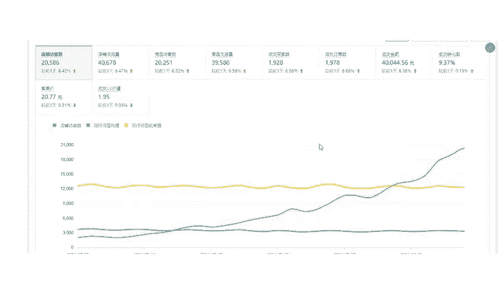

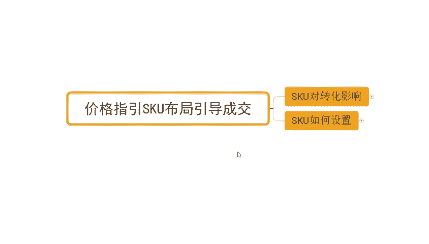

我也可以带着你一起去时尚坐店啊，就像这些小伙伴一样呢，一起能够得到更好的方法，让我们店铺呢做的更好，好不好？那对于我们价格直引SQ布局的一个操作方式呢，我们在分享之前。

首先给大家说一说SQ对于转化的影响，好吧。😊。

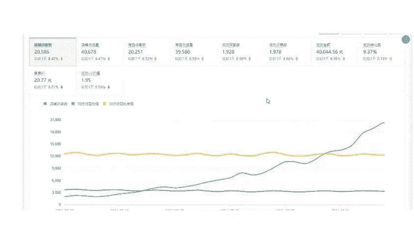

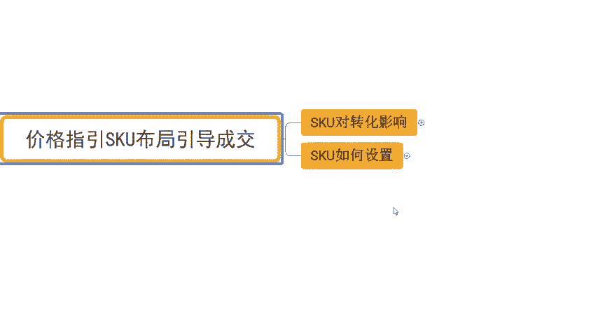

首先可以看到啊整个的一个逻辑。当用户呢进入到我们商品界面之后，对吧？如果说他对我们产品有兴趣想要购买的话，这个时候呢一定会干嘛呢？一定会点击我们的产品对吧？对我们的规格进行选择啊，那么选择的时候。

如果这个规格没有用户需要的，或者是不能满足客户的要求的话，就会导致我们可能有到大量的用户啊，它会流失。那么至少来说这个概率啊会增加，对吧？那么当用户流失概率增加之后呢，我们整个的商品转化。

甚至可能就会啊变得很少啊，转化率呢也会变得很低，对吧？啊，这就是我们啊转化跟我们这个SQ的一个影响啊这个关系啊，那所以说我们想要做好我们店铺的转化呢，我们的SKU一定要做到两个事情。

第一个事情就是能够满足用户的需求啊，第二个呢就是能够。😊。

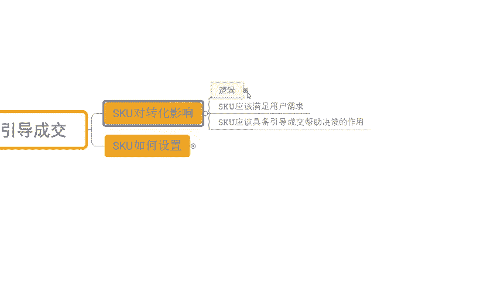

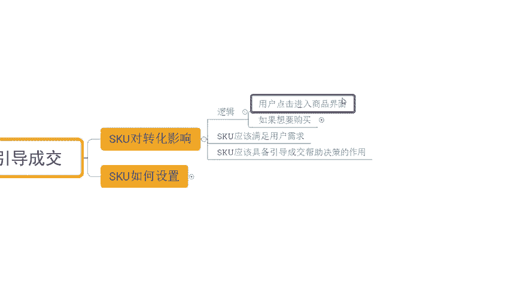

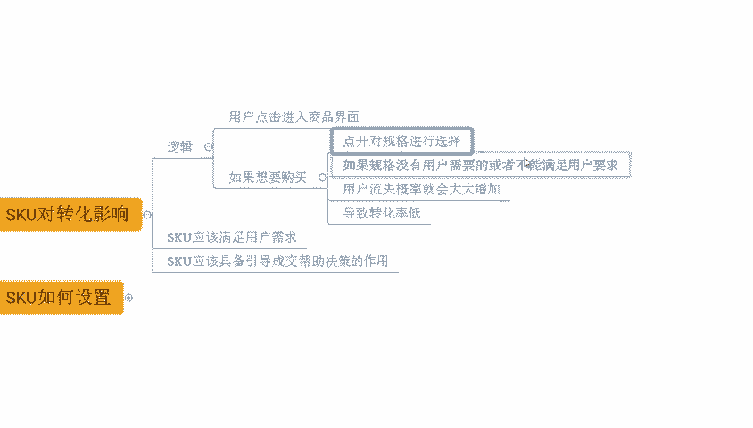

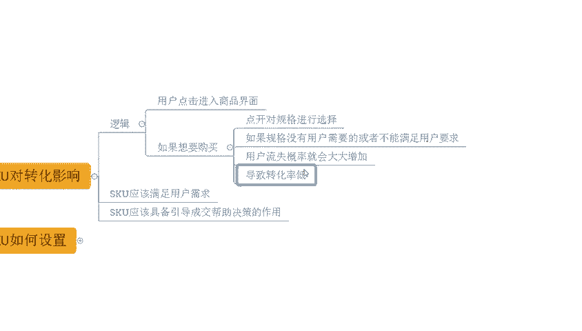

嗯，具备引导成交帮助决策的一个作用啊那么这个时候呢啊才能够去得到更好的转化，达到更好的效果啊。所以说这个大家需要去留意一下啊，那怎么去做呢？这个是我们大家可能更加关心的话题，对不对？哎，说了这么多。

对吧？SQ也说了很多很重要的东西，对吧？对我们转化很很重要啊，帮助很大，很影响很多，怎么做来看一下啊，首先呢我们要分析清楚我们用户的需求啊，这个很关键。

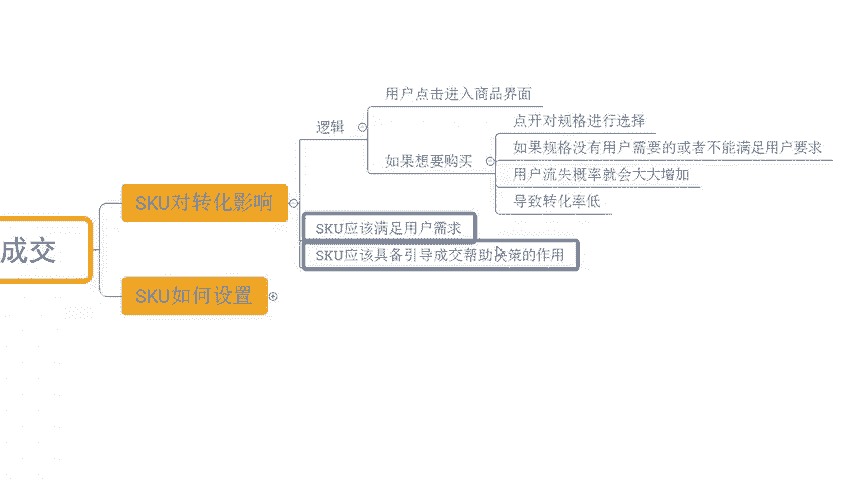

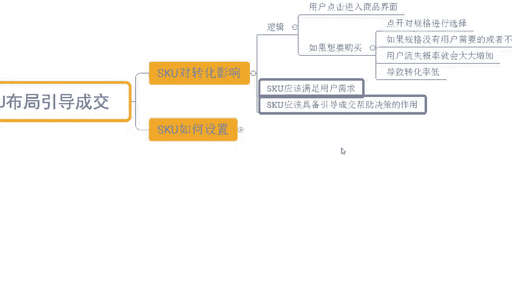

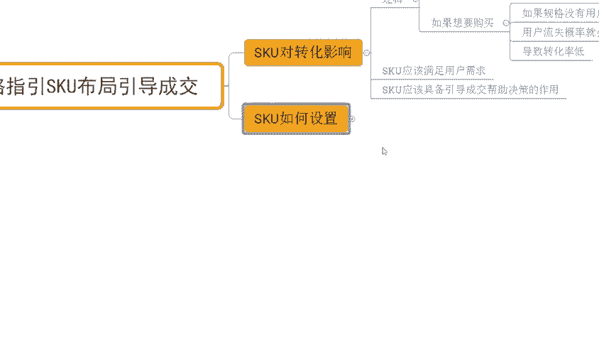

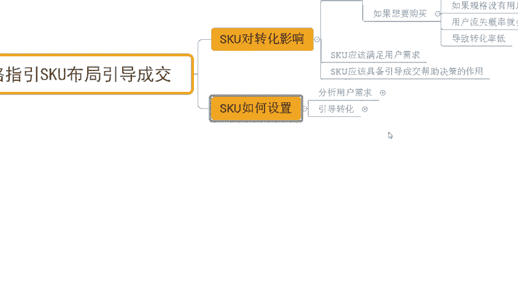

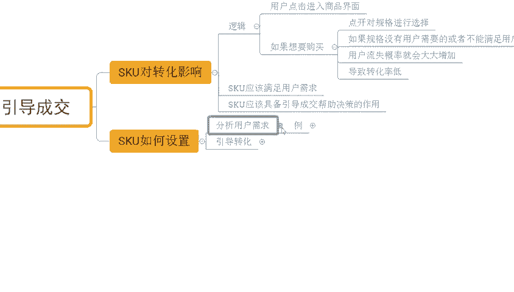

为什么这样说呢？就像我们刚才讲的？如果说用户进来我们店铺之后发现这个SQU啊跟我自己需要的产品不一样，那是不是也不会导致呃不会这个转化，导致流失呢？对吧？O那我们来举个例子啊，比如说衣服啊。

那么我今天要买件衣服对吧？我会对我的颜色对我的尺码进行选择。如果我进入这个店铺，我选择SQ的发现它没有我需要的颜色也没有我需要的尺码，那我会购买嘛？大概率是不会的对吧？很有可能我就流失掉了，对吧？

那这种情况下我的转化有帮助吗没有任何帮助，对不对？所以说我们在做的时候呢，我们就要考虑清楚用户的需求。比如说我们做衣服的那用户呢喜欢什么颜色，我的产品有什么颜色，那我要把它展示出来。

并且呢我的主推的SQ它就要是用户需求多的SQ这个颜色，而尺码呢一样的主流的尺码一定要具备对吧？至少来说我的经营的过程中，我产品的这个呃客户群体的，它也有主流尺码，我要。😊。

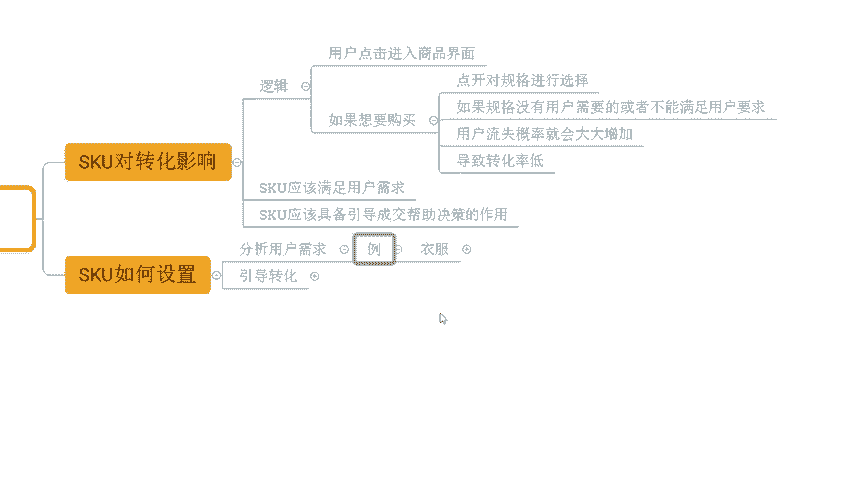

对的对不对？当然这只是衣服啊，那么其他产品也是同样的道理，对吧？比如说我们今天要去买一个手机。那么这个手机它是用来呃这一个日常使用的，就是具备通话功能的基础型的手机呢，还是一些呃有的特殊要求的对吧？

比如说有摄像功能的啊，高清摄像的防抖的这样的一个功能的，又或者是这个玩游戏使用的对吧？那它具不具备我所需要的这样的一个性能。如果不具备，那我也不会买，对吧？当然了，这个只是一个举例啊。

我们具体产品具体分析就可以了啊，大家不用去纠结它。那么这是我们刚刚讲的这一个用户需求。总而言之就是什么呢？我能够把我的产品的这个用户人群进行一个细分。

并且呢能够真正意义上了解我产品对应用户的一个需求之后，把需求量多的产品规格，产品的一个这个呃库存调整好，对吧？让用户进来之后呢，它能够去找到他需要的规格，能够去满足它的要求。当然呢，还有就是什么呢？

我们的一些套餐的一个设置，对不对？比如说今天我们是做这个灯具的啊，打个比方，那么灯具呢有很多的不同的使用场景跟组合。有的人可能买灯具呢，他就买一盏灯，有的人可能买灯具呢，他会买一个这个整套的对吧？

客厅灯卧室灯、厨房灯等等啊。那么我们在做的时候，我们应该更好的去满足用户需求的话，那么我就要把不同的组合形式表现出来。并且呢把更多用户选择的或者主推的一个组合方式呢放到更加靠前的位置。

方便用户选择是这样子的。那么这个是需求分析带来一个最终优化的方向啊，那么再来说一说就是我们的转化的引导啊，转化引导的这个东西呢也很关键啊。如果说我们不懂转化引导的话。

那么整个商品的SQ表达呢就会非常的low啊，或者是对我们转化没有任何帮助。就像我们平时说的这些大部分的服装内目一样的对？它就是一个单纯的颜色和尺码展示，没有任何引导。

那么这样呢对我们后期的一个产品的货比呀。

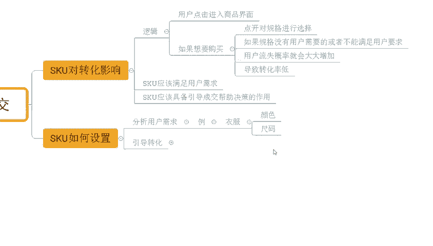

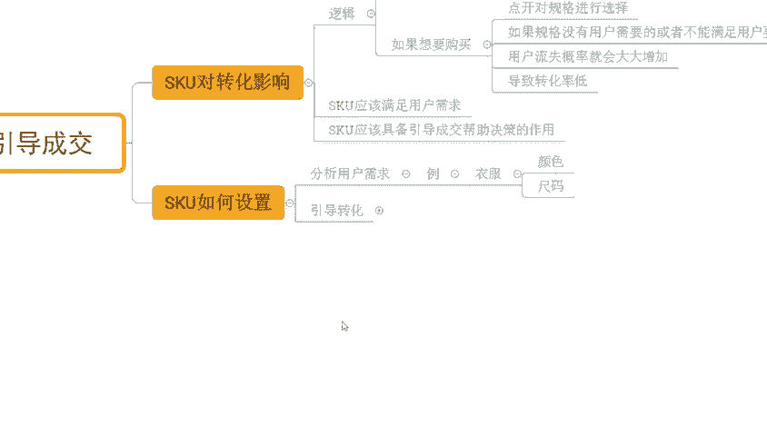

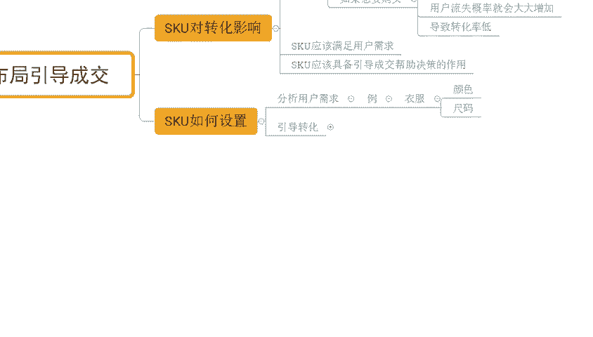

也没有任何帮助，对吧？对我们产品的一个这个成交也没有任何帮助，那就没有意义了。那么转化一来怎么做呢？O那么两个方式，一个是我们的这个阶梯定价，另外一个就是我们的价格指引啊，这两个方式呢非常非常关键啊。

我们展开来说一说，首先是阶梯定价啊。阶梯定价呢，我们可以理解为是同一个产品呢，它有不同的组合形式或者不同的一个价格啊，这里呢我用字母A代替我们第一个组合字母A一啊代替第二个组合A2代表第二个组合。

那么A一呢我们可以理解为它就是我们最低价的一个SKU它在做的时候呢，主要是干嘛呢？是能够去把这个产品的价格表达出来。这个价格呢是用户可以接受的价格，而且是符合平台啊热销的一个价格段啊。

那么这个时候用户呢可以通过A一来完成价格的定位，并且进入我们店铺。那么这个时候进入店铺之后呢，这个产品呢就会形成一个价格展示。😊。

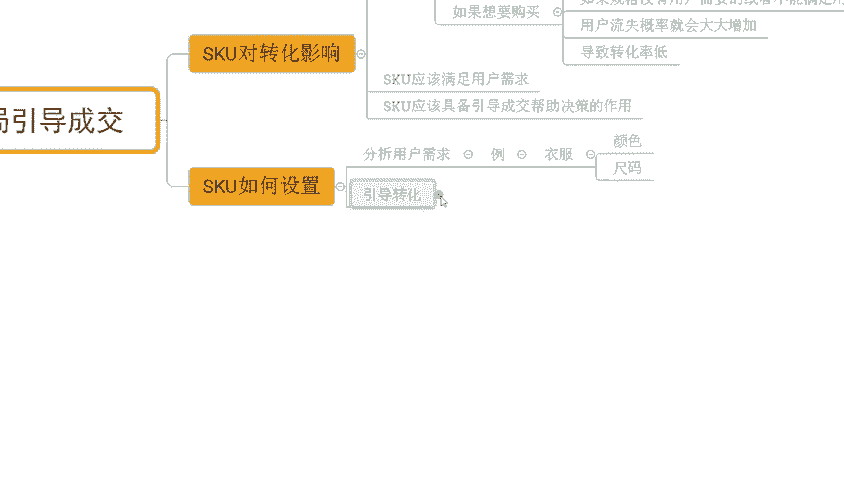

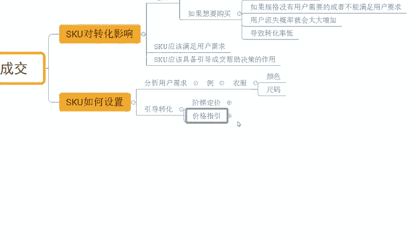

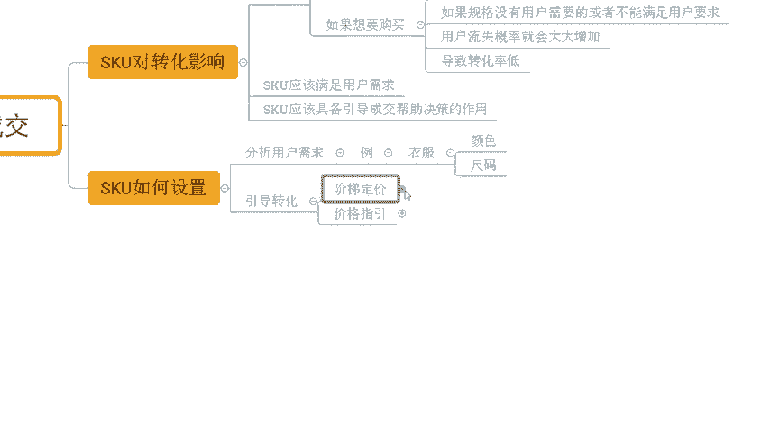

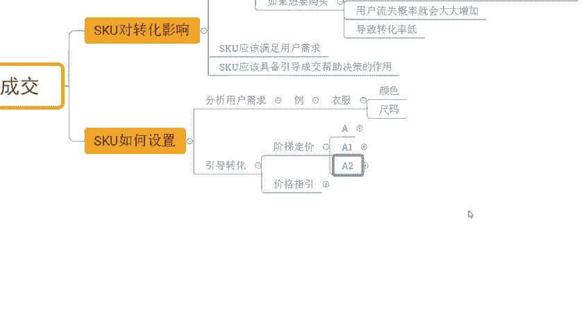

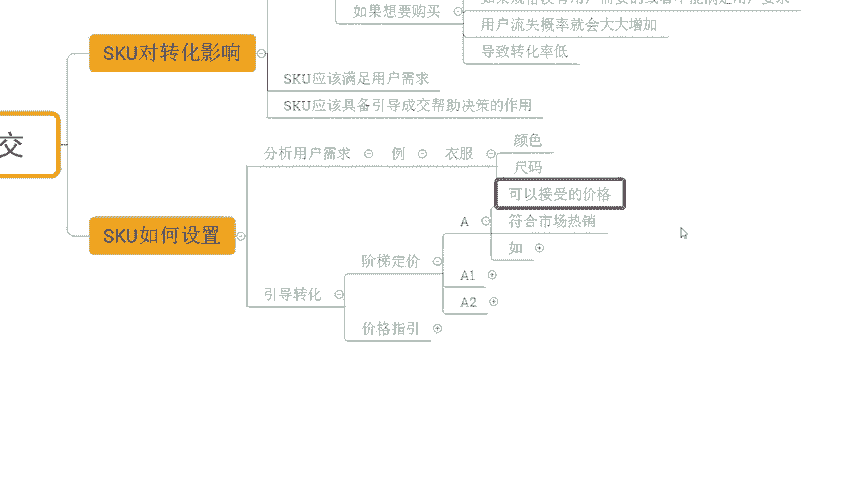

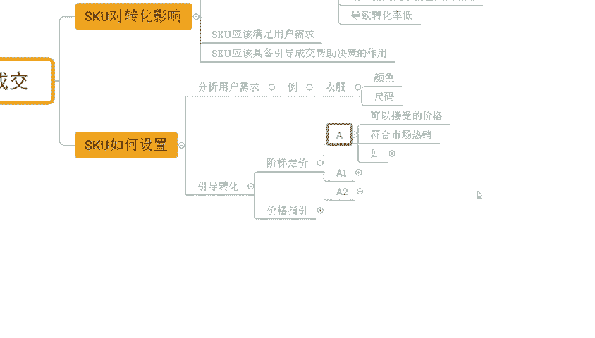

比如说9。9块啊，比如9。9块啊，那么A一呢是我们A一的产品的组合装或者升级装啊，它呢基于A来说，会有到更多功能的补充或者数量的增加，比如说A一打个比方是一件衣服，一件T恤，对吧？那么A一呢。

我们就是两件T恤，对吧？或者A一呢是一件衣服，那么呃A是一件衣服啊。A一呢就是一套衣服，对吧？它是功能的补充。那么它能够干嘛呢？能够体现出一个性价比啊，这个是一个非常非常重要点。

而且这个A一的一个性价比呢，要是最大的啊，这样才能够保证我们用户呢在进行选择的时候呢，会直接选择A一啊，比如说这个时候A一呢我们的价格呢是15。8块啊，它是两个啊，它是两个啊，那么A是一个A一是两个啊。

那么这个时候呢，A一是9。9块，A一呢单个的价格呢就变成了这个。

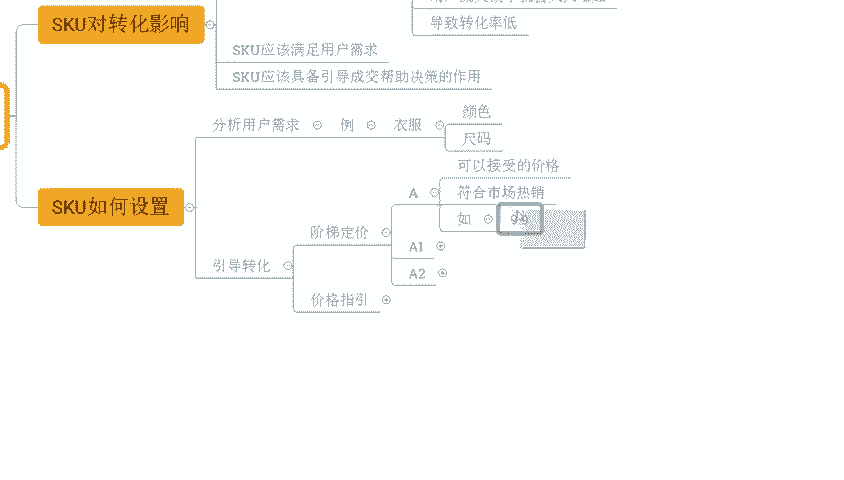

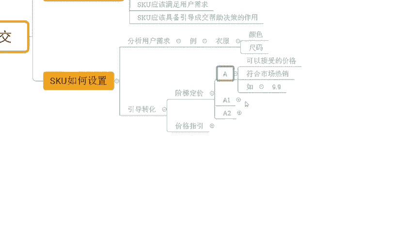

77块多8块多啊8块不到啊，7块9块啊，7块9块的一个价格啊。那么再来看一看啊，A2啊A2呢是在A一和A之后啊做了一个另外的拓展啊，它呢也是功能和数量的一个增加啊。那么比如说我们的A一对吧？

我们刚讲是一件衣服的话啊，这个A是一件衣服的话，A一是两件衣服，那么A2呢就是三件衣服，对不对？它是数量的一个提升。但是这个时候它的性价比会有一定性价比，但不是最高的。什么意思呢？来看一下。

比如说A2的价格呢就变成了24。8块啊，24。8块。那么这个时候呢，它的单个的一个价格呢？其实就变成了啊8块多对吧？8块多啊，那么就是9块多7块多和8块多的一个比价啊，那么这个时候呢最具性价比呢。

就是A一，所以用户呢也会选择A一啊，这里呢举一个非常非常直观的例子，就是手机那A是基础版的手机对。😊。

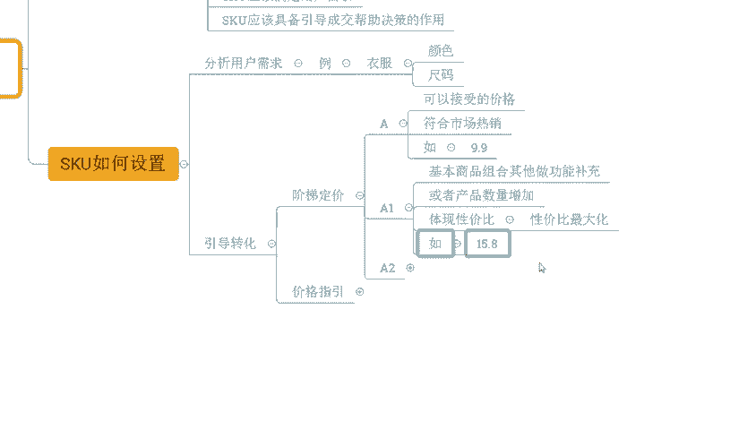

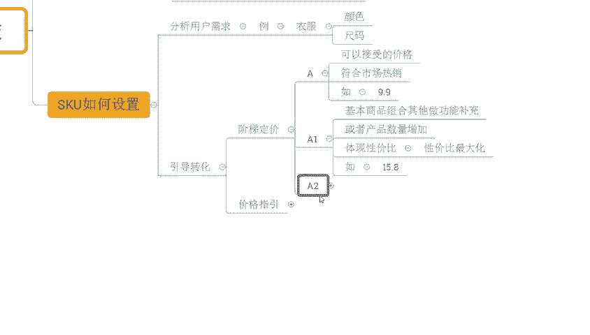

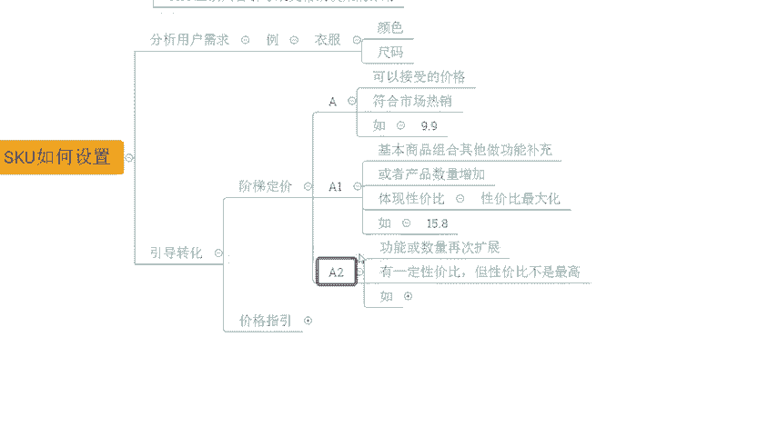

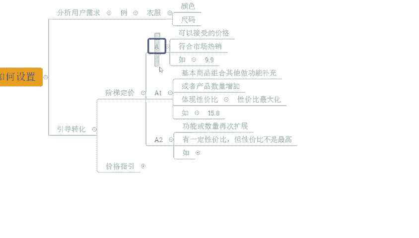

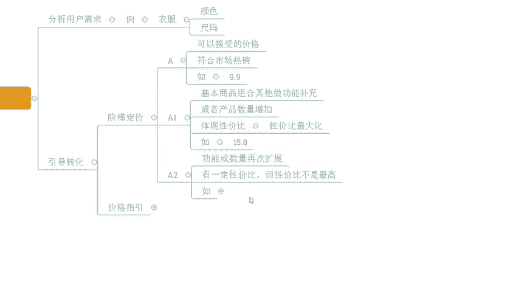

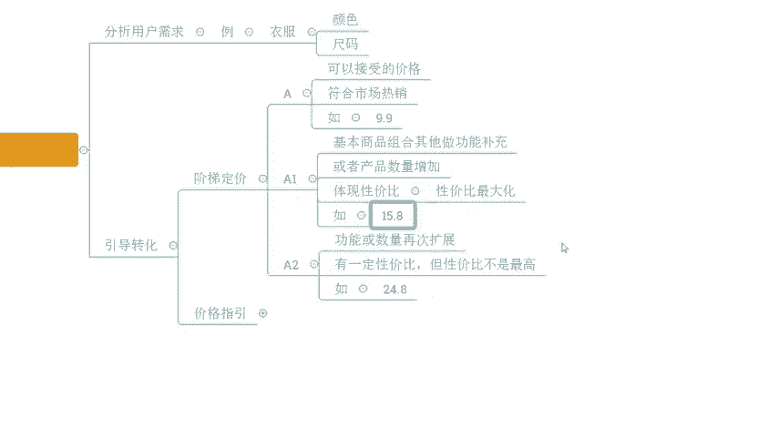

它的这个运行内存跟这个手机内存都很小，A一呢稍微升级了，对吧？它的运行内存会大一点。那么手机内存也会大一点。那么A2呢是运行内存和手机内存变得特别特别大的这种的可能平时我们用不上啊。

它可能是相对来说配置更高一点，但是性价比来说就不是很高了。所以用户在选择基础款手机的时候呢，它往往会觉得我稍微加一点点钱我就可以选择更好的手机了，性能更好啊，更好用对吧？用的可能也会更旧。

那我选择A一好了，吧？是这样一个意思啊，所以它就是我们的接机性价的方式啊。那么A的价格呢就是我们的价格锚点啊，以此类推往后去延伸，然后体现出性价比啊这个在我们手机啊、汽车啊。

各种企业里面各种一些知名产品里面其实都有遇到过啊，那么再来看看我们的价格指引啊价格指引呢这个东西呢就相对来说比较简单。但是它很有效啊，什么意思呢？

它的核心的这个作用呢就是突出我们的价格突出我们的优惠信息。😊。

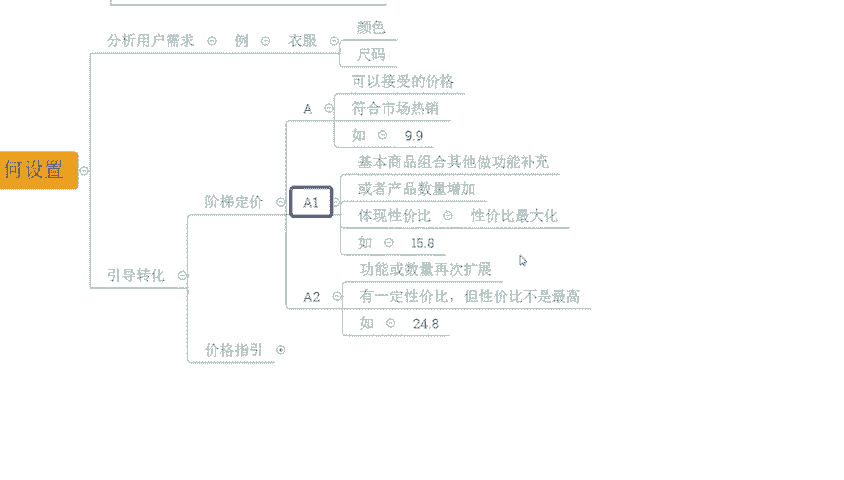

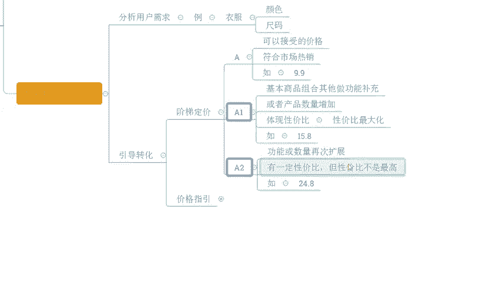

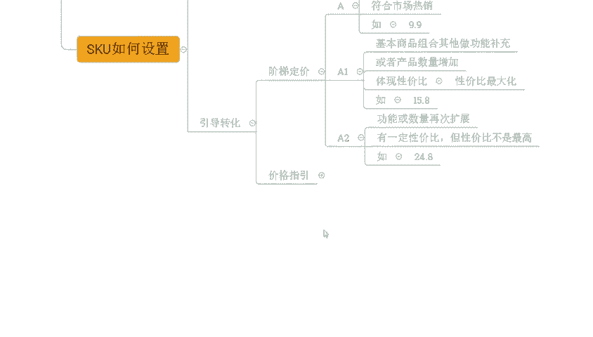

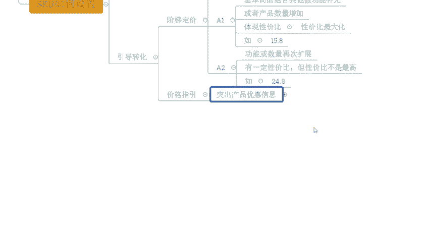

那么同样的两个产品啊，假如说都是A啊，都是A一个A呢，它是卖10块钱，另外一个A卖8块钱对吧？那么这个时候呢，你会买10块的还是买8块的，他们俩是同样的。

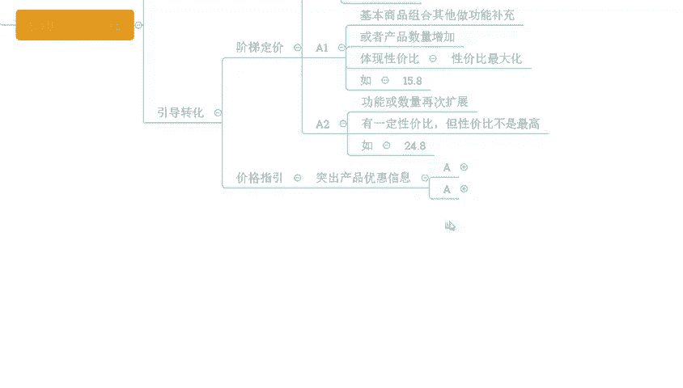

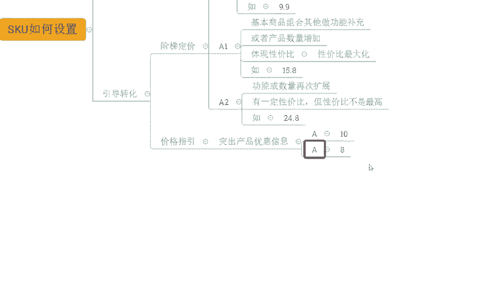

我相信啊这个时候但凡是脑袋正常一点的都会选择8块的，对不对？那当然有人可能说哎我不差钱，我就想买一个品质更好的，我觉得8块的可能质量不好，我就要买10块的行不行也行啊，也行，这个不冲突。

那么这个时候如果它是两个链接的话，可能会有这样选择。但是如果今天我们做的时候，这两个呢在同一个链接里面，它是两个不同的SKU但是体现出来的产品展示是相同的。这个时候呢。😊。

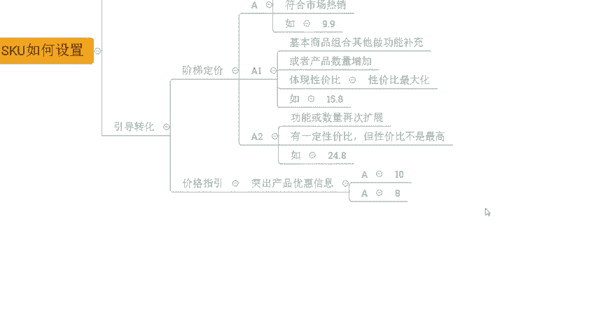

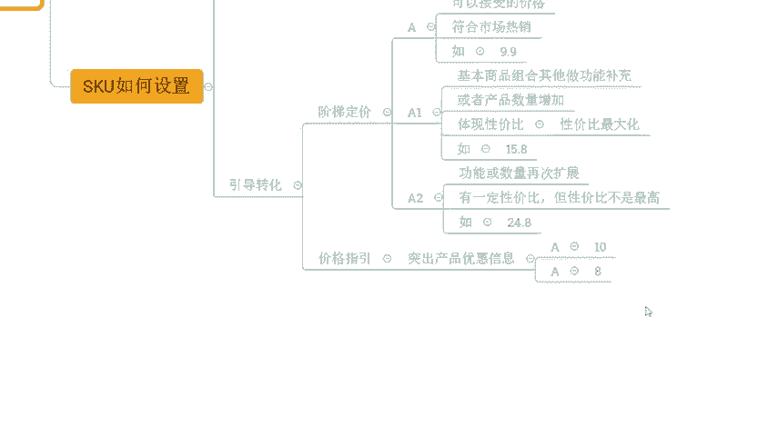

8块的这一个体现的一个这个优惠信息的表达。那么用户呢往往就会呃一开始选择的什呢就锁定了8块的进行转化，它的转化率就会更高啊。所以呢它就是对我们产品转化的引导啊包括阶梯价也好，包括我们价格好。

都是完成我们SQ布局的一个重要方式啊，当然这两个方式呢在讲的时候可能没有结合到我们产品只是一个随随便便的一个举例的话，可能大家其收起来捏起来还是比较困难的啊。如果说你在具体操作过程中有不清楚的地方呢。

也欢迎大家跟我交流沟通啊，对于店铺来讲的话，其实方法有很多更多的还是细节的操纵啊，那么如果说有需要资料的呀，对不对，有问题的呀，都可以找我啊当然还是句话有时间的话呢，我也可以带着你一起去实操做垫吧？

像这些小伙伴一一起能有更好的方之后，让我们店铺做的更好对？那么今天的一个分享呢就到这里，我们下周见，各位拜拜。😊。

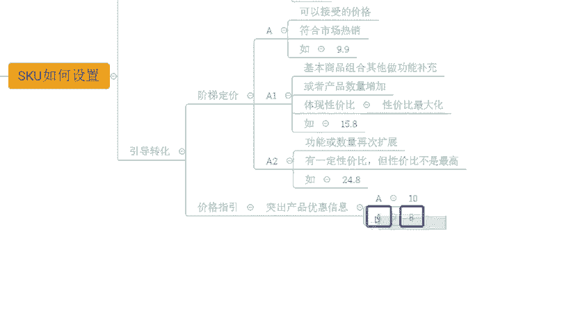

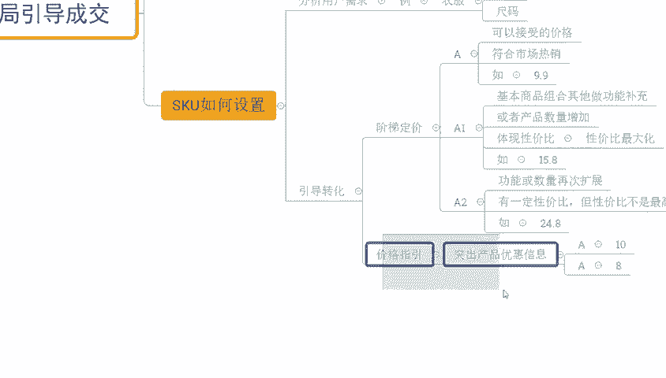

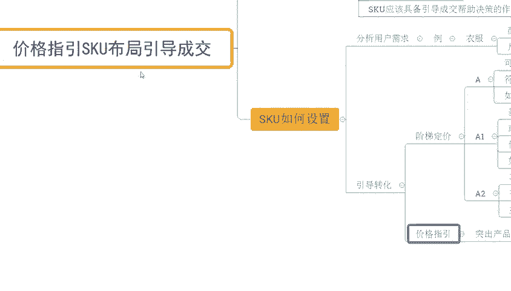

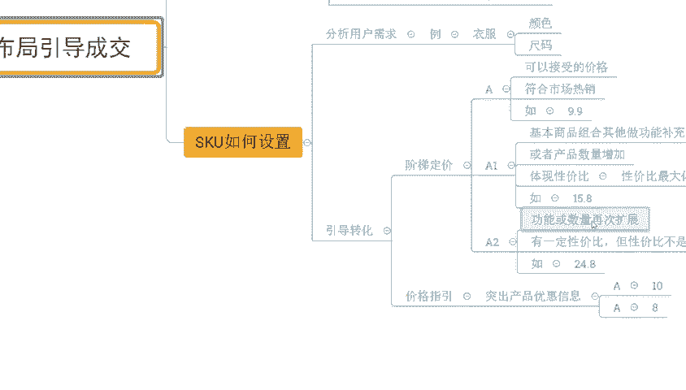

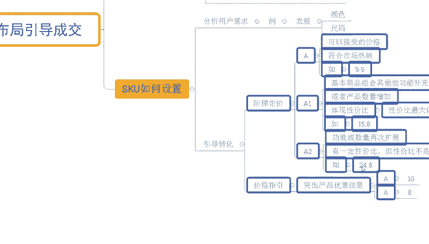

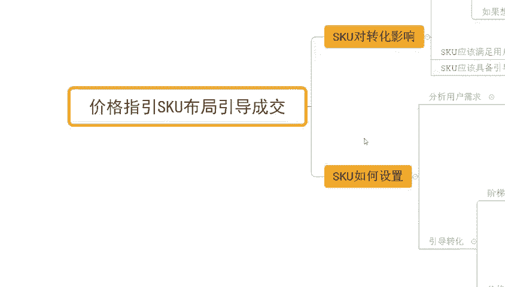

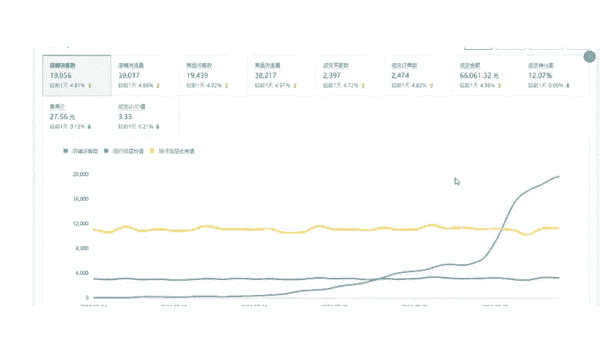

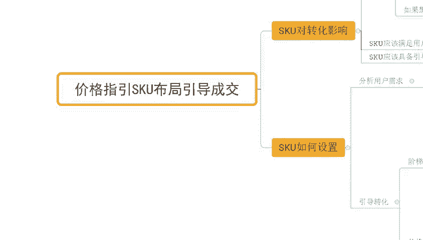