# 【吊打付费】目前B站最完整的拼多多运营实操教程，包含所有新手拼多多开店干货内容！这还没人看，我不更了！ - P25：10 SKU防比价拒绝流失 - 拼多多运营思路 - BV1A2sqeeETC

hello大家好，我是西楼。今天给大家分享的内容呢是我们拼多多店铺运营新品请流量方法中的SQU防比价拒绝流失的内容啊。在分享之前呢，先来看一下近期更多时的小伙伴他们的店铺数据，好吧。

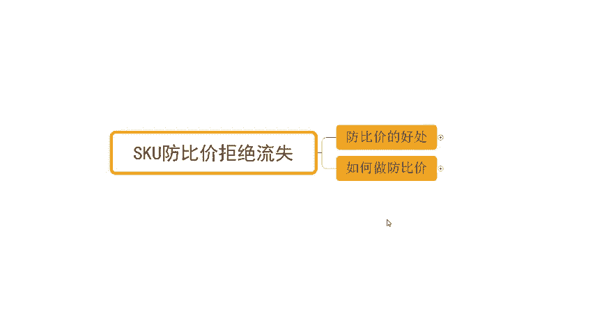

可以看到像这个店铺呢，原本访客呢只有几百个啊。那么在经营过程中呢，我们完成了产品的结构调整，完成了SQ的一个调整。当这些调整完成之后，整个商品的转化呢是得到了提升。那么转化提升之后呢。

整体访客也在不断的增长啊。到后期的话整个访客呢从原本的几百个啊，涨到了9000多个将近1万。一天的订单呢是1200多单，转化率呢13。12啊，还有像这个店铺原本的访客呢是2000多啊。

那么通过优化之后呢，完成商品数据提升之后，整体访客也在不断的提升，到后期的话，一天的访客呢，从原本的2000多变成了2万啊，那么一天的订单呢也变成了1900多单，转化率呢9。37%啊，也是非常不错的。

但是呢除了像这种有基础有数据的店铺之外，还会有到很多小伙伴呢是从零开始的新店那么提升也是非常快速的啊，可以看到像这个店铺原本呢是一个没有任何数据的新店，一个零访客的店铺。那。😊，同样的啊。

跟着实操之后呢，我们完成了市场分析，完成了竞争分析，搞清楚了我们的爆款定位之后，完成了产品的会员对接，不断的上架商品之后呢，进行技逐权重的累积。那么经过一段时间的一个累积之后呢。

整体店铺的数据也在不断的增长啊。到后面的话一天的访客呢，是做到了19000。一天的订单呢是2300多单，转化率12。07啊，也都非常不错。当然呢，像这些店铺呢也都是通过自然流的方式来操作的啊。

如果说啊你想知道如何通过自然流来操作店铺，如何通过自然流来打造爆款。OK那么建议呢可以仔细观看啊，我分享视频好吧。😊。

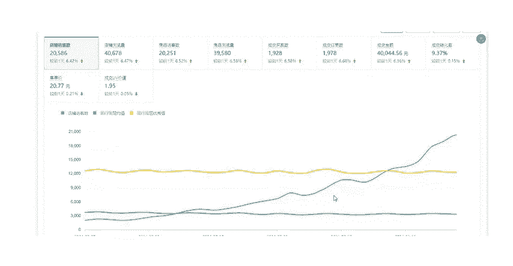

那店铺运营呢对于很多的这个新路小白来说呢，会有到很多很多的困难啊，这个非常正常。因为毕竟呢一个陌生的领域肯定会有到很多的一些啊不清楚的地方，对吧？那对于店铺操作来讲的话，如果说你有遇到什么问题啊。

或者有需要什么资料的呀，OK的，可以找我啊。那有时间的话呢，我也可以带着你一起去实操作业啊。就像这些小伙伴一样呢，我们一起能够有到更好的方法之后，让我们的店铺呢啊做的更好，那么能力提升也会更快。好吧。

😊。

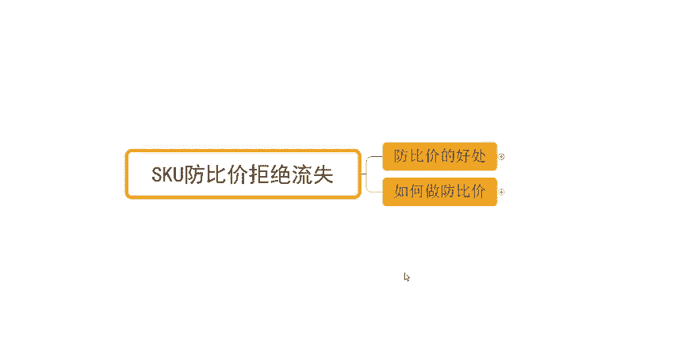

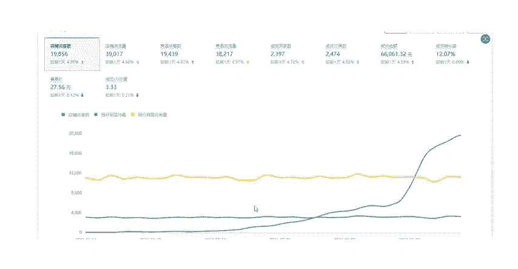

那么SQ的反比价啊拒绝流失这样的一个内容呢，到底他对我们店铺来讲的话有什么样的一个意义，对吧？我们首先看一看房比价的好处是什么，好吧。

仿品价呢好处很多啊，我就简单说几个最直接的。第一个，它可以避免直接的价格竞争。

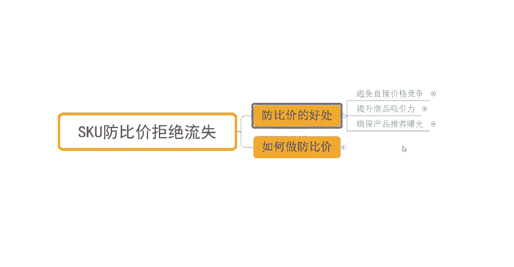

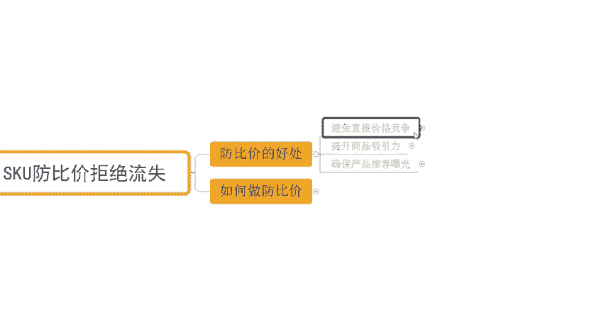

什么意思呢？OK来看一看啊。首先呢我们的平台还有用户呢，他们对价格是非常非常敏感的。

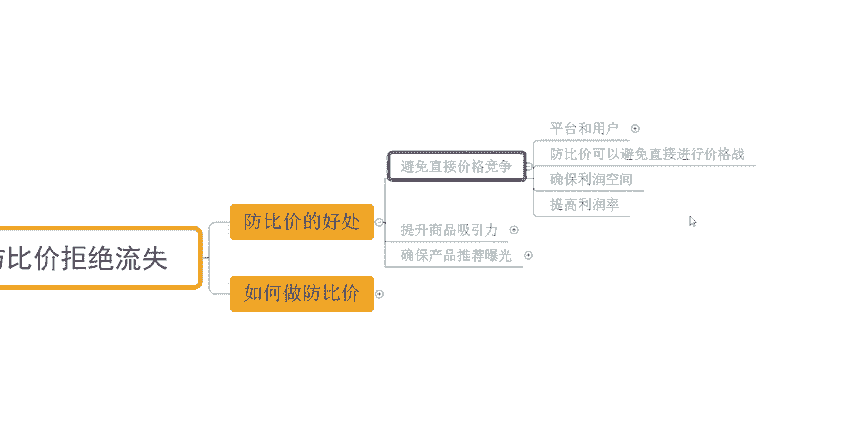

如果说啊我们是同样的商品，那么这个时候在平台上进行销售，那么往往价格更低的商品呢是能够得到更多推荐的啊，而且当我们产品呢形成曝光之后，那平台也会针对到对应的人群来推荐跟我们相同商品的低价商品。

这个时候呢会导致我们的用户流失也会导致我们的订单流失。所以说仿比价呢，它可以直接避免掉价格战啊，那么这个时候呢就可以确保我们的利润空间，而且呢还可以提高我们的利润率。对于我们店铺运面来讲的话。

它的意义是非常非常重大的那除此之外呢？仿比价呢还可以提升我们商品的吸引力啊，什么意思呢？很简单，就像我们刚刚讲的对不对？那么如果说我们的产品呢是被一些低价的商品啊来进行比价的话。

这个时候呢我们这个产品啊可能就会导。

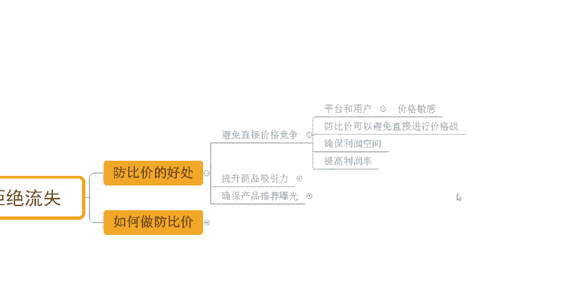

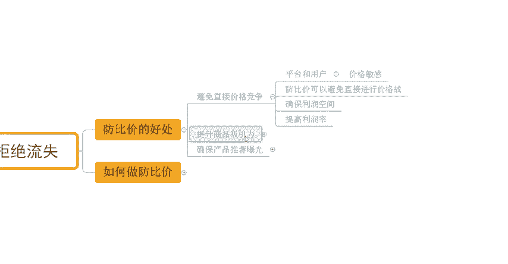

致用户流失啊，那么整个的一个价格啊进行比价的时候呢，没有优势。我们的用户流失之后呢，我们商品呢就不会有到很好的转化。而整个仿比价的话，它可以减少这样的一个操作，对不对？

那么也会降低我们产品被用户比价的一个可能，从而呢也可以大大提升我们商品的转化啊，得到更好的数据，对吧？那么另外一点呢，仿比价呢还可以确保我们产品的推荐曝光啊，那么这个东西呢也很简单。

就像我们之前说的一个事情，对吧？比价会导致用户流失，那么这个流失的方向呢就是一些低价商品。包括说整个推荐呢也是直接推荐到低价商品的。但是如果说我们做了仿比价的话啊，那么就可以保证我们的曝光减少流失。

同时呢这个流失的方向呢，也不会说是一些低价同款商品，对吧？而确保我们产品呢它的曝光是能够稳定的，能够更加健康的成长的所以说好处非常。😊。

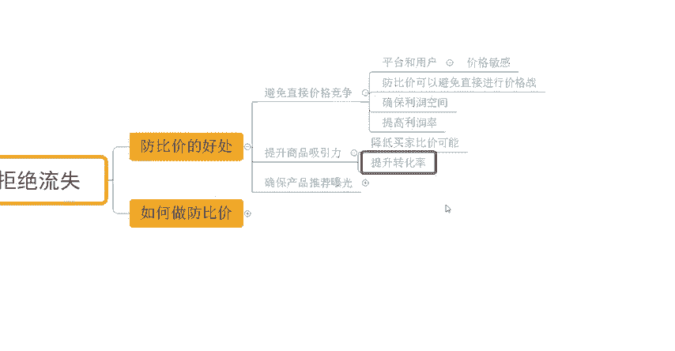

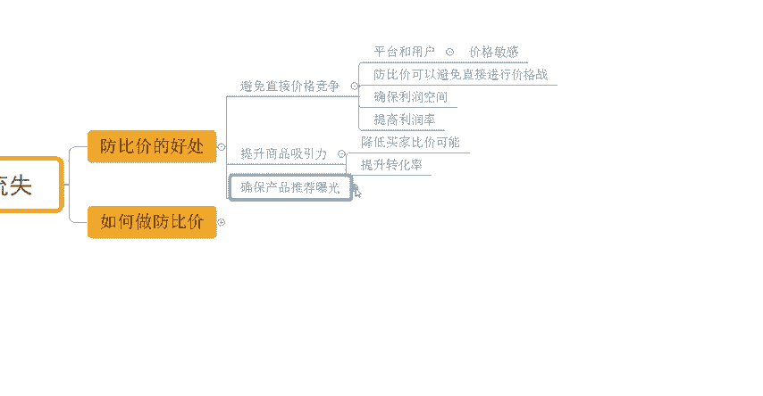

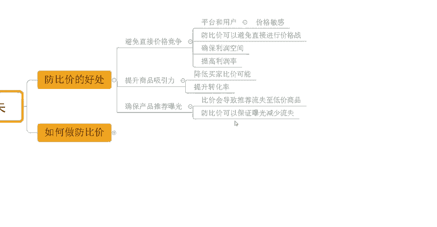

非常多。那么好处这么多的情况之下，我们应该怎么去做好这个防比价呢？这个也是我们大家可能比较关心的话题，对吧？其实仿比价的一个操作呢并没有特别的复杂，而且比价的操作呢也不是说很麻烦，对吧？所谓的比价呢。

其实考核的就是我们的SKU的名称和SKU的图片。

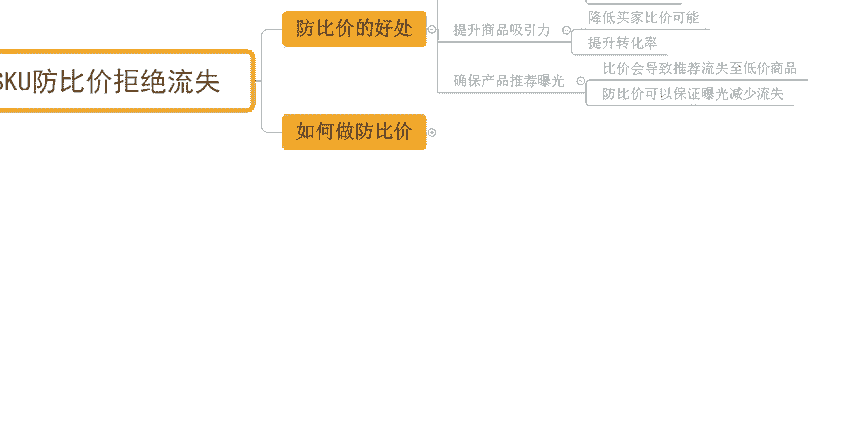

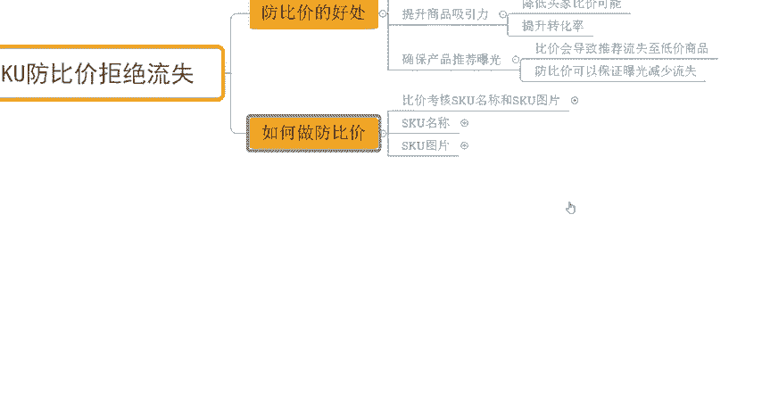

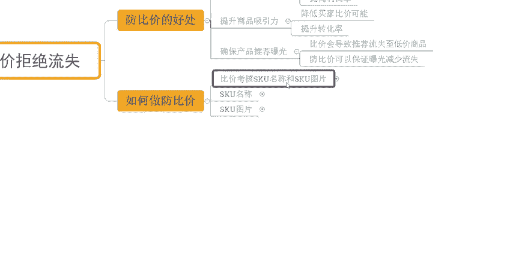

所以说想要做好防比架的话，就要做出不一样的SKU就可以了，对吧？那么这个做法呢，两方面来产生，一个是SKU的名称，一个就是我们SQU的一个图片，对吧？那么SKU的一个名称怎么去做呢？我们来看一看。😊。

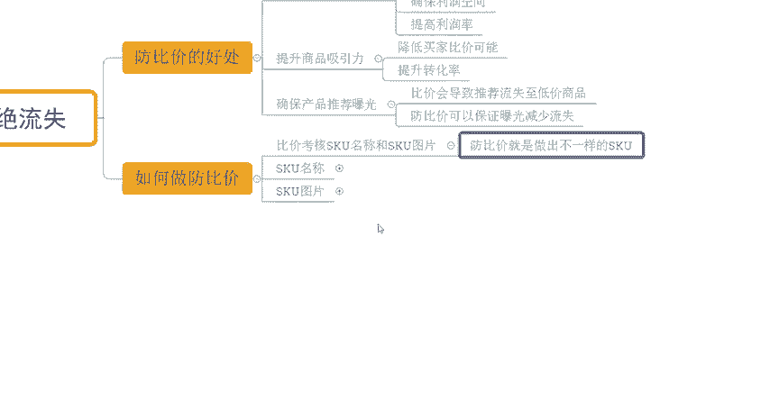

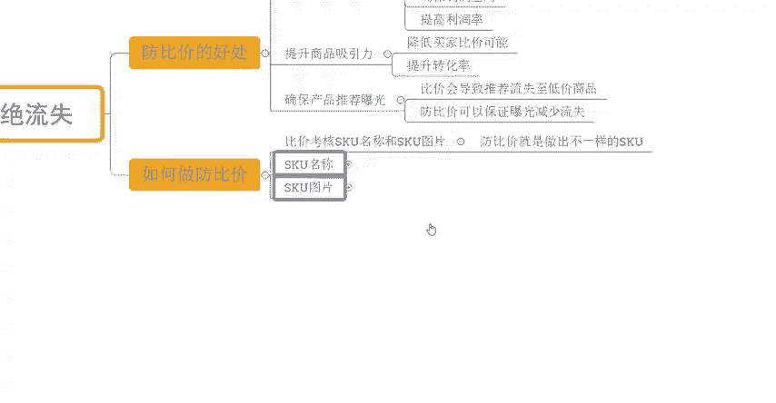

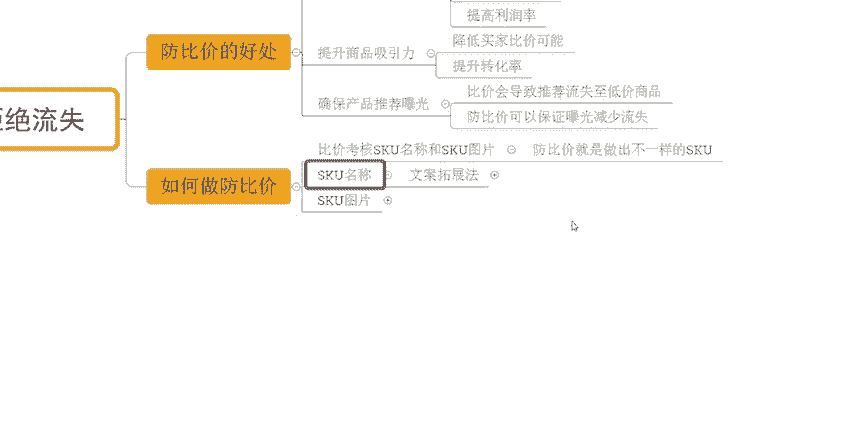

非常简单的一个套路啊，叫做文案拓展法，就可以帮我们完成我们这个SQ名称的一个拓展，或者是SQ的一个描述的一个呃不相同，对吧？那么在我们整个的SQ里面呢去添加修饰词。

那么这个修饰词呢可以是根据买家需求进行拓展，也可以是我个人的主观意识来进行拓展，只要做到一个事情，就是确保我的SQ呢是独一无就可以了啊。那么这种方式呢，其实非常非常常见啊。

我们可以看到经常在一些产品里面啊，会发现它写了一些莫名其妙的一些内容啊，或者一些数字，对吧？那么这些操作呢就是为了保证我们的SQ呢它的名称跟同行不一样，或者确保我自己原创性，除非有人抄袭我的对吧？

不然的话我就不一样的啊，那么简单给大家去举个例子吧比如说今天我做的是服装，对吧？今天我做的是服装啊。😊。

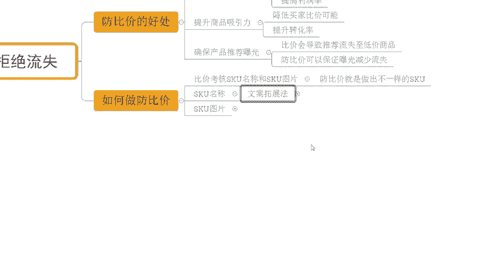

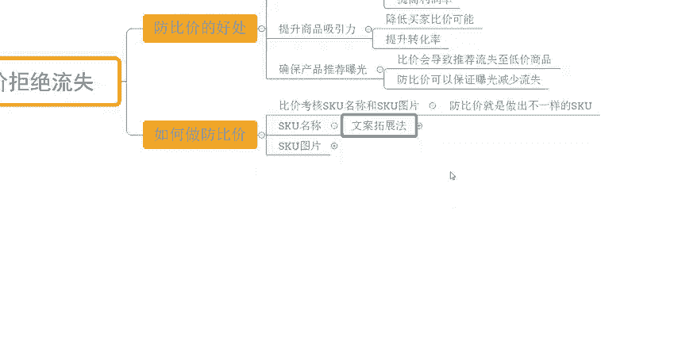

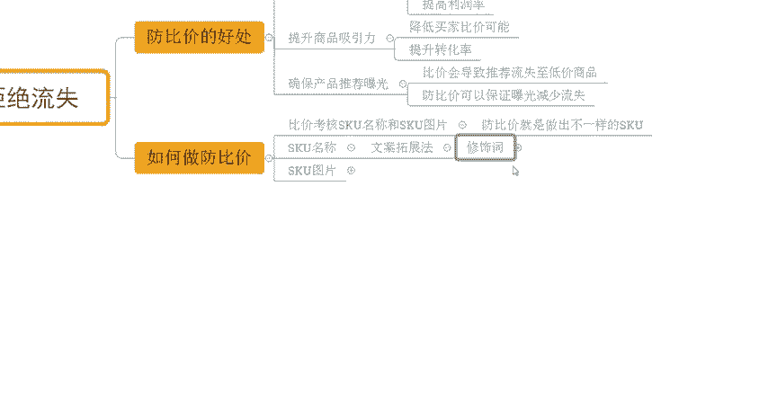

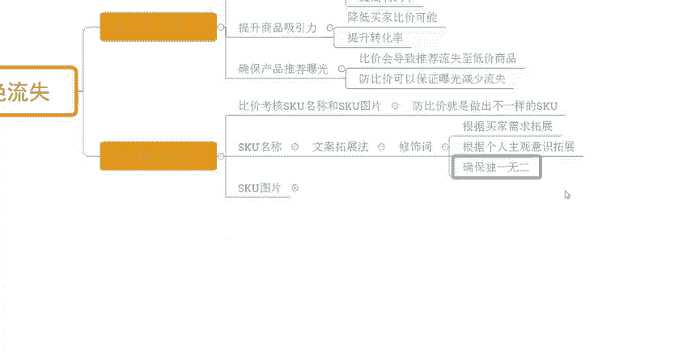

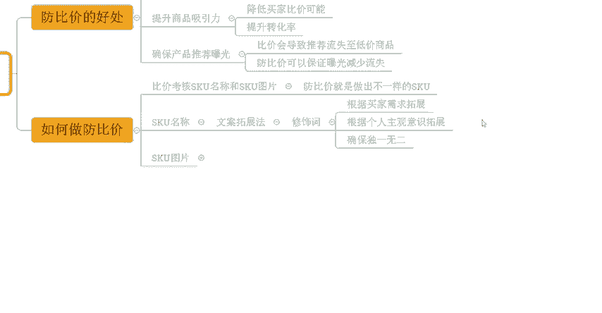

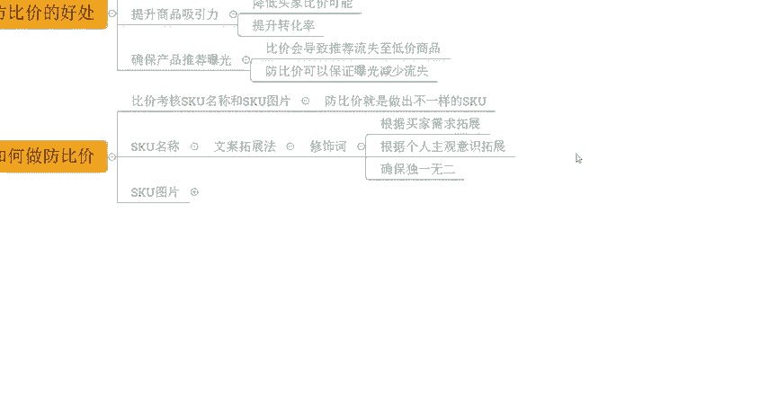

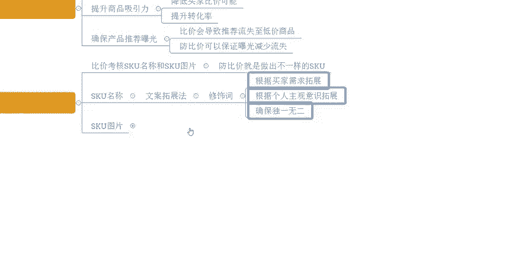

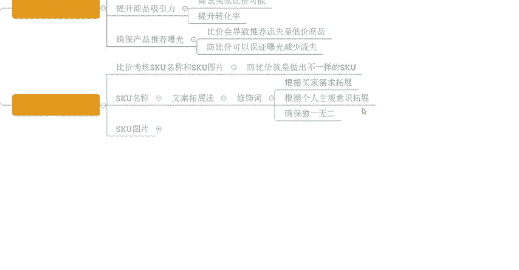

那么在我进行这个服装的SQ的一个。

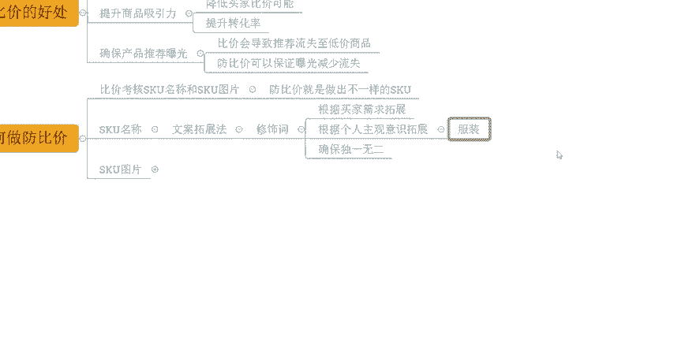

这个呃编辑的时候呢，OK那我们可能正常的呢就是两个对吧？一个是颜色啊，一个是尺码对吧？颜色，一个是尺码啊，那么在做颜色和尺码的时候呢，哎我们现在的颜色呢，可能是黑色、白色、红色、黄色对吧？绿色等等啊。

各种各样颜色。那么这些颜色啊，我们在真正意义上进行操作的时候呢，就要和我们的同行进行区分，我不能使用到这种啊平台的默认颜色或者是同行使用的颜色，对不对？比如说我们听的比较多的一个颜色，对吧？啊，黑色。

对吧黑色啊，那我可不可以把这个黑色呢做的不一样呢？对吧？啊，我可不可以把这个黑色做的不一样，当然可以啊，对吧？我把这个黑色呢啊做一些修饰词的一个填充啊，或者是一些编辑，对吧？啊。

我把它做成一个乌黑色可不可以啊，可以的，对吧？墨黑色可不可以也可以的，对不对？😊，啊，总之我要做的跟同行的这个所谓的颜色呢，它是不一样的。而且在这个过程中呢。

我们也可以对这个颜色呢进行其他的编辑一些呃不具备实际意义的一些数字啊啊字母啊进行一个编辑，对吧？让它具备一个某种特定的所谓的啊编码，对吧？而这个编码是我自己在独立使用的啊，就可以的。

那么包括尺码也是一样的道理，对吧？我们可以把它做进去都是可以的，做更多的一些修饰词啊，什么修身显瘦啊之类的东西，对吧？通通可以做进来。这样呢既能够增加我们的搜索权重，又能够去做好原创性。

做好一个啊这个差异化，对吧？那么是一举多得的啊，那么再来说一说我们的SQ图片啊，SQ图片呢也是非常非常重要的一个事情啊，首先呢两种方式啊是可以帮我们直接去做到这个图片的独一无二的，对不对？

图片的原创性的。那么正常来讲，我们的SQ图边呢可能就是直接产品拍摄图片，对不对？😊。

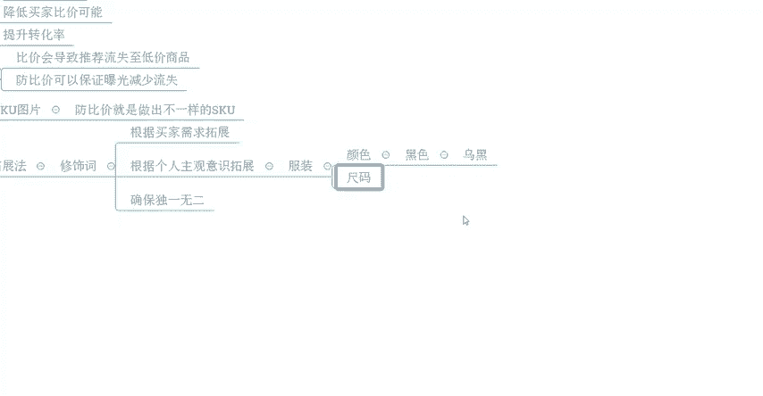

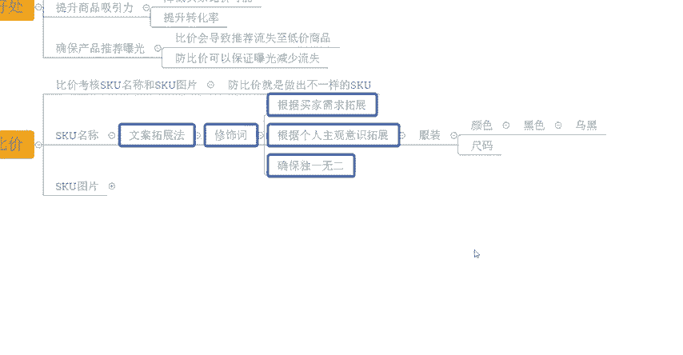

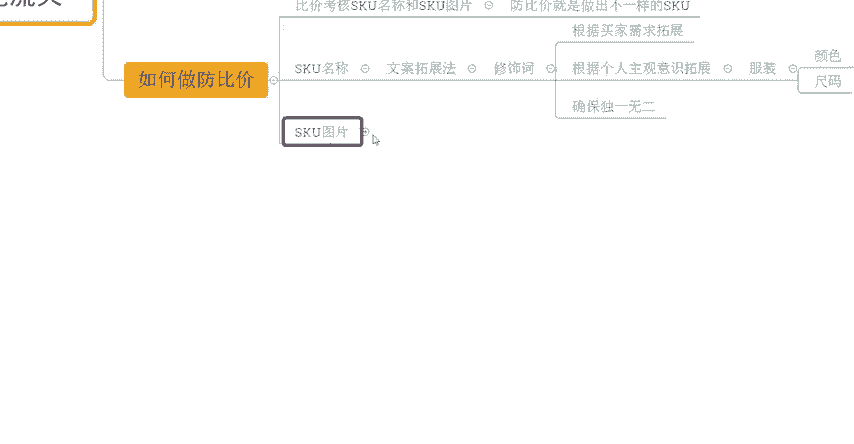

那么这里呢给大家介绍两种方式啊，可以非常好的去解决这个问题。那么在我们进行图片编辑的时候呢，我们可以做一个文字图片。什么叫文字图片呢？就是把我们产品的图片直接替换为对应的文字图片啊，给大家举个例子。

好吧。

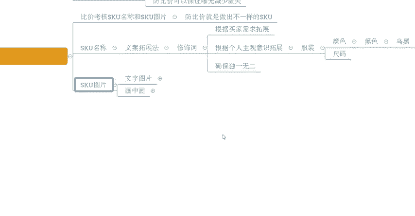

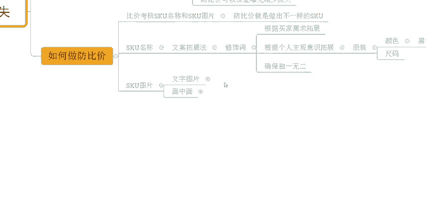

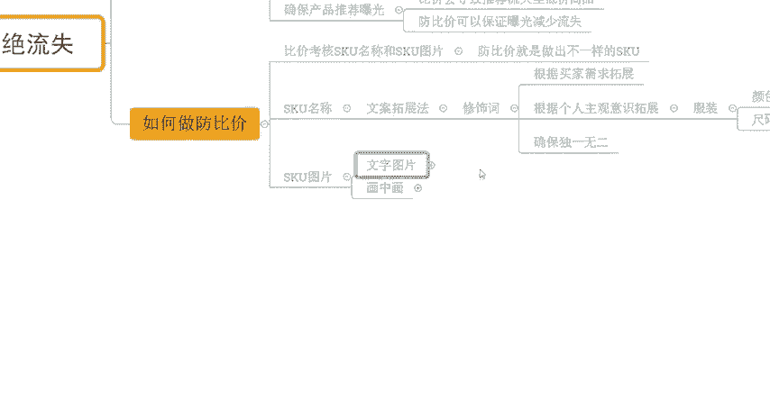

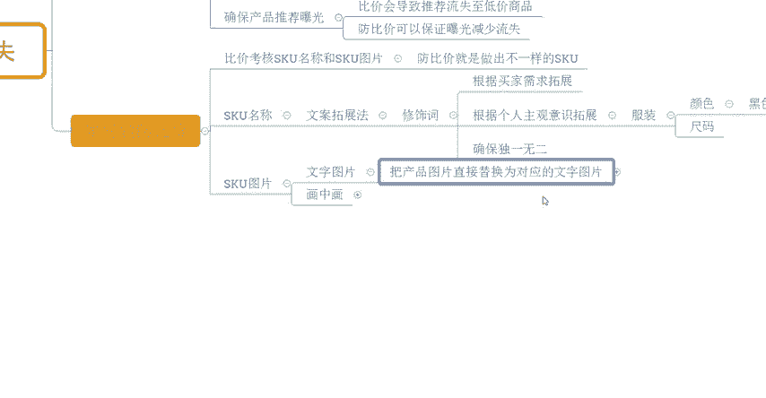

来。

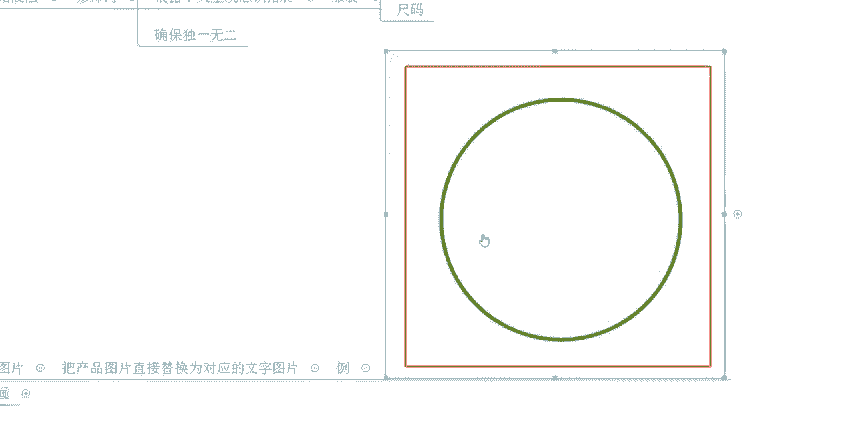

那么这里啊中间的这个绿色的圆呢，就是我画的一个产品啊，这个地方我们假设它是一个产品，对吧？这个产品呢叫做圆啊，这个产产品叫做圆啊，红色框子呢是我的产品的这个SQ图片的一个框子啊，一个框子啊。

那么正常呢我们打开的时候可能看的就是一个绿色的圆，对不对？那么在这个时候呢，我在上传SQ的时候，如果说我上传的图片就是拍摄出来的这么一个圆。那所有人它的产品都是这样子的。

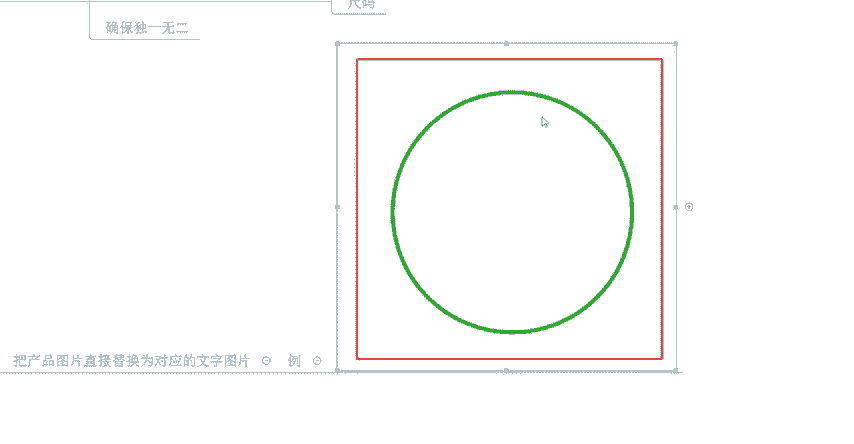

那么我们在做好这个反比较的时候呢，可能就比较大难度，对不对？那么怎么办呢？来看一下啊，我重新去做1个SQ图片。而这个SQ图片呢，在我们正常的SQ里面呢，我把。

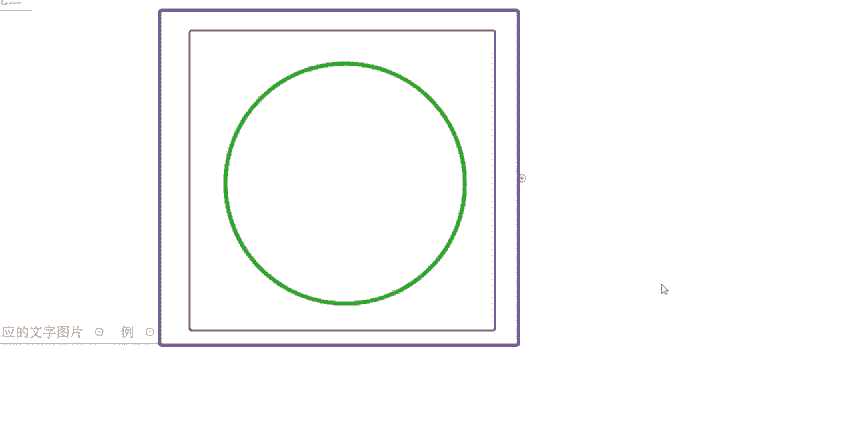

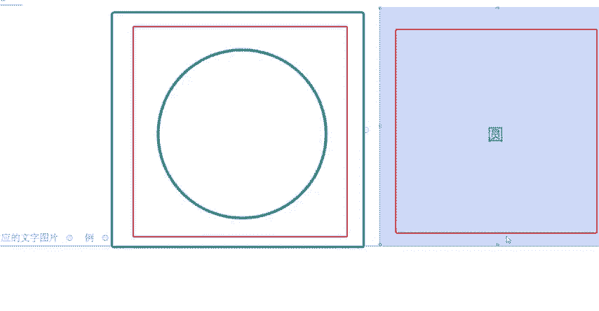

文字的圆啊打在这个图片里面去啊进行一个展示，对吧？甚至我可以把这个圆的尺寸写进去，对吧？多少尺寸的圆啊，什么颜色的圆，我把它写进去，这样呢能够去帮我们做好一个非常好的啊区分啊。

就是我跟同行的话就完全不一样的，对吧？同行可能用到的就是一个图片的圆。而我是一个。😊。

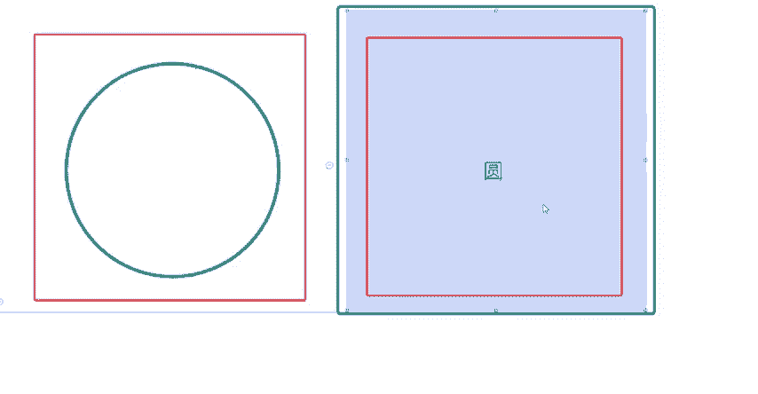

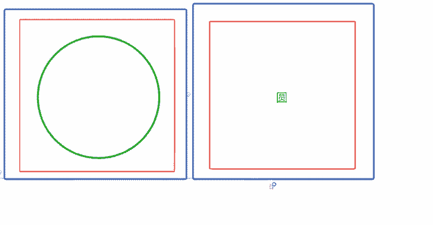

文字的语源啊是这样子的。那么这个时候呢，我们整个的操作呢，就可以帮我们完成一个粉笔下的一个一个操作啊。那除此之外呢，还有就是我们的画中画的一个策略啊，画中画的策略呢也比较简单啊，就是说。

把我们产品图片呢隐藏在众多的商品里面，让平台在识别的时候呢出现误判或者无法识别准确的一个产品啊就可以了啊。那么什么意思呢？来举个例子。

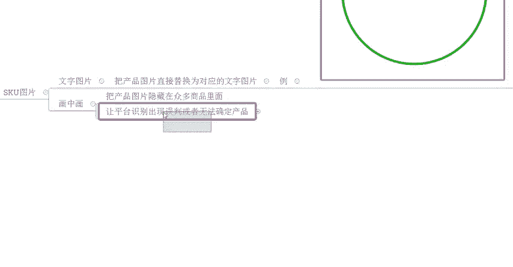

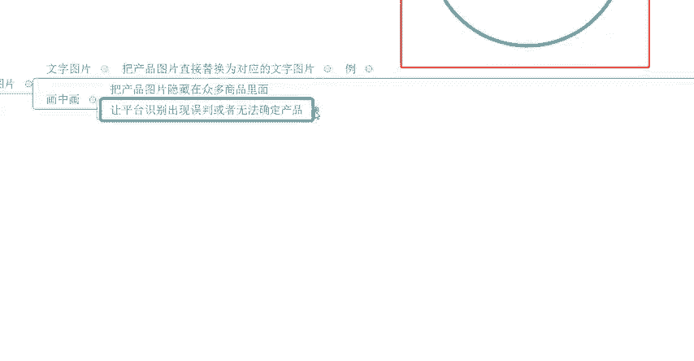

这个还是我们刚刚画的这个圆，对不对？当我进行产品展示的时候呢，我要表达的产品主体是这个圆的部分，那么没关系。😡。

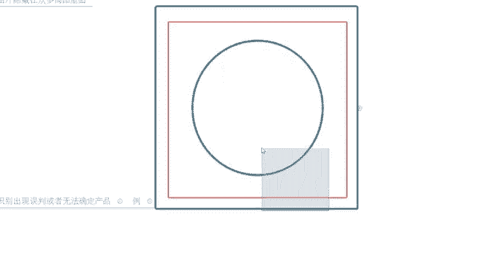

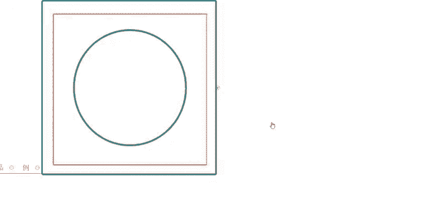

那我就在这个图片里面呢放了很多的其他产品，比如说这个绿色的框子，对吧？绿色的正方形的框子，绿色传媒形的框子，然后边上角落里面有一个圆。那我要卖的产品实际上是这个圆。但是我的商品主体展示的时候呢。

可能会有到更多其他的一些元素在这个图片里面。那么这个时候平台就没有办法识别出具体的产品是哪一个啊，来确保我们原创性的一个产生。同时呢来确保我们的什么差异化，保证我们的什么仿品价。好吧。

这个就是我们仿品价的一个操作，包括说一些注意事项以及它的优点哈。那么做好这个东西呢，我们整个商品呢在进行运营过程中呢，就可以规避掉比价带来的一些呃这个经济上的损失，还有一些运营上的难度啊。

那么做好之后呢，订铺操作呢就会更加容易一点。好吧，那具体操作呢在实际运营过程中可能还会涉及到更多更多的一些细节。那如果说还有什么不清楚的地方呢，也欢迎大跟我交流沟通。

包括你们在日常做点过程中有什么其他问题，或者需要重要的都可以找我好吧。😊。

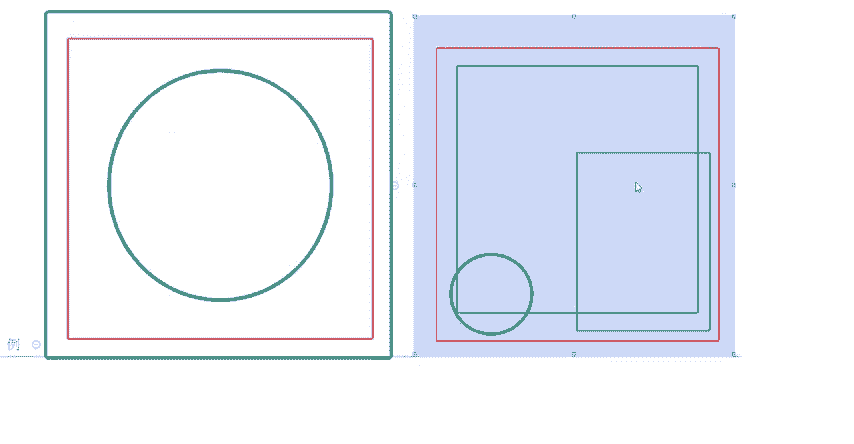

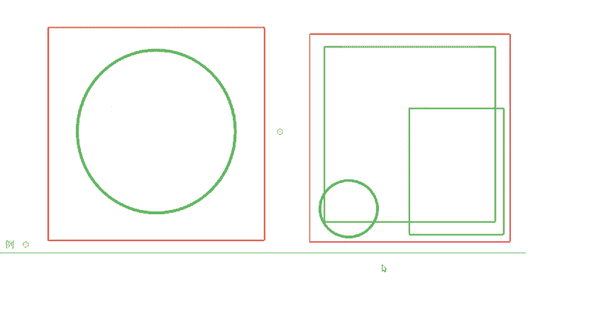

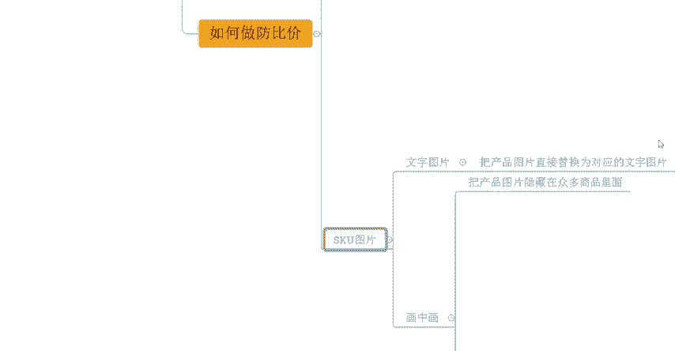

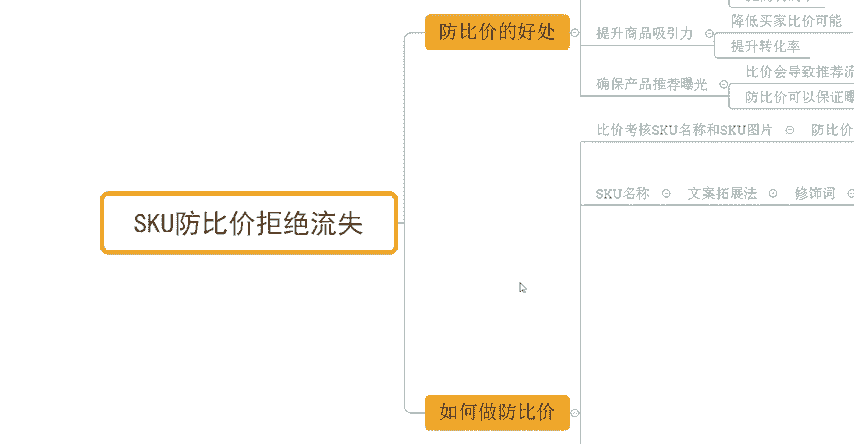

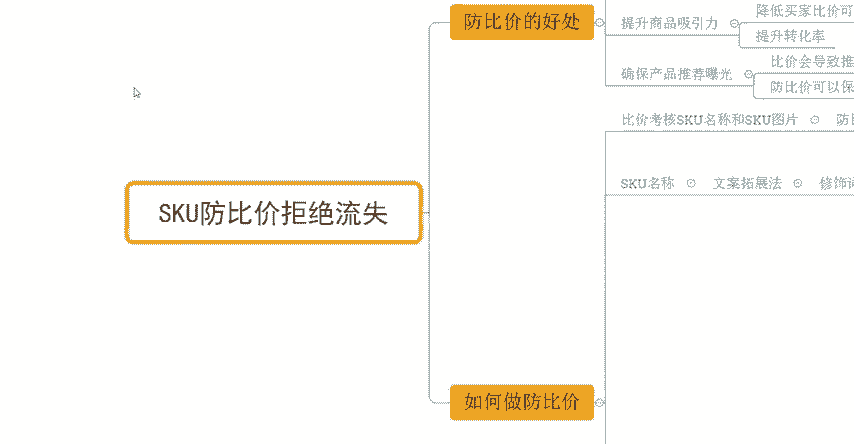

那还是那句话啊，如果说自己确实提身比较缓慢，运营能力比较差，那么有时间的话也可以找我带着你一起实操，对吧？就像这些小伙伴一样呢，我们一起能给到更好的方法之后，让我们店铺做的更好。那么能够去赚更多的钱。

好吧，O那么今天的视频呢就到这里结束，我们下次再见，各位，拜拜。😊。

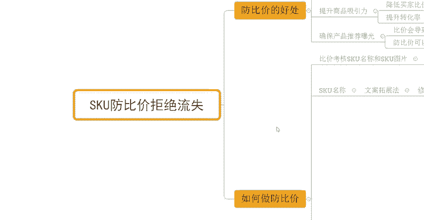

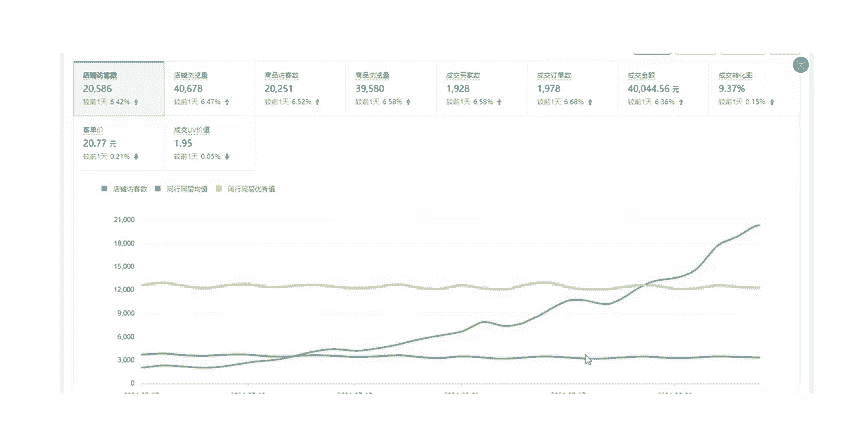

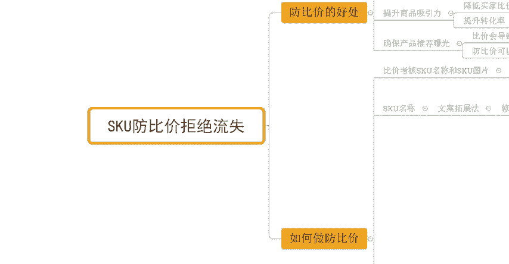