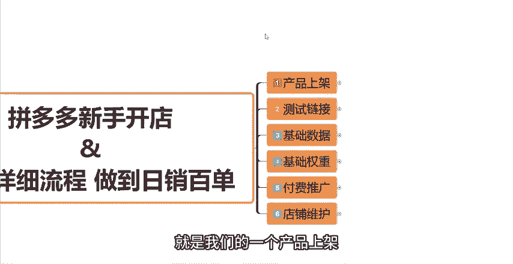
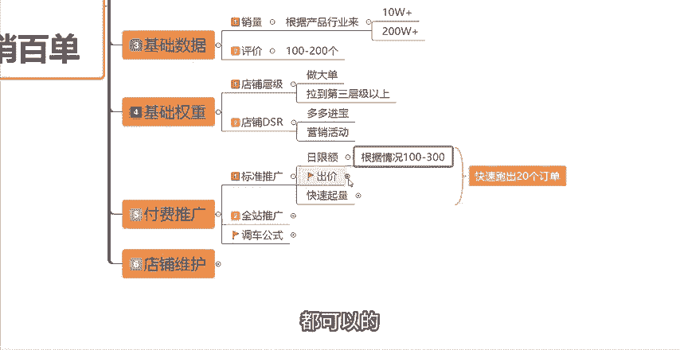
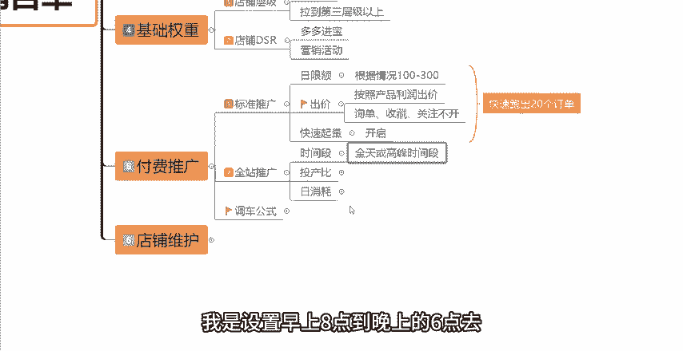
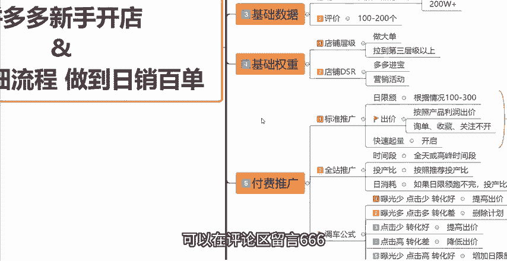

# 【吊打付费】目前B站最完整的拼多多运营实操教程，包含所有新手拼多多开店干货内容！这还没人看，我不更了！ - P2：2.六步详细流程 做到日销百单 - 拼多多运营思路 - BV1A2sqeeETC

现在做拼多多啊，其实没有那么难啊，新手做店呢也就几个步骤，很多新手做不起来的原因就那么几点，要么没思路，要么操作的步骤不对。今天这一期视频我来详细的给大家讲解一下，起一个新店到日销百单的一个全部流程。

大家可以关注点赞收藏起来，反复观看，学会了至少让你的投入少一半。那首先第一步呢就是我们的一个产品上架啊，产品上架，大家记住，不要直接的去发布产品，而是要通过商品列表当中的发布机会商品。

然后找到消费者正在收，点击热度排序，然后发布同款。具体的路径在这边啊，在我们的商家后台商品列表当中点击发布机会商品，然后这边有一个消费者正在收点击消费者正在收，然后按照热度排序。

这里面呢就是目前消费者搜索的这个体量比较大。但是呢商品比较紧缺的这些产品啊。

我们找到跟我们的产品类似的同款，直接点击发布同款就可以了。那然后发布同款之后呢，我们需要做好主图，做好标题，做好SQU主图的话你要去做出营销卖点的主图，从而保证高点击率。标题的话。

直接参考我之前给大家出的视频，爆款的标题制作，做出一个满足30个字，并且包含热门核心词，并且没有任何违禁词的这样的一个标题通顺就可以了。然后第三点，SQSQU的话。

按照这三个方向去做一个是低价引流的SQU一个是热销走量的SQ，然后是高价利润的SQ从这三个方向去布局你的SQ这才是一个健康的一个链接啊。那同时呢你还要去做好防比价。

仿比价的话主要通过从规格名称以及规格图片去跟同行去区分开。

那么做好这些之后啊，如果说是做代发的小伙伴呢，除了这些之外，你还要跟你的上家去对接，搞清楚具体是发什么快递，然后发货时长是怎么样的。然后售后流程等等这些问题。还有就是做代发的话，前期千万千万不要囤货。

一旦囤货的话，你就完蛋了。因为我们新手搞就是要搞轻资产，知道吧？然后前期上架产品呢上架8到10个就可以了。接着我们来到第二步去测试我们的产品。

然后这边给大家讲解一个方法，就是我们通过我们店铺后台的付费推广去新建一个标准推广计划啊，需要去设置好你的日限额跟出价，然后快速起量。这边直接打开后台给大家讲解一下，在我们的店铺后台有一个标准推广。

点击进来标准推广，然后直接把你刚刚上架的，比如说8到10个链接全部的添加进来。然后在这个地方去设置好链接的日限额，每一个产品指定日限额100就可以了。然后成交出价，这边给大家一个公式啊。如果说你的产品。

是在50元以内的客单价。那么你的这个成交出价就按照你的热销SQU的价格设置，知道吧？因为上面我教给大家。

你们的SQU布局有低价引流的SQU有热销走量的SQU有高价利润的SQU如果说你的客单价是50元以内的，你就按照这个热销走量的SQU的价格去设置你的直通车出价就可以了。

那么如果说你的这个产品的客单价是在50元以上的话，那么你就按照一单的利润出价就可以了。

知道吧？比如说你一单卖80块钱，你一单赚30块钱，那么你的这个成交出价，你最高就可以设置到30块钱，知道吧？这个是我们的一个成交出价的一个设置。然后下面这几个询单出价收藏出价，关注出价，通通都是不开的。

好吧，然后最下面有一个高级设置当中有一个急速起量。这个我们是可以打开的这个功能呢可以快速的帮我们在前期获取曝光，获取流量。然后这一个标准推广计划，我们设置好了之后啊，我们就需要去跑三天，然后看数据的。

因为8到1010个链接，我们不知道哪一个链接它是有潜力的，哪一个链接它的数据表现是比较好的，所以说我们需要去先做测试啊，跑三天之后，我们呀我们需要来看消耗，看曝光量，看点击量，看转化。

当你的这一个链接有曝光的，有消耗，然后能够拿到点击，甚至说能够拿到转化的话。

你这样的一个链接才是一个好的链接，有潜力的链接平台证明平台认可了你的这个链接跟你的这个定价，知道吧？所以说我们在这8到10个链接当中去选出一个数据最好的来当做我们的一个主推链接，好吧。

因为只有我们找到了平台认可的链接，我们后期后期啊去做推广的话，才能够事半功倍。然后接着来到了我们的第三步，我们需要去做基础的数据，基础的数据就是一个销量跟基础的评价。销量的话。

根据你们的产品行业来可以直接的去改销量，如果说你的这个行业同行整体的销量没有特别的高的话，那么你可以先改一个1万加10万加家都可以的。如果说你是做这种快销品的。同行的销量都非常非常的高的话。

你可以直接的去改200万加的销量就可以的。那么改销量的具体操作方法，我之前给大家出过一期视频。如果说还不会的小伙伴呢，可以去找一下我之前的一些。

视频如果说没有找到的话，也可以在评论区来找我好吧。然后第二个就是评价的这个点啊，评价的话可以直接的做100到200个评价啊，100到200个评价。自己看着去操作就可以了。然后第四步就是我们做基础的权重。

因为现在权重平台考核的就是一个是店铺的层级，也是坑产。然后是店铺的DSR这个店铺层级啊其实很好解决，可以直接的去做大单。我们在店铺的后台在店铺后台首页，然后我教大家在哪里看在店铺的后台首页这个地方。

然后在这个你可以直接的看到我们店铺的成长层级。如果说你是一个新店，那么你的店铺是处于第一层级的，你就需要先把你的店铺层级拉到至少第三层级以上。

那么在这个地方你是可以看到你的这个层级是需要多少的一个销售额的啊，这个地方它给你展示的是一个比如说你达到第三层级的话，你每天的一个日销售额就至少要是282元以上。

那么你就可以通过你店铺后台这个数据呢去乘以1个30，就是你每个月的一个坑产，好吧。

那么这个金额呢就是你要做到的一个坑产，你直接通过自己去找亲朋好友，然后做一些大单就可以了。然后店铺成级这个问题很好解决啊，然后是店铺DSR的一个问题。店铺DSR呢也很好解决，可以直接的通过多多进宝去做。

然后多多进宝去做DSR呢，我在前面的视频也给大家讲过，所以说大家也可以去看一下我前面跟大家分享的这个视频啊。如果说还不会的话呢，也可以在评论去找我，然后也可以通过一些好的资源去做好吧。

然后配合一些活营销活动啊，或者说搭配营销工具评价啊，比如说我们的评价有理，然后一起做也是可以的啊，方法非常非常多，就看你适合哪一种啊，你就选择哪一种去做就可以了。

然后这是第四步啊，做我们的这个基础权重。那么到了第五步，就是我们可以正式的去做我们的这个付费推广了。就是开车了。开车的话，你可以先开标准计划，新建一个标准计划。

然后日限额根据你们的预算来可以开一可以设置100，也可以设置200300都可以的。然后这个出价呢，你就按照你产品的利润去出价就可以了。然后下面的这个询单收藏关注，同样的还是不开好吧，还是不开。

然后快速起量可以打开。

然后我们先开标准计划的话，你要先保证你的这个计划能够快速的去跑出20个订单。因为跑出20个订单了之后啊，你的这个标准推广，包括你的这个链接，就是已经打上了这个精准的一个标签了。打上精准的标签之后。

我们就可以先去把这个标准计划转成全站推广计划了，就可以开全站了。好吧，开全站推广之前啊，你可以先划分时间段。你如果说你的预算比较高，你可以开全店。如果说你的预算没有那么高，你可以就开高峰时间段，知道吧？

把你。

就是你的这个产品在一天当中是哪些成交段，主要是哪些成交段，成交比较多，你就重点的去开这些时间段就可以了。好吧。一般情况下，我是设置早上8点到晚上的6点去这个开直通车的，好吧，然后实际的这个投产比呢。

你就按照啊推荐的一个投产比去设置就可以了。然后日限额这一个点呃，如果说你发现。

你的这个日线额跑不完的话，你就可以适当的去把这个投产比做一下减少。比如说10%的一个递减。当然如果说你能够在这个时间段内把日线额跑完。然后你的产品也会有成交，那么它的一个自然啊这个权重排名就会有提升。

你就可以慢慢的把你的这个日线额增高提高，然后慢慢的把你的这个投产比也可以提高。好吧，然后通过这样的一个操作呢，我们可以连续的跑5到7天去观察一下它的一个数据，然后根据这个数据我们可以去做针对性的调整。

那么这边教给大家几种调车的一个公式啊。如果说你发现你的直通车曝光少，点击少，但是转化好的话，你就可以去把你的这个成交出价提高也好，或者说把你的这个投产比提高也好，好吧。

那如果说你的这个发现你的这个直通车曝光多，但是点击多，但是转化差的话。

那么你就直接把这个计划删除掉就可以了。如果说你发现点击少，但是转化好的话，你就把出价提高。如果说点击高，但是转化差的话，那么你需要去降低你的这个出价。那如果你是曝光少，但是点击高，并且转化好的话。

那么你就一定要快速的增加日线额。好吧，通过这样的一个调整啊去慢慢的把你的这个直通车的计划给稳定稳定之后呢，你才才能去考虑托架的一个问题。考虑托价托价的话，你就按照10%的一个幅度去慢慢的托价。

而且记住每天最多调整一次。好吧，每次调整10%，每次最多每天最多调整一次。因为如果说你一下调整的太多，或者说你每天调整的太频繁的话，就很容易导致翻车啊，导致翻车的。好吧，那你的以上的这几个步骤，第一步。

第二步，第三步，第四步、第五步，这些都做。

好了之后啊，那么你的这你的这个时候啊，你的店铺就是有一定的技术权重了啊，每天基本上也能够卖个几十单上百单的。好吧，那么这五步做好之后，最重要的后续要做的操作呢？就是要做好你的这个店铺的维护了。

成功之后啊，一定要稳住店铺的后台的这个综合体验分，跟你的这个店店铺的DSR评分，只有你维护好了这两个数据，你的店铺的流量才能够平稳的去提升。不然的话，你的流量很容易快速的下降的。好吧。

那你如果说是你做一个新品，或者说你是做一个新店的话，你就按照我教你的这6个步骤去操作。基本上啊不到一个月的时间就能够实现日销百单的一个情况了。那么看到这边还有什么不了解的小伙伴呢，或者说需要表格资源的。

可以在评论区留言666，找我领取一份我整理的店铺综合运营大礼包。那么看到这边也别忘记一键三连支持一下，好吧，感谢大家的一个观看。

