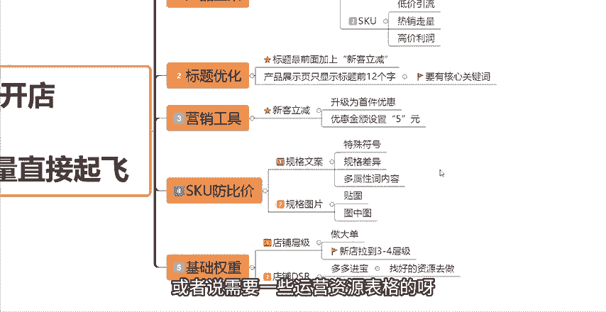

# 【吊打付费】目前B站最完整的拼多多运营实操教程，包含所有新手拼多多开店干货内容！这还没人看，我不更了！ - P3：3.标题优化技巧 流量直接起飞 - 拼多多运营思路 - BV1A2sqeeETC

现在做拼多多店铺啊，新手在上新链接的时候，你只需要在标题前面加上四个字，链接就能够直接起飞。那么这期视频呢给大家带来的是标题优化技巧，流量直接起飞的一个系列课程。

当然不是说让你在标题前面去加什么买一送二，今日半价这种很low并且无下限的一个手段。那么具体怎么操作呢？接下来这期视频我会详细的跟大家分享这个玩法，玩法的思路也很简单。

就是你只要你在你的标题前面加上四个字，再搭配我们平台的一个营销工具。那么你就能够获得平台的免费推流，大家点个关注点个赞，一键三连，反复多看几遍，我相信大家都能够学会这个操作。

那么接下来我们开始正式的一个内容啊。今天的这一期视频呢分为5个点来跟大家讲清楚具体的一个操作途径。首先是产品上架。产品上架这个点大家要注意一下，就是不要直接的去发布新商品。

我们在店铺的后台可以找到这个商品列表，然后我们点击商品列表，在这边我们选择。发布机会商品啊，从发布机会商品这个入口去发布你的这个产品链接。点击进来之后呢，你选择消费者正在搜，这个是搜索量大。

但是商品紧缺的一些类目啊。然后这个呢它会根据你们店铺后台的一个类目情况，自动的给你展现，符合你类目的一些产品。当然呢，你也可以在消费者正在搜这个地方去选择具体你做的一个产品啊，到底是什么？

然后我们点击按照热度排序，找到热度最高的这些同款。然后我们可以点击发布同款。发布的时候啊，我们手动的进行一下修改，修改哪些东西呢？就是。修改你的这个主图。第一个是主图，只需要留下一张同款的图片。

然后我们再上传几张这个点击率高的一些主图就可以了。然后第二个标题标题的话，只需要按照之前的视频跟大家讲的爆款标题制作的一个方法去把你的标题写出来就可以了。标题通顺，并且满足30个字就可以了。好吧。

然后第三个呢是我们的SQQU呢，你需要做好这三个东西。第一个第一个是低价引流的SQU，第二个是热销走量的SQU，第三个是高价利润的SQU就是我们的SQU要做好布局。因为你不可能只有一个SQU的。

这样你的后期的链接是没有办法去做的。好吧，SQU做好布局了之后呢，直接上架提交就可以了。那么关于这SQU的布局到底怎么去做。我前面的视频也有跟大家讲过。如果说不会的。

小伙伴呢可以去再看一下我前面发布的一些视频。然后如果说没有找到的话，也可以在评论区找。到我我给你再讲一下都没有关系的。好吧。然后这一步啊第一步产品上架我们做好了之后呢，我们就到了第二步啊第二步。

因为从这里发布的商品基本上都是能够获取到新品标的，然后可以获取到这个机会商品新品标的。这样的话，我们的自然流量的加权呢也会比较大。然后我们进行第二步的一个操作，就是这个玩法的核心点之一啊。

能不能够成功呢？就看这一步做好你的自然流量，你才能够跟同行拉开差距，就是直接在我们的产品标题前面加上新课立减这四个字啊，加上这四个字。当然你的标题要通顺啊，你标题30个字一定要通顺，除去这四个字之外。

你标题的前面12个字，大家注意啊，标题前面12个字，要展示你的这个产品的核心词。因为我们在产品的这个搜索展示页面，大家可以看到啊。我随便打开给大家看一个啊，随便打开。比如说我们的进口运动。

然后在这个界面。大家可以看到，基本上我们的一个产品标题虽然说有30个字，但是在这个地方呢，它只会显示你产品的前12个字啊，你标题的前12个字，所以说前12个字一定要带有核心词，好吧，没有这前12个字。

没有带有核心词的话，你的搜索流量就会偏少。那么弄好了这一步之后啊。弄好了这一步之后，我们再去来到第三步，要设置一个营销工具。什么营销工具呢？买我们打开我们的店铺后台。

然后我们在这个后台首页找到我们的这个营销工具啊，店铺营销营销工具啊，找到这个营销工具，找到营销工具之后，然后有一个新客立减在这个地方，大家可以看到点击新客立减，然后我们需要去创建这样的一个活动啊。

去创建一个这样的一个活动，具体怎么创建呢？首先开始时间你可以根据你自己的一个情况去设置，然后活动备注的话，随便选随便写就可以了。这个不重要啊。然后活动商品添加你要参加这个活动的一个商品。

然后直接的去创建就可以了。呃，然后首件立减的一个金额呢，我们可以直接设置5块钱，知道吧？直接设置5块钱就可以了。你不需要设置的太多，如果说你的这个产品的客单价比较高，你的这个利润空间也比较高的话。

你可以设置的高一点。如果说按照我们正常来讲，设置5块钱就足够了。点击创建就可以创建成功的。那么这个新客立减创建成功呢，我们可以获得三重权重的一个加成机会。首先是一个这个商品标的一个加权。

然后新客立减优惠的一个加权。然后标题营销文案的一个加权，三重权重的一个加成的一个机会啊。这样上架去做布局，新品就能够拿到权重的同时，也能够提升我们产品的一个转化率。当然了，你的产品推报到这里。

其实还没有结束，产品内供布局还有一个重点就是我们要做好SQ的防比防比价的一个布局啊。新品前期想要在同款竞争下脱颖而出，做防比价是非常非常重要的。那么防比价我们主要通过两个点去做，一个是规格文案。

一个是规格图片。那么规格文案呢，我们可以通过特殊的一些符号，一些规格的差异。些多属性词的一个内容去做差异。那么具体规格文案从通通过这三个点怎么去做差异。

我会后面会单独出一期视频来跟大家重点的详细的去讲一下这个仿比价的一个具体操作啊。那么这边就跟大家简单说一下，如果说有懂的小伙伴呢，那么你们就通过这三个方面去做规格文案的一个仿比加差异就可以了。

然后第二个是规格图片啊，也要做仿比价的一个差异，可以通过要么你去做贴图，要么你去做图中图的处理。当然自己去做布局啊是比较费脑子的。大家可以去看一下我前面的课程，或者说看一下我后面给大家出的更详细的课程。

或者可以直接在评论区找到我啊，跟我说一下你的类目，跟我说一下你的产品，我教你这个仿比价怎么去具体做操作。好吧。然后这一步啊SQ防比价这一步做完之后，最后一步我们要把基础的权重做好啊，基础的权重做好。

这个时候啊我们把基础权重做好之后呢，就可以引爆流量了。其实做权重无非就两点。一个是店铺层级，一个是店铺的DSR店铺层级呢，我们在后台可以直接来看到店铺后台。

然后首页在这个地方大家可以去看一下你们的店铺层级是在哪一个层级啊，我们点一下这个店铺层级，一般来讲，如果说你是新店，你的店铺一般是在第一层级啊。那么这个时候呢我们就需要通过我们自己去做大单。

把我们的店铺先拉到第三层级或者第四层级。这个根据你们后台店铺的一个呃实际情况去做。如果说你发现第四层级，它所要求的这个近30天的交易额比较低的话，你可以做到的话，你最好是把它先做到这个第四层级。好吧。

因为在同样的权重。在同样的基础情况下，第三第四层级。它获取自然流量的一个能力是远远高于第一层级的。包括说。你去做推广也好，你如果说是一个第一层级的一个店铺，你去开直通车的话，你的直通车是很难获得曝光的。

很难获拿出数据的，知道吧？所以说店铺层级是我们做一个新店的一个基础，直接通过第做大单的一个方式，然后把你的你可以看到啊，比如说第四层级这边要求的是。近30天，日均交易额达到3359元。

那么你可以通过这样的一个方法去把你的店铺成绩给拉起来，知道吧？高于1496元就可以达到第四层级。所以说去看一下你们这一个店铺的，就是你选择的类目，它的一个要求金额是多少，直接去把它做上来就可以了。

自己去做就可以了。好吧，这是一个店铺成绩的一个呃一个方面。然后还有一个呢就是我们的店铺DSR的一个方面，店铺DSR可以通过要么你通过多多进宝去做啊，多多进宝直接的去呃找自己有资源的话。

就自己去找资源去做。如果说没有的话，也可以去评论区联系一下我，我可以分享一些好的资源给你。那么你自己有资源，当然是更好了。好吧，直接通过多多金宝，可以先去把店铺DSR做出来。

然后要么你就配合营销工具去做啊，配合营销工具。比如说我们的一些。啊，新客理减啊或者说一些好评啊好评返现啊等等。通过这些营销工具去做就可以了啊。然后店铺DSR为什么说让你们先去做出来呢？

因为大家可以看一下店铺DSR其实就是我们的这个店铺评价分啊，店铺评价分，它的一个要求是大家可以看一下店铺近90天内有效评价数低于50条。那么这个时候你是没有店铺评价分的啊，你只有店铺90天内。

你的有效评价大于50条，你才会出现这个评价分。所以说有了这个评价分，有两个方面，第一个方面是你的店铺基础权重会比较高。第二个方面是你的这个转化率会比较高。那么基本上就是这两个方面。

所以说你如果说新店新链接想要快速的起爆的话，你一定要把这两个东西先给做出来，不然你去操作再多的这个操作都是没有效的，或者说数据会很差的，知道吧？店铺层级和评价数据。把这两个点先去做出来。

这两个点呢就是我们的一个基础权重。好吧，那么就是这个呢就是我们这个操作这个玩法的五步啊五步重要的一个操作节点。大家可以看一下你们这五步按照这个操作一步一步的去做。我相信你们的一个链接啊也能够快速的做报。

做到这一步呢，你们的产品有流量，而且你们的转化至少会比别人翻一倍。大家可以看一下啊，像我带的这些徒弟啊，他们的一个店铺呢也是通过我这些玩法，跟着我一步一步的操作起来的。

像这个店铺4月中旬开始跟着我操作的。大家可以看到这个曲线图啊上升的非常非常快。像在每天呢基本上有2000多单啊，成交金额在接近4万块钱。像这个店铺也是从4月初的时候开始跟着我做的。

也是到现在啊不到一一个多月啊，一个多月的一个时间。现在店铺每天也能够卖很多很多了啊，看到没有？像这个呢是跟着我之前有一点点基础。有权重啊，有一点基础数据，但是整体的数据效果不是特别好。

那么通过跟着我做了这接近一个月的时间啊，这个数据大家也是可以看到这条曲线啊都是上升的非常非常快的。所以说你们认真的学习这些操作，学习这些玩法。我相信你们的店铺也能够快速的做起来。好吧。

那么看到这个地方呢，还有什么不懂的小伙伴，或者说需要一些运营资源表格的呀，都可以在后台留言666找我领取一份我整理的店铺综合运营大礼包。好吧，那么你们在做店的过程当中有什么不懂的一些玩法呢。

也可以在评论区找到我。那么呃我能够帮你们解决的呢，也会给你们一些啊建议跟指导。好吧，那么也希望大家能够一键三连支持一下。那么我后续呢也会更新更多的视频来跟大家分享一些店铺操作的其他玩法。

感谢大家的一个观看。

