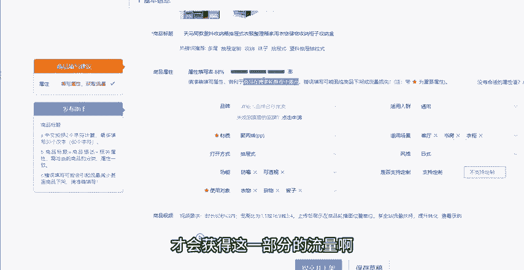

# 【吊打付费】目前B站最完整的拼多多运营实操教程，包含所有新手拼多多开店干货内容！这还没人看，我不更了！ - P5：5.黄金内功布局 上架自带流量 - 拼多多运营思路 - BV1A2sqeeETC

新手做拼多多店铺啊，想要起店又快又稳，一个好的产品内功布局呢是必不可少的。今天这期视频给大家分享一下黄金内功布局法。我这边带了一些徒弟，他们的店铺啊，他们的产品内功都是这样去布局的，起垫又快又稳。

上架就自带流量。所以说新手呢一定要先点赞再关注收藏多看几遍。首先我们在发布产品的时候啊，你的产品选择类目的时候，是什么产品是什么类目就一定要发布什么类目，一定不能上错类目。

因为上错了类目很容易会导致限流。然后就是10张主图的一个布局。这边给大家把每一张主图都全部的分析出来了。首先第一张主图呢，一定要放你测试过的这个高点击率的图片，这个是用来吸引点击的。

第二张图片呢就放能够突出你产品核心卖点的这个图片，展现你产品的这个优势啊。然后。

第三张主主图呢就放直戳用户痛点，能够帮助用户解决他们的疑虑的这样的一个图片。第四张呢可以放一些，如果说你的产品有在做什么打折啊、促销的活动，那就去放这个促销活动的这个图片。

可以直接的提高我们产品的转化率。第五张呢可以去放一些展示产品的材质啊、细节啊、质量啊，这种能够让消费者了解你产品做工和品质的这种图片。然后第六张我们可以放这个文案加场景使用产品啊。

这种可以给到消费者一种很强烈的代入感。那么第七张呢我们放呃你可以跟这种市面上或者其他同行的一些垃圾产品去做对比的这样的一个对比图片啊，这样的话也可以提高我们的一个转化率。

然后第八章的话，我们如果说你的产品呃有这种功能性的对吧？或者说有一些产品的资质证书，或者说获过什么荣誉啊，获过什么专利啊，奖项啊之类的，可以把这种荣誉证书啊或者专利证书啊，全部的放上去都是可以的。

然后第九章的话，我们可以放售后保障，对吧？我们有提供什么样的一个售后保障啊，或者说下单的流程是什么样的，我们可以去打消这个消费者下单前，最后的这样的一个顾虑。然后最后第十张呢就放白底图就可以了啊。

放白底图，这样可以有利于我们后续去报名活动，然后方便入池。这是我们主图10张主图他们的一个布局，你们做图的时候，就按照这10张图的一个布局去做就可以了。然后接下来呢就是我们的这个标题啊，标题的话。

主要还是关键词的这个选词的问题。这里呢有两种方法。首先第一种呢你可以去打开拼多多的这个买家版啊，买家版，然后在拼多多的这个搜索框搜索框当中，可以去搜索产品的核心关键词。搜索完之后啊。

它会展示很多的下拉框词。那么下拉框的当中呢，它就会推荐产品相关的一些词。这些词呢都是最近的一些热搜关键词。如果说这些词跟你的产品是匹配的，那么你都可以把它摘取出来，用在你的这个产品的标题当中啊。

这是第一种。然后第二种呢我们可以去这个推广工具，搜索词分析当中去搜索啊，我们可以直接打开我们的这个商家后台啊，打开商家后台，然后找到下面有一个这个推广平台，推广平台当中有一个推广工具。推广工具当中。

你去找到这一个。

搜索词分析在这个搜索流量分析，然后点击进来之后啊。

点击进来之后，你就会看到呃哎我打开给你们看一下。

点击进来之后啊，它是这样的一个页面。然后我们点击搜索词分析。在这个里面你是可以去选择。比如说你做的是什么类目的，它可以选一级类目，二级类目，三级类目，三级类目啊，就可以选的很详细的选择好之后呢。

在这个地方啊，它会出现很多的最近的这些飙升词，你可以看一下这些飙升词当中有没有跟你产品所匹配的适适合的是可以拿去用的。如果说不适合你的产品的这种词，你就一定不能用啊。这个点大家要注意一下，能用的。

你可以拿出来用。然后在下面这个点呢，我们可以去自己主动的去搜索一些关键词，搜索完之后啊，我们可以去看一下它的这个搜索指数，然后点击指数，然后竞争指数啊，我们把这些这些数据啊比较高的。

我们可以把这些词拿出来用啊。但是这些词呢也一定是要与你的产品。

不管说是风格啊还是属性啊，都相匹配的词的排名越高，代表着它的这个呃成交就越多。那么成交越多的这个关键词，它就意味着这个转化能力就越强啊，转化能力强，就代表着这个流量是精准的嘛，对吧？

然后把这些词呢全部的摘录出来之后，我们就需要把这些关键词去组合成我们我们的这个产品标题了，然后组合公式，这边给大家整理了几种。你可以用比如说你的产品是用品牌的，你可以用品牌或者型号加上商品的核心词。

然后你也可以用比如说一些促销的关键词或者特点关键词形容词，然后加上你的这个商品核心词，也可以用一些地域特点。比如说你做的是一些呃有地域特征的呀，或者说哪里的特产啊，或者说哪里同城的一些服务啊。

你就可以用地域特点词加上。

品牌词加上商品的核心词。通过这些关键词的组合公式啊，把这些关键词组成为1个30个字，并且通顺，并且不带有任何违禁词的标题就可以了。好吧，这是标题的这一个点的一个呃写法跟这个注意事项。

然后接下来呢就是属性啊，属性这个点。

属性这个点呢大家会看到啊，就是你们根据不同的产品，不同的类目，它有的属性前面是打了新标的，打了新标的这个呢它是重要属性，就是你一定要填写的属性不填写不行的啊。然后其他没有打新标的呢，就是可填可不填的。

但是呢属性这个点给大家呃一个注意事项，就是建议大家一定要填的准确并且详细，就是不管说它是打了星号或者没有打星号的，你尽量的都给它填进去，并且填写的准确，一定要是正确的。因为这个属性呢。

它会关乎到我们搜索推荐页的一个流量的。所以说只有你写了这个准确，并且写的详细了，才会有利于你的商品，看到没有？有利于你的商品在搜索和推荐页当中去展出，才会获得这一部分的流量啊。

然后接下来呢就是我们的这个视频视频呢。

它有商品视频，有商品讲解视频，有商详视频。

就是这几个地方，这个呢是商品视频，就是呃展现你商品的一个视频，视频时长60秒以内，宽高比1比1或者16比9或者3比4。就是平时我如果说我们刷抖音，就是抖音这种格式的一个视频是可以上传的。

然后是一个商品的讲解视频，要求是时长是10秒到5分钟以内。但是也不建议大家太长啊，就建议大家控制在一分钟以内就好了。然后这个宽高比呢是9比16啊，9比16。然后接下来是一个商详视频。

商详视频呢是展示在商品详情页的一个图文详情页的顶部的啊，就是我们详情页顶部的这个位置。如果说你有上传这个详商详视频的话，所以这三个视频呢就建议大家都上传上去。如果说你有视频的话，就都上传上去。

如果说你没有视频的话，就建议大家尽量的去做一下这个视频，然后把它上传上去。因为这三个视频呢，它是能够。

大大的帮助我们提升转化率的啊。然后接下来呢是详情页，详情页的话就比较简单的啊，我们可以直接的去参考同行的一个布局方式啊，因为同行他才是我们最好的老师，知道吧？

所以说我们参考一下同行他们是怎么样做的详情页，怎么样去布局的。然后详情页当中呢，虽然说我们看着上传了很多张啊，上传可能说上传十几张图片，但是一般来讲只有前几张前5张是最重要的。

所以说你一定一定要把能够更加重要展示你产品的这个卖点，展示你产品的这个使用场景，展示一些这种功能或者一些信息的这种图片放在前几张，然后没有什么太重要的，不是那么重要的，就往后面放，好吧。

然后这个是详情页啊，然后接下来呢就是这个白底图啊，白底图这个点呢是一定要上传的，这个是很重要的。因为它会影响到我们后续上活动或者类目推荐页的这个流量的啊，然后就到了这个内功布局的重点呢。

就是我们的SQ的布局。

。然后以及这个SQ的定价的技巧了。然后SQ的布局呢，这边给大家呃几种格式，大家可以参考着这么去写，一个是数量加规格，一个是颜色加款式加功能，一个是尺码加数量组合加颜色，然后是颜色加款式加组合推荐词。

或者说款式加详情加组合内容。通过这几种格式啊去组成去做出你的这个SQ的规格的名称。因为你只有把你的规格名称写的详细，并且跟同行不一样的之后，才会做到这个仿比价平台。

它才不会把你的这个产品跟同行类似的去做这个比价的。如果说一旦被同行被平台比价了。如果同行的价格比你低，那么你是拿不到流量的流量是全部在同行那边的，知道吧？所以说这个呢你们按照这几个。

按照这几个组成形式去写就可以了。然后具体不同的类目，不同的产品到底应该怎么去写呢？我之前也有出过这个重点讲这一部分的这个内容的视频，大家可以去找一下去学习一下。

如果说找不到的小伙伴呢可以在评论区找到我啊，直接的来联系我都是可以的。好吧，我可以给你指导一下，然后这是SQU规格的名称的一个写法。那么SQU图片的话呢。

我们就可以去直接用这个图中图的方式去做图做处理啊，我们可以用图中图图中图呢就是我们用做图软件，先把我们的产品这个图片抠出来。然后去保存一张透明的图片，我们再换一个其他的产品作为这个背景图片，这样做的话。

布局啊基本上能够实现这个仿比价啊。仿比价的目的，刚才跟大家讲的，就是为了防止被同行同款去比价，导致被抢走流量啊，这是SQ的一个规格名称跟图片的一个。

方式，然后定价的话，大家可以先按照我的这个公式去定价啊，售卖价等于拼单价乘以。

啊，拼单价乘以2。加5啊，这边没有写清楚啊，乘以。乘以2加5到10块钱啊，加5到10块钱的一个优惠。这样去做的一个目的呢，就是你不仅有一定的利润空间，然后也为你后期提价，或者说提前去做这种营销活动啊。

去做好了布局。因为你拼单价乘以2，首先给你留足了这个利润空间，对吧？然后你加上5到10块钱的优惠。你这5到10块钱呢，你就可以去做一下优惠券去做一下营销，对吧？我们后期呢也可以通过这个呃优惠券。

然后一些营销工具去把这个价格给打下来啊，这样的话是更好的。然后接下来呢就是这个地方大家要注意一下。

这个地方它有一个满减折扣啊，满减折扣，这个是平拼多多平台的一个流氓工具啊，这个是我们没有办法关闭的。所以说这个地方你只能说尽可能的设置高的折扣，你可以设置1个9。9啊，设置1个9。9折。

然后这这个地方大家需要在发布产品的时候注意一下，不然说到时候给你打个5折，你都不知道哪里钱是哪里没的，好吧？出单，然后导致亏损就划不来了，然后最后呢就是我们的这个发货啊。

发货发货这个地方呢就建议大家尽量的去选择48个小时就可以了，以免以免到时候没有及时发货，被这个平台给处罚了啊，然后我们设置好这个运费模板啊，设置好运费模板就可以直接的提交上架了。

你的新品按照这样去做做布局啊，想要不起自然流量都很难，知道吧？然后如果说还不懂的，大家可以多看几遍这个是。

视频我们的类目怎么去选择主图怎么做标题怎么做，属性视频详情页、白底图以及SQ的名称、规格、图片以及定价，还有满减折扣跟发货时间跟运费模板。好吧，那么这一期的视频内容呢，主要就是这些看到这里。

如果说还有什么不懂的，或者说需要这个表格自愿的小伙伴呢，可以在评论区留言666找我领取一份我整理的店铺运营综合大礼包。然后也别忘了一键三连支持一下你的支持，就是我更新的一个动力。感谢大家的一个观看。

