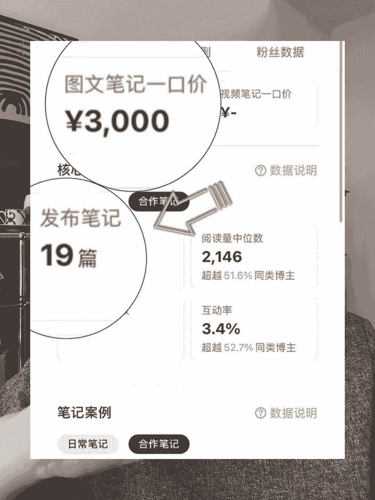
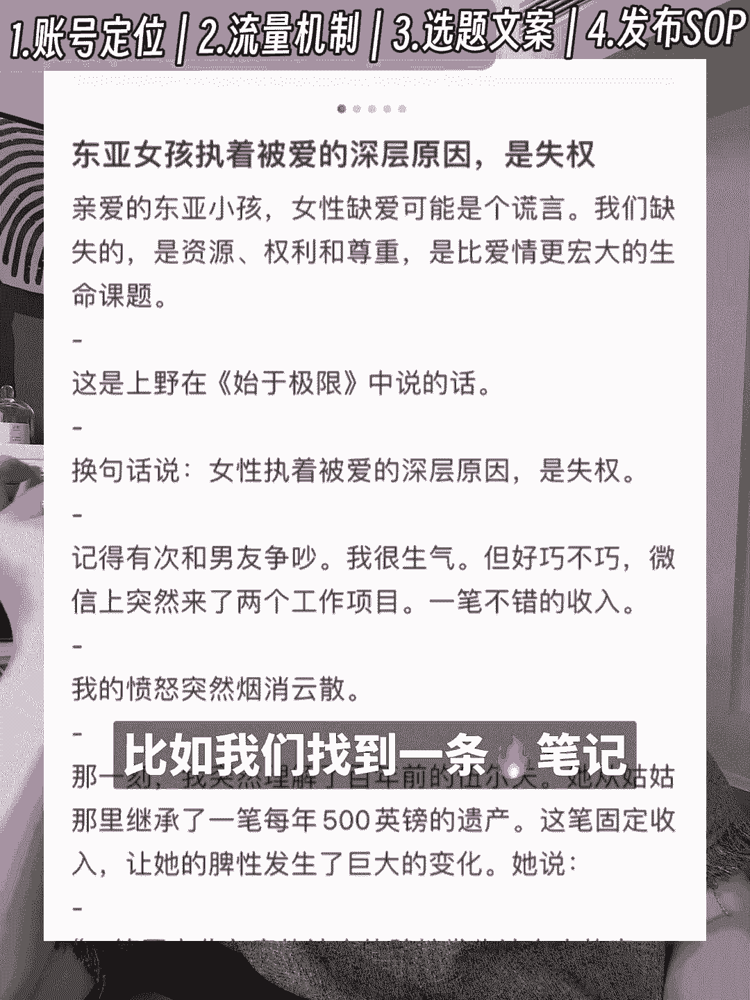

# 【小红书30天起号】火速变现教程！别再花钱学了，4分钟学明白！ - P1：【自媒体是个杀猪盘】30天起号变现教程！别再花钱学了，4分钟学明白！ - 亚特兰大歌 - BV12wtAejEix

这个博主不露脸，2。8万粉的账号，一篇图文3000块，一个月接广19条，怒赚5。7万。

你们看这个博主就用手机随手拍照，3万多粉丝，一条图文报价6500，一个月能接31条广，这位宝妈才1万多粉丝，一个月变现9万多，但我发现现在很多人想做自媒体啊，第一步不是调研市场需求，做账号案例分析。

而是花几千块钱去买课，我是真的看不下去了，直接跟你们分享我的30天自媒体旗号sop，那我的经验就比较适合普通人，像上班族，在校大学生，还有全职的宝妈，就咱们日常时间有限，需要高效利用时间赚点小。

只要你一步一步踏实做，30天后你一定能收到必要的结果。

起号第一周找赛道做账号定位，我在4月26日就发布过一条视频，就分享了怎么选赛道，就为什么有的账号10万一个月收入不到1万，有的账号1万粉月入近10万，读书赛道一个月只有20多万的广告投放。

而养生赛道有700多万的广告投放，这样我们就知道这读书博主是一个赚钱，很辛苦的赛道，锁定赛道后，我们还要根据自己的情，按照这个结构来确定自己的账号定位，起号第二周学习官方课程，了解流量推送机制。

如果你不知道怎么做封面啊，爆款标题不知道怎么快速涨粉，你可以直接看官方提供的课程，再说一个信息差啊，小红书的算法是cs算法，也就是点赞一分，收藏一分，评论四分，转发四分，关注八分。

这怎么就要思考你的每条，以及可能要引发更多人去评论，转发和关注，你的流量才会越来越多，那起号第三周，找对标账号制作选题库，拆解内容模仿，这里分为两步，大家一步一步跟我来，第一步制作选题库。

我知道很多新手想选题的时候就是拍脑袋，想到啥就做啥，今天没有灵感了就断更，那跟大家分享一个秒出选题库的技巧，不到一分钟帮你搞定一个月的选题，比如咱们第一周定赛道，选择做女性成长，找到三个博主。

将他们的首页链接呢输入到豆包AI中，怎么输入话术，请列举该博主的十个爆款笔记标题，用表格的形式展示出来，这样一来，你再手动筛选一下这三个对标账号的选题，你就得到了一个爆款选题库。

以前我一个月花300多的会员费，在第三方平台才能搜到这种选题库，现在用豆包AI我可以免费提取，就大大提高了我的效率，第二步，根据选题来撰写文案，我就知道很多人拿到选题也不知道怎么说，怎么写。

更可怕的是就是硬憋着写了很多的空泛大道理，就特别有爹味，但用户看了肯定就没法产生共鸣，在这个时候，我们肯定要向已有的报文去学习，他们之所以能报，肯定是评论区有，就很多人有共鸣。

那那怎么拆解模仿这样的报文，给大家分享一个万能的指令，一次性实现拆解文案，生成大纲，宣传文案的功能，比如我们找到一条爆款笔记。

主题为东亚女孩执着被爱的深层原因是失权，我们想模仿这条笔记的行文结构，写一篇主题为东亚女生一生只有一个课题，理直气壮地认可自己的文案，就可以把原文链接输入动画AI，以及一个万能话术。

请根据这篇笔记的行文结构，仿写一篇主题为东亚女生一生只有一个课题，理直气壮地认可自己的笔记，要求800字，多使用emoji符号排版，具有小红书爆款笔记的特点，你看豆包AI不仅模仿了原文的结构。

还提供了上野千鹤子厌女书中的言论，以及两个生活中的具体故事，这样就言之有物多了呀，使用do包AI也非常方便，你可以下载软件，在电脑上使用，也可以在浏览器上安装插件，光看视频的时候呢。

它就会自动总结关键信息，非常方便我们高效学习文案结构，再让逗猫AI来仿写，关键是它是免费的，无限次数使用，也不会时不时的跳出来广告，那么烦人，对于咱们自媒体人来说就是一个零成本的好处。

那么第四种我们就要制作我们自己的内容发布，Sop，在咱们熟悉了怎么去做自己的选题库，以及撰写文案之后，为了更高效率时间起号过，这个新手起号执行的sop，在起号初期就是根据这个时间表在落地执行。

来确保我日更一个月拿到1万粉的，像我是做女性成长赛道的，所以我定在晚上十点后发布，如果你做的赛道不一样，可以参考这张图，各赛道发布的时间表，那么关于自媒体几号，你还有什么疑问。

