# 【小红书教程】一小时学会在小红书开店运营，从入门到精通深刻理解，小红书涨粉起号，在小红书成为大卖指日可待！ - P10：3.测试小红书账号 - 是你的孤风呀a - BV1GH4y137By

。Yeah。

🎼Yeah。有的想说老师我这个没有作品的有粉丝，那属于平台，有的时候估计别人刷粉啊，他那一个错乱东西关注到你那里去了。这个很正常啊，我们很多这个新号刚注册完，隔天啊这个连浏览作品都没浏览。

直接上来十几个粉丝都有这种情况啊，但这个粉丝是没有用的，就是我们的粉丝平台在后台识别你的粉丝的时候，他只会识别通过你作品关注你的粉丝，其他都是不做数的。

就比如说你2000个粉丝有效粉丝可能只有1700是这样的啊。好，那么我们怎么去测试这个账号来给大家看一下啊，我们之后再养号完毕之后，对吧？养号完了以后啊，然后我们先发一篇作品，这个作品的话呢。

文字编辑好啊，认真去写。然后图片呢，我们真正准备好，然后去发不过在这里呢我要强调一点，不管我们之后做什么账号啊，你上来的前两个作品，你不能直接表明自己是个卖家的身份。

就像刚才我们看到那个卖手机壳的作品一样，你要写的文案是这个东西是你买的啊，我买来的。😊。

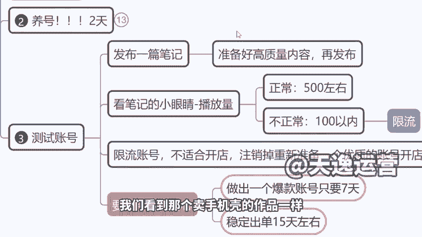

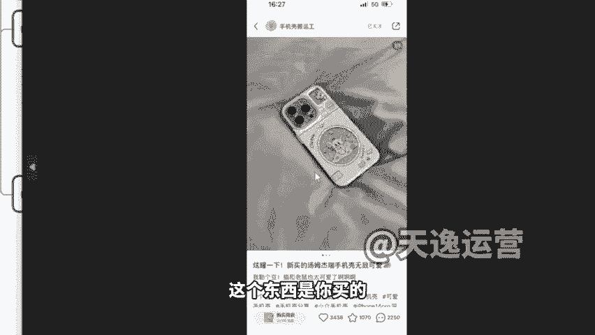

产品跟大家分享我用的好用的东西，我来跟大家分享。啊，你不能直接去发说啊，今天给大家分享一个手机壳啊，这个是我自己在卖的什么9。9块，这个不能去这样做啊。前两个作品不要挂小黄车。

前两个作品只从分享者的角度去分享东西，不挂车。然后测完流量之后，流量没问题，再开始挂车啊。来，那么在这里给大家看一下啊，就是当我们在发了这个测试的作品之后，你等两个小时时间两个小时过去了。

如果说你的播放量在500左右或者说更高1002000，那很好，这个播放量算很正常，说明你的账号是正常有推流的。但如果说两个小时过去了，我们的小眼睛啊，100来个70个80个呃。

1170180都属于限流状态，都属于平台没有给你推流啊。因为我们看到的这个100来个流量，它不是说真的有那么多人看了你的作品啊，很多时候是安慰性的一个数字。😊。

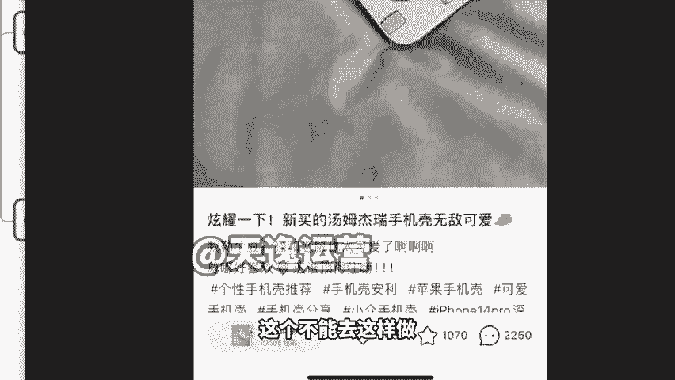

就是平台为了告诉你说啊，你这个作品是有人看的，安慰性给你镶了几个数字，不是真的有那么多人看。所以说这个时候我们的号都是属于限流的一个状态。就像我刚刚讲的，号又不要钱，注销了再重新注册就可以了啊。

这个东西因为小红书去测号的话，抖音的话可能你还得测两三个月的啊。但是小红书的话呢，它是属于说做一个爆款账号需要7天左右的时间啊，稳定出单的话，最起码15天左右的时间15天左右的时间啊。来。

那么同时呢我们在测了这个账号以后啊，我们发现你发的两个三个作品的播放量都比较稳定的情况下，那你可以尝试去开店。😊，但是如果说我们发的两个三个作品都是在100来个播放量啊，那这个时候我们就可以直接注销。

然后再去注册新的这个账号了啊，然后呃因为是这样的，我们今天是两个直播间开课啊，所以说公屏评论区可能问题会有点多，我不能说一一去回答，但是我拿个别也跟大家做个讲解。

像刚才有同学讲到说老师我有的是100多播放量，有的是一两千，这是什么情况呢？包括像有同学讲说老师我的播放量全部都在100多，但是我还在坚持发啊这种情况的话，来这样啊。

同学们如果说对自己的账号不是很确定的，我们可以下了课，把你的账号主页，以截图的方式然后发给你推课堂链接的那个助理老师，我们的老师都很专业，下了课给大家逐个去分析一下，好不好？

看看你们的这个账号到底适不适合做，要不要注销，还是说可以继续做啊，你们可以下了课给助理老师发一下啊，但如果说你的播放量高，发的是生活类内容，就比如说是你自己的自拍，是你出去吃了一个好的餐厅。

那个播放量再高都不行啊。😊，再高都不行，因为那是属于生活流量，我们要的是商业流量。😡，好，OK这个我们就过掉了啊。然后我给大家看一个我们之前一个学生做的一个号吧，跟大家讲一下啊，为什么人家的号能起得来？

包括他之前为啥没流量啊，跟你们分析一下呃，我这个学生叫李继平，然后他是属于40多岁一个年纪，没有做过抖音，没有做过小红书，就任何短视频平台没有接触过的。😊。

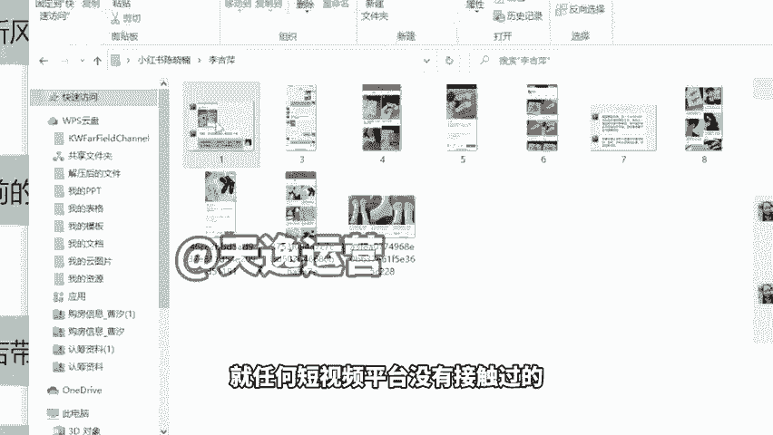

啊，但是他的这个号现在能稳定，就一个月，变现最起码在1万以上啊，跟你们讲一下他的这个情况。他之前的这个作品，如果说有同学你现在发作品没有流量，你也可以考虑一下，就是跟你的发的内容其实也会有关系。

他是什么？他内容实在是不好啊，因为这个审美是有问题的。当时我跟他有讲过，我说小红说的用户其实更多是这种。😊，对生活品质有要求的啊，审美有一定要求的用户。所以说如果他去卖这个发卡是可以的。

但是他去卖这种图案的发卡就不是很合适啊，就是不怎么好看。另外他找的这个素材拍的很随意是吧？没有什么呃稍微好看点的这个配色呀，地上就是地板，你要知道啊，我跟大家说一点啊，就他这个图他这个视频。

当时发的你看一个播放量是不是非常非常少，地上很脏啊，地上还有那种掉的头发，没有拖地那种脏的。你说这种作品发出去之后，能有人看吗？没有。😡。

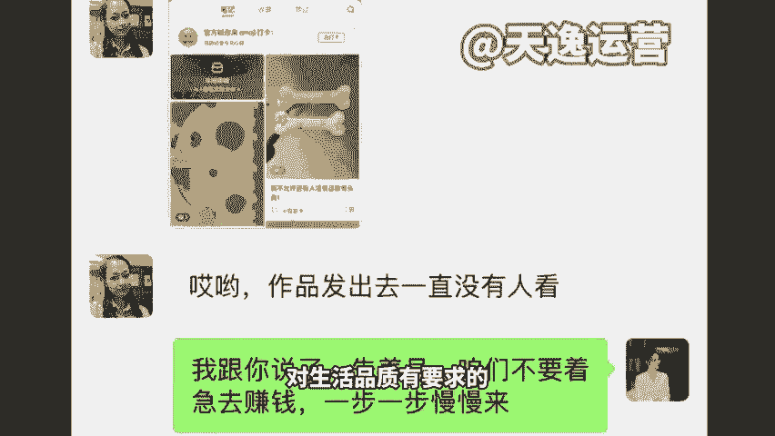

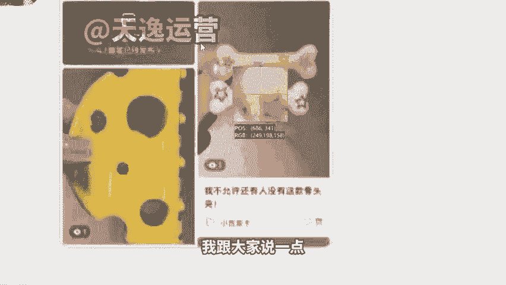

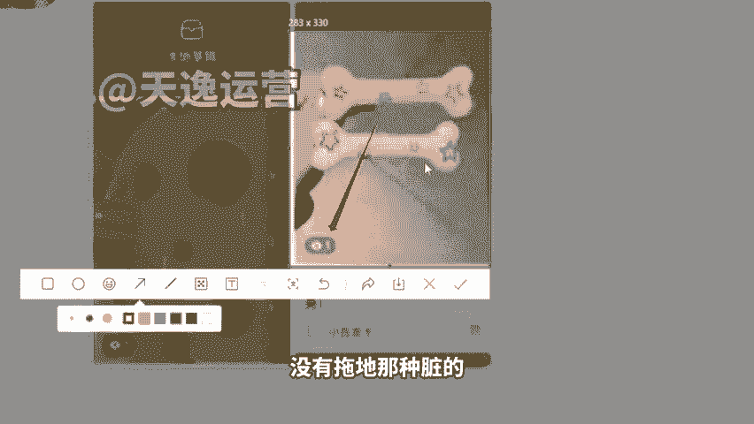

我就跟他讲了，我说啊，但是我安慰，我没有直说委婉一点啊，我说先养号吧啊，先养号，到时候再发换一个号再发这个作品。因为这个作品实在是限流，连人家连十几二十几都没有，他就是一的播放量。然后后来让他换了以后。

我跟他选了什么，我让他我说你去做那种Y twoK的风格。😊。

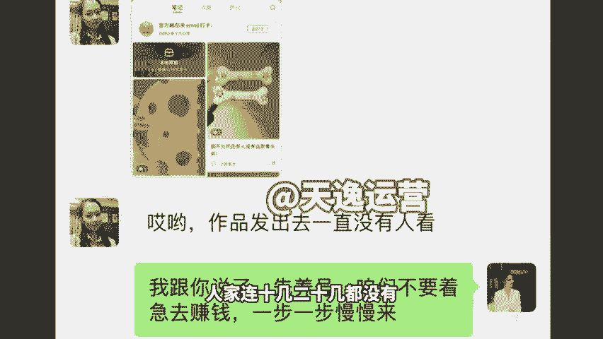

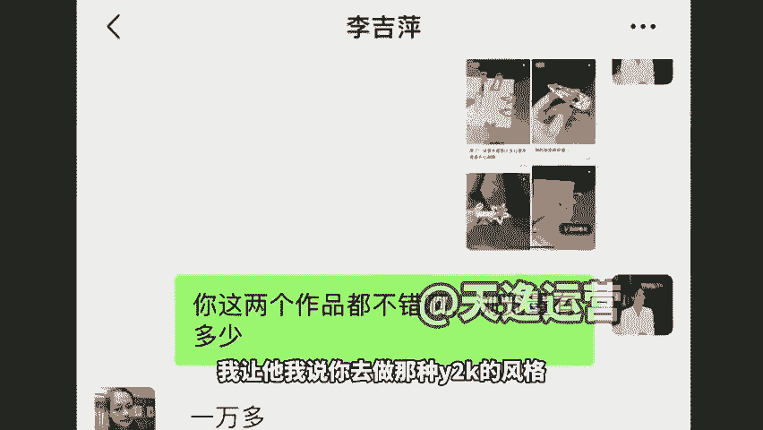

就比如说这种很精致的发卡，来看一下这种风格是吧？银色的布灵不灵的带带点小钻的这种发卡。好，这些精致女孩她更喜欢。而且当时流行的一个元素，将Y twoK的一个风格。我说你换这些产品。😡，好。

效果立马不一样，是不是同样是手拿这个产品。然后但是呢因为这个产品的颜值更高，它的效果就更好。😡，啊，当然这个素材也不是他自己拍的啊，都是找这个品牌方去拿的。来，你看一下，当时他13天时间换了产品。

之后13天时间立马100多单啊，100多单那个订单，这个里啊给大家看一下26。9块的一个价格。😊。

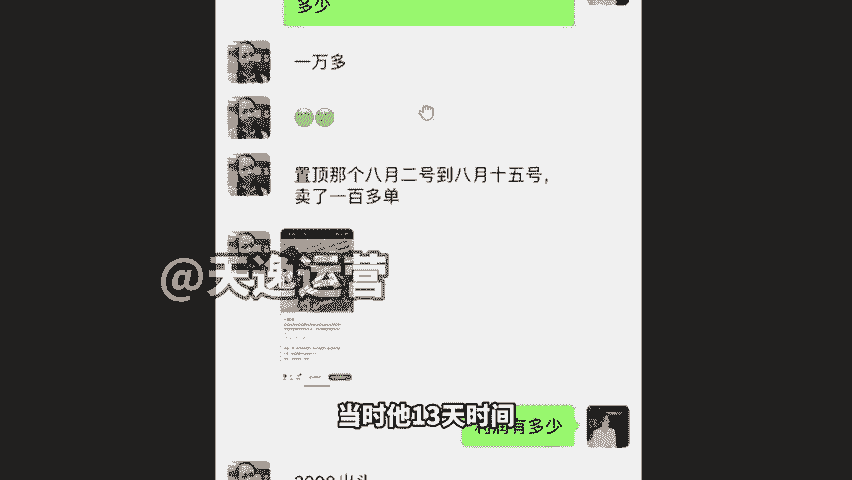

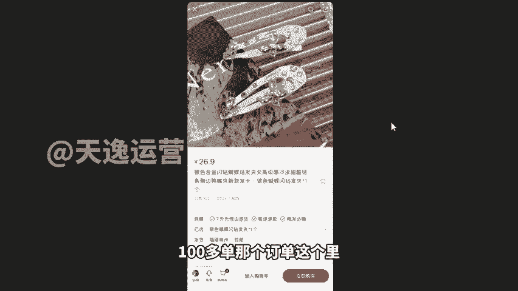

是吧卖了102单，十几天的一个时间啊，那这个产品是怎么来的？然后包括这个产品拿货价多少钱，我也给你们看一下啊，像我们刚刚有同学说到说啊老师这个货啊怎么办啊等等的。我这里呢先简单给大家说一下。

然后在后面我们讲带货的环节，我在详细说流程啊。首先第一个我们的货源问题，我推荐大家两个平台，一个是1688，一个是拼多多。但是呢我更建议后者，就是我更建议大家未来去找拼多多去合作。因为1688。

现在它的所有的产品呢是有点过时的，就它已经不更新了，拼多多里面本身是一个打价格战的平台。所以说大家很多这个产品已经接近这个拿货价格了啊，所以说到时候我们可以在拼多多干嘛去找工厂店。😊，找工厂店。

然后并不是说要你们在拼多多里面下单啊，我下单一个，然后联系那个小红书发货，不是而是你找到工厂店之后去加那个商家的微信，然后跟商家去说啊，说我这个想跟您合作，我想做代发，然后我想卖你这边的货可不可以。

一定是可以的啊，工厂店本身他们就是做代发的，然后给大家看一下啊，就是我们之后先确定好自己要做的一个类型。后面我详细说啊，现在我不想不讲那么细，我先把大概的跟你们先讲一下，让大家心里有数。

然后那么我没有钱拿货怎么办，对不对？你不要去跟商家说啊，你说啊，老板我没钱拿货怎么怎么地，你不能这么抢，人家一听都不敢把货拿给你，你怎么说你说因为我这边开店开的比较多啊，我是做矩证的，我是做批量的。😡。

所以说我们现金流啊没有那么多。😡，先跟您签个协议吧啊，签个什么协议，先采后付的协议。这个拼多多里面他都支持这个方式啊，这个叫先用后付。但是咱们签协议呢，叫先采后付。啥意思？

就是我跟你签订好多长时间来结款。比如说15天或20天，对吧？那么我先把你的产品挂到我店里上去卖，我卖了一单，你这边给我发货，让你们的财务记好，我的成本是多少钱，等15天到了20天时间一到。

我就把钱打给你。那这个时候你的客户也确认收货，你也收到钱了。😡，你就不会存在说我没钱去付货款的问题了。这个大家能不能听懂，这个都直接是在线上签电子合同，直接电子协议有法律保障的啊。

谁都逃不掉的那这样的话，我们前期就不需要去投资钱啊，这个对于新手来讲就比较友好了，对不对啊？然后像我们当时这个同学的话，他就找到左边那个商家。😡，这里面卖的是6。69块，但他合作价格啊。

私下沟通的价格是5。9块包邮啊，这个是包邮的啊。因为本身这个工厂价格很便宜。那你看他一个的价格是多少钱，一个的利润多少钱，21块钱的利润啊，然后再乘以多少钱再乘以这个102个订单。

相当于说他这个是2000以上的一个收益，对不对？2000以上的收益啊，就光这一个产品的收益就还不错了。然后他当时第一个月的时候就挣了8000多块钱，就是做带货啊，后面他因为他不止做做这一个项目啊。

之前也跟我讲，你看他以前是在图书管里员做管理员，后来因为他帮帮着他女儿带孙女啊，然后呢，他孙女经常生病，然后他老请假就被辞退了，本身收入其实也不高，就2000块钱一个月，他想的时候干脆在家找点事情做啊。

然后你看现在人家卖的啊，这不是现在啊也之前的你看这个发卡不同款式都在卖嘛，对不对？😊。

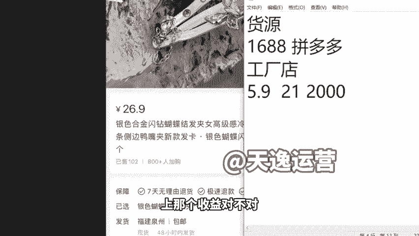

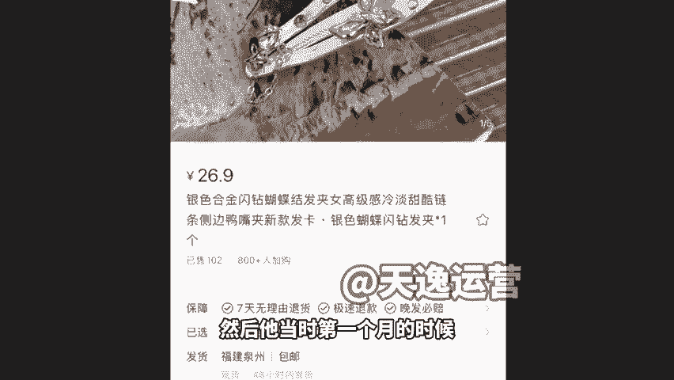

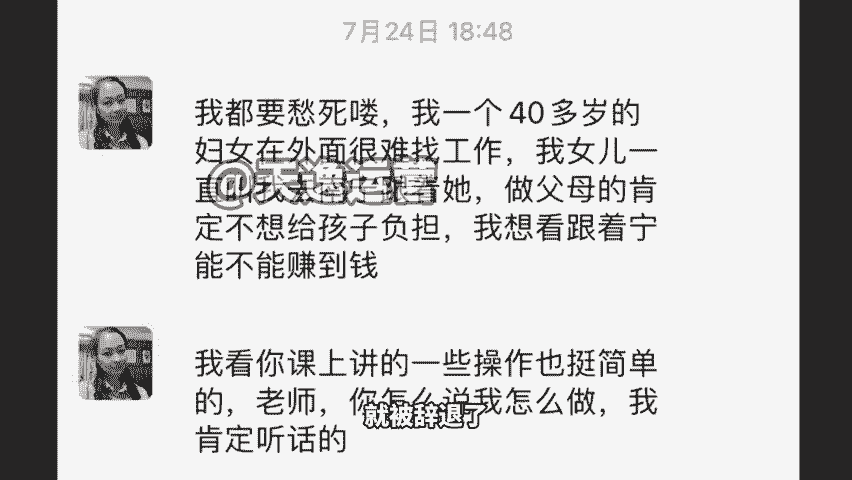

19块989单嗯，28。8135单。24。5是吧，25单就这种几十单几十单，其实它的一个利润加在一块也不低了。然后他在第二个月的时候就已经上了1400一个收入啊，现在还做了一套在卖袜子的啊，就这种。

然后你们之后都是可以去走这个方向。因为开店铺，我说实话它是最挣钱的这个玩法。😊。

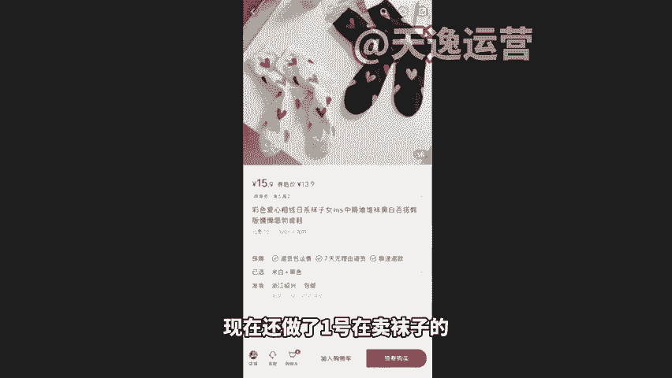

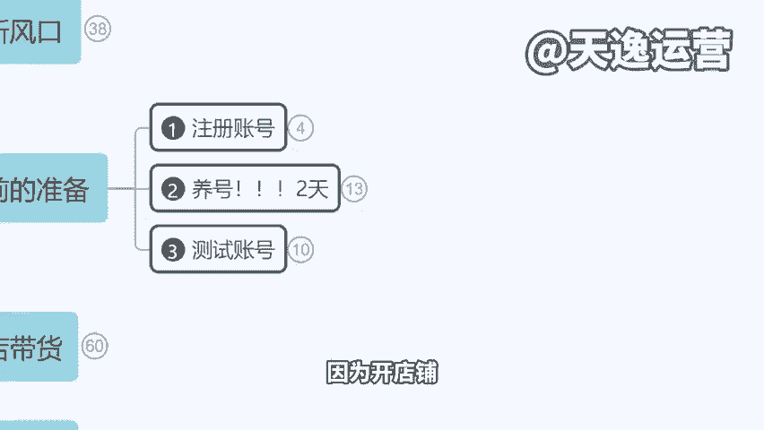