# 【小红书教程】一小时学会在小红书开店运营，从入门到精通深刻理解，小红书涨粉起号，在小红书成为大卖指日可待！ - P11：1.小红书薯店带货，什么作品更有变现能力 - 是你的孤风呀a - BV1GH4y137By

。Yeah。🎼Yeah。然后现在我们也先讲这个带货啊，先讲完带货，再讲商单变现。因为商单呃我讲一下商单的优势啊，来钱快很简单。所以我们放在后面说复杂一点的，我们先拿到前面来讲啊。

属店带货就是开一个店铺我们去卖货。这个对大家时间有要求啊，你最少一天拿两个小时出来做，有没有问题。一天最少两个小时没有固定说几点到几点啊，但是你中，比如说中一小时，晚上一小时，那是必然的，肯定要的。😊。

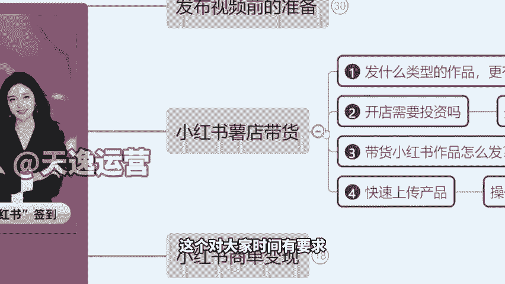

啊，没问题那就行啊。呃，我先讲一下。如果说我们做带货类的这个账号。因为带货类，为什么我们要重点讲它是符合目前平台的一个叫做百万扶持计划的。你们可以看一下，这里啊，我直接打开这个小红书官网给你们看。

因为这个东西我光我嘴上讲没有用啊，我们要看平台的。你看这是小红书签翻商城，就是他们的官方商城的后台。然后在这个登录界面就直接写了买手时代以来，1000亿流量，助力买手和商家共同成长。

就是平台是实打实真的给咱们推流量的，对不对？这个东西不能作假作假，人家不可能写在自己的这个官网首页啊，那罚款都得罚死啊。所以说这个是实实在在真的给流量的，那么只要开了店铺啊，一定是能出单的。

那么有句话叫七分选品三分运营。就是说我们卖的这个产品的类型，他得是符合平台，目前有的一个需求的。我上课以前有同学问过我啊，说老师我是宝妈，我能不能卖小孩的衣服啊，我不建议。😊。

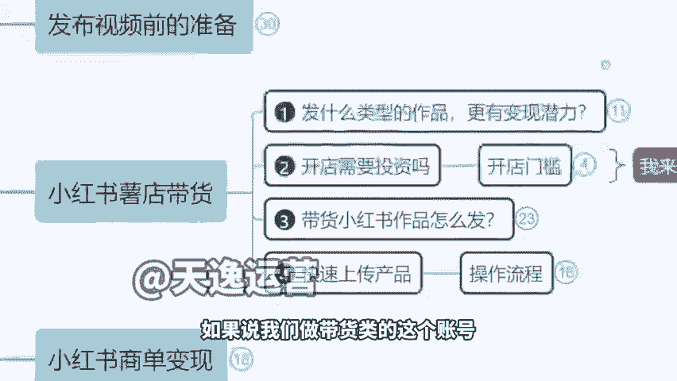

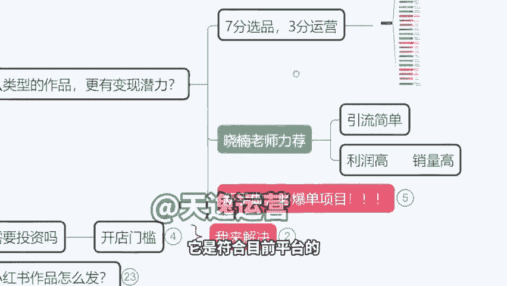

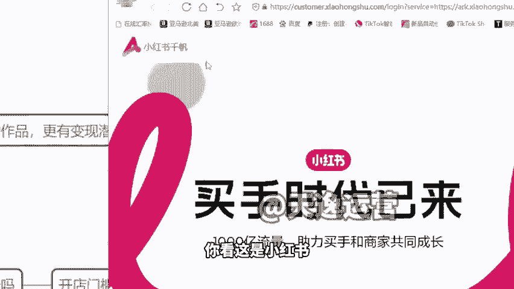

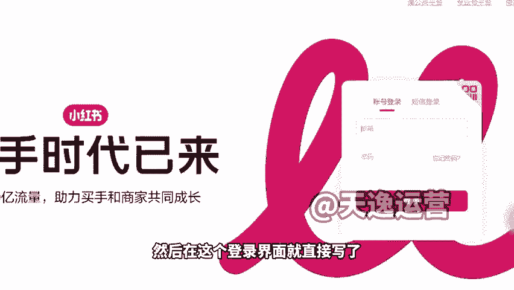

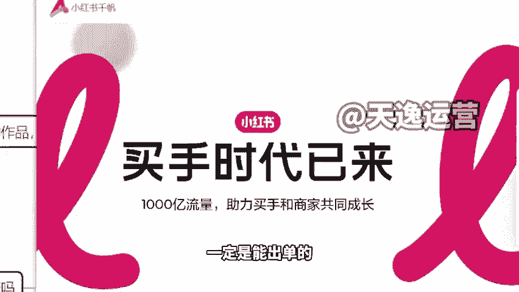

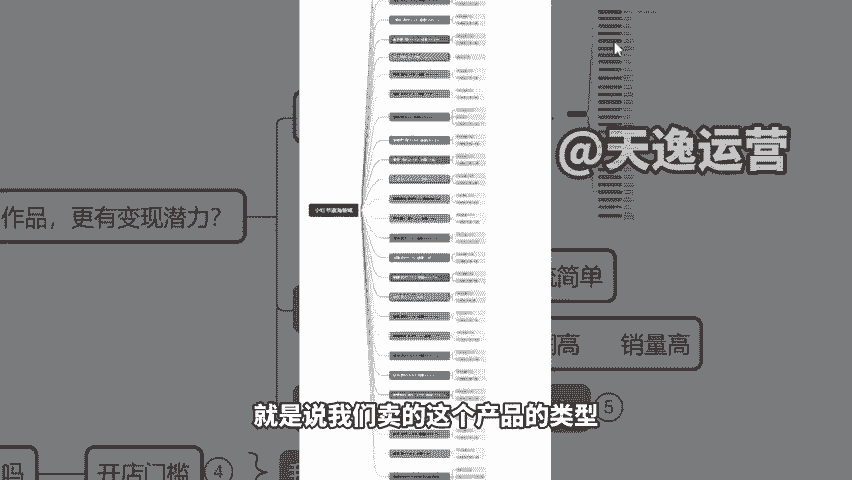

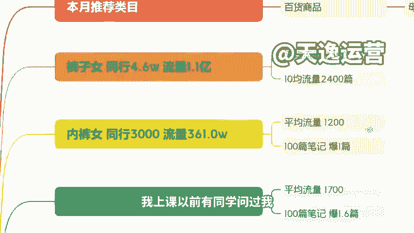

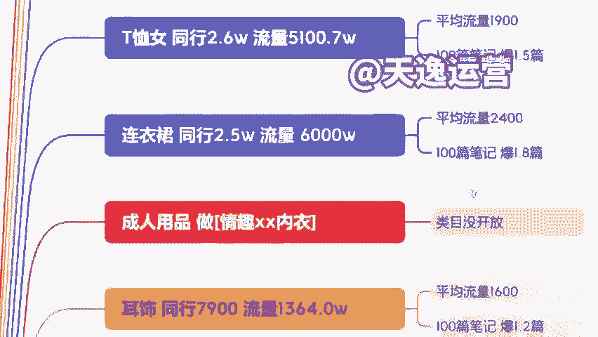

来，我给你们看一下这个图我不细讲啊，这个图你们需要的公屏扣要字。然后助理老师后台拿那个数据统计一下，打了要字的，我们下了课，自己对照那个网名去微信里面给大家去发一下这张图啊，打了要字的。

我们下了课去给大家发一下。呃，我教大家怎么看我这个列表啊，教你们怎么看这个思维导图，这是我自己写的。比如说像同行7600，那可以做，不算说特别大的竞争，但如果这种你看T恤2万多个。

是不是你说老师好多人卖T恤啊，我也卖，那就大错特错了，不是这个思维啊，而是卖T恤人太多了，我不掏这个浑水了，做的少的，你去做啊，选择少的，你去做，比如说睡衣可以。😡。

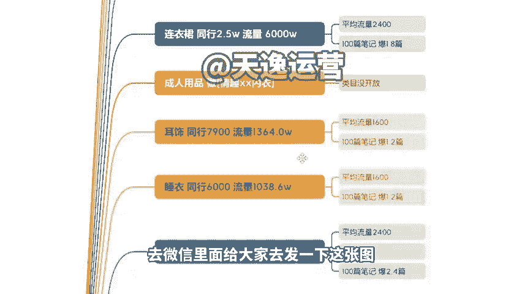

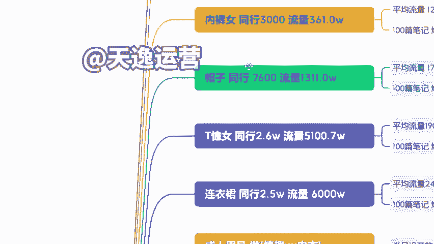

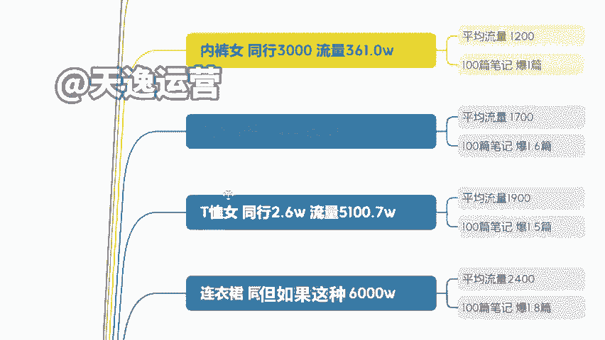

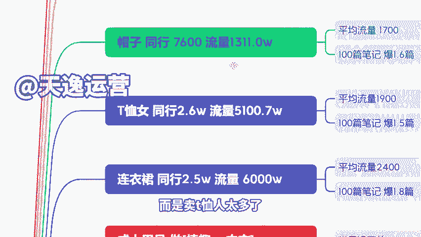

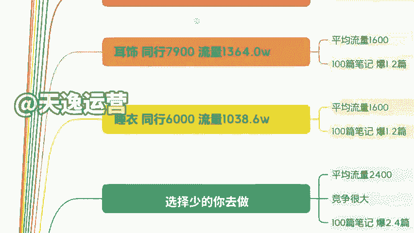

家居服可以，对不对？然后呢啊像这种3C数码的，虽然说做的人多，但是你也可以做什么充电器呀、无线充啊，对不对？快充的那个数据线呢啊，OK都可以啊。然后像这个项链的同行也比较多，然后爆款的这个概率又很低。

我们就没有必要了。在这里我自己写了三个啊，就是目前我们测流量特别爆的。一个是这个母婴用品，一个是百货用品一和车载用品给你们举几个例子给大家看一下啊，我拿几个产品举例给大家看一下。呃。

其实我们有句话叫做这个小孩的钱是最好挣的啊，其次是这个女性。😊。

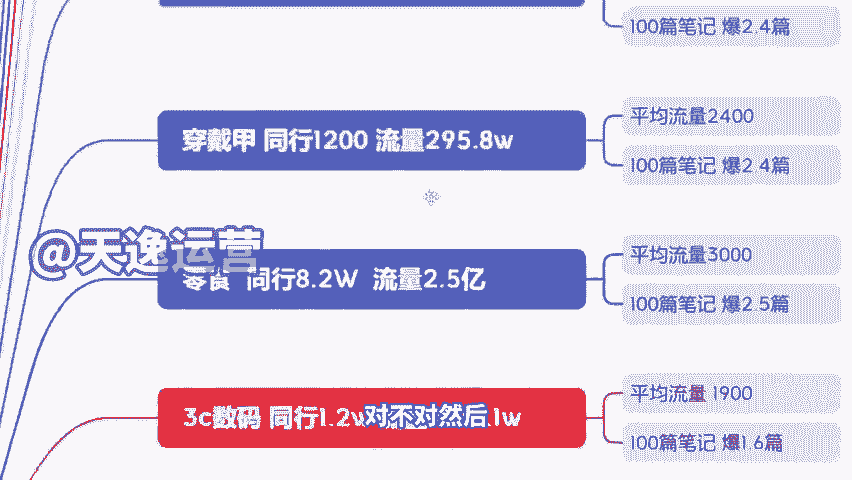

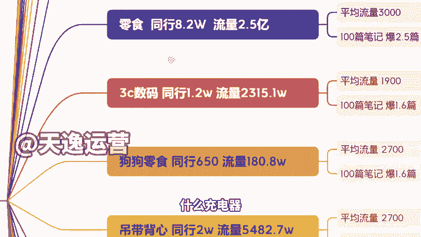

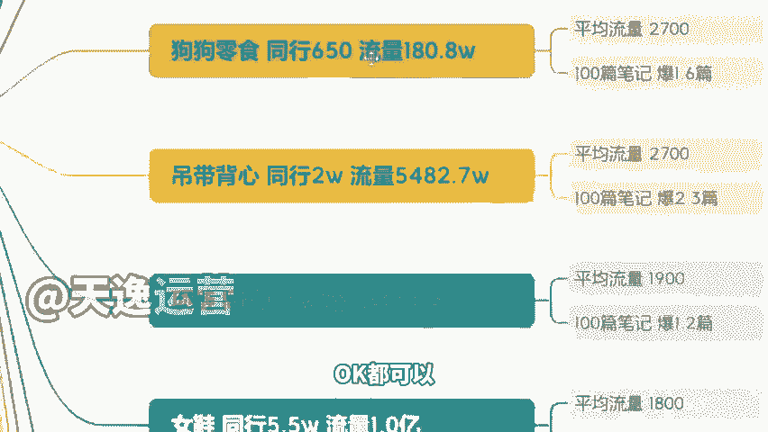

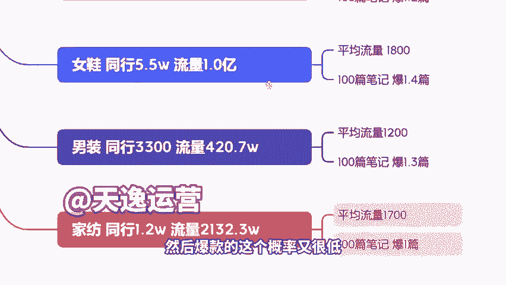

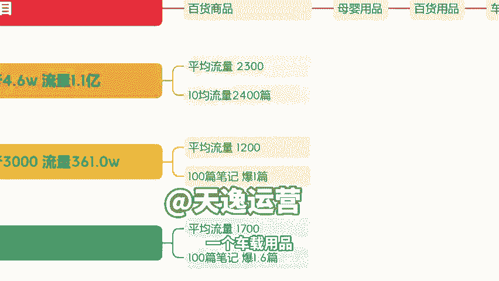

对吧，然后所以说我们其实就可以从这些角度啊，我们去考虑这些问题来给大家看一下，就这些啊，比如说像这个你看粘毛器，狗狗的。😡，这个东西成本多少钱？卖价36。9块啊，对吧？你们看不清楚，可以横屏一下啊。

因为我们这个图放大不呃，这个图放大不了啊，你们就可就得这个稍微咱们这个呃斜一下看一下啊，然后这个36。9块的一个价格，对吧？我们真正它的一个成本价格才3块多钱，3块多钱。

所以说这个也是可以去变现的一个方式，然后包括这种手套啊，然后这个除毛器。😊，这个成本才1块钱。啊，然后包括这边你看这个套耳勺，对吧？29。8块成本多少钱，也3块钱。😊，也是3块钱包邮啊。对，这个是包邮。

就3块钱包邮的成本。😡，3。9块包邮的成本，23。9块的一个杯刷，这个东西1块多钱的一个成本。😡，啊，因为像这种东西呢，它其实我们会觉得说好像快递很贵呀，我去菜鸟驿站寄个快递12块钱啊。你要知道。

其实我们真正去合作了这个物流之后啊，很多小的不占面积，不占体积的这个产品，它几乎物它几乎运费是跟我们直接省掉的，就是五毛钱1块钱的这个运费都有啊。然后包括像这边你看9。9块的这样的一个盒子，对吧？

包括这个建麻的一个这个猫扎板，它那个价格49。9块，成本十0来块钱。😊，啊，成本十来块钱，还有像这个啊像这种产品啊，有特也想说老师那我那边运费高，这个怎么去处理啊，我们之后去卖货的话。

是不需要我们自己发货的啊，就是我不建议大家把货囤到自己家里，然后你自己再发，这个是没有必要的，就相当于说我去卖别人的货，对吧？我卖他的产品，我今天把所有的产品的订单导出来之后啊，有这么20个单。

那么他会有一个数据统计，每个订单，他的收货地址等等导出一个表格，直接甩给那个商家，让他安排发货就行了啊，发完货之后，订单号发给你，你去填就行了啊，就是这样的。然后那么我建议大家去做的产品。

除了我刚刚讲的这些就是类型之外啊，就是我们得去考虑一个点，就是他的颜值高不高，我们不用管他这个东西有没有用，你就看他值高不高。因为像小红说里面卖了很多像之前有个很火的叫ly的一个那个呃。😊。

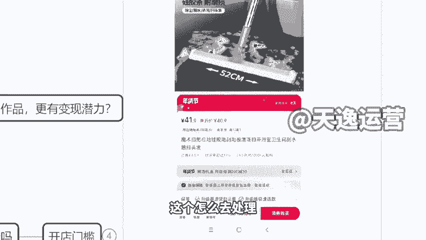

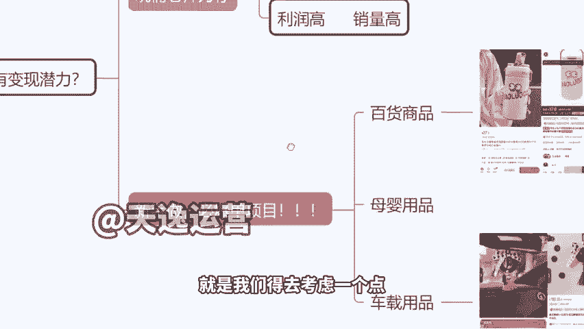

摆件啊那个玩偶是不是就那样的一个东西，我说实话就韩国流行过来的啊，我觉得不是很好看。但是小红书里面很多人喜欢。😡，啊，然后还有各种带钻的呀，布灵不灵亮的呀啊，即使说它成本很低，都是可以卖高价的。

然后像这种水杯也是一样的，你看一下啊，就这样一个小眼睛的这样的一个保温杯，对不对？拼多多17块1706块啊，这边227。8块的一个价格，包括在过年的时候卖的很好的这样的一个车载挂件啊。

拼多多里面的就16。8块的一个价格，小红书卖49。8块。所以说在小红书普遍普遍来讲，它那个价格更高，另外包括像我们看到那种手机壳什么的啊，这个在淘宝啊，拼多多有这个2毛钱的啊，有2块多钱的是吧？

有这个3块钱的小红书都29。9块39。9块，就这样的。😊，就这种包括像我们其实很多时候在卖母婴产品的时候，发现很暴力一个东西啊，耐拼。😡，对吧我这个成本我去拿货的时候，这个成本才18块钱。

在想我说我甚至可以卖到160180的一个价格啊，这个就是我们挣的就是这个平台里面有收入，有收入，有这个高收入或者说有消费力，有购买力的这一群人的这个钱啊，那这是我们要做的。😊。

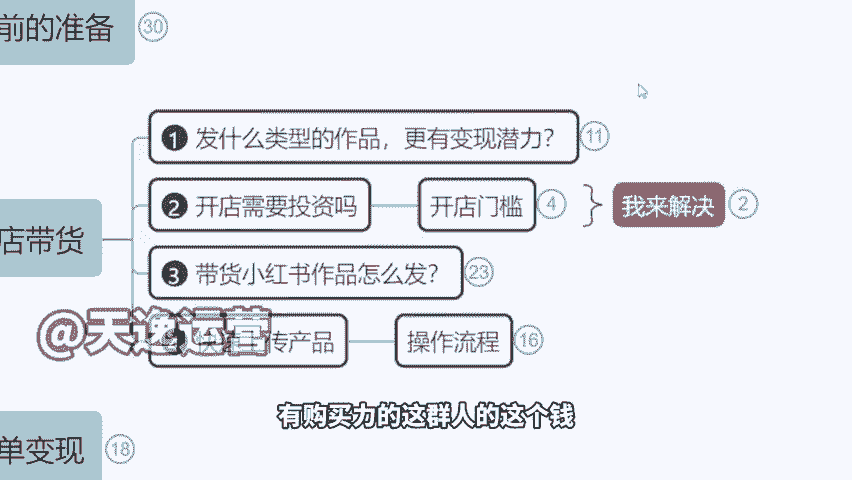