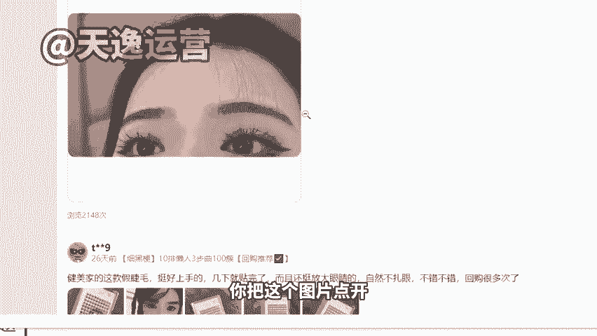
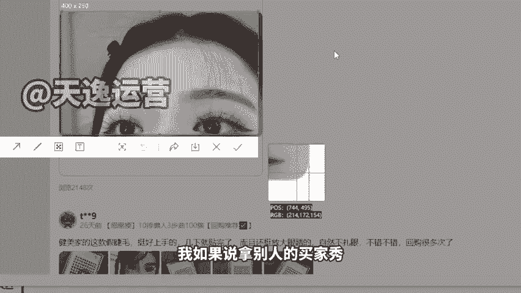
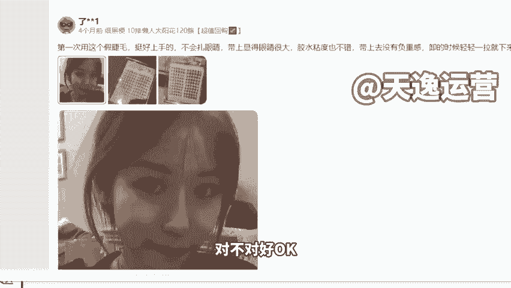
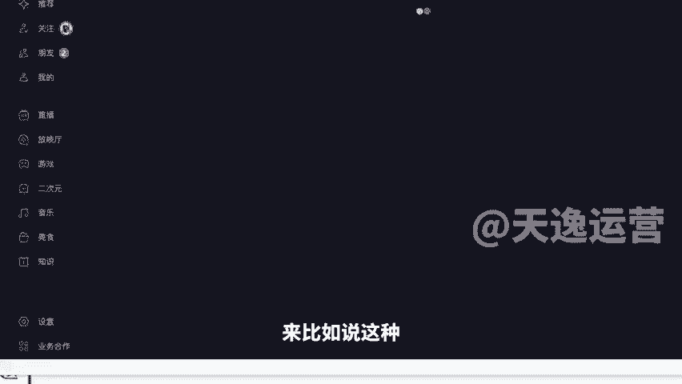
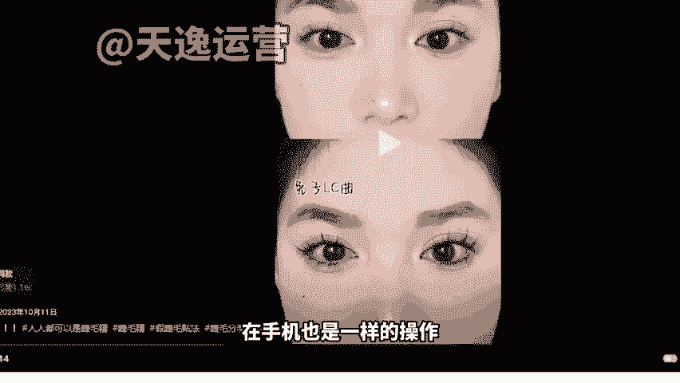
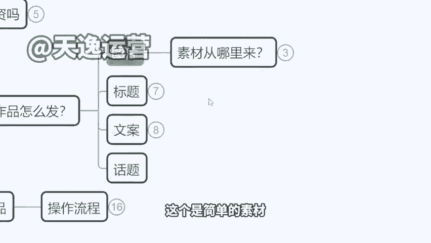

# 【小红书教程】一小时学会在小红书开店运营，从入门到精通深刻理解，小红书涨粉起号，在小红书成为大卖指日可待！ - P13：3.带货小红书怎么发，图片素材哪里来 - 是你的孤风呀a - BV1GH4y137By

。Yeah。🎼Yeah。嗯，来，我们OK我们再来看第三个啊，就是那如果说我们确实是去开这个店铺的话，我们的作品怎么去发，是不是内容我怎么来去处理啊？来，首先我们在小红书去发一个作品的话呢。

它无非是这么几个组成部分来我们看一下。😊，给大家找一个啊，就这种你看我们随机点开一个这个啊这个内容，你看它就是这些图片啊，图片啊，加上一个标题对吧？加一个标题，加上一大段文字啊，加上对这个产品的介绍。

好，OK这就是这样的一个这个作品的一个组成，不需要去剪视频，不需要去做那个很长的那个作品啊。好，那这些图片怎么来，咱们自己拍还是怎么回事啊。这个文章又怎么去写这么长，我都不了解这些什么美容仪。

我怎么来写。来，现在我来告诉大家，我们具体一个操作方式。第一个图片问题，其实更多的啊，我们如果说去卖货的话，你的图片组成，一个是产品的实拍图。😊，产品实拍。就真实的拍摄的，手拿的也好。

那个产品放在一张床上，一个好的背景，拍一张也好，产品实拍图。😡，然后再一个真人的。😡，体验图。对吧比如说我是一个卖化妆品的上脸的效果，我卖假睫毛的，贴上之后的效果，对吧？

然后我卖等等这个其他产品在使用过程的效果，卖个沐浴露，你得去拍那个手上有泡泡的啊。好，来这个是真人体验图，加起来的话呢，最起码有个4张左右的图片是最好的啊，4张左右图片。如果我们追求这个产品的。😊。

追求这个作品的一个效果。来，最好呢是有对比图。我对比图是最好的，就是我使用产品前，使用产品后的这个效果，那是不是需要我们自己拍呢？不用。首先产品实拍图从哪里来啊，你找商家。

因为像我们有的时候卖了一些货啊，他没有品牌，他也没有任何知名度，甚至说我在淘宝我都找不到这款货啊，那你就要联系商家，因为他们有自己的美工，你让他们的。😡，商家给你提供实拍图，你说我要别人没发过的。

或者说您这边能不能安排美国现场给我拍一下啊。因为我这边是呃要做这个账号，我是做自媒体的，帮您宣传你的产品，他一定会给你啊，这是第一种方式。那如果这个产品刚好它是其他平台也有在卖的那就更好了。

有现成的素材，我们可以拿去用啊。好，这个是一个那真人体验图从哪里来，既然我们讲小红书是一个升级版的高端的买家秀平台，那图片我们不妨就从淘宝买家秀来，对不对？来给大家看一下啊，我们直接在手机也好。

在电脑也好，你到淘宝的这个界面去，我们直接去搜这个。比如说我今天要卖假睫毛。😡，对吧我直接去搜假睫毛，来，我登录一下我账号啊，稍等一下。😡，给大家来看一下。好，登录上去之后啊。

到时候我们直接在小嗯来稍等啊，这个还要再加载一下。😊，好，就这样的，比如说我们搜了假睫毛以后，然后你们尽可能去看那个销量高的，看销量的那个排行榜，我们去找销量高的那个产品啊。比如说这样你看我选这个销量。

对吧？第一个的这个6万多人收货的这个9。9块的啊，我不管这个产品跟我卖的款式是不是一样的啊。像这种假睫毛啊、沐浴露啊、香水呀那些啊，然后包括啊像什么粉底液呀，对不对？然后包括像什么身体乳啊，啊。

就这些东西用在身上是看不见牌子的啊，你找其他品牌的都是可以放心用的，你找其他品牌买家秀都可以用，我卖的这个牌子，蓝天牌身体乳，但是我用的买家秀是这个多芬的身体乳的，买家秀都没有关系啊。来。

那么我们直接进入到它这里面有个宝贝评价是吧？有宝贝评价，这里面有很多人是上传了自己的买家秀的那我们就去里面找一找有没有稍微高质量一点的这个图片啊，比如说这个你看一下。😊，这个好不好看。

能不能作为我们的这个买家秀来用啊，我们要注意点啊，就如果说这个美女有点美的太过头了，就是一看就是像个网红，像个大明星似的那种太美的，咱们也不要啊，不真实，稍微有种邻家女孩的感觉。

像是我们身边真实存在的那种颜值啊，这种图我们可以拿来用，对不对？我们可以拿来用，包括底下再看一下，像这里。😡，是不是这些啊再往下。你看这个还有对比图的那更好了，是不是还有对比图的那更好了。

我们都可以拿来使用。但是为了避免啊，因为我跟大家说一下，为了避免重复，比如说你去买这个产品，你用了这个买家秀，别人也用的是跟你同样的一个图片就很尴尬了，是吧？我们最好是往底下多翻一翻啊，往底下多翻一翻。

只要越往后啊，用的人越少的，那我们可以拿来使用，是不是？然后像这样的图，我们是不是就可以直接直接拿来发了，对不对？但是我跟大家讲一点啊，因为这种图片，如果你直接去点击下载。

那么它的一个图片代码是淘宝的代码是不可以直接发的啊，因为这个代码的问题会导致我们的作品是违规的，那么怎么办？手机截图会不会。😡，手机截图会把你把这个图片点开，不要直接保存。

我们用截图的方式把这个图截下来，然后再用。😡。

然后再用。那么这个时候大家会面临一个问题，我如果说拿别人的买家秀，别人上传图片去发作品，我不会造成违规的现象吗？是不是我不会侵犯他人那个肖像权吗？我跟大家讲，小红书本身我们走的就是一个买家秀的路线。

那么我们在发布了这个作品之后，你不能讲这是你本人，你要在我们的文字当中去描述，比如说涂几涂几是试戴效果，你讲清楚这是产品的试戴效果，你不用说这不是我啊，你就说这是产品试戴效果，明白了吗？啊。

我们这样去讲就可以了。我们这样去说就可以了。如果遇到本尊要求你下架，那咱们就下架换成图片就可以了，这个是可以去操作的啊，这个是可以操作的。我们目前在小红书看到很多这种真人露脸的都并不是这个账号本人啊。

并不是这个博主本人好，这是第一个方式在淘宝买家秀直接去获取这个图片，是不是真的很方便，对吧？这里面还有好多啊，你看每一个是？人家为了好评返现啊，给他回一个这个图片。😡。

那这个咱咱们是可以拿来使用的啊，这个还有清纯的啊，对不对？好，OK那除了这个以外呢，还有一个方式在抖音。😊。

啊，因为抖音现在电商做的很成熟，在抖音里面带货答案是很多的那这个时候来我给大家。😡，🎼来，比如说这种啊像在抖音平台里面也有这些带货的一些作品。那么但是呢我们要注意一点。

如果你用的是抖音已经签约公司的达人的素材啊，就好比说这个博主他是签了公司有M森的，对不对？那么你是不能只用直接使用人家的全脸的素材的。比如说你看他在他在卖的这一款假睫毛啊，他是有一个什么。

他是有一个试戴过程的。唉，那这种素材就很好。因为你看他有这样的一个对比，是不是普通睫毛啊，然后带上这个款式之后啊，对不对？有这样的一个效果，那么我们在使用他的素材的时候，一样使用截图一个方式。

但是你不能够把他的整个脸部的所有五官都截下来，你只能去截部分，比如说我截他单只眼睛，光是这样一张图，其实也很好看了，对不对？普通睫毛是这个效果，他带上我们的产品之后是另一个效果。

这个使用前使用后的对比图，他是不是也有了。😊。

🎼对不对？是不是也有了。像这种视频里面去截图使用的素材，重复率反而还会低一点，就是没有人跟你撞款，没有人跟你撞型啊，发出去之后效果可能会更好。这个是我要教大家的几个这个方式啊。

然后当然呢我们会遇到一个问题，因为我是电脑打开，你看这个点赞啥的，在边上不会遮挡，对不对？你们正常在抖音里面呢，这边有个头像有个点赞，有个评论什么的，把这个视频遮挡掉了。那如果你直接下载呢。

它又会带一个这个抖音的logo在上面就很尴尬。如果之后我们想要使用这样的一些素材的话啊，到时候呢我去给到大家一个工具来给你们看一下，咱们不要去点下载视频啊，我们一定要去复制这些视频的链接。

在手机也是一样的操作，然后呢，我会给大家去送一个工具，这个工具是可以免费去水印的。在咱在咱们的这个微信小程序里可以直接用啊，点击粘贴链接就好了。😊。

直接人家的整个视频给人家copy上来了啊，水印什么的完全没有。我们再到这个原视频里面去做截图就可以了。来，这个大家听懂记住了没有？听懂来，咱们扣个一啊，记住了明白了，公屏扣1。😡，嗯，好。

OK这素材问题啊。呃当有同学说老师，那我能不能去找人拍呢？当然可以，我为什么不建议大家前期做原创？因为你的试错成本很高，我们并不能确保说我请的这个模特给我拍的视频就一定能火。那每条视频都是一个成本。

在这个时候你前期投入资金过高的情况下，你很难获利。但如果说我们前期以这种搬运的方式来进行，对不对？那么效果会更快一点，会更显著一点，等你的收入上，你说像我们现在有同学能做10万店铺的。

你到达人家那个水平，你再花钱找模特做原创，因为你之后那个账号想长久引流嘛，对吧？我想长期做，我想做的更大一点，你再去什么找模特去拍呀，拍这个照片什么的，拍这个图也就100块钱一张。

请模特拍就100块1张。但是现在没有必要去投这个钱。说实话啊。来O这个是简单的素材，我们去找这个素材的一个方式。😊。

