# 【小红书教程】一小时学会在小红书开店运营，从入门到精通深刻理解，小红书涨粉起号，在小红书成为大卖指日可待！ - P14：4.小红书标题怎么写 - 是你的孤风呀a - BV1GH4y137By

。Yeah。

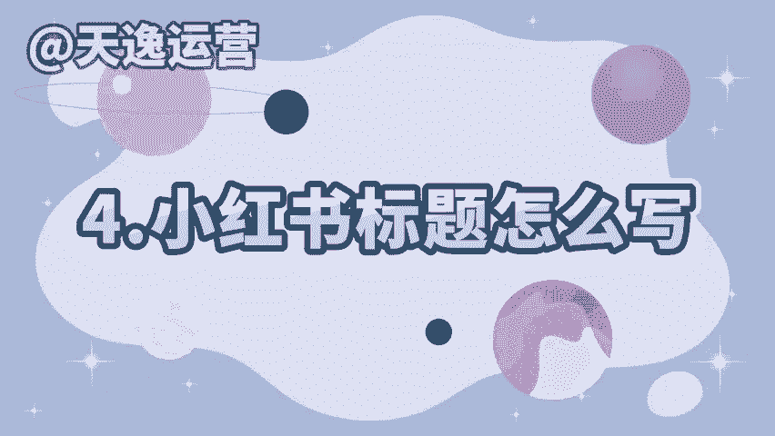

🎼Yeah。啊，然后再来讲第二个啊，我们要说到的一个标题的这个问题。然后这个关于标题的话，如果说我们有原创精神的同学啊，你说老师我文字还不错，我愿意自己去写。然后我今天呢也给大家送个小福利。

这个咱们下了课可以找助理老师去领啊，记住我找助理老师领啊。你们看一下，就这里面呢我给大家去总结了一些关键词就不同类目的一些关键词，就是在我们的呃标题里面可以去体现的。因为我们现在如果说你的标题里面。

比如说别人在搜索的时候啊，搜这个。😊。

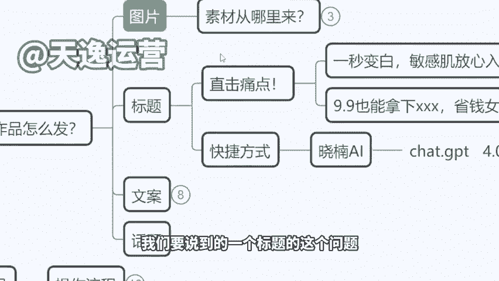

淡斑对吧？搜美白，那刚好你卖的这个产品是有美白功效的，你就得在那个标题里去写上美白两个字啊，就是你得带有这个关键词，对吧？什么修复啊、精华呀、护肤品啊，人家搜的时候是可以通过这个关键词搜到你的。

那所以说我们在标题的时候就要注意去加上这些关键词啊。然后这个关键词的话呢，在这里我就给大家总结好了。到时候你们可以下了课找助理老师去领。然后另外一个就是做爆款标题的这个点。

然后这个标题呢是给大家总结了一些目前带货效果还不错的啊，然后把这个标题给大家拿出来了，把这个词啊给大抠掉了，你们也可以去带入进去，然后呢去形成一个新的标题，但是不能直接用啊。

就好比说人家这个是这可能是全网最清楚的美白教程，对吧？但是你不能完全照样的把这个去写进去啊，因为这个跟别人是重复的，所以说你只能说去模仿他这句话再写个类似的写个类似的啊，这个是我们适合有原创想法的同学。

😊。

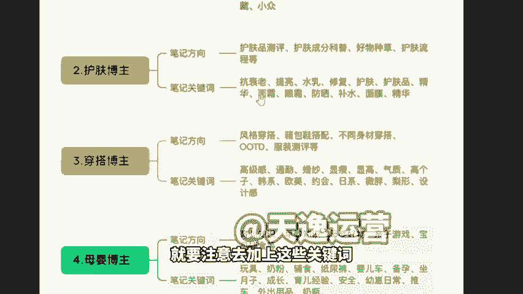

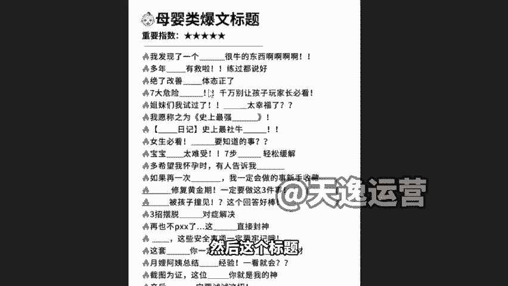

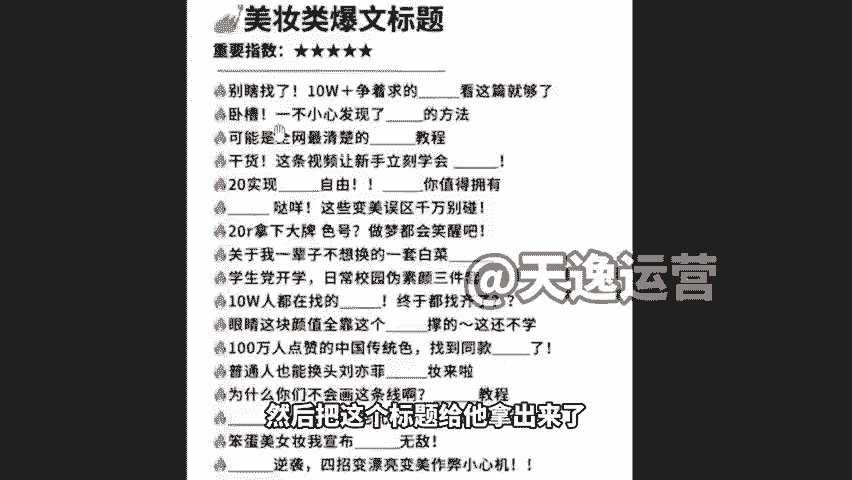

但是实际上其实我们自己在做内容的时候，一般来讲我们不会做原创。😊。

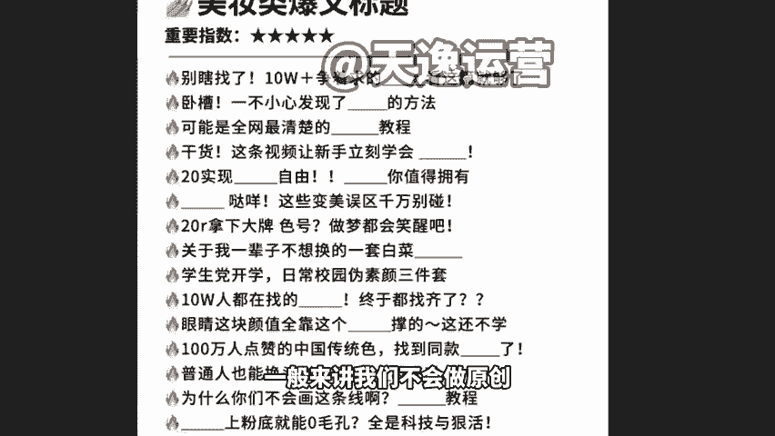

我们是怎么做，不会说自己去写啊。呃，我想问一下大家知不知道什么叫做ch的GPT我现在跟大家讲个黑科技啊。😊。

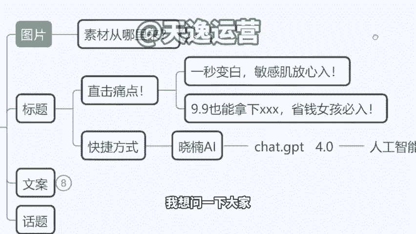

讲厉害的一个东西。然后这个软件的话呢呃是我自己团队做的，我们自己研发的。然后但是说句实在的，我们本是它的一个本体啊，我们是借鉴了一下海外的chaGPT啊，我们是把他们的核心技术拿过来了啊。

copy了一下啊，然后做了一个升级迭代。😊，知道哈人工智能能帮你高考，能帮你写论文，能帮你写周报写月报写工作总结啥都会啊。嗯，对，然后但是呢我们现在国内它其实是没有一个针对于小红书的一个版本的。

然后当时我们在跟小红书去讲这个合作的时候，他他们他他们当时就跟我们讲了，说现在做小红书的时候，其实很考验写稿能力啊，就是说小红书确实挣钱机会多，但是很少有人能够在小红书有这样的一个机会，他不像抖音啊。

你能剪个视频出来，你各种素材去拼接，你就能做一个能够做爆款的一个作品，小红书不需要有那么复杂的视频，但是他对于你的文笔有要求，就是你写的内容能不能吸引人，能不能抓人，更多人在刷小红书的时候。

是看除了看你的几张图片，那几张图片有什么好看的，对不对？更多是看你的文字，对于这个产品的描述，你对于这个产品的心得体会，他觉得话真的很真实啊，写的很好，对吧？有吸引到他他才会下单才会去消费啊。

所以说这个文字是很重要的那怎么办？咱不会写，我也不知道我写的东西到底能不能做到爆款，能不能吸引人那你。😊。

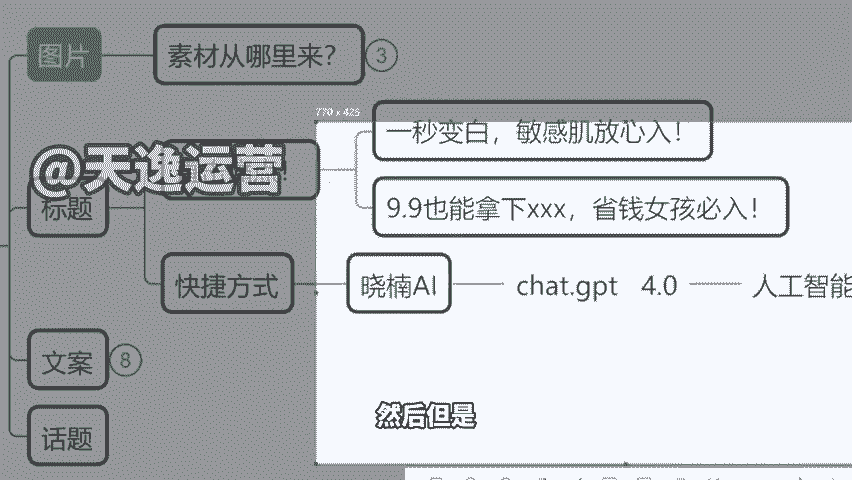

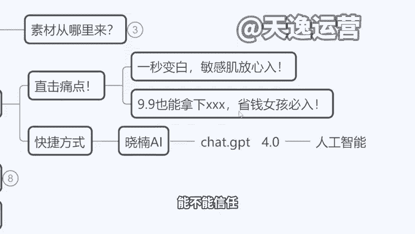

不妨交给AI来做啊，我先给大家看一下啊，这个工具我不是拿来卖的啊，我就是今天给大家做个分享。到时候如果说你们做小红书，能把这个工具用上也是事半功倍的啊，来给大家看一下，比如说我今天要做一个标题，对不对？

那么我要写这样的一个内容。如果自己去写，它不一定是爆款。但是如果用工具的话，它的素材的呃采集呢是来自于小红书本身已经有的这些爆款标题，然后呢，它通过模仿的形式啊，达到80%的原创度给你写个新的出来。😊。

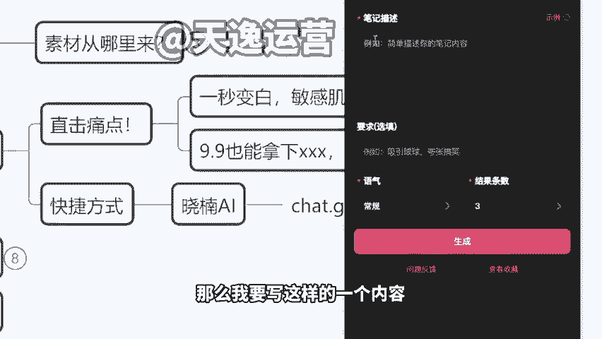

我们看一下，比如说我今天要卖一个这个我想个产品啊，比如说我们做一个什么好呢？😊，墨镜吧。是吧比如说墨镜啊，然后呢我的要求是吸眼球，大家想做一个什么标题，你们也可以说一下啊，想做一个什么产品。

然后我给我给他我给大家去示范一下啊，吸引眼球。😊，不要说大范围啊，什么女装那些不要讲啊，你要讲产品的名字啊。😊，新眼琼。

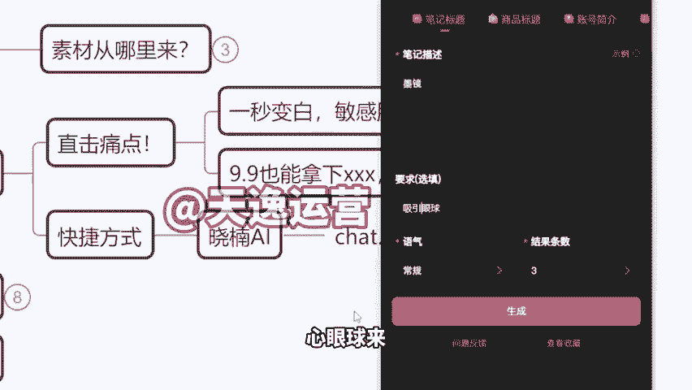

来语气我怎么选？如果说你想更亲切的口吻，我们可以选友好的啊。然后如果说是奢华来这样吧，我们有一个小葛同学收到了一个珍珠项链。来，我跟大家讲珍珠项链好了啊，我跟大家讲为什么？

因为它还有一个好的用处来珍珠项链。😊。

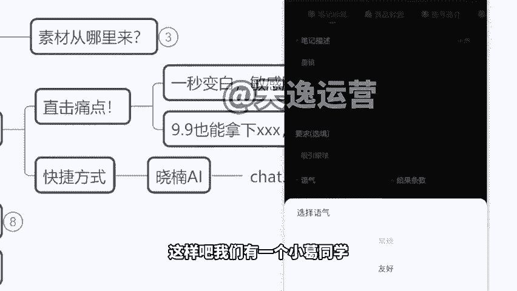

我们用这个的情况下，你看它是可以做区分的。如果我卖的珍珠项链价格很贵，对吧？它是1000多块钱一条的，真正的高端的产品，那么我们不能很随意去写，我选奢华的，我点击生成，它的词藻就会比较华丽。你看一下啊。

奢华的象征。😡。

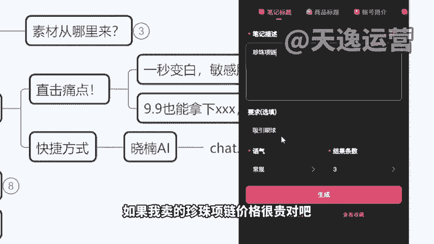

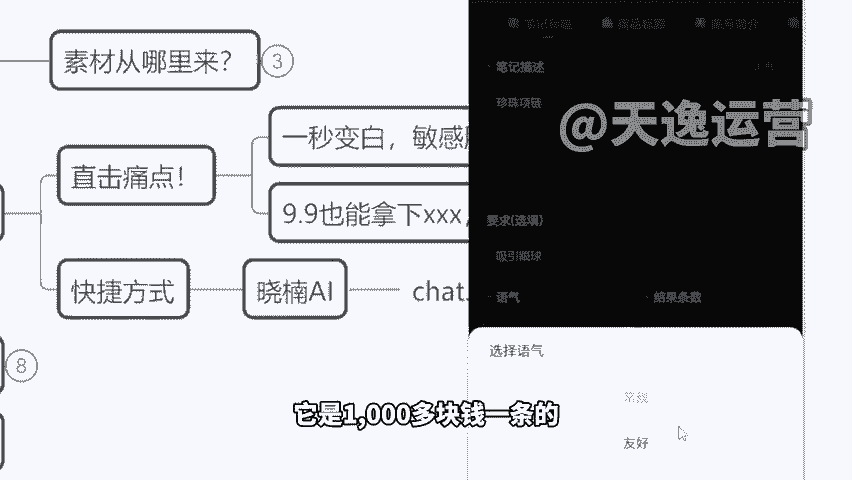

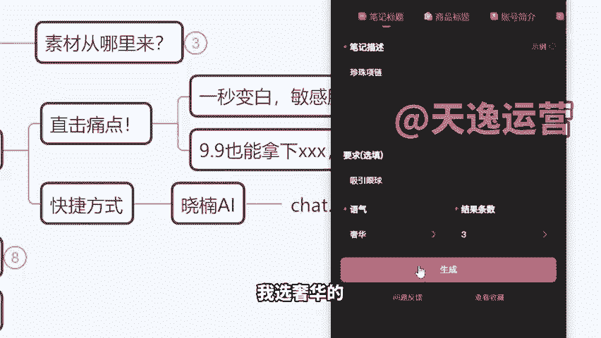

一块珍珠项链的奢华魅力，揭秘顶级珍珠项链的奢置风范等等。哎，他写个这样的一个内容出来啊，你们能看清楚吗？在底下，如果我对这个内容我不满意，我点换一换，然后他立刻又会给咱们写新的。😊。

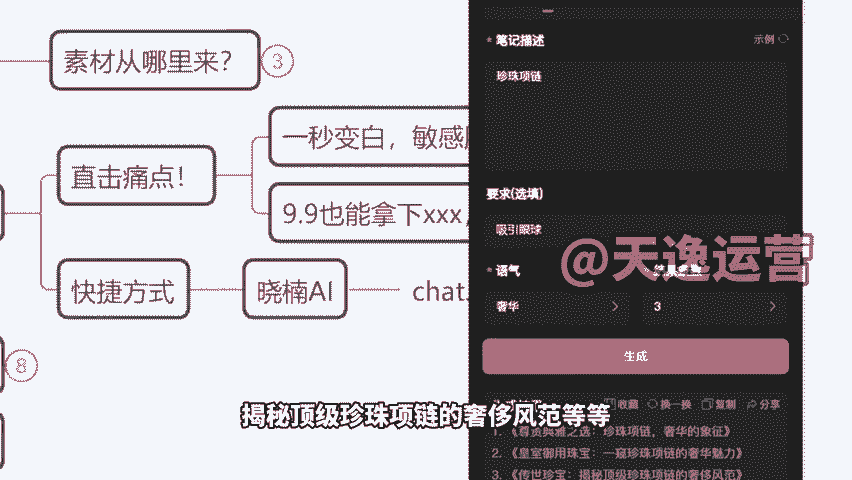

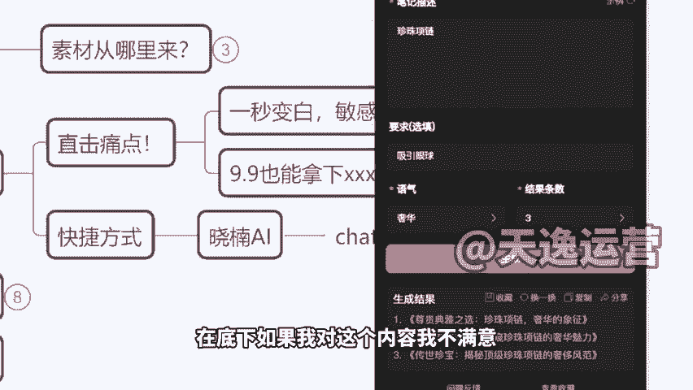

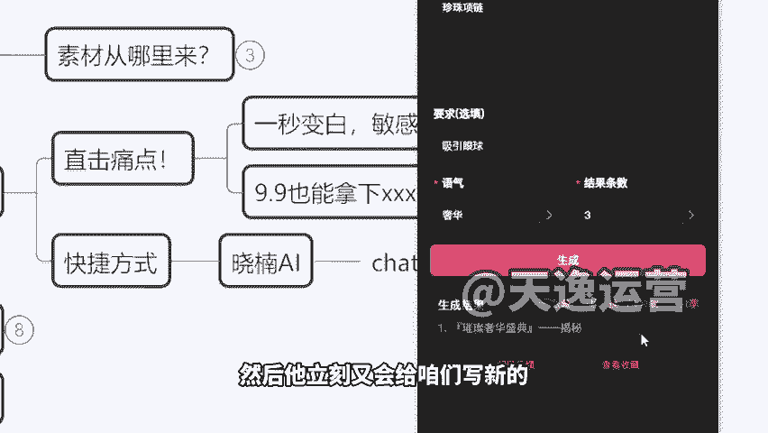

看到没有？又文写新的。😊，啊，以这样的一个方式给到你。如果这个我还不满意，再点换一换，它永远不会重复。但如果说今天我卖的这个珍珠珍珠项链，它是属于什么呀？它属于那种low货啊。

就是50块钱的人造珍珠是塑料的那我们就不要选奢华，你选什么亲民一点的，咱们选个友好的啊，我再点生成，来看一下，这个时候就不一样了。😡。

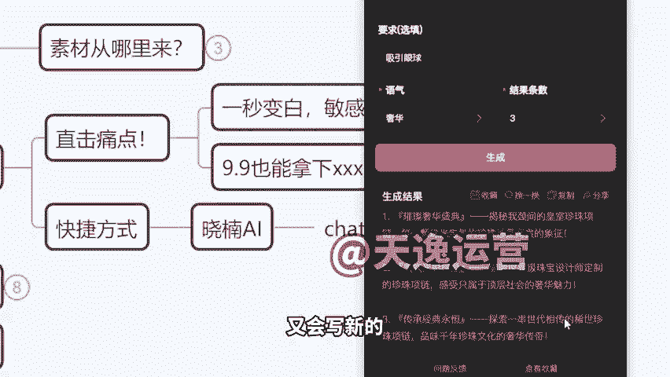

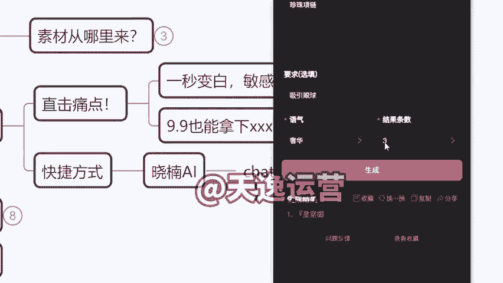

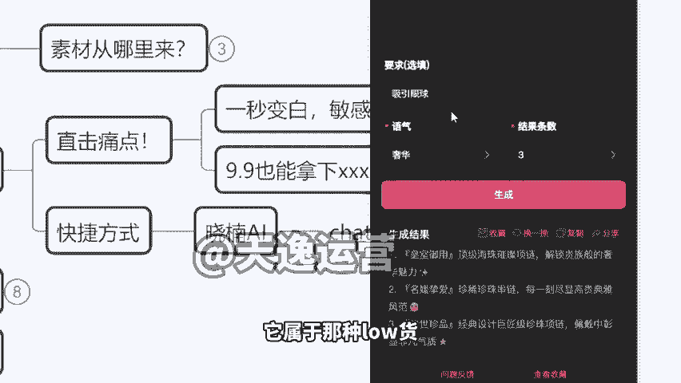

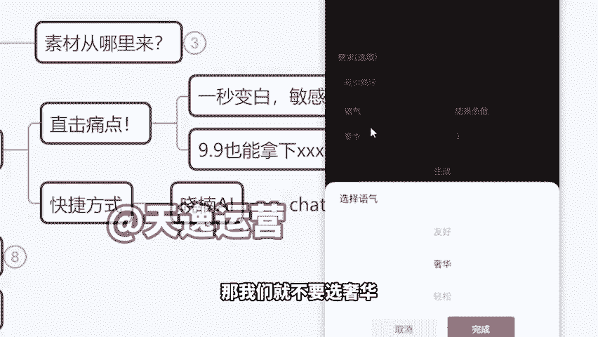

啊，他就不会说有那么辞早的话，那么华丽的一个词藻了啊。你看如何挑选你的完美珍珠项链，小红书精选指南珍珠项链搭配数，让你轻松成为优雅焦点，对不对？来这个标题写的好不好？大家觉得这样的一个标题好不好？😡。

能不能用？😡，来看啊，好是吧？还不错，珍珠控必看如何选购与保养你的珍珠项链，每颗珍珠都有故事。珍珠项链的时尚演绎之旅，小表情都给你带上了，小表情都带上了，这种就是便宜的啊，它一定会有的这个小表情，贵的。

人家就不带表情，因为要严肃是吧？要庄重啊，这个就不一样来这个标题咱们就搞定了。无论是哪种品类，哪种类型，包括甚至说哎我做个沐浴露，对吧？我做一个沐浴露也是一样的，我选个友好，或者说我就选个常规的吧。来。

咱们选个常规的再点生成。😊。

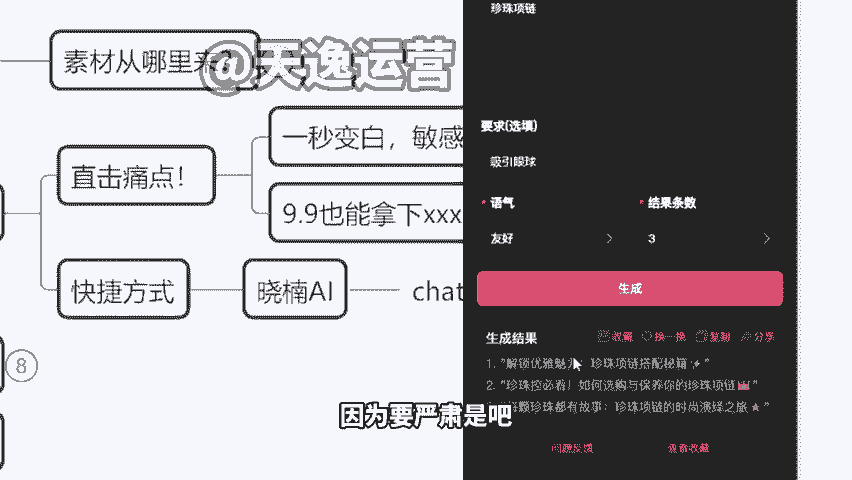

你看宠爱自己从沐浴露开始，对吧？让肌肤喝饱水的秘密啊，来，我们重新再加载啊，刚刚跟那个融合了沐浴沐浴小确幸，发现一款让人心情愉悦的沐浴露，对不对？这些都OK啊，这些都OK啊。然后鼠标垫做什么高级感。

鼠标垫就做常规就可以了啊。鼠标垫不要高级感，你高级感的话就卖不掉了。人家一看你的标题就觉得这个鼠标垫太贵了，人家点都不点开啊，这个标题我们取得这个呃效果的话是跟人家能不能点进来看是有关系的啊。

零食也是OK的。来这个标题我就不多说了。之后，AI咱们直接生成就可以了啊，你不用说自己动脑筋去想。😊。

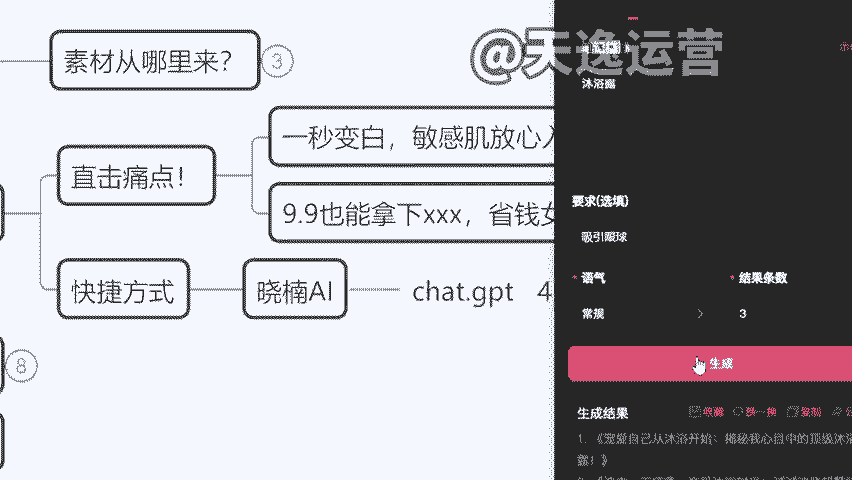

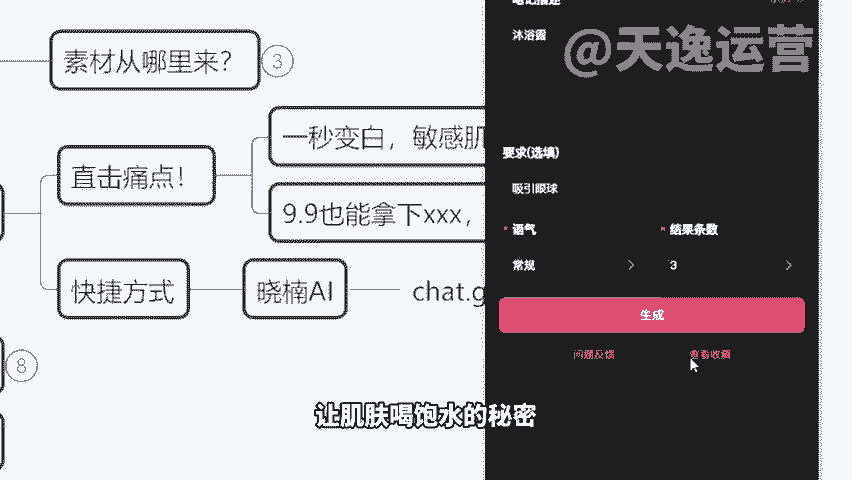

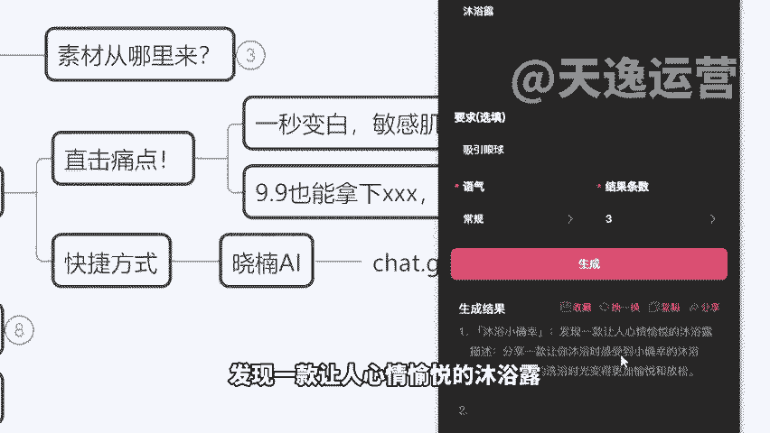

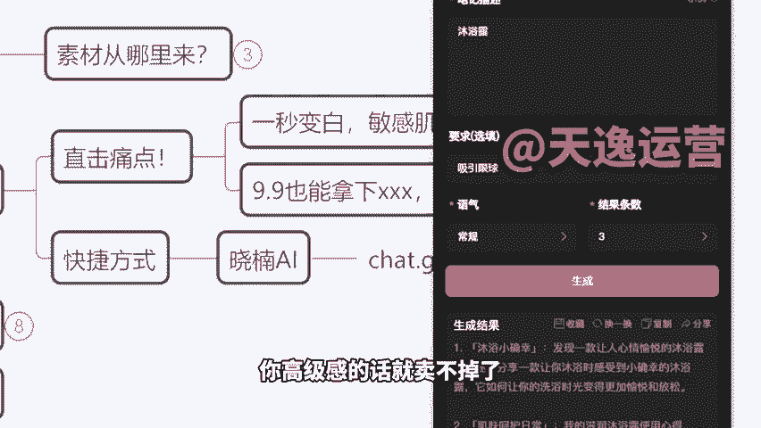

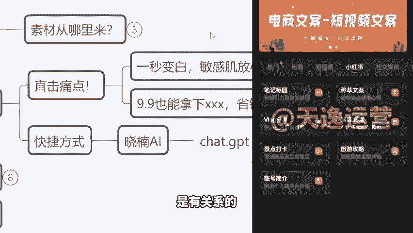

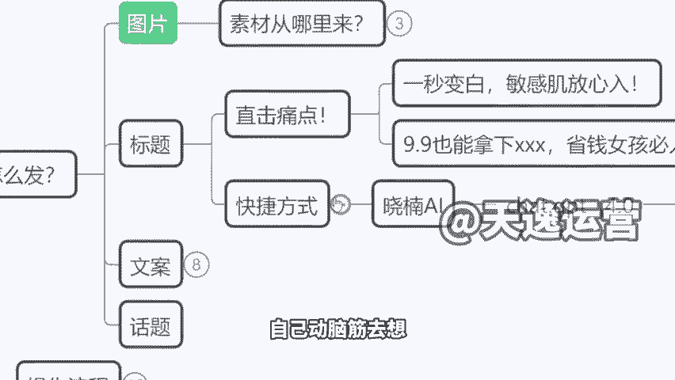