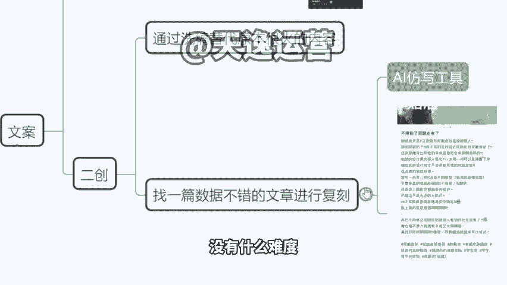

# 【小红书教程】一小时学会在小红书开店运营，从入门到精通深刻理解，小红书涨粉起号，在小红书成为大卖指日可待！ - P15：5.小红书的文案怎么写 - 是你的孤风呀a - BV1GH4y137By

。Yeah。

🎼Yeah。然后包括我们再回归到刚才讲的这个带货啊，我们这个带货还没有说完，对吧？我们既然有这样的一个工具之后，我们就可以直接生成文章。无论是卖产品，还是说接商单，非常简单，非常容易啊，没有什么难度。

那么同时在这个工具里面，如果之后还有一个方式啊，就是我们还有一个可以去获得流量的方式，在这里也交大一点。比如说我在小红书刷视频，我刚好刷到了某一个达人，他的这个作品呢是两个月以前的。但是他依然在推荐页。

😊。

我们再推荐也看到吧有个作品啊，3000多点赞。你看那个发布时间。😡，去年的。😡，前年的甚至更久的啊，半年了是吧？几个月了。好，那这个时候告诉你，这是个商机的。😡，你去模仿他的文章，写一篇类似的。

包括你的图片的排版等等，都跟它做类似的。因为平台始终要新的东西，它不可能说一直推以前的老的这个东西啊，那是因为没有可以替代的，所以说只能推之前的旧作品。那如果你写一个类似的出来。

平台会选择把流量划分到你的这个账号这里来。好，那这个时候我们怎么去模仿，对吧？我不知道怎么去写这个东西，你把这个东西一样的，交给咱们刚才的AI工具啊，在这个位置，它有1个AI聊天，来有个AI聊天。

它会模拟啊，这个就是你它会满足你的所有的要求。然后在这个位置的话呢，比如说我把这个文章，我复制过来，对不对？我把这个文章复制过来之后，我下面带上一句仿写这段文字。😊，好，那么他就会给你反仿写。

你看本身我们第一句话是肿眼抛天菜，对不对？好，它改成什么了？改成这款隐形双眼皮贴真的太赞了，对不对？它意思没有变，但是它的文字它的语言，它的语气是会有变化的啊，这就叫仿写。

然后包括你如果说重复再给大家发，还会有新的东西，这个AI软件叫什么？目前没有名字啊，因为这个是我们自己做的？毕竟我跟大家说一个这个说一个这个事情啊，为什么它没有名字，因为这个技术是从国外来的。

它原版的这个工具叫GPT但是它没有小红书的这个试用版本，我们相当于说是等于说我们用了人家的技术，然后做了小红书的版本，所以说我们没有办法在正规平台上线，这个工具是我们自己私下在用的。

就是我们公司自己的员工在用的。如果到时候你们确定做小红书，比如说你从明天说老师我下定决心我要开始做这个做这个项目了，你到时候找我来要。😊，你到时候再来找我要好不好？如果说你真的要做小红数再要。

因为今天我们也也担心会有同行在听课，我不可能说把这个东西直接啊，我说每人一份，那这个东西不值钱，也是增加竞争对手啊。然后到时候如果你们真的要做的话，我们再考虑这个问题，你再要就找我要就行了啊。

这个东西我不会说收大家钱啊。因为我们这个东西不会拿去卖，拿去卖的话，相当于说别人如果说再来抄我们的这个技术，对不对？那我们这个东西就很难搞啊。所以说如果你们真的是自己要做的，我们再说啊，自己要做的再说。

😡。