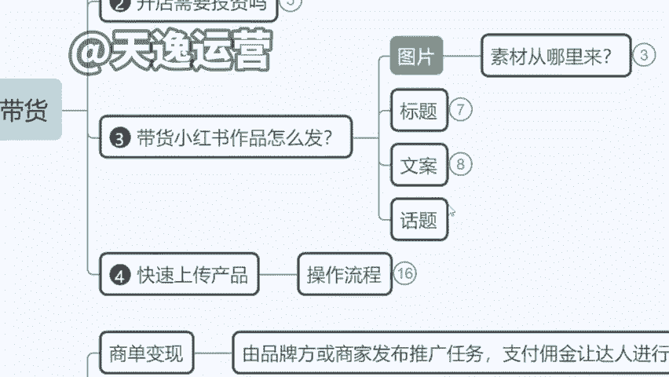
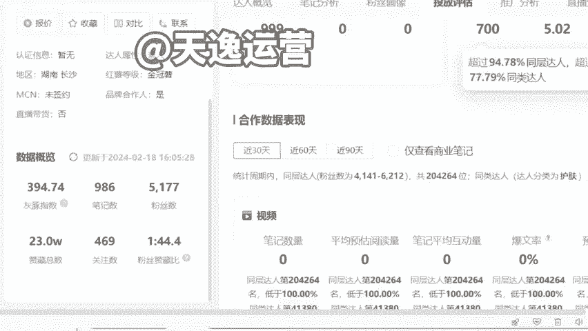
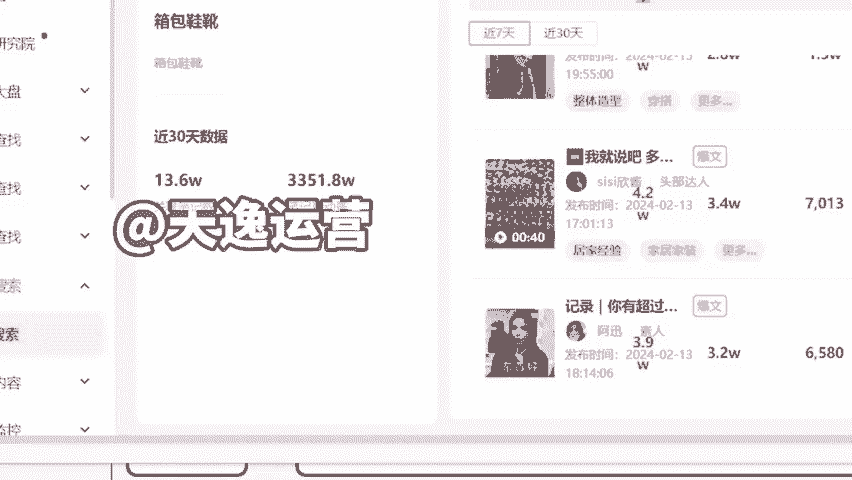

# 【小红书教程】一小时学会在小红书开店运营，从入门到精通深刻理解，小红书涨粉起号，在小红书成为大卖指日可待！ - P16：6.小红书的话题怎么找 - 是你的孤风呀a - BV1GH4y137By

。Yeah。

🎼Yeah。另外就话题的话，到时候我们会有包括我跟大家讲啊，你们到时候如果说在文章里面不知道带什么话题，对吧？有更大的一个热度。😡。

然后包括你不知道要卖什么产品的，我们现在是直接拿到了小红书后台的所有的统计权限。我给你们看一下，我们是有这种比如说呃品类的一个品类搜索给大家看啊，就是我们有比如说我要做箱包鞋靴，对不对？

我要做这个箱包鞋靴，女鞋男鞋等等都O那么我们在后台是可以直接看到，比如说这个笔记有多少篇，一共有多少篇，然后呢，这些所有的笔记里面爆款当中用的关键词最多的是什么？达人分析品牌分析，它的关键词分析。

高频的评论词，我们都有，就是我们可以直接看到整个平台，包括他每天新的作品，发的这些内容是什么。然后包括他是怎么样去做的引流，就是我们这边可以直接看到后台所有达人发的作品。

然后到时候如果说你们需要说老师我不知道我应该怎么去发这个内容，对吧？我不知道我当下卖哪个款式，比如说同样是之前卖一个这个长筒靴，我是卖这个V型的还是圆形的这个鞋统的。😊。

然包括我卖棕色还是黑色的，这个其实都有讲究的。然后到时候我如果你们需要的话，我们直接导出数据给你们，就是我们会导出后台数据，告诉你哪个款式是当下适合去卖的。然后你卖就可以了。有这个专业数据来做扶持的话。

比你去测评，不断试错，效率要高很多啊。然后这个的话我们到时会给大家去操作啊，我们直接是有后台给你们导出的。😊。

