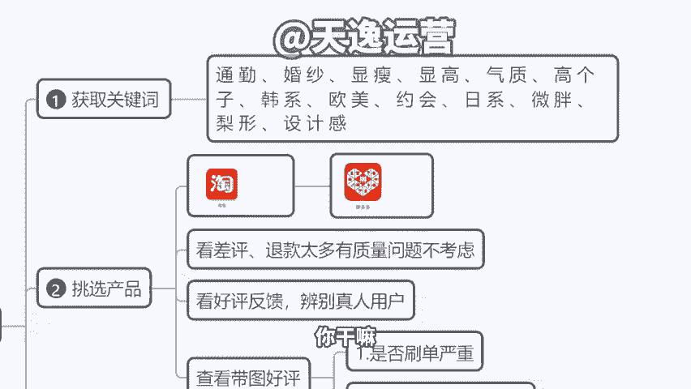
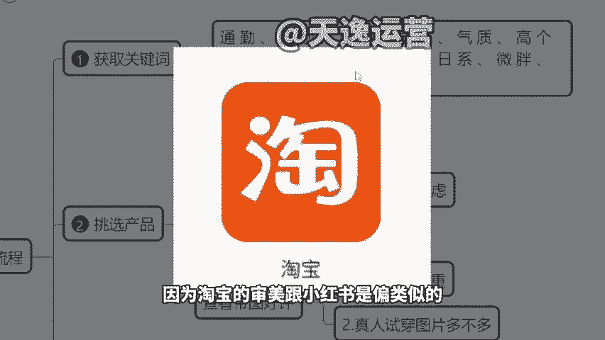
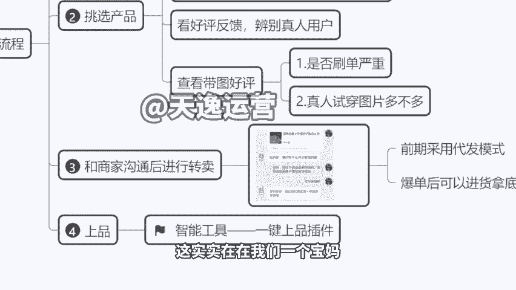
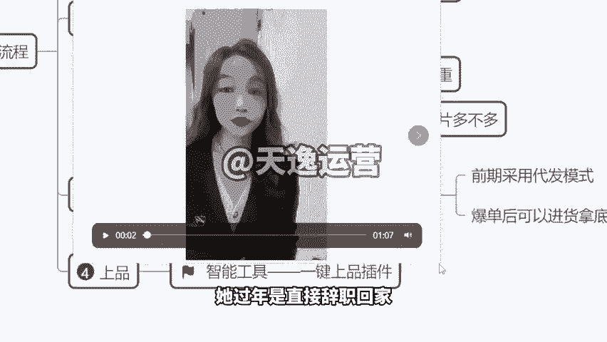
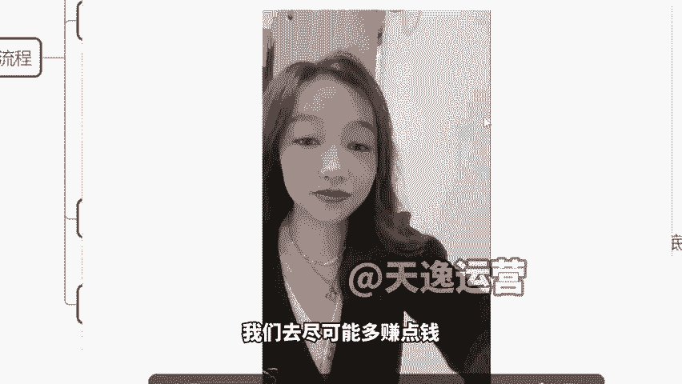
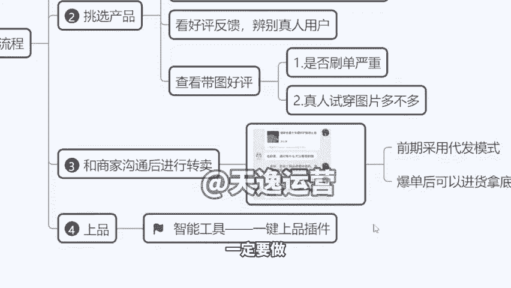
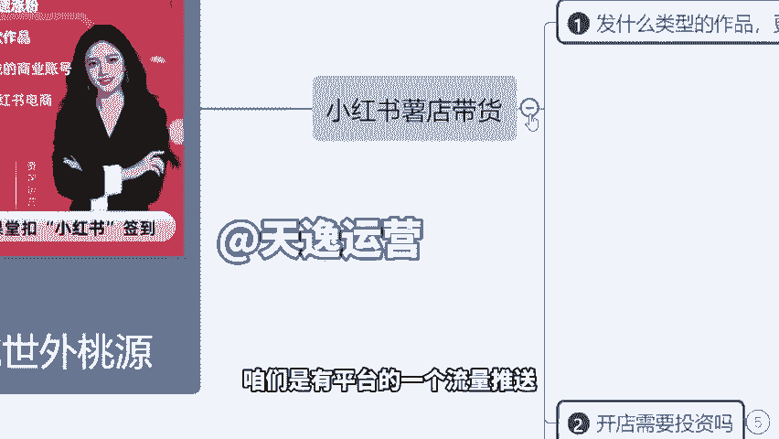
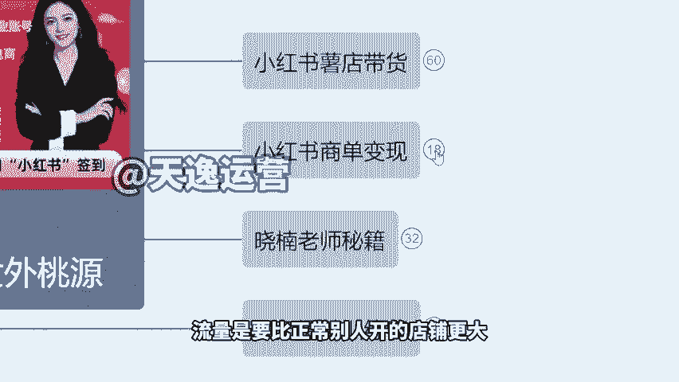

# 【小红书教程】一小时学会在小红书开店运营，从入门到精通深刻理解，小红书涨粉起号，在小红书成为大卖指日可待！ - P17：7.小红书快速上传产品，小红书操作流程 - 是你的孤风呀a - BV1GH4y137By

。Yeah。🎼Yeah。然后现在我们讲一下关于我们到时候店铺的时候上品的一个问题。因为店铺对于大家来讲，我们到时候上品会有一个。😊，要注意的事项。来，同学们仔细听一下啊。关键词的话。

之后我给你们去获取啊，关键词我们这边都有，就是我们有后台关键词，我告诉你们用哪个关键词像这个流量会大，然后你们就直接呃拿到这个关键词之后，比如说像这个卖服装，对不对？

婚纱风韩系欧美约会微胖美眉显瘦穿搭梨形身材设计感，对吧？通勤穿搭好，你拿到关键词之后，你干嘛呢？你到淘宝里面去搜啊，到淘宝去搜，因为淘宝的审美跟小红说是偏类似的，偏贴近的，我不可能说我看这个小红说。

别人卖啥，我卖啥，对不对？那这个你们有优势，我们也得自己去选个同样类似款式的出来啊。好，那么我上淘宝去搜这个关键词搜了以后，我们去看那个销量榜单。你找那个销量比较高的价格又适中的，不是说特别贵的啊。

就是价格适中一两百块钱啊，这种这种的一个价格就可以了。😊。

好，找到以后记住不用多多停留。你把那个图片保存下来，把那个款式的图多保存几个产品的图片上拼多多去搜同款。那么这个时候在拼多多他就有同款式，价格更低的产品了啊？那这个时候不能说我单纯看这个价格低。

我就跟他合作，是不是你要看评论那个买家秀是不是真的，还是说请的模特拍的假图。😡，或者说他差评多不多，因为我们新店有一个致命问题，你一旦退货率很高，会影响到你账号的流量。😡，啊，那退货率的原因是什么呢？

就质量你卖东西质量太差了啊，人家这个真的实在是受不了啊，给你退掉了。所以说我们得去看那个评论啊，你看一下人家的退货率怎么样，包括评论说这个东西质量到底好不好？如果说确实是OK的，就算价格稍微高一点。

没关系，我们就跟他先去合作，我们先把前期店铺评分拉起来，你的销量包退货率不高的情况下，后面我们的流量也会更大啊。好，那这个时候找到合适的产品跟商家去联系，跟商家沟通，呃，不要直接在拼多多下单，为什么？

因为你直接拼多多下单的话，人家那个商家帮你发货，那里面还有拼多多宣传单页，还有什么好评返现那些的，很尴尬的。人家用户一看啊，我在小说买的东西，原来是拼多多进来的。😡，肯定会退货，是不是？

所以说你要联系到商家，跟他发微信，跟他讲清楚。😡，你好，我这个产品要做转卖，我要做自己的品牌，麻烦您把发货人改成我店铺的名字，比如说你店铺叫小明之家，对吧？发货人就叫小明之家，地址无所谓。

地址是他们的就可以了啊。发货人改你的名字，然后包装和要求是没logo的，素的包装，里面不能放任何宣传单，也跟他一切讲清楚了，商家是明白这个的啊，人家是知道人家做工厂都知道这个转卖的。好，O讲清楚了。

有的商家好说话，就直接给你安排了，不好说话，就说啊我们要收包装费，一个产品1块钱，那你就给就是了，对不对？好，O了，这就叫代发模式。那么代发的话，比如说一个产品，你代发的一个价格。

找人这个帮你发货的价格，可能那个产品的拿货价20，你进价的话，可能你去进货，囤货的话，可能拿货价才15啊，我就建议大家前期你就先做代发。因为你本身没有多少的一个启动资金，当我们收入高了，你的利润高了。

你再去拿底价，像我们那些同学卖袜子的啊，你自己去。😡，找别人代发一双袜子，5块钱，拿货一双袜子，1块钱，这种你就可以进货啊。但是如果说这个价格差的不是很多，没必要进货啊，你就找人代发就行了。还更方便啊。

当你产产生订单之后，后台直接导出一个表格，对吧？啊，多少多少的这个多少双袜子啊，多少双这个产品，多少多少件产品，然后地址是什么啊，你一次性把这个表格直接发给商家，让他跟跟他讲说您这边安排好发货之后。

帮我把那个呃就对应的订单号填到那个表格里面去，然后到时候你再挨个对吧？你往你那个店铺里面去输送，挨个去填就可以了。然后有一个问题啊，就是我们之后再。😊，传产品的时候会出现这个情况来给大家看一下。

就是比如说我刚有提到的一个货，像这个你看一下像这种东西，拼多多里我们找的商家，人家那个图确实因为人家成成本低嘛，对吧？人家不会说费心思做美工，把那个图片搞得很漂亮，他就个白底一个杯子，看到没？😊。

但是那些卖的好的啊，通常这个你看这个手啊，这个白衬衫啊，这个背景啊，这个光影啊，这个图就很好看，很美观是吧？那怎么办呢？我又想跟他合作，我又没有好的图片，那这个时候可以这么操作货，我就卖他的货，图。

我从别人那拿那这个图你既然没卖别的商家，那个好看的图片的商家的货，人家不可能给你，但是我们可以用一些技术手段，对吧？我把他图拿过来啊，比如说我到淘宝我去找一下，哎，我看一下有没有卖这个产品的对吧？

有没有卖这个同款产品的啊，这个时候比如说我看你这样的一个床上四件套哇，好好看。😊，颜值好高是吧？啊，颜值好高。唉，刚好我在拼多多找到了同款的货，那么我是不是就可以用他的这个素材上传到我的店铺去呢？是的。

但是啊如果说有一点同学们，如果这个图你是这么复制粘贴的，是那么下载保存再上传的，还是那句话，你的代码是淘宝的代码。你传到小红书店铺之后，直接就违规了啊，直接就违规了。这个东西是啊这是给自己判死刑啊。

不行，对吧？它不是原图，是不可以这样复制粘贴的那怎么办？😡，啊，拿工具啊，拿我们的一个插件，到时候给你们啊，拿这个插件。你看我们直接在手机安装，或者说在你的电脑里安装上这个插件。

手机电脑都能用PC端就电脑移动端就手机直接有一个你看这个啊下载以上全部信息的按键，我点击下载以上全部。它就会把当初商家在上传这些图片的时候采用的原图没有淘宝代码的图片一次性给你下载下来。就这样的。😡。

你看几个文件夹给你罗列好，对吧？SKU图片呢详情图片呢123456给你排序好。😊，啊，都已排好，我给你们看这个图是不是真的原图啊，你在淘宝这里你都没办法放到那么大那么高清。我给你们看我这图。

这东西又不是我在卖的，这店也不是我的啊，就是咱们这个实实在在下载下来的。你看我放大。😡，啊，我这还是电脑啊，你们在手机看的会更清晰。来，你看我放大，我再放大清楚吧。😡，为什么？

这是人家真正的相机拍的原图，我们采集下来的啊，看到没？我还放大这个羊眼睛还这么清楚，这个抱枕还这么清晰，这这个原图啊就等于说我们拿下来的这个素材的话，它是没有任何代码的，是原创图片。

那么你在小红书里面去上传的话，你的这个产品也会被判定为是原创产品的，是不会有任何流量限制风险的，明白了吧？啊，我们就用这个AI我们用这个工具去识别，用这个工具采集就行了。

无论是拼多多还是说这个淘宝还是说其他任何店铺的，你去找那个高颜值的图片来用啊。小红书对于这个审美要求是有要求的。尽可能找好看一点。你看像这种拍就很好看，很有意境，对吧？啊，我再放大，包括换一张图片。

你看这也是一样的，我再放大，一样是高清的。😊，我再放它一样是高清的，对不对？可以放到这么大来缩小这个图。其实这个小羊抱枕才这么小一个看到没有？这就采集的是原图啊，采集是原图。

那我们就可以做到第一个货我拿的又是便宜的，是吧？图片我用的又是最好的啊，这个时候销量就不会有问题了，对吧？包括呢我采集下来，唉，这个文件夹以后，那我到时候上品呢，我是一张一张图上吗？一张张传。

那不是也很累吗？对吧？那也很累，你不需要一张张传，直接把这个我们会有商品工具啊，直接把这个文件夹直接传到那个网页就可以了，手机也可以操作，电脑也可以操作，直接传文件夹上去，他会自己帮你匹配好啊。

会自己帮你去匹配好，就是这样的一个方式啊，来O这个我们就解决了，对不对？然后店铺真的还是那句话啊，声音卡了吗？同学们其他同学卡了没有？没卡扣数字8啊，没卡扣个8给我回复一下。😊，我这没卡呀。😡，嗯，好。

卡了的我们刷新一下啊，因为我是没有卡的。啊，我我实实在在讲啊，因为确实是挣钱的这个项目，我建议你们做，你们到时候做的越好。我前面也说了，你店铺达到一定的销售额，我是有奖金的，我是巴不得你们多赚点钱的啊。

所以说我给大家看一下，这实实在在我们一个宝妈啊，自己的一个心得体会，他什么情况呢？他是过年的时候直接辞职回家。原原来人家是在药企上班的啊，他过年是直接辞职回家，现在全职在做小红书的，因为孩子在家里上学。

你们可以听一下他的分享啊，这是他年前的时候给我拍了一个视频。他说老师我分享一下自己的心得。当时在我们的学习群里发的，我就保存下来给你们看一下啊，你们可以听一下他的一个分享。😊。

老师好，大家好，我先给大家汇报一下我的账号情况。我是跟小南老师呢做小红书快4个月了。那我呢最开始是做车载摆件的，大概测了两个屏左右就直接出单了。这个呢是属于出单比较多，但是呢利润其实是比较一般的。

我做了第一个月呢大概是赚了7000多的样子。后面呢又同时在做抓夹跟厨房用品的这种号，一天呢基本上在稳定2000左右的利润。那我刚开始觉得做号的话呢，真的是要有耐心，赚钱呢不能想着说我不劳而获。

那我每天呢基本上是做四个视频加两个图文这样子就能够稳定到这样子的一个收入。我之前呢是在医药公司去做销售，大概一个月的话呢，到手也就才7000多块钱。但是在深圳生活的话呢，我感觉真的是不够的。

平时买个东西哦都是精打细算的。那我呢是准备年后回家直接全职做小红书风口。有钱还是比较好赚的，所以大家一起加油吧。😊，啊，我觉得他这句话其实说的很好，这也是我当时我跟我的很多。

就是之前我们代的学生我在讲啊，我说这个市场它是瞬息万变的。不管是抖音还是小红书，现在知道小红书越来越多，你看都上春晚了，对吧？知道人越来越多，未来做人越来越多，就果跟抖音一样，刚开始好做，很好挣钱。

后面越来越难。😊，这个东西是无法改变的，因为跟你竞争人越来越多了。但是如果说我们前期储备好了。比如说你的店铺我已经有销量在这了，那那些后面听说这个平台好再来做的，人家是零销量。

他是没有办法跟你去比的对吧？因为我们已经有储备了。所以说现在我们尽快的去把这个店铺做起来。我们在有限的时间，我们去尽可能多赚点钱，这个是我给大家的一个建议啊，然后这个是我们的一个店铺的这个玩法。

一定要做，必须要做，一定一定要做。因为做店铺的话，到时候我给你们开的这个店铺的，咱们是有平台的一个流量推送流量扶持的，流量是要比正常别人开的店铺更大，人家开的普通个人店铺，那是完全流量，他都进不来。

平台压根不推流的。😊。

