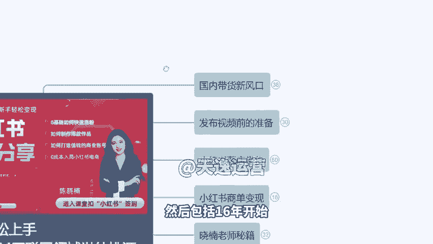
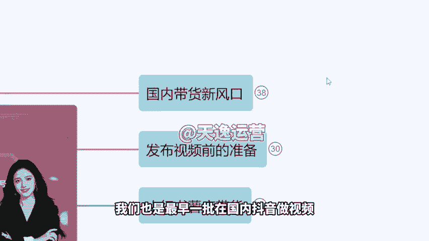
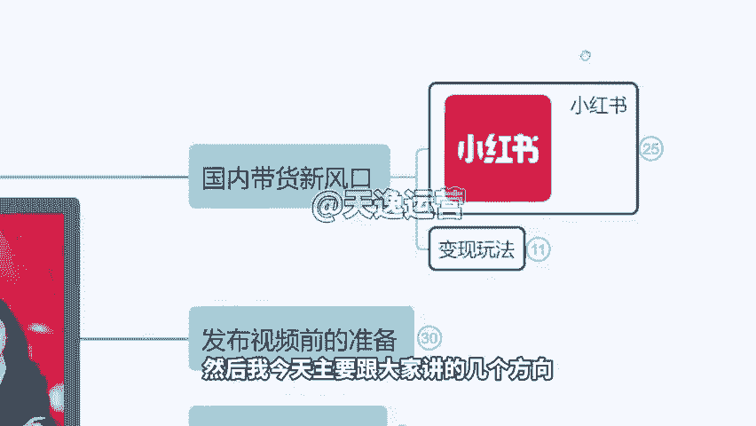
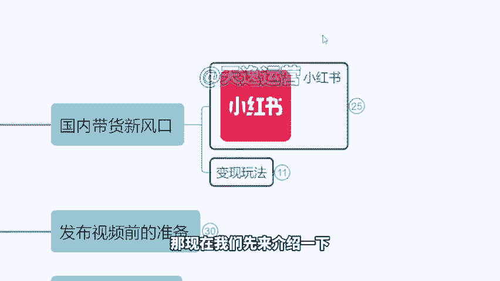
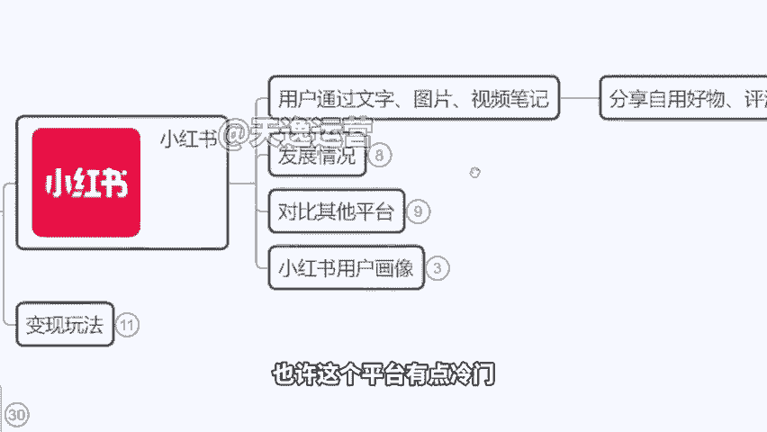
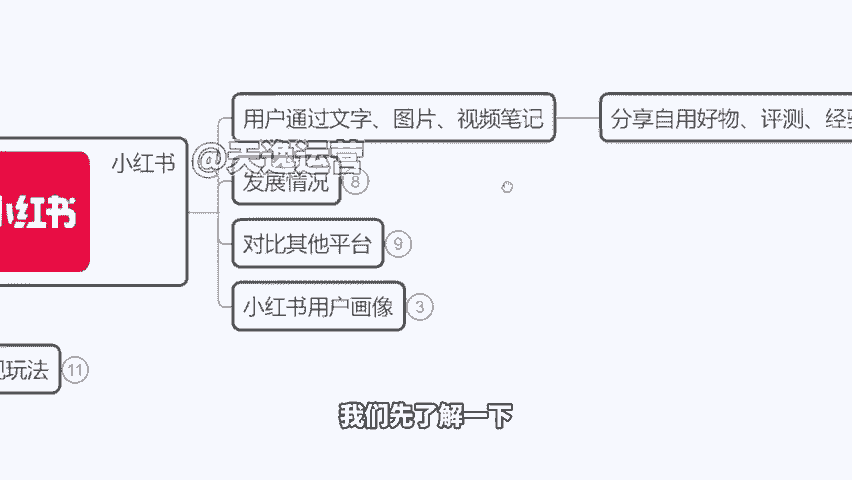
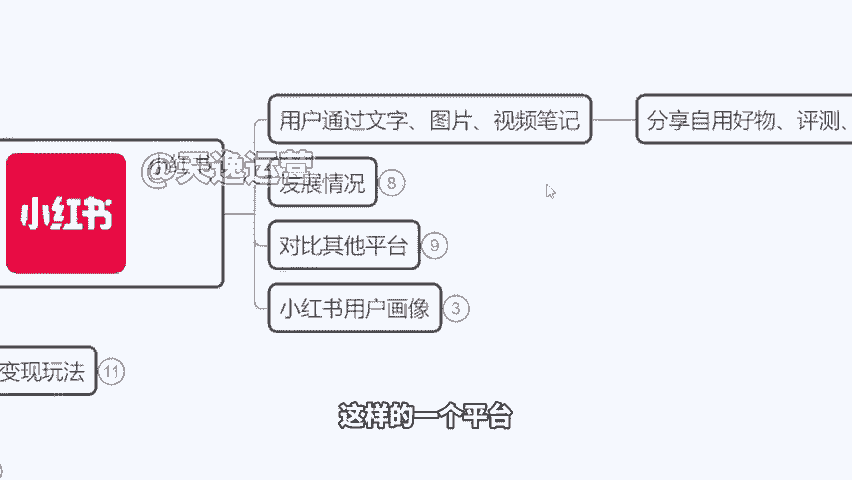
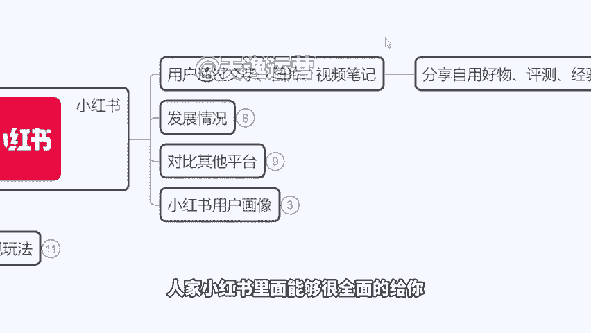
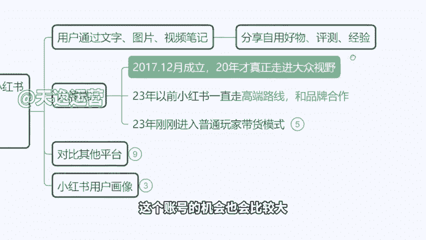

# 【小红书教程】一小时学会在小红书开店运营，从入门到精通深刻理解，小红书涨粉起号，在小红书成为大卖指日可待！ - P4：1、小红书的前景，国内带货新风口 - 是你的孤风呀a - BV1GH4y137By

。Yeah。🎼Yeah。大家进入课堂啊，然后我们现在开始的话就进行我们今天这个课程，欢迎大家啊。然后据我了解啊，我们今天课堂有来自于不同这个平台的这个同学，然后有了解小红书有不了解的，是不是啊。

有在这个什么B站啊，抖音啊啊知道听说小红书，现在有这个挣钱的项目，但是可能具体怎么来操作，不是很清楚啊，大家现在有没有这个小红书的账号，或者说你们平时会不会用小红书会用吗？自己平时有没有用。😊，啊。

有会使用，对不对？啊？我先跟大家讲一点啊，因为如果说我们现在要去选择一个互联网的这个行业去变现，大部分人会想哎，好像这个抖音比较挣钱，对不对啊好有用啊，但不知道怎么挣钱，没关系啊。

很多人下意识会想说是这个抖音的这个平台啊，那事实上啊，抖音它现在已经处在一个饱和期了啊，就是因为做的人太多了啊，在这个平台去变现。然后想要在这个平台赚钱人有点太多了事场是已经溢出来了啊。

那么所以说小红说它其实也看看中了这个抖音这样的一个变现模式是吧？以前抖音哪有这个什么带货，哪有什么直播都没有啊，以前我们看到是美女在那PK呀，在那跳舞啊啊，是这这些内容。

然后包括刷视频看到也是娱乐等等啊，但是自从抖音开了这个直播带货之后，开了这个橱窗带货以后啊，他相当于说把我们中国传统电商的啊，这个市场已经做到了一个瓜分。就比如说呢之前我们习惯性在。😊，淘宝买东西啊。

在什么京东买东西，现在更多我们会下意识觉得好像抖音上更便宜，对不对？好，那么呃小红书它的一个模式其实跟抖音有点类似，它也是一个社交平台，也是一个分享作品的平台。但是小红书的区别在于。

它不是说那种大批量的视频，而是小红书更多是以图文的这个方式来进行。但是你想啊作为一个社交平台来讲，就作为小红书来讲，它如果说一直走这个图文的方式，它不挣钱。😊，对吧平台不赚钱啊。

所以说他开始呢想要去借鉴啊这个抖音的一个代货模式，也想做出一个社交的代货平台，社交电商平台。那么所以说今天咱们才有这节课啊，因为小红书给大家提供了一个这个创业的机会。

我不知道大家有没有关注到这个在春节联欢晚会的时候啊，有第一个小品，当时上场的第一个小品。😊，在那里面出现了一个小红书的logo啊，我们以前看这个春晚，基本上没什么广告吧，对不对？

今年啊小红书直接把广告打到哪里去了，打到春晚去了啊，直接一个抱枕最显眼的红色的抱枕在这里，所以说它下血本了啊，那么我跟大家讲这个意味着什么啊，我们今天为什么会有这么一节课。

因为小红书即将迎来它的流量爆发期。第一，小红书自己花钱花巨资啊，再给自己的平台打广告，在疯狂的引流。那么同时如果说未来我们在小红书的平台去开店铺也好啊，还是说我们去做一个商业账号去打广告也好。

那么我们会直接获得平台给予我们的免费流量啊，就是你不用说像做抖音一样，我还要抖抖家，对吧？我还得花钱，在小红书，我们去做账号的话，现在我们是可以完全封闭不掏，获得流量去挣取收益的。

然后今天我会详细跟大家讲几个玩法啊，来给大家看一下，一个的。😊，是我们怎么样来快速的去涨粉？因为目前我们是处在一个零粉丝的一个状态，对不对？😊，来这是第一个啊。第二个呢，怎么样去制作这个爆款的作品。

因为既然我们想要在小红书平台去赚钱。首先你的作品得有人看我得有粉丝是吧？有人能看到我的作品，那么才能达到引流的一个效果啊。那么第三个如何打造值钱的这个商业账号，就是我的这个号，如果说有粉丝了有播放量了。

我怎么把这些粉丝去变现变成钱啊，让他们来买我的产品，或者说呢我通过接广告我来挣钱啊，那以及呢我们今天也会讲到一个很重要的，我在不掏钱的情况下，对吧？不花钱啊，然后呢并且呢我们有产品啊。

我没有货源在这种情况下，我们怎么样在不投资的这个情况下，我们去获得回报啊，这是小红书这个平台目前能够做到的那今天这节课的话呢，就是由我啊全程来跟大家讲一下我们整个平台它的一个玩法啊。那么我叫小南。

我做互联网的这个时间算比较长啊，15年开始做过淘宝。然后包括16年开始呢，我们又接触了很多跨境项目像什么虾皮呀酷胖。😊。

啊速卖通啊，然后包括呢像亚马逊啊等等啊，18年我们也是最早一批在国内抖音做视频带货的商家。然后我今天主要跟大家讲的几个方向，也是我们不用去直播啊。

就是你自己自己不用真人出镜后另外呢我们不用说去拍摄自己的生活呀，然后不用说自己原创去做这个素材一样可以挣钱的一些玩法那现在我们先来介绍一下这个小书平台到底是什么啊来我们有很多同学可能一进来云里雾里。

咱们现在在讲的是什么呢，讲的是这个小红书平台的变现玩法，也许这个平台有点冷门。有同学可能进来之后连这个平台是什么都没听过啊。没关系，我们先了解一下啊。

小红说现在他其实是一个集合了所有的年轻人的这样的一个平台啊，我们现在已经有一个根深蒂固的感受就是我如果说想买个什么东西，我会下意识打开小红书先搜一下，比如说我现要买口红，对吧？

我不知道我这个白皮适么黄皮适和什么小红书搜索一下我要出去旅游，我也不是问一下当地人说哪里好玩什么东西好吃啊。😊。

我这小说搜的吧，武汉啊这个哪个地方景点，江汉路怎么怎么样啊，对吧？什么东西好吃啊，然后去搜。😡，在小红书能直接给你答案。包括我今天我想买一个什么筋膜枪啊，我想买个按摩仪。

人家小红书里面能够很全面的给你把所有的这个品牌的介绍都给你写清楚。来，我们看一下啊，我直接打开这个小红书的界面，来，我们搜索一下这种，你看一下。😊。

对吧我直接搜索一个什么美容仪。他的内容做的是很精细的啊。来，咱们可以看一下啊，在这里面的话，它有很多这种专业的产品的分析，来看到没有？对不对？就这种啊，很多个产品给你罗列在一块儿。

然后给你做分析非常专业。那所以说这个平台做这个流量背书，做的很好啊，它里面针对性的客群是有很多的。就是想要购物的客户，它是居多的那所以说我们之后去做这个账号的机会也会比较大。😡。

