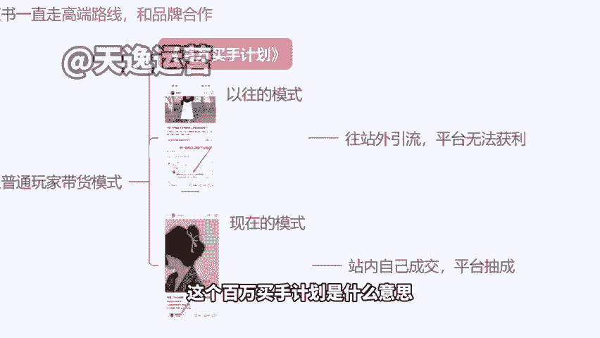
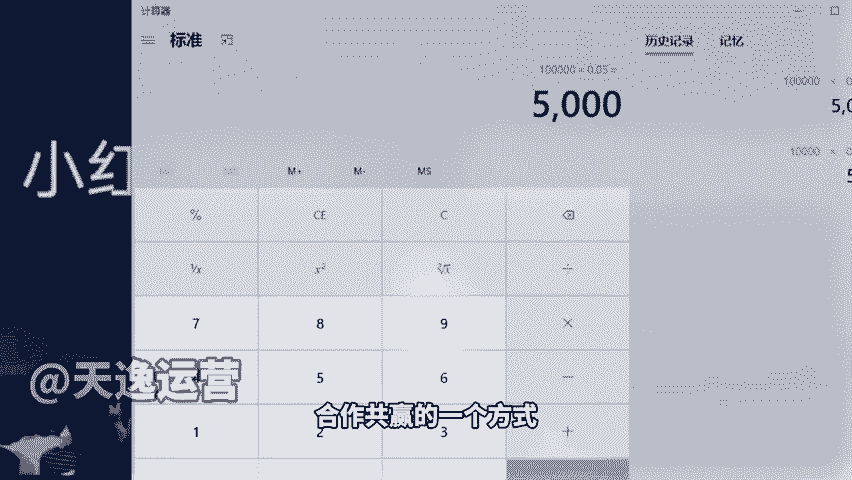
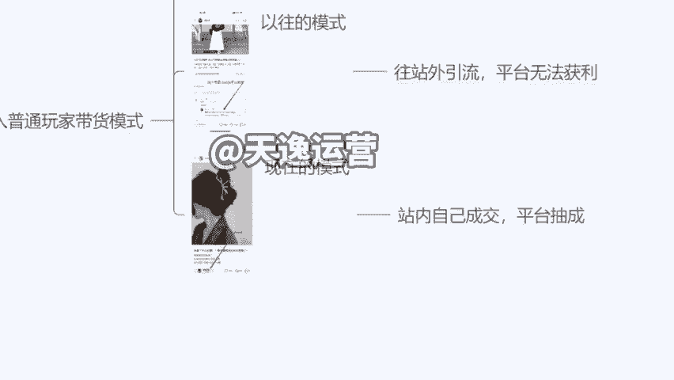
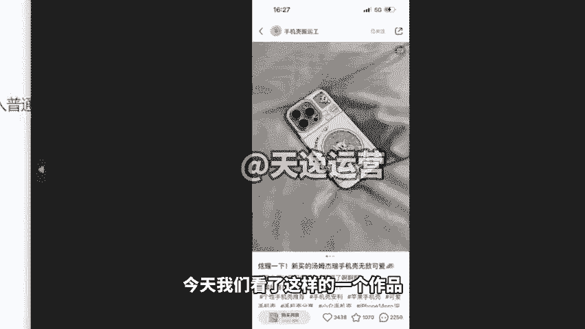
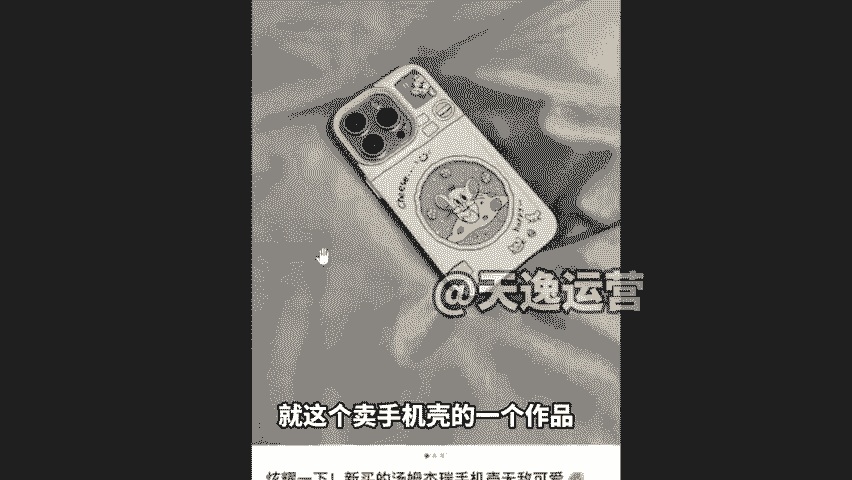
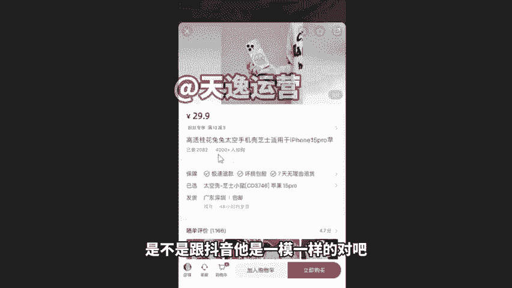
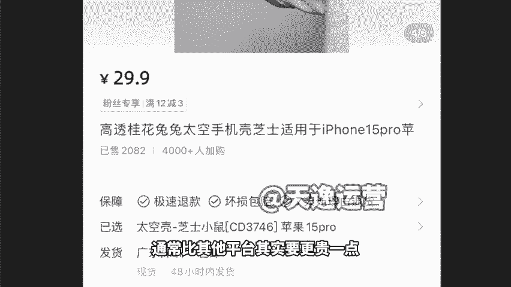
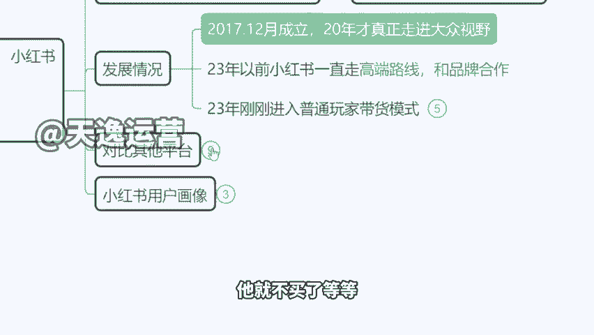

# 【小红书教程】一小时学会在小红书开店运营，从入门到精通深刻理解，小红书涨粉起号，在小红书成为大卖指日可待！ - P5：2、小红书的发展情况 - 是你的孤风呀a - BV1GH4y137By

。Yeah。

🎼Yeah。那再一个跟大家讲一下小红书它的一个发展历程啊，就是在最早之前，小红书其实它是一个没有变现能力的平台。就是我们以前刷小红书，发现里面可多炫富的了。😊，有没有什么香奈儿的包啊，怎么去买啊。

哪个款是当下的爆款，什么情人节限定是吧？然后包括呢买这个爱马仕的铂金包，你需要配货10万还是20个W啊，以前讲的是这些东西，名媛的下午茶啊，这个星空顶的豪车，对吧？以前是刷的是这些东西啊。

但是这个大牌是不可能说在小红书去开旗舰店的啊，所以说慢慢转型，到后来呢这个卖点什么化妆品啊啊，卖点这个护肤品啊啊，然后再到呢后来跟各种服装品牌去合作啊，再到现在什么花西子啊，完美花西子啊完美日记啊。

这个几10块钱的产品也开始出现在这个平台。所以说现在小红书它其实主打的一个方向啊，就是去做带货么所以说今天我们也会来教一下大家，我们怎么样来做这个模式啊，我跟大家简单先说一下这个百万买手计划是什么意思。

为什么我前面在开课的时候，我就跟大家强调我说现在是做小红书的黄金时间，对不对？黄金三个月啊，就从现在起往后数三个月时间，现在。😊。

是平台直接给咱们免费上流的一个时候，为什么来我们看一下啊，他们这个CEO发布了这个新闻发布会，讲到了这么一个玩法，叫百万买手计划。😊，就是他们现在在大力的招募，有创业能力的人，有开店能力的人啊。

有电商经验的人来到小红书去开店去卖产品。不管我们的货有没有品牌无所谓啊，就是能够开店能够去成交，那么就可以。为什么来现在小红书要靠这一个玩法去翻身。我举个很简单例子啊。

如果未来我们的店铺成交金额达到1万块钱，对不对？我卖了一万的货。😡，那么平台能不能从我们手里抽成呢？可以，他会获得5%的手续费服务费啊，相当于说你需要交钱给他是多少钱呢？500块直接从你手里扣走啊。

不会问你同不同意，看到没有？那如果说我们成交的是10万元，对不对？他直接能够从咱们手里啊获得5000元的分成，来同学们，这个钱是不是挺多的，是吧？这就是小红书啊，他未来走的一个方向。😡。

你开店卖货卖的越多，你给平台创造的价值越多。那么他从你身上捞到油水越多，他给你的支持就越多啊，这就是小红书现在跟我们所有的达人合作共赢的一个方式。😡。

那么今天我们就算是个小白，我啥都不懂，只要你把这个店开起来，我们把产品上上去，把作品发起来啊，赚钱是很容易的。基本上7到15天左右是没有问题的啊，这个是一个百万买手计划。你看之前我们在小红说。

你要买个东西很麻烦的对吧？我还得去搜啊，说这个你好链接有没有求个链接，这个群子很漂亮啊，你还得到淘宝上去下单，是不是作为商家来讲，作为卖家来讲很亏的作为作为小红书来讲很亏的，明明是我自己平台引流的。

我花钱来的，买来流量啊，结果跑到淘宝去买东西，钱被淘宝挣走了，对不对？那现在不一样啊，现在的个玩法什么样的来我放这个大图给大家看一下啊。😊，很方便，它的模式跟抖音几乎没有区别。

就好比说今天我们看了这样的一个作品，一个卖手机壳的，但是小红书算很委婉啊，我们可以看一下，就这个卖手机壳的一个作品，他怎么写的，他不会告诉你，像抖音一样，我告诉你，今天我这个产品9。9块包邮。

买一个再送一个啊，赶紧进入直播间抢购，没有这种他是什么嗯，来你看炫耀一下新买的，他们就是手机壳，对吧？呃，是不是他真的是他买的，不是我们通常会被这个标题引进来，对吧？

好像哦你真的在给我推荐一个好用的一个东西，实际上人家自己就是老板。😡。

啊，他写文案，把你先圈进来这个小套路，对吧？然后在左下角告诉你啊，购买同款直接点这个通道可以进入，它就跟抖音的小黄车是一样的道理啊。然后进入到这个界面以后，来。

你们自己看这个界面熟不熟悉小红书的购买通道是不是跟抖音它是一模一样的。😡。

对吧没有任何区别，一模一样的啊。来，这里已售出产品价格等等，对吧？下面加入购物车立即购买都是一样的。😡，那么用户呢就可以直接下单，直接购买了。那么但是啊小红书的产品通常比其他平台其实要更贵一点啊。

但是用户并不会有这个想法，并不会因为价格高，哎，他就不买了等等啊。😊。

