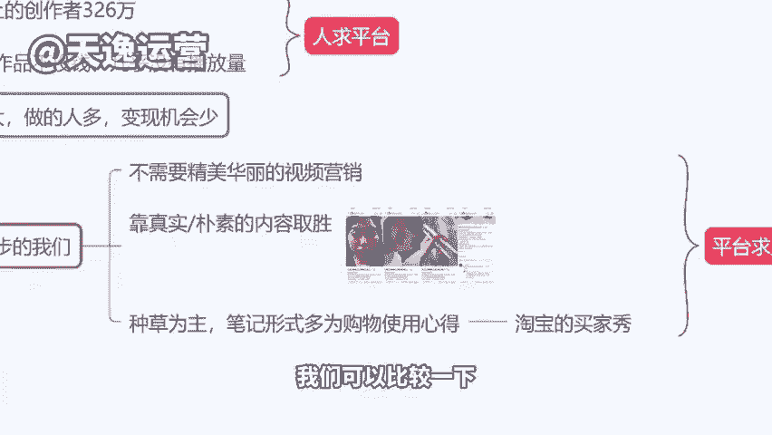
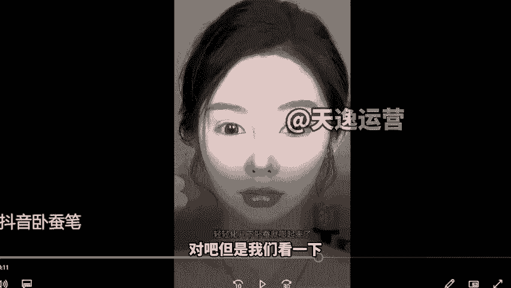
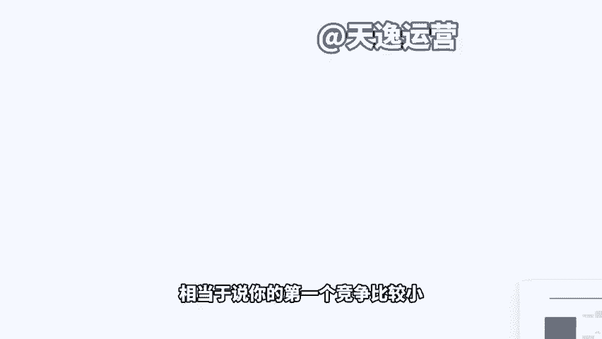

# 【小红书教程】一小时学会在小红书开店运营，从入门到精通深刻理解，小红书涨粉起号，在小红书成为大卖指日可待！ - P6：3、小红书对比其他平台 - 是你的孤风呀a - BV1GH4y137By

。Yeah。🎼Yeah。刚才其实我们也讲到了这个说到了一个抖音的这个玩法啊，抖音的这个方式。就是我其实说实话不太建议大家在做抖音。因为我们像自己团队来讲的话，我们去年做抖音200多号人。

去年年初的时候还有200多号人。然后我们缩减到80个左右啊，因为它投产比越来越低了，就是相当于说如果你去做抖音，你不投钱的情况下没有回报。而且抖音现在限流很重，很严重啊。因为它的市场饱和的原因。

太多人做橱窗带货了，导致呢如果说你是个新号，或者说你的作品质量不是很高，不是原创内容。那么你挂了车就被限流。😊，挂了车就被限流，因为太多了啊，对吧？但是小红书恰恰相反，你不挂车反而没流量。

你挂了车平台直接哐给你上流量啊，这就区别。因为平台要靠你给他挣钱啊，要靠你给他挣钱。现在小红书做人很少啊。你今天比如说是今天我们听课的很多同学都不了解小红书。

在大街上随便拉个轮问一下自己亲戚朋友了不了解他，很多人不知道的对吧？那一个平台知道人越少，机会越大，是不是另外啊小红书我们去做的话呢，要相当相较于来讲更简单一点点，我们可以看一下他的一个素材啊，呃。

我们拿抖音的来对比一下，就说因为我们今天听课的时候，同学也讲说老师会不会很难呢？对吧？我做小红书这个作品当中我怎么去做啊，会不会很复杂呀等等啊，同样的一个产品，我们可以比较一下啊。

然后这个视频的话是一个卖完美的一个卧蚕笔啊，一个美妆的一个产品，如果今天我们在短视频平台去做一个账号，你也许要达到这个效果。😡。

🎼才能把作品才能把产品卖的出去。来，我们看一下啊，哪，这哪里是在画卧蚕，简直是在徒手捏卧蚕一笔两笔三笔4笔，无论多少笔都不会手中不会化脏，再用另一头的提量轻轻化几下卧蚕就起来了。大家看到没有？

这种是短视频平台，她那个特点啊。因为人家要在两三秒之内，我必须拿个美女吸引到你如果说我第一秒我在抖音看到是个普通的女孩的这个脸可能我划走了对吧？我不感兴趣。因为美女太多了，就这个作品啊。

她实际上的一个带货能力不是很好，在抖音里面一个月才卖了500多个订单，卖了500多个订单，为什么呢？因为作为消费者来讲，如果说我看到一个这么漂亮的女孩啊，我会被你吸引，但是我可能不会有下单的一个冲动。

因为我觉得你本来就好看，对吧？你用完这个产品好看是应该的啊，但是我这么普通，我完你的产品能有这个效果嘛，对吧？这是作为消费者的一个想法啊，所以说她在抖音虽然说播放量高，但是带货效果不是很强。

如果你们要做一个这样的作品，你最起码投入一个视频找模特。😊，找代拍800到1000块钱肯定是要的对吧？但是我们看一下啊，在小红书完全不一样。其实小红书平台它的一个性质是属于哪种呢？就是高端的。😊。

买家秀平台啊，更高端的买家秀平台。来，我们看一下啊，这个是在小红书平台一个月卖了3000多个订单的一个作品。有没有发现她的这个女孩其实很普通，是不是？😊，再想我说你要放一个特别美女的。

特别漂亮的一个美女啊，反而可能点击率还不如这个。😊，啊，因为大部分的这个女生是想要去变美的啊，想要去改变的。那么她看到这个图之后，对第一感觉很真实是吧？我们这个二建中心说了很真实的感觉。第二张图一看啊。

画完妆之后变化确实很大。😊，那我对你这个产品有兴趣，我觉得可能我画完也有这个效果，是不是？那你看几张图片加上一个标题，加上一小段文字，效果很好。😡。

小红书里面它没有说抖音那种几十万几千万这种点赞的一个效果啊，3000多赞1000多收藏算是非常非常理想的这样的一个作品效果了啊，那么我们未来去做小红书也是一样的。我们有图片的素材加上取一个好的标题。

加上一段对产品真正的描述，那么我们就可以达到一个带货的效果。你即使说我不会视频剪辑，那也一样是可以的。另外小红书平台现在很缺人啊，所以说我们去做的话呢，相当于说你的第一个竞争比较小啊，竞争比较小。

另外呢我们的几会比较大。😊。

