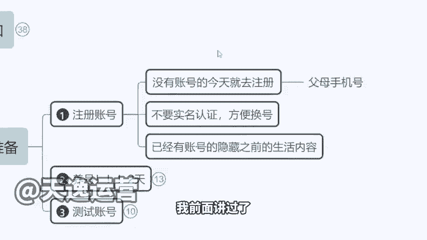
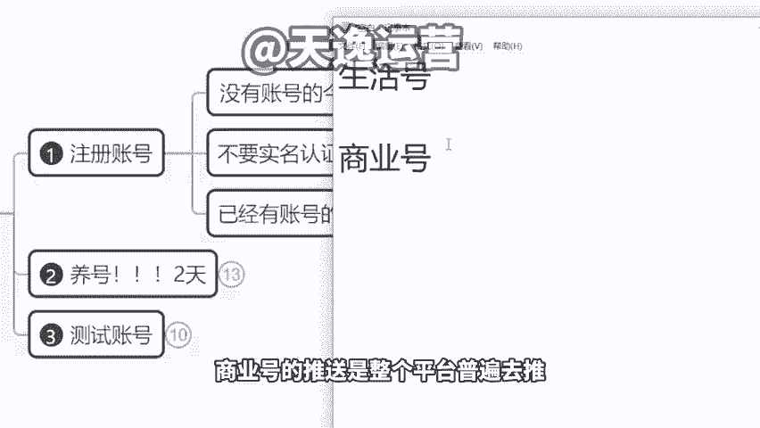

# 【小红书教程】一小时学会在小红书开店运营，从入门到精通深刻理解，小红书涨粉起号，在小红书成为大卖指日可待！ - P8：1.发布视频前的准备，注册小红书账号 - 是你的孤风呀a - BV1GH4y137By

。Yeah。🎼Yeah。我接下来把没有流量，没有播放量，包括像甚至有同学说老师我自己也去申请店铺了。但是我那个店铺开下来，我店铺连人都不进啊，一天几十个流量的，特别可怕的啊，不知道该怎么办了，对吧？

我一会儿给你们来分析啊，一会儿来给大家解决，我们先讲第一个发布视频前的准备啊，我们先把这个注册账号的问题说了，我前面讲过了，小红书上春晚了。

他现在已经是让全国的人民在下载小红书去使用小红书再打这个广告了。那么我跟大家讲，不仅是你们啊，现在绝对有很多公司，很多电商公司都瞄准了小红书这个风口了，想要去批量注册账号了。

那么所以说我建议大家如果你想在这个平台多挣钱啊，你可以去联系你的父母，把父母的账号都拿来一起用，有亲晰的拿过来一起用。你不要说我只做一个号，做一个号收入有限啊，你多做号收入是叠加的。

所以说趁这个黄金时间，赶紧把账号做起来，就跟抖音当时。😡。

一样啊，做的早的呃，是吧，草根都挣钱了，做的晚的你再厉害，没有办法竞争太大了，蛋糕就那么多。😡，啊，不管你是男性还是女性，都是OK的啊。来，那么我建议大家，我们如果说还没有注册账号的，先暂时不要实名。

为什么？我跟大家说一下，有一点你们必须要接受。所以说我们在做小红书的时候，它的起号是有概率的。比如说你注册了5个账号，对不对？😡。

嗯。我就我就不算他5个账号，比如说我第一个账号啊，我就一个账号，然后你这个账号是不是百分百能挣钱，不不一定你这个作品也许发的很好很优质，但就是没有流量，那怎么办？这个号可以不要了。

如果我们等了两天三天播放量没有起色，直接注销啊，拿你这个手机号，隔天再注册一个新的账号。😡。

你也许你不断的注销再注册，不断注销再注册差不多最多啊就5个左右，你肯定是能测出一个有流量的一个账号的，明白吧？因为这个东西是有概率问题的，现在注册小数人太多了，平台的审核很严格，然后他是随机去推流量的。

他不可能说每一个这个发作品人我都给你推送啊，所以说他会有概率啊，那么为什么我建议大家5个账号一起做，这也是概率问题啊，5个账号里面最起码你起来两个三个，对不对？好，剩下时间我再去测新号，就是这样的啊。

所以说呢最好不要实名啊，因为你实名的话，要隔天才能注册新号，但不实名呢，你当天注销，当天又能注册新的账号，直到我们测出一个有流量的账号为止。😡。

啊，然后呃包括像我们之前有很多同学是已经发过作品的，有没有发过作品的啊，你不管是这个变现作品还是什么其他的自己的自拍呀、旅游啊，自己的小孩啊，通通隐藏掉啊，我跟大家讲，你的账号千万不要删除任何一个作品。

不要删任何一个作品，因为删了之后，你的账号健康会受到影响。那么我们账号它其实分为两个属性，一个叫生活号，一个叫做商业号啊，今天我在课题图里面我也写了，我们要做商业号，有价商业价值的，删过怎么办？

先发几个作品，到时候撤下流量，如果流量不行，我们就注销啊，来跟大家讲一下生活号什么意思？就是你平时发的这个生活的内容比较多。那平台会直接认为你是一个用户，就是你是一个客户，你是用户的这个角度。

那么你的作品发出去，你发的再好，它只是给你推身边的人或者说同城的人，很难往外推啊，你的播放量是受限的。那么商业号不一样，商业号的推送是整个平台。😊。

普遍去推，直接推进页里面去推。所以说这个是不一样的。😡。

