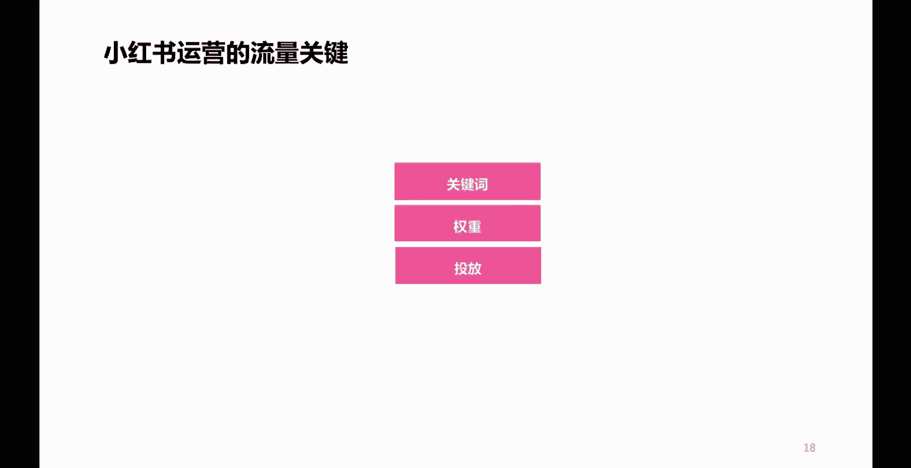
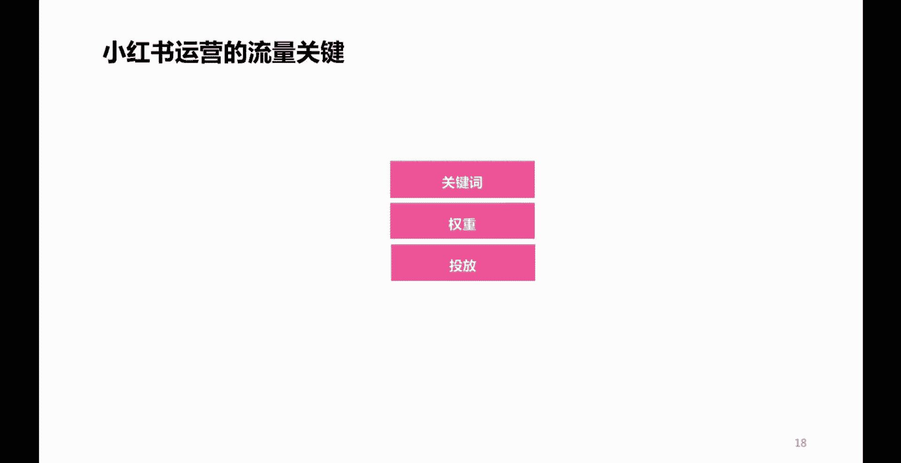
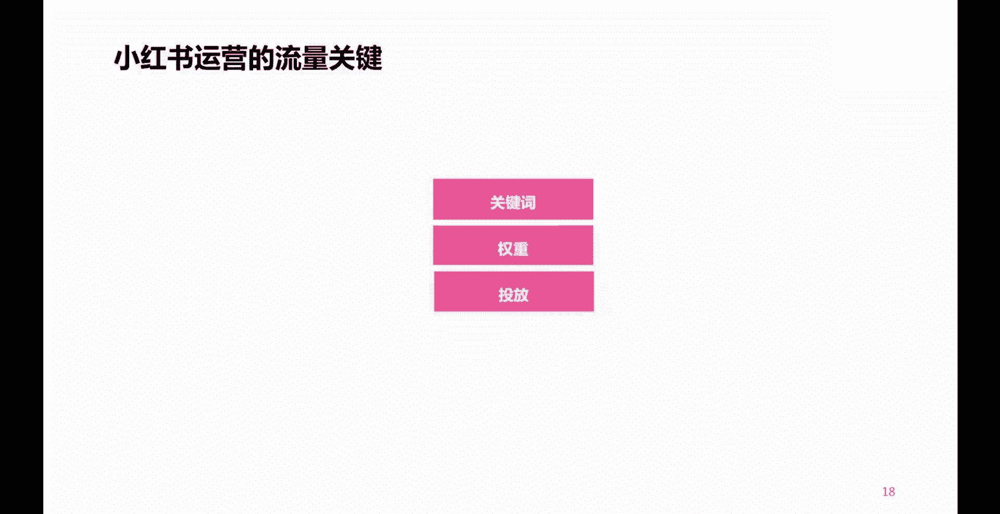

# 【小红书教程】一小时学会用小红书开店做无货源电商，从小红书起号涨粉入门到卖货百万的小卖家精通深刻理解平台运营规，小红书卖货一件代发，在小红书闷声发小财指日可待！ - P17：P15小红书高效引流的方法 - 骆驼教父 - BV1wgpiepEh9

往下看，那么说到底影响小红书笔记内容的一个流量。

关键点在哪儿呢，啊或者说提升流量还有什么样的一些技巧呢。

啊就是这三个点，第一个关键词。

我们在写小红书内容笔记标题的时候。

或者是笔记内容的时候，或者是做图片，做视频的时候，是否清晰，清晰匹配的体现了我们账号的垂直定位。

清晰地体现了相关的一些关键词，这个非常重要。

第二个是权重嗯，虽然呢有些人说这些账号不存在权重这一说。

但是呢我告诉大家。

权重指的是什么呢，指的是你账号的一个活跃度。

你要记住我刚才说的一句话，任何一个平台都喜欢活跃用户。

所以你经常活跃啊。

有规律地去进行内容的更新发布。

一定程度上是有利于你这个效果的一个什么呢，提升的第三个点是投放啊。

大家都知道小红书呢。

笔记呢有一个投放的一个渠道呢叫做薯条，它呢是可以通过付费啊。

通过付费，一定程度上呢可以提高你一个笔记的效果的。

对吧，这个功能叫薯条，大家呢打开小红书啊。

笔记啊，在笔记浏览那个界面右上角有三个点。

点开之后呢就可以看到啊，下面底部呢有一个薯条功能。

它呢是可以付费啊，进行把笔记流量或者是点赞评论这些啊。

做到一个更好的一个提升的啊。

那么这三个点呢，也可以为我们小红书的笔记内容带来一个比较。

哎来说比较是更好的一个效果啊。

获得更好的一些流量啊，更多的一些流量啊。

