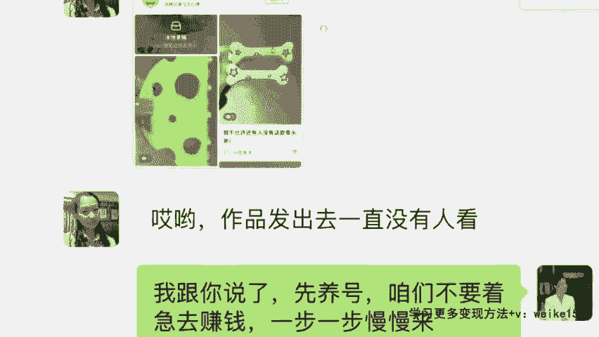

# 【小红书电商教程】B站最良心的最新2024小红书运营全套教程（精华版） - P10：8.如何测试账号 - 宅舞之韵小使者 - BV1GBvreQEab

然后呢养号养到位了之后啊，你要去测试一下，就是看一下我们这个作品怎么样了。

对不对，看一下我们这个账号如何了，那这个时候我们正式去发一篇笔记，这个笔记的图片认真去发，认真去找文章，好好去写，达到一个真的是可以接单的那种状态。

我们再把这个笔记发出去，如果你发了大概两个小时了，对不对，你发现诶我的播放量这个小眼睛在100以上，说明流量正常，两小时之内播放量在30以内，像我们这个学生晶晶同学一天就十几个，对不对。

那我跟你讲这个账号，你直接去注销掉你的这个号，就是个限流账号，没有办法挽救的啊，我跟大家讲啊，当然挽救也不是没有，也不是说没有办法，你挽救这个账号，重新把它做起来要一个多月，你与其说浪费这个时间。

你不如直接注销，你重新再注册一个新号不是更好吗，花两天时间就能挣钱，是不是啊，注销掉这种号不适合开店啊，所以说直接注销，未来我们要的是个高权重高流量的账号，你不仅要开店，未来咱们还要接商单。

我们要靠我们的流量吃饭，如果这个号限流，你不要不舍得他陪你拍的再久，收藏了再多。

你喜欢的作品直接不要了，重新起个号，明白没，那么我给大家讲小红书，因为它的周期是比较长的。

它不像抖音时效性很高啊，像我刚刚讲的说诶第一天发作品，第一天就挣钱，这个是很少数的，那么像大多数人是什么情况，我今天发了作品之后，我今天1000播放量，明天有1000，后天有1000。

诶到了第三天的时候发现诶突然涨了四五千，这种情况是因为小红书他有阶梯式的流量推送，通常做一个爆款啊，最晚的话都要七天时间，或者说一般来讲要七天时间，那么像一个店铺，我们开开来之后啊。

一个零粉的一个状态到能够稳定出单，大概在15天的样子，所以说想在小红书挣钱，需要7~15天的冷静期，储备期，我们才能够正常去报单，持续稳定获得收益。

像有同学说我的等级是金冠数，天天播放量就100左右，这个跟等级没有关系的啊，你的金罐属是因为你的使用的这个年限啊，使用的一个这个情况，如果说你天天播放量都是100左右，还是我那句话。

你不妨先把之前的作品先隐藏，我们重新养两天号，然后再发再测试一遍，如果还是只有100多，你就把它注销掉，我们重来，因为现在呢平台给新号的流量更大，给新号流量扶持更大啊。

因为他会认为说这个新号都是来做电商，然后呢是外面招商进来的新的呃，这个商家或者达人，所以说他的一个扶持力度会更大，但如果说我们是个老客户来讲，他其实不是会那么在意我们啊。

这个呃大家最好我觉我觉得用星号会比较好啊，因为我们很多同学现在能够去稳定出单，都是新号，你看像我这个学生，我给你们看一个，李继平40多岁的一个大姐了啊，嗯她的基础知识。

包括他那个经验肯定是没有你们丰富的，因为他连抖音都没怎么玩过。

他对于互联网什么的完全不敏感的，他最早的时候开始做号，你看他特别特别着急啊。

他跟我讲，然后我今天我课堂里面嗯，也会给大家看一些其他的，就是我们零基础的一些学生，我给大家做个参考吧对吧，因为大家也想知道说哎我作为普通人，我能挣多少钱，我花多长时间能够达到什么样的效果。

你们可以参考啊，我都给大家挑这些普通人好吧，你看一下啊，他之前是在河南驻马店，在一个图书馆做管理员，后来因为遭遇裁员啊，大环境的原因嘛是吧，本来2000多工资其实也不高，然后现在做的挺稳定的。

你看作品发出去一直没有人看，我说信仰号不要着急。

结果呢他是直接拿他女儿的账号啊，你看头像搞了一个这么可爱的，这完全不行。

你肯定是要搞高端一点的，卖这个发卡，然后他当时找的素材是什么样的，你看一下呃，一开始我在想，我说你素材一定要发给我，确定你再去发，结果发的都是这种就不怎么好看的啊，呃就是也不说这个发卡不好看。

而是他没有找到好的素材。

然后后来我让他改了，让他改了之后，你看我说这两个播放量都不错，对不对，重新注册的账号重新发。

立马播放量就起来了，你看1万多播放量对吧，浏览量就第一天啊。

浏览量1万多，他说置顶那个8月2号的，8月15号卖100多单，是不是当时给我发这个截图。

你看一下一个这个发卡，一个y two k风格的这个银色的一个发卡啊。

你们瞧一下啊，26块九毛的售价，虽然说卖的不贵，其实这个可以卖的再高一点啊，因为这个发卡的话呢看起来质感还不错，然后但是呢当时是额卖了102单，十几天嘛，102单，你看额大概的个销大概的利润。

我们看一下拿货啊，然后这个我也讲过知识点吗，同学们刚有同学问说老师，那我之后拿货从哪拿来给你们看，拼多多是首选，其实职业拼多多拿货啊，因为拼多多第一个它价格有优势。

第二个啊拼多多里面开店的大部分呢他是厂家，就他是这个产品的工厂的厂家，而且很多像我们卖的一些小商品，其实更多来自于义乌或者山东嘛，对不对，山东，那么这里面呢，他们的厂家的专业度还是比较可以的。

再一个呢他们是比较擅长去做转发的，就他们已经很熟悉，有很多商家跟他们合作了，那我们一沟通呢沟通起来非常快，非常方便啊，那你看当时他合作的是哪个价格，合作是左边这个虽然说价格贵一点，但是它的销量更好。

差评也不多，当时就跟左边这个商家沟通了，说啊你好呃，能不能我这边多多卖你的货，你给我便宜点啊，最终那个成交价格是五块九毛啊，你看包括像这里有一个先用后付，看到没有，同学们有的人可能会想说，老师啊。

那这个如果说我到时候想要去卖这个产品，我想去进货，想去拿货，我没有钱怎么办，是不是我没有，前期我没有钱去垫付这个资金，那么在拼多多，只要咱们正常啊，你没有说什么坑蒙拐骗，你都有这个先用后付。

到时候大家去开通一下，先用后付的话，就等于说你可以先拿货，等确认收货的时候，再把钱打给商家就可以了是吧，那这是不是我零元购，我没有任何成本，我先卖，等我的客户确认收货了，那我收到钱了。

我再到拼多多确认收货，到时候卖的多，你加商家的微信，私下去交易都是可以的，是不是签个协议保证双方的利益，那都是OK的啊，当时拿货五块九毛，那你算一下嘛，五块九，那26块9-5块九成，利润是21，对不对。

我乘以21来102×21啊，等于说他当时十几天的时间靠卖这一个发卡，2000多的一个收益。

对不对，他当时8月份啊，当时8月份一个月，他当当时跟我讲了，他8月份那时候第一个月他是赚了有8000多的。

然后9月份的时候一个月呢他是挣了有，我记得是1万3还是1万4啊。

因为他不只是卖这个发卡，你看当时他也跟我讲了，对不对，他说我这个女儿想让我去南京跟着她，她也不想不愿意啊，她想自己挣钱嗯。

他人家现在挣得不错啊，比他女儿收入要更高的，你看到没有这种产品，后面的产品全是我给他选的，因为他自己挑的实在是啊，确实不是很好看啊，你看89单，看到没有，135单，对不对，25单，45，43单等等啊。

每个产品销量都还行，加在一块利润不会低的啊，所以说他能做的好，你们是不是也可以，你们是不是也行，那像他你看他为什么能够做到，说单月兵线能达到1万多块钱的一个收入，对不对，为什么能把这个发卡卖得出去。

他后面的作品是怎么发的，这个作品是怎么制，怎么去这个制作的啊。

