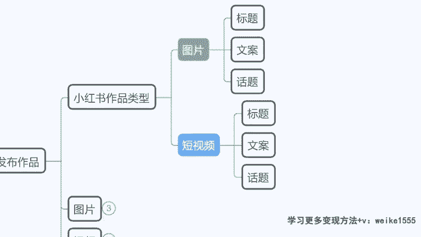
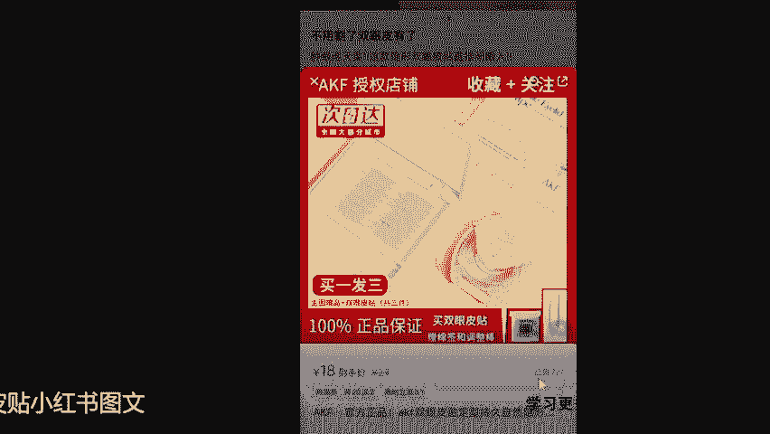
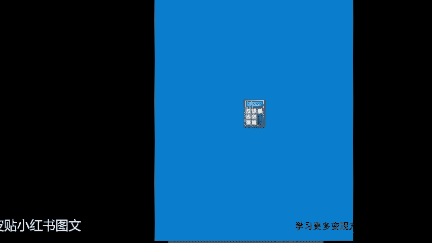
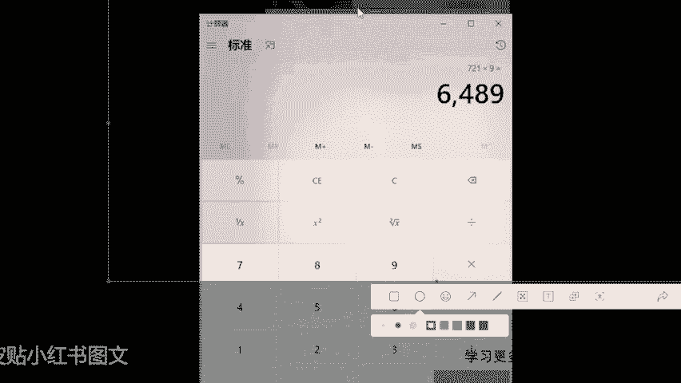
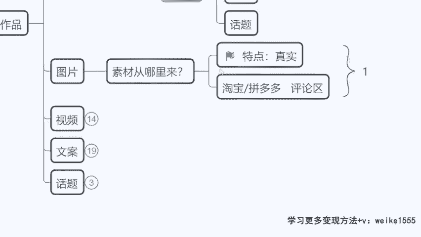
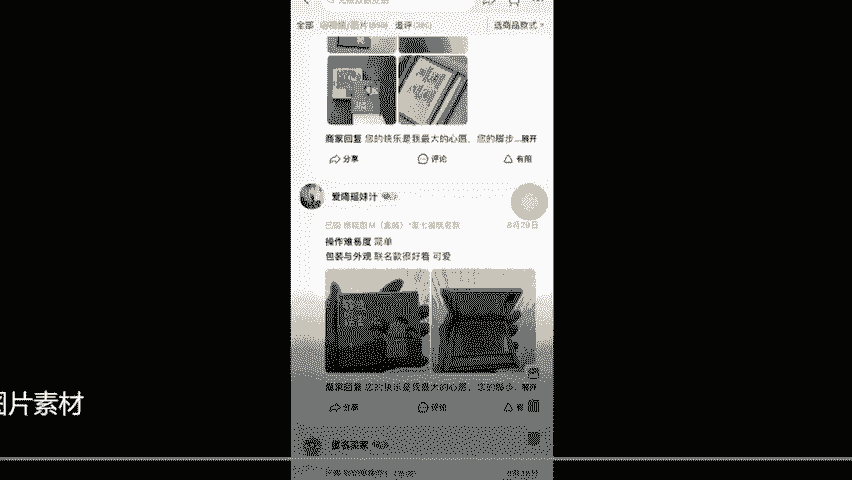
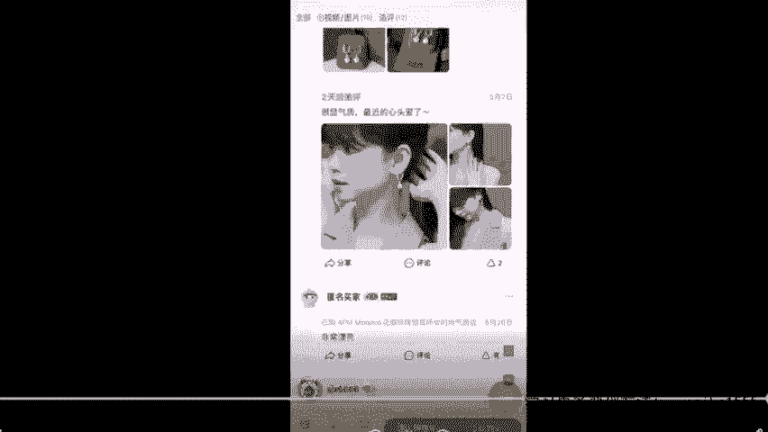
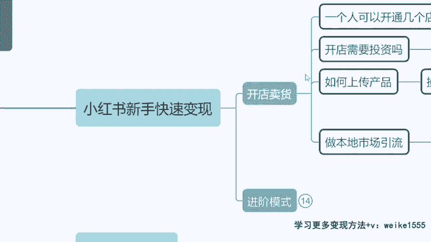

# 【小红书电商教程】B站最良心的最新2024小红书运营全套教程（精华版） - P11：9.作品类型和素材 - 宅舞之韵小使者 - BV1GBvreQEab

咱们怎么去发布作品，我们现在来看一下啊，小红书里面的这个作品类型呢无非就是两种，要么是图片类的，我们刚才看到的基础的这个图片，来给大家看一眼啊，我们再回顾一下这个小红书里面带货带的，像我们来为大家。

我们今天大大学生有没有嗯，大学生有没有，我给大家找了一个啊，我之前一个学生，我挺骄傲的，现在大三在汉口学院，在武汉上学，然后呢他学的是商务英语专业，大三那个学生，他现在每个月靠小红书挣钱。

也是有1万左右收入的啊，有没有大学生有没有想要去增加自己收入，人家现在生活费一分没找家里要啊，所以说我想把它拿出来给大家看一下，但是人家做的作品并不是说很高大上啊，也没有大家想的那么复杂。

我们来看一下啊，来瞧一眼当时他做的是什么内容，做的是一个这个双眼皮贴的一个内容啊，大家来瞧一下他的每张作品都没有那种网红脸，都没有那种非常高大上的那种图片，来我们看第一张卖什么AKF0双眼皮贴，对不对。

他就在宿舍的这个桌上啊，还是他教学楼的桌上，我不知道哪个桌啊，三个双眼皮贴直接放在桌上，排在一块儿，对不对，拿着小红书里面的这个字幕，把几个文字加上去了，然后第二张把几个双眼皮贴带包装的。

放手上拍了一张照片，第三张贴在手上拍了张照片，对不对，来下面啊，给大家来示范了一下，上演的，你说她长得好看吗，普通颜值普通的一个效果，对不对，我这个我这个觉得胖胖的啊。

他有点有点这个胖胖的这个这样的一个长相，然后你看一下他这个肿眼泡，贴上之后效果明不明显，挺好的吧，人不漂亮，但是效果不错，是不是啊，他自己拍了一个这个自己上演的，然后呢找自己的同学拍了一个双眼皮。

不是很明显的，又拍了一个，然后呢又找到这个内双的同学，又给他提供了一个照片，来三个图片是不是都是素颜，都不是美女，都是普通人，但是这个作品带货效果很好，因为小红书追求的就是什么就真实嘛，对不对。

加上这个标题，加上这样的一个文字啊，那么当时呢他卖的这一款双眼皮贴啊，它是单月，你看他那个专属链接授权店铺，看到没有，授权店铺专属链接，单月变现卖了是720一个订单。

那么我们就算他最低的利润啊，因为像有的这个订单。

他一个订单里面会有好几个这个产品同事下单，我们不算其他的，我就光拿这个720一个订单来讲，他如果说每个人就买一个双眼皮贴，那么他就有九块钱的利润，等于说光是最低，他单月就能获得6000多块钱的一个收益。

这只是他这一条作品，更何况他有接别的商单来看到没有，这个收益怎么样，大家觉得啊这个就是什么，这个就是它的一个图文的形式。

对不对，那像这种啊，真实的不需要很美的这样的一个素材，你说老师，但我不可能自个儿去拍吧，啊虽然说他这个做的确实挺简单，但是我也不愿意去拍，那咋整啊，我今天来教大家怎么来找素材，仔细听啊，同学们。

现在我来讲素材怎么去找啊，如果今天我要跟他来竞争。

我也要去卖这个双眼皮贴，那么现在看好了，同学们有一个素材的来源地非常的到位啊，那就是淘宝买家秀，特别是之后如果说来遇到一种情况，比如说我们要去接这个商单，或者说我要去给自己卖货，我卖的是个杂牌。

我卖的是个染发膏啊，同学们，我卖的也许是这个叫做什么ABC染发膏啊，那我在淘宝我压根搜不到ABC这家店是吧，他就是个杂牌，但是我就是得推广，我得挣这个钱呢，那我能不能去搜一个。

比如说欧莱雅的海飞丝的染发膏，我去搜一下他们的使用效果，我把它们的使用效果的图片诶，我拿过来，我就说是这个AABC品牌的效果可不可以，然后呃像这个产品的话，大家是选择囤货在家里还是说直发呢。

看大家自己的意愿，如果说像你去卖袜子，那个袜子呢，你找别人代发一单，可能是五块钱一双，但是如果说你同事批发100双到家里，一取一双才两块钱，然后批发100双回来，就是个200多块钱的一个价格，对不对。

然后再和当地的物流一合作一个订单呢，你就跟他谈嘛，你说咱们这物流费就五块钱呗，不要收什么十二十块钱了，对不对，谈谈物流费用，那你也可以放在家里就囤货，这个形式也行，因为你的利润会更高，但是这个适合什么。

适合家里场地大呃，然后呢包括你时间多啊，再一个就是你的前期的一个储备资金到位的，流动资金到位的情况下，你可以去囤货，但如果说我们前期想轻松一点，不用占用我们太多的时间做副业，然后呢额有钱挣就行的话。

我们就直接找人代发就OK了啊，你不用管物流那些的，都是商家会帮你处理是吧，可以是不是啊，OK可以的，那既然素材我们都是公用的，对不对，那就放心了啊，大把大把的店铺都能给咱们提供买家秀，是不是。

那今天假设我要卖这个AKF的一个双眼皮贴，我就在淘宝直接搜到这家店，我们直接啊杀到他的评论区，我们来看评价3000多条，这对咱们来讲可不是评价这是什么，这是我们赚钱的工具，对不对，来打开评论区。

我们点击视频图片专栏，500多条视频图片在这儿，那么我们就能来挑这些真实的买家秀，作为我们的小红书素材啦，啊那你看一下是不是这么多啊，什么比如说这个双眼皮贴，他那个主图啊上演的效果啊。

你看因为我这个图片啊，我是从手机上录完，转到电脑上，所以说它糊掉了，你们真实看到的这个状态呢，他是很很干净，然后呢很高清的，然后包括你看伤手的这个都有，对不对，每个都有啊，你看包括他的一个这个开开盖的。

一个这样的一个形式，对不对，都能放，都能作为我们的一个素材去用，以及上演的是吧。

然后包括像这个啊，我给大家再讲一个，特别是像饰品类的，那就更好了，如果说像我们之后接到，像这种什么小红书的一个商单是吧，你接到了一个单，是这个PM一个珍珠耳钉啊，那我除了在淘宝找买家秀之外。

我告诉大家还有个方式，在抖音搜一下他那个视频嗯，包括像很多产品在抖音，其实他也有一些网红啊，他要去带这个货啊，但是很多网红呢他去拍这个视频，他会怎么拍，他先给你看一个我非常美的样子。

然后再给你录一个从我素颜开始化妆，画到好看之后的一个效果，是不是，然后在这个时候，你们也可以去剪里面的一些素材，那你看比如说我要卖这个耳钉啊，我们就可以在抖音对吧，我去搜索这个耳环花瓣耳环吗。

PM这个品牌花瓣耳环，我去搜一下相关的视频，那这个时候你会有很多惊喜啊，来我们看一下，来有同学问啊，咱们2号直播间，有同学问老师这个会侵权吗，我跟你们讲一个点啊，同学们。

如果说之后我们要拿别人的上身效果，来作为我们自己的素材去发作品，切记一个点，不要急于全脸，你不能把别人的整张脸，包含他的五官截到你的素材里面，并且说这是你自己本人，那必是侵权的，你侵犯他人肖像权。

但如果今天你看我想要卖的是这个耳钉，对不对，我不要你的整张脸，我就截这么一小部分，你的1/3的脸，加上你一半的眉毛，一半的眼睛，那么我侵权吗，同学们，我侵不侵权，我不侵权，是不是，这做这个图片。

我随便用的，嗯这样是不侵权的好，Ok，这个就能成为我们最后的一个世代上身效果的，一个图片对吧，展示图片好，OK那么除了这个之外呢，我还想要一个什么拆箱视频来，这个就真实了，看到没有这个作品。

到时候我会给大家一个方式啊，就是怎么样把这个录屏当中，包括这个视频，原视频里面旁边的这个点赞这些全部消除掉，包括没有水印，这个视频没有水印，直接是一张完整的这个高清的这个素材，给到咱们都都有啊。

我会有工具给你们来，那么我们看一下到时候我们怎么来做，你看开箱的时候打开之前一张图是不是啊，打开之后啊，端在手里啊，拿起来又是一张图卡，第二张是吧，第三张拆开以后展示图片来，第三张是不是来了。

那么第四张是什么，第四张不就是咱们刚才上耳朵的那张照片嘛，对不对，或者说啊在我们的淘宝买家秀里面，咱们去找一些，你看这么多买家秀好看的能拿来用吧，是不是啊，能拿来用吧，这么多上耳的是不是这么多素材啊。

这些都能作为我们小说素材，是不是来图片就解决了啊，这是我们最简单的去找到，小红书素材的一个方式，那当然后面我们还有更多的啊，还有更多的啊，呃小树开店需要1000粉丝吗，不需要零粉就可以了啊。

零粉就可以了啊，同学们，像这个刚刚大家讲到的什么代发的呀，电商模式这些问题呀，来给大家说一下啊，在这里来享受新手快速变现，我们会讲到开店卖货35个点以及进阶模式，咱们的商单变现都有，我们待会我发货啊。

上传产品需不需要投资啊，对不对，能开几个店啊，在这讲好不好，现在不着急啊，现在不着急问啊，因为现在你们问了的话，我直接就回答的话，咱们课乱了啊。

