# 【小红书电商教程】B站最良心的最新2024小红书运营全套教程（精华版） - P12：10.视频内容及标题 - 宅舞之韵小使者 - BV1GBvreQEab

我们现在图片解决了下一步内容啊，下一步内容啊啊包括视频我也来说一下啊，像视频的话其实不复杂好吧，来我们看视频类的啊，其实像抖音里面的这个视频，像呃抖音里面的视频呢，他他的带货会比较复杂，就那种啊。

家人们今天给大家分享一个超级好用的狗窝，怎么怎么样，对不对，他有他有他有很多话术啊，他就恨不得在一条视频里面，把这个产品所有的优点给你讲干净，讲完整，但在小红书不一样啊。

我们看一个当时小红书在呃秋天初秋的时候，当时卖的一款很爆的千金风连衣裙啊，我们看一下当时这个作品是咋样的，大家看完之后估计都还可能有点无语啊，这都能火好，咱们来看一下啊，在小红书里面啊。

当时比较卖的效果比较好的一个视频。

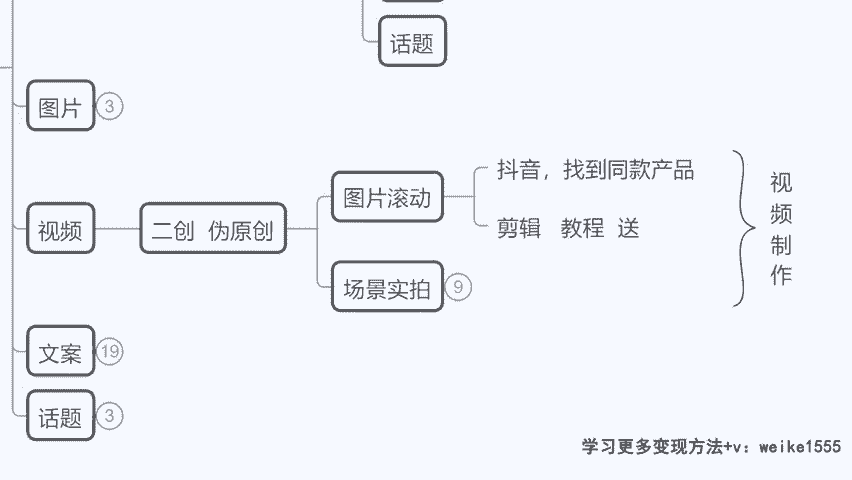

我们来瞧一下。

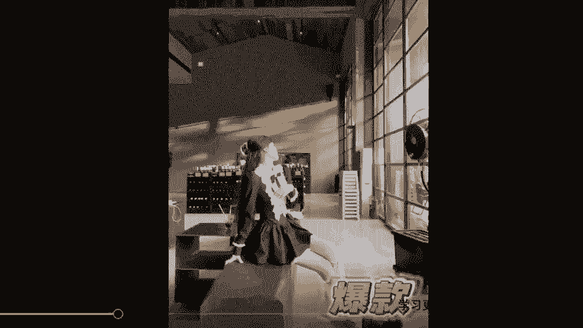

来看到没有同学们这样的一个作品，你会不会做，你今天你说老师，我再怎么不会用剪映这种作品，你总剪的出来吧，对不对，他是怎么来的，在淘宝里面把这个模特的主图啊，在这个拼多多里面找商家。

把模特的主图都给拿到手了，然后呢剪成了一个作品，是不是直接以图片滚动式的，加上爆款两个字，OK一个作品好了，这个产品单月变现是3000多个订单，那你说为什么他卖的好。

因为小红书里面视频的内容它不是最主要的，其实用户呢他看我们的图片，看我们的视频，只是为了知道你是卖什么的，对不对，那么我们只需要告诉他，我是卖这款连衣裙的就可以了，你真正的表达营销的环节在哪里。

在你的文字区域，就是在文案里面，你要介绍我是什么面料，对不对，这是2023年的秋季最新款一个爆款，你要这么跟他去描述，让他产生购物的一个购物的一个想法，对不对，所以说你看第一种啊。

图片滚动式的就好简单啊，如果有同学说老师这种我也不会，这种我都不会的，没关系，到时候我给大家送个剪辑教程啊，实在不会剪辑的，咱们到时候给大家送一套剪辑课啊，因为这个确实不难。

视频制作不是小红书里面最关键最简单啊，最最重要最关键的，然后还有一种就是场景实拍，类似于抖音里面，如果到时候大家想做一些这样的视频，也可以，这种视频我不建议大家直接去自己拍啊，自己拍摄不一定能火。

你不如从抖音去搬运，不如从抖音搬运啊，然后当然这个搬运的话我们不能说，比如说我我给大家举个例子啊，什么叫做搬运啊，为什么要在抖音搬运呢。

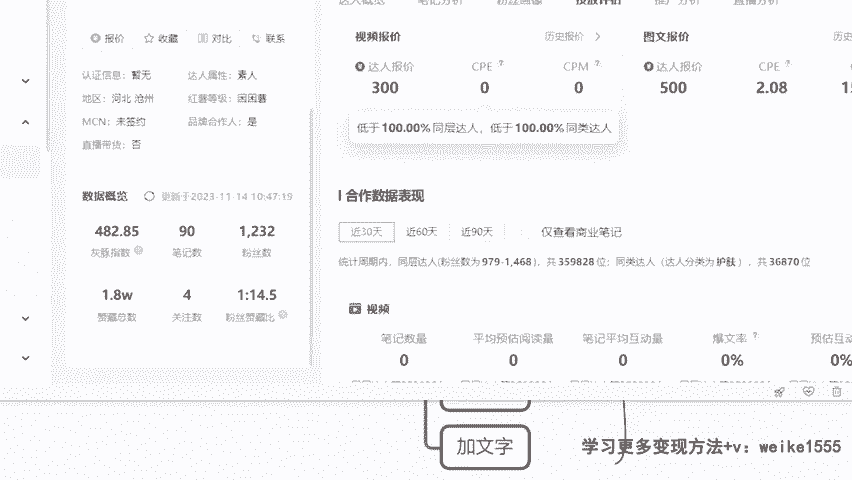

因为像有的时候我们除了发图文之外，也许你想再额外发点这个视频，在引播视频粉的流量，对不对，那么像这种，你看假设我在抖音里面呢找到了一些啊。

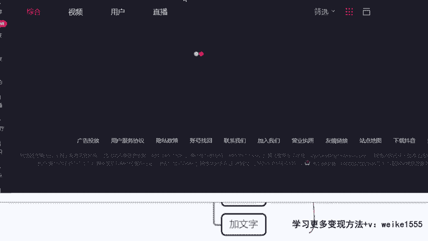

比较还不错的一个视频是吧，就拿这个挑一个啊，这个吧嗯两二十一秒的这个作品，狗窝我一定要推荐给你们，我们家千万去年就在来，就像这样的一个作品对吧，咱们随便挑一个啊，我不管这个视频好不好。

我就随便选一个给大家做示范，那假设我想要搬运一条这个视频，我找到了跟他同款的狗窝的货，是不是好，那么你们记住不要直接去下载。

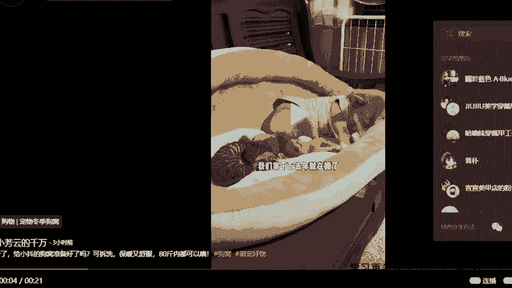

我们去复制作品的链接以后，到时候呢我给大家去送一个工具啊。

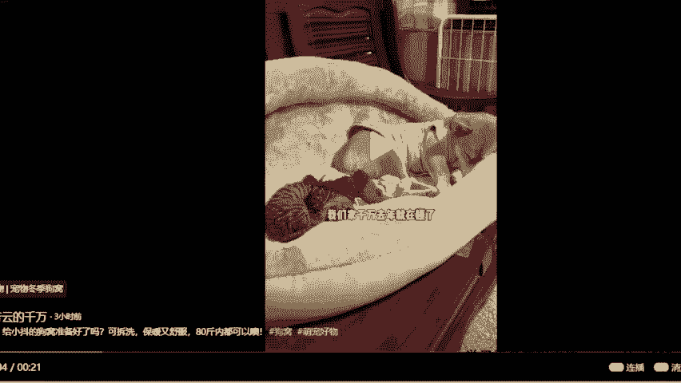

我给你们送一个，在你们的手机里也可以直接使用的，叫做免费去水印的工具，那么你们粘贴这个链接，咱们直接解析啊，两秒钟的时间就能给大家搞定一个左上角，右下角都没有水印的视频啊，这个水一定要去干净啊。

因为咱们在小红书去发，对不对，好，OK水印去好了，下一步干嘛呢，我下一步还得改变视频的代码，因为小红书跟抖音视频它是有查重的，如果发现咱们是搬运的，那么作品会限流，怎么样让平台发现不了。

就是靠NMD5值的更改，那之后呢，我再给大家送一个一键更改MD5值的工具来，记住了啊，也是一样的，微信电脑都能去用，手机电脑都能直接用的，直接改视频代码怎么去做，来有个视频去虫那个效果啊。

你们到时候呢直接把药去虫的一个这个视频，你们到时候呢去导入到我给你们的一个，工具栏里面啊，像点击基础去虫一个智能修改MD5值，智能调色啊，抽帧画面锐化，随机加速这些你给他都勾上啊。

把要选的那个视频给他导入进去，加进去，直接一键就能完成，一键就能完成，到时候我们再到剪映里面啊，你稍微做些什么滤镜那些的修改就可以了，好不好，这样的话，我们就可以在根源上。

把这个视频重复率的问题来解决啊，就不用担心什么限流啊，没有播放量的问题，这个我就简单带过了，听明白了没，这个听明白了没明白了，没下载会有水印，我不是教了大家吗，到时候给大家一个工具，送你们个工具啊。

下载完了以后直接把水印去干净啊，这个是不会有水印的啊，明白了没明白了，是不是这个我就直接过掉啊，因为视频是真不太重要，我们之后啊做这个小红书里面主打的就是图文，我现在跟你们讲讲。

非常非常关键的关于文案的问题啊，文案咱们今天有黑科技啊，今天有黑科技来作文啊，啊其实很多同学会觉得说，哇老师你让我去写那个文稿啊，说实话我真不行，是不是包括让我去写标题啊，那真有点难度，我们看一下啊。

在小红书当中，你想要你的作品脱颖而出，你的这个标题必须得吸引眼球，你们看一下啊，在小红书界面里面，它是很多很多这样的一个图文排在一块儿的，然后呢用户要选择的话呢，要么你这个图片出众。

比如说这个马桶里放了个盘子啊，这个别人就特别想点开是吧，还告诉你这是新款洗碗机啊，这怎么洗碗机，这不是马桶吗，对不对，你就特别想看是吧，还有这种标题，你看来上海新天地我只干三件事。

这种带有那种耐人寻味的，有那种铺垫性的，绝对是个商单，绝对是卖货的啊，绝对是卖货的，还有这边你看像这种其他的啊，嗲里嗲气的蜜桃粉设计师真的很懂少女心，你看像这种标题，它都是精心设计的，对不对。

像这种就是真实分享，收到22岁礼物啦，谢谢爸爸妈妈，对不对好，那你看迪士尼千金为精致出门筹备第九天，对不对，这种也属于卖货的啊，那么像这种但凡是卖货的，他的标题都是精心设计过的，我怎么样在我的标题当中。

能够让用户有购买的冲动呢，首先你得在这个产品对这个产品有充足的了解，你得知道这个产品的关键词，并且呢你得知道啊，我怎么样来写这个文章，怎么样来写这个标题，才会让人被我所吸引，是不是。

然后如果说有同学比较勤奋的啊，我们到时候想要做原创的啊，我就给大家送一个小福利，我们那个万能句式啊，也是给大家总结好的98个爆款文案词啊，啊近期的2000个爆款选题呀，啊。

包括像我们这个每个品类的一个热门的关键词，和它的一个万能句式，如果这个需要的话一样的，咱们扣要字助理老师帮我登记下课，作为福利免费送一波啊，来你看像这种饰品类的对吧，结婚首饰三金啊。

然后这种的话他就一定是个热门话题，对不对，三金怎么买啊，这个然后包括呢像这种，你看像这种健身类的入门新手瘦大腿的，燃脂的瘦身的，对不对，嗯还有呢像这种减脂类的啊，不长肉的运动，瘦肚子瘦腿啊。

来就是它有关键词，那么我们在我们的标题里面把关键词带上，再套到我们的这个模板里面去就比较合适了，你看超火的啊，变白效果，明星同款，马上要学等等，对不对，我们就可以往里面去带啊，好当然那这种模式的话呢。

还需要咱们给我挑，而且很容易撞型，比如说这个话题你用了，万一别人也用怎么办是吧，我们就重复了，没有新意了，我们不是独一无二的平台，就不会优先给咱们去推流了，那这个时候如果大家想更快速。

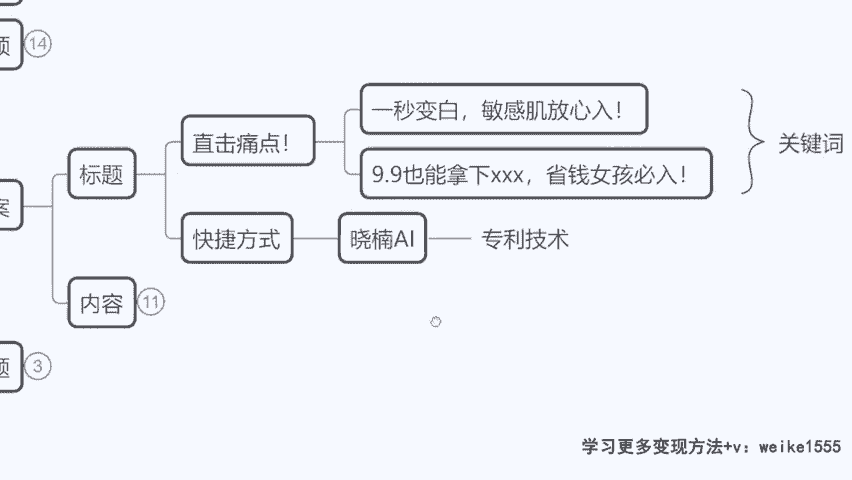

今天我给大家讲厉害的啊，呃这个工具呢咱们今天课程也上了这么久了。

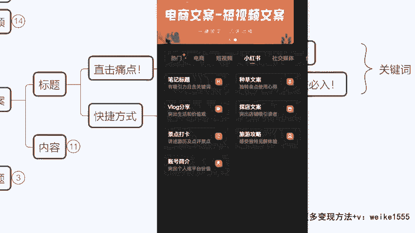

终于啊千呼万唤始出来了啊，他已经等了很久了，这个工具我必须要跟大家讲，但是也强调一下啊，我不是卖软件的，这个软件我们也不对外销售，但是我今天想告诉大家一个快速的，咱们去挣钱的方法，就是拿科技。

拿AI技术啊，大家应该有知道，一个就是国外的这个chat gp t4。0，是不是知道吗，chat gp t4。0版本就是个人工智能AI的啊，这个服务器，然后呢我们是等于说借鉴了这个工具啊。

我们去打造了一个中国版的，适用于中国人做小红书的专用的平台，我们是全网唯一个啊，全网唯一一个，我们现在也在申请专利技术的这个过程里哈，所以说这个工具的话呢，今天也是第一次来跟大家见面。

以往都是我们自己内部在用，但是我想让大家感受一下啊，什么叫做我没有文化，我没有写稿能力，我没有网感，但是我却能够去碾压你啊，来咱们现在看一下啊，假设今天我要写个笔记，标题是吧。

我不懂这个网络的热词是什么，没关系啊，我把这个我的要求给到他来，我现在给大家演示一下啊，大家认真来看有工具有多重要是吧，假设咱们今天接到的这个商单啊，给到我的任务呢，是让我写一个PM的一个珍珠耳环对吧。

珍珠耳钉啊，但是我现在呢不能把品牌写出来，标题不能漏品牌漏了品牌就会限流啊，来OK我就把我的要求写珍珍珠耳钉，是不是啊，要求吸引眼球，看的人得多嘛啊吸眼球，那么这个时候我跟大家讲一点啊。

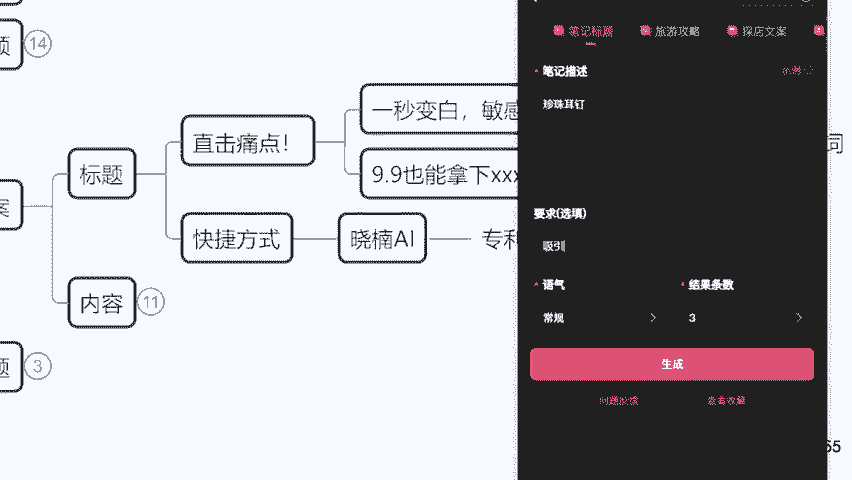

就是你们得知道我要卖多少的一个价格，如果说你的这个产品价格呢，是属于1000来块钱的，不算很贵的啊，不是不是这样啊，如果说是100来块钱不算很贵的，那么我们直接选个轻松，是不是就正常人看了之后。

他有购买力，他能买得起的，OK咱们直接点生成，立马给咱们写，你看耳朵上的小心思，珍珠耳钉的魅力无限，时尚小物不可或缺的选择，珍珠耳钉，对不对，来这种就比较简单的一个标题，如果我对这三条不满意。

我再换一个啊，看到没有一款珍珠耳钉，多种穿搭可能让你的衣服衣橱焕发新生，标题好不好，凸显你的女人味，珍珠耳钉的搭配技巧大解密，是不是轻松搭配，如何让珍珠耳钉给你的造型增添一抹优雅，看到没。

我这个要是再不满意，我还能再重复是吧，没花大钱也能拥有明星范儿，是不是，这标题写的好不好，同学们，说实话，这标题写的好不好，这标题写的好不好，这是什么什么工具，没有没有名字，我们工具没有名字。

他没有上线啊，就是你们现在搜不到这个东西，暂时命名为小男AI，因为这是我自己找的呃，这个团队去做的工具，我们暂时是内部在用，但如果说之后大家是确定你说老师。

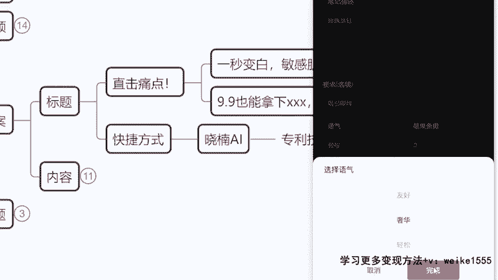

我明天开始，我想跟你去干对吧，我也想做小红书，我要在这个平台挣钱，那这个工具一样会给到大家去用啊，如果我要卖的这个耳钉更贵，对不对，它的价格是1000多，2000多，算是一个小的轻奢品牌了。

那这个时候我们就可以把语气呢改成奢华类的，再生成，它就不像刚才咱们那种那么俏皮了，你看这种语言就会更加的辞藻就更加的华丽了，看到没有，柔媚光芒，如玉般耀目，镀金珍珠耳钉，只为在暗处绽放奢华，看到没有。

立马是不是高大上起来了，这工具好不好用，而且我在讲不仅是笔记标题啊。

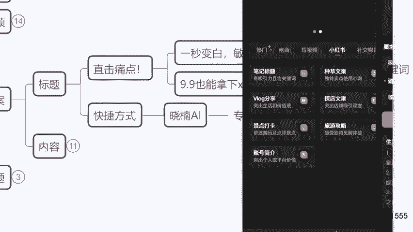

今天我要做个账号简介，我想让我的账号变得更高大上，就是一个专业博主。

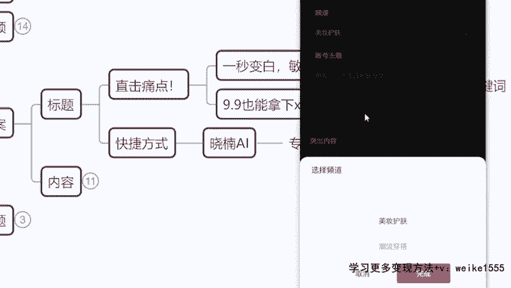

那怎么办，比如说我做美妆博，美妆护肤类的，对不对，我就是一个个人的生活护肤的分享，护肤分享来，我直接这么去写，我突出内容等等啊，到时候你们看自己的啊，咱们今天时间原因，我就随便给大家打几个字。

你们之后肯定是对自己账号的描述，写的越多越好，你得让他知道你到底是干嘛的一个账号，对不对，好点击生成，它就会根据我们账号的主题给咱们，直接生成一个账号简介给到咱们，而且我要告诉大家。

这个工具的厉害之处就在于，今天你刷出来的内容，跟我刷出来的内容是天壤之别，咱们永远碰不到一块儿，但凡是你点了换一换，错过的不要的这个内容它就不会再出现了啊，下一次呢一定是个全新的东西，来看到没有。

这个账号简介是不是就给你写好了，这东西方不方便呢，同学们方不方便方不方便来。

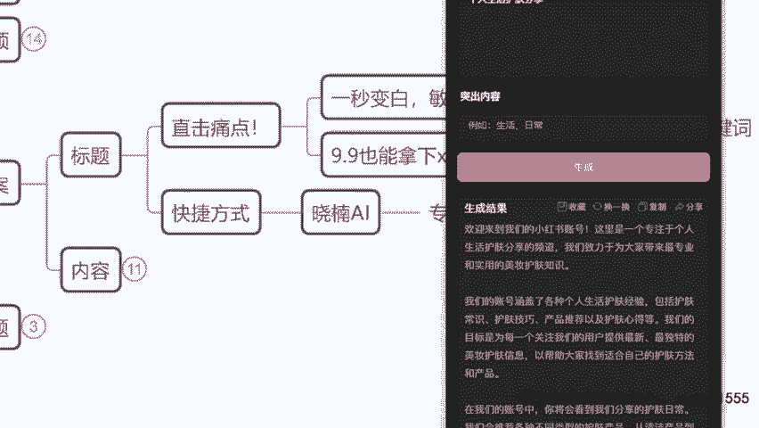

这是标题啊，咱们就先说到标题来。