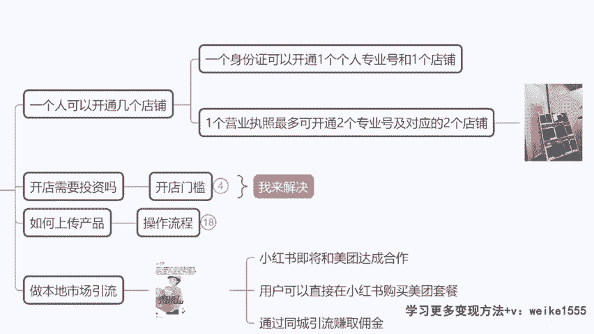
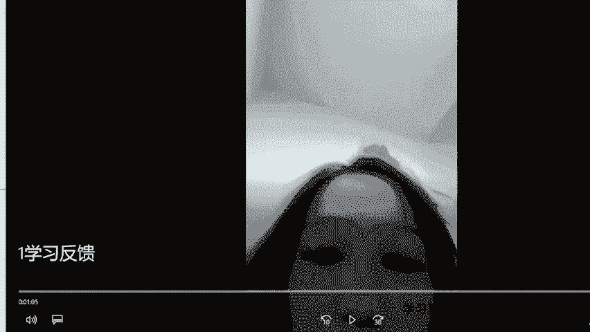
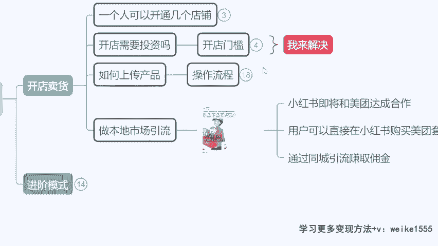

# 【小红书电商教程】B站最良心的最新2024小红书运营全套教程（精华版） - P13：12.小红书开店卖货门槛 - 宅舞之韵小使者 - BV1GBvreQEab

我现在跟大家讲一下，就是我们之后去开店啊，包括我们去做商单的一些细节要注意的啊，然后大家来认真听一下我们变现的一些方式啊，刚才我们也是把这个商单提前跟大家讲了，然后我们现在说一下。

这个关于开店卖货的一个事情啊，开店卖货是零粉丝就能做，开店适合谁呢，开店适合我们之后想稳定的持续的可以去变现，而且想长久的去变现的同学啊，因为电商呢毕竟挣的每分钱是给自己的，你给别人接条广告。

如果说是那种别人给你提供文稿的两三百对吧，你自己去写的呢，粉丝如果说一两千的话，也就是个800~900的价格，如果像达到4000~7000的样子啊，你可能有个1000多，是不是那么呃但是带货的话。

你卖的越多，赚的越多啊，他其实是适合我们想当老板的，各位同学的，你们可以先听一段啊，这看一个视频啊。

这是我们的学生给我录的一个感谢视频，刚好呢他也分享了一些心得嗯，你们可以去听一下他是怎么讲的啊，给大家分享一下，他是在深圳做hr的。

Hello，各位hello，小楠老师，我是赖一家，我之前的话呢都是一直在深圳没有离开过，那我做的工作的话呢，就是hr大家也都知道比较平稳的一份工作嘛，但是确实呢收入也是个问题，它就是比较低的。

而且后面的话呢越来越难做了，所以说呢这才是我选择副业的一个契机吧，那我在6月份的时候呢，就开始跟着小南老师去做小红书，一开始的时候我真的觉得非常的难，因为我自己没有接触过，也没有去做过。

所以我担心自己失败嘛，结果呢我就是听老师的啊，一步一步的去做零粉丝的时候呢，就直接开店了，那我呢是做的卖甲片的一个账号，因为本身小红书的受众群体是女性偏多嘛，第一天呢我直接上了品，第二天就出单了。

那我从6月到9月份的话呢，就已经基本上是体现了有9万多，希望你们也能有一个很好的结果，但是呢千万不要跟我做同样的啊，不要抢我饭碗哦，啊他是我们最早开始去带的小说的一批学生啊。

然后也可以给大家看一下，他当他现在的一个稳定收益情况啊，给大家看一下，这个呢就是我今天的所有收益了，大概是2000多，那我所有的一个利润加起来的话呢，也有个2000出头的样子哦。

啊他为什么他的这个2000多的一个支付金额，利润有2000呢，因为他的产品拿货价才十几，20几，卖89块钱啊，给你们看一下啊，卖甲片，然后他说说哎呀你们不要跟我做一样的，还是可以做的啊。

这个大家不用有压力，甲片的话这个市场的一个竞争不算很大，然后你们到时候去做的话，利润也不会低，你看他卖的89块钱，看到没有啊，69卖了5000个订单，900个订单是不是800个订单等等啊。

这个利润是相当OK的，然后他拿货的话都基本上在拼多多拿货，你看1000多的点赞，1000多点赞啊，然后呢，他的所有的图片素材其实就来自于搬运，拼多多里面的一些内容是吧，你看这个啊。

这款卖的他特他卖的特别好，89那个22块九，那个拿货小红书同款手工定制光疗穿戴甲，看到没啊，就这个的话你们到时也能去做啊，这个利润还是不错的，然后像开店的话，到时候大家先这样啊，一个身份证。

咱们开一个个人专业行业店铺，自己开不了，没事，你找我，我帮你下店，我给大家讲一下开店的一个门槛问题啊，开店要不要投资呢，不要我前面说过了，拿货咱们可以零元购，是不是。

那么现在我来讲一下这个开店的一个问题，因为像有同学，如果说你自个儿到小红书的后台，去申请一个店铺呢，是通过不了的啊，这个平台无问你是否有从业的经验，你是否曾经有过开店的这个呃经验，比如说要拿证明。

你要给店铺的流水呀或等等啊，你说没有，那平台是不会通过你的审核的，因为现在小红书平台有调性，虽然说他要做一个全平台的买手时代，但是他不是说允许啊，咱们作为素人，你也能去开店，他不允许他要的是专业的卖家。

对不对，并且产品的价格等等都是有要求的，咱们就不能卖那些什么特别便宜，一块两块那样的一个产品啊，像拼多多那个价格是不允许的啊，所以说他要审核平台电商经验，那么如果大家到外面去找人，代开小红书店铺的话呢。

价格还比较高，一两千块钱的一个价格啊，所以说这个呢你们就不要在外面找那种不靠谱，还可能封店，如果咱们现在没有店铺的，想要在双11双12期间，对不对，我们把这个店铺开起来的，因为未来活动持续这么长时间。

那么我来解决这个问题啊，到时候跟我讲，到时候如果说你们想开店的话，直接跟我说，我们帮大家去免费去下店啊，因为开店的话我们有这个关系的话，是不用去花钱的，不用去花钱的嗯，开店本来其实就不用花钱。

大家在外面找人开那种1000块，2000块钱的这个开店，那完全纯属是被割韭菜。

