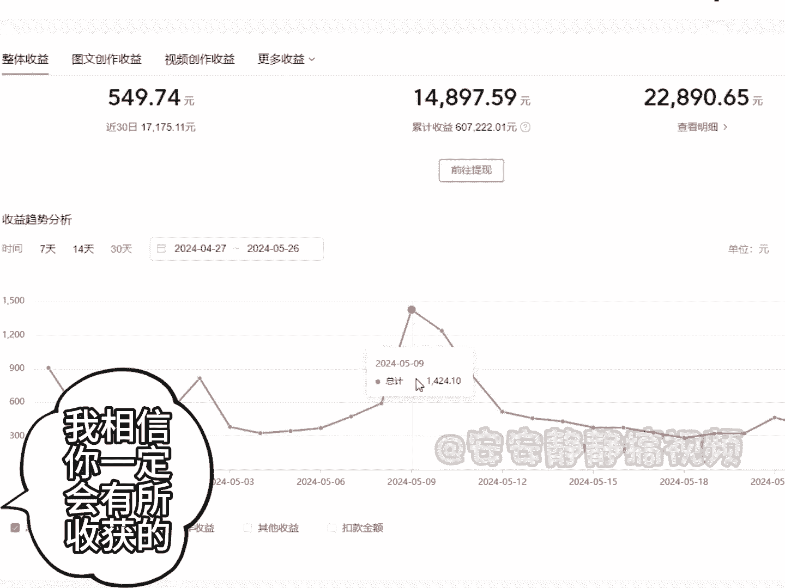

# 【小红书电商教程】B站最良心的最新2024小红书运营全套教程（精华版） - P17：选修 - 电脑极客科技领航 - BV1M4eoeHE5g

我昨天发布了一篇文章，报了能看到99万阅读，然后涨了2000多个粉丝，然后收益这么多，接下来呢我就来详细拆解一下，我到底是怎么样做的，首先我们需要打开这么一款写作工具啊。

打开之后能看到里面的板块非常多啊，功能太多了，应接不暇，然后呢我们直接选择这个头条创作恢复版，点进来，点进来之后呢，然后我们想把我们想要写的文章，标题给粘贴进来啊，点击粘贴。

然后呢这个时候直接点这个AI键生成就行了。

好，那现在呢，这个AI就会帮我们写一篇这个全新的原创文章，这篇文章呢在全世界它是独一无二的，我们可以发布到任何一个自媒体平台上面，不会被平台给判违规，判原创，判抄袭，这个都不存在，写的速度也非常快啊。

而且他图片也给你配好了，你看到，他的这个写作的逻辑，比我们普通人这个逻辑要强很多啊，文章质量要好很多，然后能看到你像这个标签对吧，然后标题这个开头，然后图片配好，那我们想要发布的时候呢。

直接点击复制复制成功了，复制成功之后，我们直接粘贴到这个平台上面去发不就行了，而且我们发的时候，这个文章就不需要你再做出任何的修改了，很方便，那么给大家看一下我其中的一个账号，累计收益是有这么多了。

那么本月的话呢也是有1万5左右了，昨天也是有549，近30天呢也是有1万7000多，所以总的来说还是不错的，可以看到每天的收益都是比较稳定的，可提现金额也有2万多了，这些都是真实的数据啊。

如果你也想通过今日头条来变现的话呢，你可以在评论区给我留个学习，我把我整理的运营教程分享给你，我相信你一定会有所收获的。

接着奏乐。

