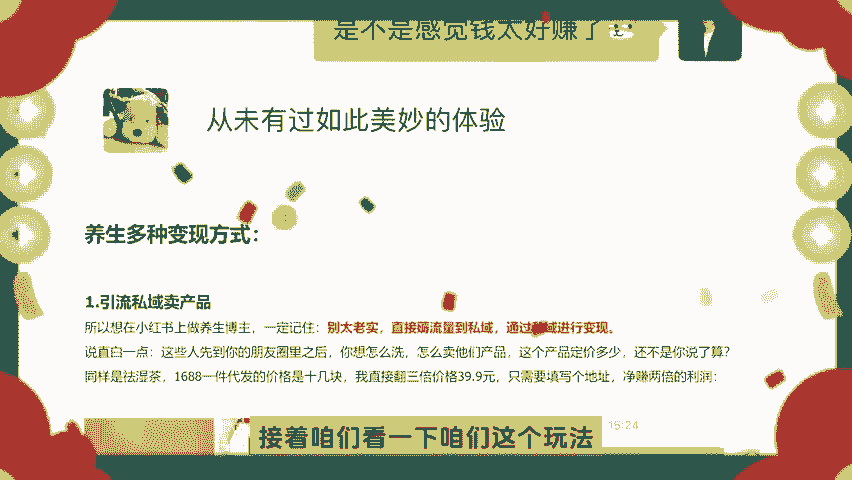
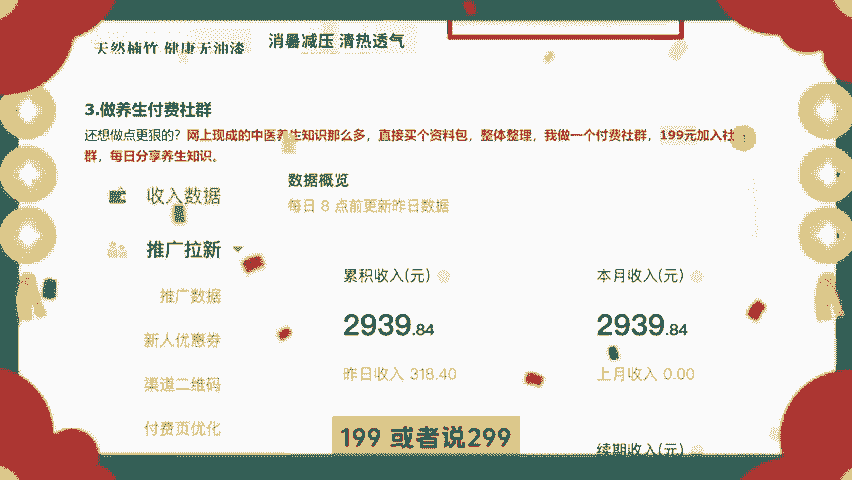
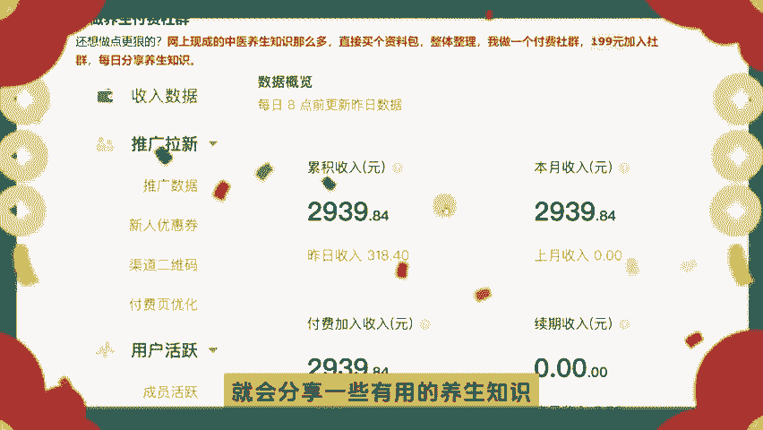
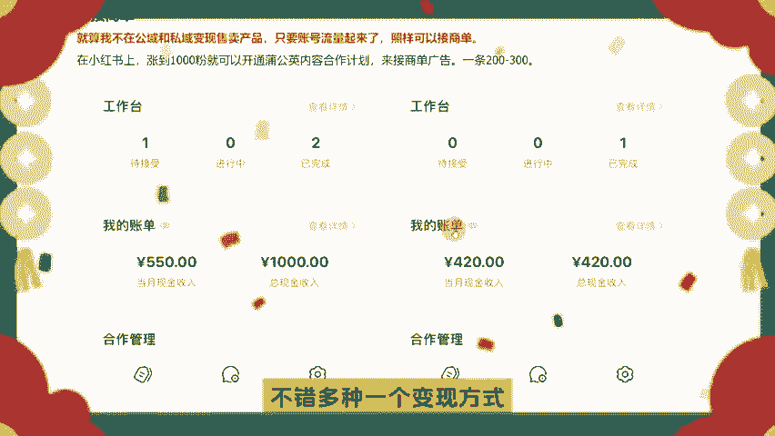
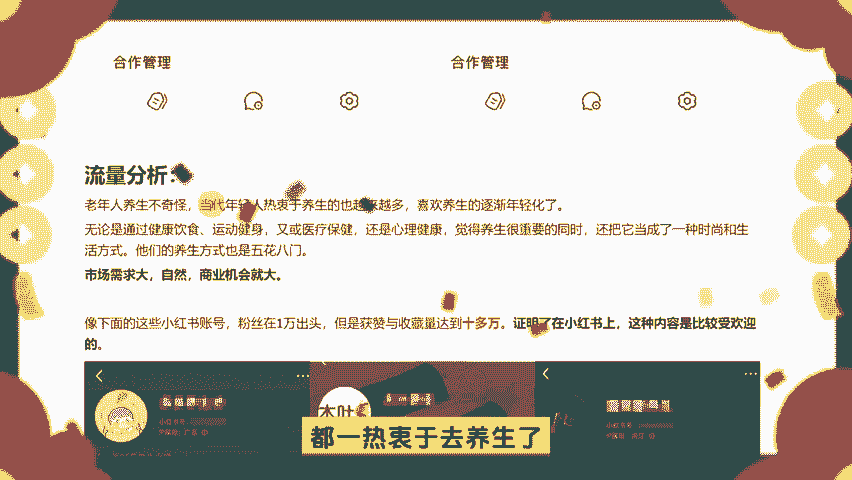
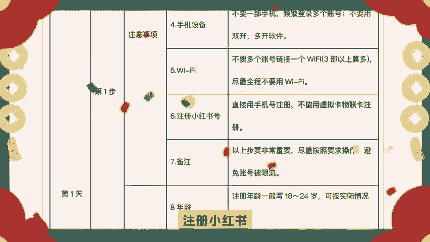
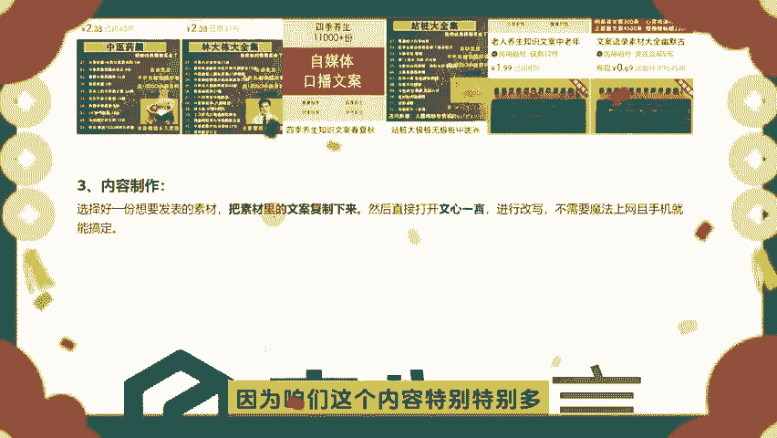

# 【小红书电商教程】B站最良心的最新2024小红书运营全套教程（精华版） - P1：先看案例，卖养生虚拟资料年入50 - 宅舞之韵小使者 - BV1GBvreQEab

我们今天要来分享小红书啊，做一个闷声发财的养生博主，年入50万啊，多种的一个变现的方式啊，首先来看一下咱们这个啊学员啊，也是一个大学生啊，啊他当时呢就是做这个养生的这么一个项目啊。

一个假期呢一天就可以变现3000多块钱啊，从未有过如此美妙的体验啊，真的是特别的爽啊，然后首先看一下咱们这个流量啊，啊这个流量是咱们五一期间啊，总共用了一周左右的一个时间啊，我们在以这个小红书上。

做这个养生博主的一个账号啊，当时呢这是一个小红书养生博主的一个红利期，基本上一周之内啊就可以养号啊，咱们测试的一个数据呢是我们测试了五个账号，其中有三个啊都在一周之内啊，跑出了一个数据。

大家可以看一下这个播放量啊，直接啊6万7000的一个啊，播放量直接这直接一个7万8000的一个播放量，点赞呢也有5000多5000多啊，特别的爽啊，这个播放真的特别特别的高好。

接下来咱们看一下咱们这个玩法。

咱们这个养生有多种的一个便捷方式，咱先把这多种的便捷方式一一给大家来拆解啊，第一个啊就是引流私域啊，来卖产品啊，大家可以看一下啊，咱们在其他产品上的一个其他平台上的一个呃，一个薏米的一个茶啊。

咱们在上面是14块五，咱们一件代发的这么一个价格，咱们在思域上的可以卖多少呢，可以卖39啊，咱们别太老实，直接去薅流量，去到思域，通过私域来进行变现啊，咱们1688啊，十几块咱们直接卖三倍的价格。

直接卖39块九啊，咱们直接去填写个地址，直接啊净赚两倍的一个利润啊，同样是下一个产品，就是啊泡脚包啊，咱们一件代发的价格更是只需要几块钱啊，呃3。76啊，到四块，特别特别的低啊。

然后咱们稍微啊找一些包装好一点的泡腰包，咱们往外卖卖多少钱的，卖几十块钱啊，咱们卖九块钱，卖48块钱，这个利润可想而知啊，非常大，思域呢一个好处就是你想卖多少钱，你随意的去定价啊，只要说不是太离谱。

咱们都能卖得上去啊，只是说你把这个产品的价值塑造到位啊，大家也不要觉得这个有点离谱啊，这很正常，做私域一般都是这样啊，然后第二个呢就是小红书开设店铺，一个卖货啊，咱们直接省去了引流的一个麻烦。

直接去开店去卖货，可以最快的承接咱们这个流量来进行变现啊，卖货就是最离钱最近的一个方式啊，离钱最近的一个方式，大家可以看一下啊，这个账号呢就有1万多的粉丝啊，有15。7万的一个呃。

点赞咱们店铺呢直接去卖一些啊这个产品啊，这就是养生的一个产品啊，销量特别特别的可观啊，咱们分为两个店铺类型，一种是个人店铺，一种是企业店铺啊，个人类型的一个店铺呢需要开通这些啊，大家可以看一下。

具体根据咱们这个文档来操作，就可以了，还有一种是企业的一种啊，店铺号啊，分为普通的旗舰店和专卖店和旗舰店啊，名称是什么什么什么，对不对，还有他的保证金啊，还有什么啊，一些服务费啊。

都给大家讲的很清楚好了，接下来呢咱们第三种变现方式啊，这种第三种编译方式呢有很少人去想到啊，知道的人很少啊，咱们如果说做点狠的啊，咱们可以网上去买一些中医养生的一个知识啊，比比如说一些资料包啊。

咱们把它整理好，做一个付费的社群，咱们可以设置价格199，或者说299或者说99啊。

加入咱们的一个社群，社群呢就可以分享一些养生的知识啊，咱们这个呢就是知识星球啊，大家如果说在互联网上待的时间比较久的话，应该能理解知星球，咱们就是创建一个星球，咱们成为这个星球的一个星主啊。

咱们放一个二维码放到朋友圈，或者说公众号的一个链接啊，咱们引流过来呢，他们有兴趣对咱们这个资料感兴趣的话，他们就会付费加入咱们这个圈子啊，咱们这个圈子里呢，就会分享一些有用的养生知识啊。

他们就会在里面学到咱们分享的这些知识啊，这个养这个资料包啊，都特别好整理，直接去啊，网上去买就可以了，特别简单啊，比如说拼多多呀啊，比如说嗯淘宝呀，对不对，某宝呀，或者说在闲鱼上去买一些这种资料包。

咱们每天往自己的圈子里面复制粘贴，分享一些知识啊，特别的简单，第四个呢就是接商单，如果说我们既不想在公寓去开店铺，又不想在私域去卖产品，但是啊只要说咱们的账号的流量起来了。

咱们照样是可以来接商单一个挣钱的啊，在小红书上呢涨到1000粉丝啊，就可以开通这个蒲公英内容合作计划，来接商单了，咱们啊一个广告的话，一个商单就是200到300块钱的一个利润啊。

大家可以看一下这个收入啊，这是刚开始的一个收入啊，特别简单啊，两条呢就有一个对吧，1000的一个收入啊，这里一条呢就有一个400多的一个收入啊，如果说我们不想卖东西的话，也可以接商单。

如果说我们想卖东西，也可以在卖东西的同时啊，来咱们这个接商单，特别的啊，不错啊。

多种一个变现方式啊，然后咱们再来看一下流量的问题啊，中老年人啊养生是不奇怪的啊，咱们当代的年轻人呢，现在都有很多人都一热衷于去养生了啊。

然后养生呢是越来越年轻化的啊，无论说咱们这个健康饮食，还有这个运动健身，还有医疗保健，更是心理的一个健康啊，所以说大家现在养生都特别特别重要啊，把它当做一种时尚的一种生活方式啊。

而且呢它这种市场需求特别大，而且商业机会也更大啊，像下面这些啊小说的账号粉丝都在啊，1万出头啊，也证明了这种养生的知识啊，在小红书上是特别的受欢迎的，大家可以看一下3。6万的一个点赞量啊，1。

4万点赞量，2。5万点赞量啊，3。7万，1。4万，1。2万都特别特别的一个受欢迎啊，看下1。2万的一个粉丝啊，1万的粉丝，1万的粉丝啊，这个就是他在这里一个带货的啊，带货的一个引流的方式啊，好了。

咱们可以看一下它这种一个啊类型啊，展现的形式，一种是土味笔记啊，可以养生，可以推荐一些养生的饮食啊，或者说养生操，或者说睡眠质量的一些内容啊，可以简单的先看一下他这种的一个展现的形式。

其实这种展现形式呢我在一会儿啊，在下面的啊整理的文档里面，也会给大家讲的非常清楚啊，可以看一下他这种流量真的是特别特别的高啊，特别特别的夸张，如果说我们报了一条，起码有个大几千或者上万的一个变现的收益。

其实我们要把刚才我们分享的那几种，变现的方式全都利用起来啊，可以做一种也可以做两种，也可以全都做，如果说全都做的话，就是布局的比较多啊，就会更累一点啊，但是啊我们把这个布局好啊，就会非常非常的香。

然后专注去做流量就可以了，还有这种大家看一下啊，近视养生一个建议啊，这种属于分享型的，不管是啊点赞评论还是收藏还是转发啊，流量都是特别特别的吃香啊，接下来呢就是咱们的实操项目，实操的一个部分啊。

第一步啊，首先我们要准备账号啊，准备账号呢我们啊不要使用老号，尽量使用一些新注册的一些新号啊，咱们在操作的过程中啊，注册的新号的过程中，一定要使用正规的三大运营商的一个正规的呃，正规的一个卡。

比如说联通移动电信，对不对，我们不要使用一些啊，不是三大运营商之外的一些卡啊，比如说广电啊，比如说一些其他的啊，咱们要保证一机一卡一号啊，要用数据流量来操作啊，不要使用WIFI。

因为在同一个WIFI下面，多账号操作容易被限流啊，容易被判定为营销账号啊，就是说如果说我们其中啊，无线下面有其中一个啊，他这个账号被违规了，被限流了啊，咱们其他的一个账号呢。

就可能被牵扯一些连带的一个责任啊，其他账号也会受一张影响啊，啊咱们这个图片呢就是一个详细的一个，小红书的养号的流程的图片，非常非常的详细啊，这个图片呢可以说是小红书啊，做起来的一个成功的一个密码啊。

只是说把账号养起来之后，我们把内容再做好，我们这个小红书是必定啊，90%以上的几率是可以做起来的，首先看一下啊，他这个养号的逻辑，不管说在这个账号上面啊，微信号上面，手机上面手机设备还有WIFI啊。

注册小红书啊。

备注还有各种啊绑定身份信息啊，还有一一种刷内容啊，日常怎么刷呀对吧，怎么养成一些刷小红书的一些习惯呀，对不对，还有这些啊，第一天怎么办，第二天怎么办，第三天怎么办，对不对，说的特别特别的详细说啊。

咱们直接去设置好，咱们根据这个步骤呢啊养好咱们账号之后呢，咱们设置账号的一个资料啊，就可以参考一些对标账号就可以了啊，下面的素材咱们就怎么去找啊，在拼多多啊，闲鱼啊，相关啊咱们也可以加上那个淘宝啊。

都是非常非常的好的，也是很便宜的啊，几十块钱，几毛钱，几块钱，几毛钱就可以把这个资料啊，既可以把它放在我们的一个呃社群圈子里面，又可以把它买过来之后，当做我们创作的一个素材。

又可以当做我们引流的一个钩子，又可以当做我们私域售卖的一个产品，所以说这个首先啊我们把这个资料啊给搞搞，全搞好啊，啊接下来呢内容创作啊，因为咱们这个内容特别特别多啊。

就是创作内容，包括创作内容，包括怎么去啊制作，包括怎么用AI去写文案啊，特别特别的详细啊，如果说想要咱们这个完整的一个资料啊，哥一姐小红书实操直播教程，评论区留言，红书电商我分享给你好了。

本期视频啊就讲到这里啊。