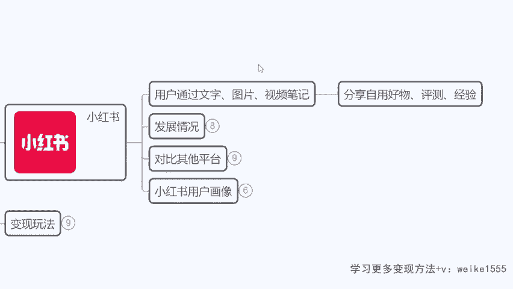

# 【小红书电商教程】B站最良心的最新2024小红书运营全套教程（精华版） - P3：1.小红书介绍 - 宅舞之韵小使者 - BV1GBvreQEab

你们要知道一点啊，双11已经过去了，为什么我这节课我挑在双11之后再讲，咱们今天有很多同学等了一个礼拜了，才听到这节课，对不对，当然也有这个运气比较好的啊，刚好加到助理老师诶，推进课堂了，为什么呢。

因为我跟大家先讲一下双11呢，它是一个品牌特卖活动，就等于说它适合的是旗舰店，但是为什么今天咱们讲这节课呢，是因为现在我们为双12或者说为圣诞节，为跨年，为年货节，为这个情人节来做准备。

我们现在是最好的时机，因为接下来全部都是普通店铺的狂欢节了。

对不对，那么从现在开始啊，小红书呢专门召开了新闻发布会啊，他讲到了一个话题，我来给大家瞧眼啊，大家可能平时关注新闻比较少，然后包括特别是看小红书相关的信息，应该很少对吧。

偶尔呢我们都是了解一下抖音啊等等啊，平时没事也刷刷抖音啊，啊对小红猪的一个商业价值了解的不是很清楚，来咱们看一下啊，当时呢这个小红书的CEO就讲了这么一句话，他说希望每一个热爱生活的人。

都可以成为小红书的买手，啥意思，小红书要转型了，我们回想一下啊，以前你们在用小红书，大家平时用吗，平时用不用，大家以前在刷小红书，有没有发现老刷到一些名牌啊，什么LV的包，香奈儿的包包，对不对。

各种什么留学生的国外体验啊，什么五星级旋转餐厅啊，这个呃大型的这种非常豪华的下午茶，是不是老看这种玩炫富的很多，对不对，然后包括呢推荐的一些品牌也是高端线的，像女装之前推荐的什么拉菲me。

3000多块钱一条裙子，包括什么输出头设计师款，对吧啊，之前我们看到基本上大牌，然后但是从去年开始啊，从去年我们就可以看到一些二线品牌，比如说像这个什么阿迪达斯啊，耐克啊，就这些更亲民的品牌出现了啊。

包括什么MOCO啊，然后还有呢像什么太平鸟这一类的啊，就慢慢有这种品牌浮现，再到今年开始又变化了，像你们看到的79元的眉笔花西子是吧，然后呢包括什么呃这种女装啊，这个女女女的女生的这种美妆类的。

像这个嗯完美日记就这个档次的诶，他开始出现了，就是小红书慢慢在转型，他发现啊，如果他单纯的只是挣这些大牌的钱，挣不着钱了，那他开始想要去借鉴抖音的形式，把小红书打造成一个全新的电商的购物平台，是吧啊。

我相信大家应该这个都都是有多少有了解的啊，你发现小红书慢慢的有一点变味了，是不是以前小说里面是单纯的分享好物，但是现在不仅分享好物，他底下还给你带个购物车，嗯我分享给你的话，你得买啊，是不是。

然后包括你看这个啊，小助理一个助力百万买手计划，也就是说现在平台给到了所有的新的卖家。

1000亿的流量扶持，专门为大家给大家提供双12，然后呢包括像我刚才讲讲到的，咱们的圣诞节啊，跨年夜，然后呢像年货节以及情人节来做一个铺垫的，那么现在我们去做店铺，一切都还来得及，我们去做电商也好。

做商单也好，一切都还来得及，现在是最好的时间啊。

大家都明白了啊，这就是小红书，为什么今天我们要讲这么一节课，我来鼓励大家做小红书的原因是吧，那像大家平时有用小红书应该知道啊，小红书现在它其实对于所有的年轻人来讲，他已经是一个非常呃。

让大家心里根深蒂固的一个这种哪种呢，就是分享日常啊，然后包括啊这个去看一些，这个等于说是笔记或者说测评啊，经验呐啊种草啊这样的一个平台，比如说我今天我想买一个这个婴儿车，对不对。

我不会想着说我去淘宝直接搜婴儿车啊，我会怎么样，我会先上小红书，搜一下哪款婴儿车更适合三个月大的宝宝，是不是更适合十个月大的宝宝，我会去这样搜看有没有推荐，我到了一个城市，到了长沙，我不知道该怎么玩啊。

我不会去问一个长沙人，我会先打开小红书搜一下这个小红书，长沙的旅游攻略，对不对，那么这个平台啊，他已经有了一个非常好的背书，前期的流量的累积，包括整个平台它的一个他的这种人设，拿捏的非常的到位。

就很多人会下意识的觉得，这个平台就是一个很真诚，在分享好东西的平台啊，那所以说很多时候你往往会忽略啊，原来它是个广告。

对不对。