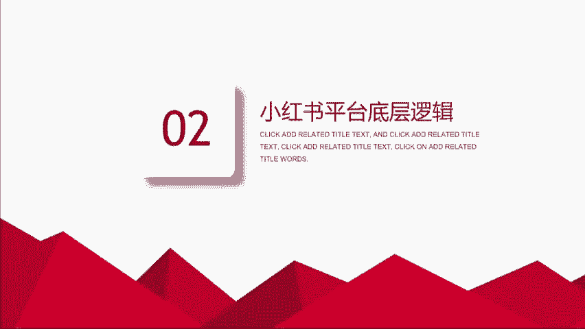
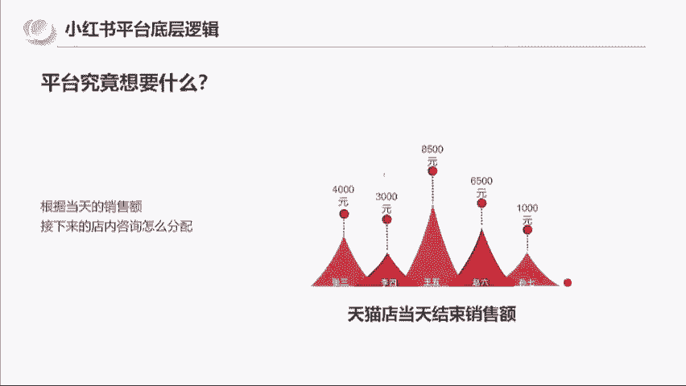
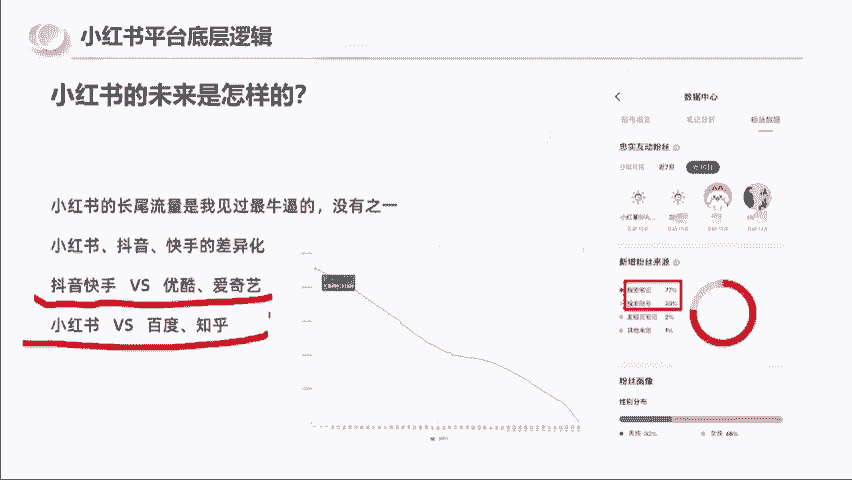

# 【小红书电商教程】B站最良心的最新2024小红书运营全套教程（精华版） - P3：3.小红书平台底层逻辑 - 电脑极客科技领航 - BV1M4eoeHE5g

那小红书平台的一个底层逻辑啊，就是我在做小红书平台的时候的底层逻辑，首先我们去做一个东西，一定要了解一个平台，他要什么平台要的东西。

你给他，他自然就给你流量，那么我想问大家一个问题啊，假设现在你们啊是一个开淘宝，开天猫旗舰店的，现在你手下有五个，有五个客服来回复这个客户的咨询，你店里有2000，现在每天有2000个咨询啊。

你会怎么去分配，是平均分配2000个除以五个人，每个人平均分配400个，还是怎么分配，还是说不平均分配，你们可以告诉我吗，你们思考一个问题啊，现在你们的身份是天猫旗舰店的一个老板，你有五个客服啊。

然后有2000个客户咨询你们怎么分配是吧，所同学很配合啊，说的是平均分配这个其他的啊，其他的朋友啊也可以啊，继续去多互动，因为我知道你们的水平，就决定了我后面讲的一个东西的重点和速度啊。

有人说不理能下单的不会多问啊，这个兄弟你在跟我开玩笑，你一个开天猫旗舰店的，你说2000多个客户咨询，你有五个客服，你跟他跟我都不理啊，有人说按需求比例，有人说按能力分配，有人说平均分配好的。

那如果说这五个是新人的话，那基本上来说的话，第一轮肯定是先平均分配，但是你们往后走，你们会发现一个结果，就是每个人的能力是不一样的，那我们可以看到那通过一个星期的数据下来，那我们现在发现了张三。

他的成交是4000块钱，李四是3000块钱，王五是8500块钱，赵六是6500，孙七是1000，我想问一下你们，接下来你们准备拼怎么分配呢，我相信啊，假设你们是一个老板的话。

你们是不是会希望王五能够拿到更多的客户，因为晚五的销售额是8500元，他是张三对吧，和李四的double，所以这就是我们啊。

假设我们开店的一个商业逻辑，那到了小红书平台，你们就去思考小红书平台，其实对于小红书而言，我们他手上拿到的东西是什么，他手上拿到的是访客对吧，我们打开手机变成访客了，然后呢他手上会有多少呢。

会有新增笔记，那你觉得他分配比例怎么分配呢，他就像我们去开店铺一样，他前期比如说我们现在同一时刻，这一分钟有500篇笔记，新的诞生了，他一定是给这500篇笔记啊，一个平均的一个初始流量值。

然后通过初始流量值的一个数据表现，再次再去决定二次分配和三次分配，所以那我就想问一下大家，第二个啊，问题就是小红书平台他最想要的东西是什么，你们有想过吗，是用户停留还是新增还是成交额。

你们可以在评论区啊，可以在评论区告诉我，你们觉得小红书平台最希望要的是什么，我来看一下啊，这道题，这道题挺有技术难度的，所有打停留的啊，停留的是正确答案，停留的是正确答案，因为我现在用的词是什么。

是最希望要的是什么，为什么我告诉你用户停留是最关键的啊，因为不管是小红书也好，抖音也好，快手也好，微信也好，他们都在干一件事情，就是要争取用户的时间，为什么，因为你后面所有的成交额，你的这个电商的变现。

广告的变现都是要基于用户在使用你这个软件，包括你们所说的用户新增新增看上去很重要，但是你要明白，当我们愿意用一个app，愿意一，新增只是早和晚的问题，如果一个app你一天只用2分钟。

或者说你一个星期你都不想打开一次，你觉得这样的新增有意义吗，所以我们就想到以前是吧，我们以前看电视的时候还记得吧，以前电视台的核心关键数据是要啥，是要收视率，对不对，收视率电视台有了收视率。

他就可以去插播广告植入对吧，可以接一些大品牌的一个广告，所以对于这种平台也好，其实不管小红书抖音，微信淘宝，他们都是希望有用户停留，有用户停留才有一切可能，那么这里又有一个问题，就是我们希望用户停留。

那就需要有好的内容让用户去停留下来，但是小红书的平台它是一个机器，如何让机器去判断内容的好坏呢，啊我们都说内容为完，你们有想过没有，如何让机器去判断这个笔记的好坏呢，如何让机器去判断比记的好坏。

机器一篇笔记灌输下去，其实它是没有办法啊，算法，机器是没有办法完全去识别出内容的好坏的，它只能通过一些数据，所以我们能够看到的，点赞收藏评论转发这四个东西，其实就是一个用户的反馈，对于机器而言。

系统推荐两篇笔记啊，A笔记和B笔记各500个报关，A笔记获得了100个点赞，B笔记获得了十个点赞，那机器就有理由判断A笔记更受用户欢迎，能理解吧，我相信你们都能理解的好，所以说整个来讲小红书平台。

它其实就是基于用户停留的需求啊，用户时长的需求，通过机器去判断你的内容是否是用户喜欢的，能够让用户留下来的，因为我们自己是不会在我们不喜欢的内容，去浪费时间的，所以那整个来讲的话大的方向啊。

我跟大家分享一下，就是小红书平台现在有哪些红利呢，第一个是流量红利，因为小红书目前的月活应该是两个亿左右啊，我估的，然后23年刚刚上线了网页版，这个流量红利就意味着说。

如果小红书未来的月活能够在接下来23年，24年达到5亿的话，它有两倍的流量Buff，就是你做相同的事情，它是有两倍的流量Buff，如果小红书能够到7。5到八页的用户，用户就有三倍的Buff。

是你做相同的事情，这也是为什么我会去在119年去做抖音，我们做一一抖音是19年6月份，我做小红书是21年10月份，我永远因为作为一个老互联网人，我永远是要抢平台的前瞻视角，前这个流量加成的。

所以说抖音我我们现在有在做，我们还会接下来还会去做，但是现在的抖音的流量已经见顶了，所以我们其实早做和晚做同样的一个项目，差距不大了，没有流量红利了，那第二个点我们讲的是素人红利。

就是小红书平台对于素人笔记的，其实是很友好的，而且最近小红书平台，他把这个广告的门槛从1万粉下调到1000粉，也可以开通，这是你能感受到，他不是去捧这种大博主的一个心态，第三个叫搜索红利。

就是笔记在小红书的笔记，他可以获得长期且持续的搜索访问量，3000小眼镜的笔记拿到100万小眼镜，这是我实际的我的后台数据，这个等下你们后面呃可以给大家看一下啊，第四个就是电商红利。

小红书今年对于电商有很多的动作，类似于早期的小红书的推出，包括最新拿到的信息，小红书的这个本地团购也在内测了，就是你通过笔记可以直接上架，本地的一些优质商家，所以我觉得就是说对于一些小白而言啊。

你这一次可以把你的目标定到，你知道怎么样去做内容，做有效的内容，然后电商这个东西，你可以就是说你不要把自己的要求拉太高啊，在这一次因为后面还有本地团购等着你，这个你们可以看一下，我有一个习惯。

就是我会统计我每一篇笔记，每一天的一个最后的一个数据，这一篇的话是截取的一个曲线，它是从这应该是几百的播放到了几万的多播放，而且这张图是我应该是去年截的，现在应该还是继续往上走的。

这个我没有去拿数据最好的图片，所以说小红书最牛逼的地方是什么，就是它的长尾流量是我见过最牛逼的，长尾流量是我见过最牛逼的没有之一，包括你们可以看到右边啊，他的搜索我的笔记，我的搜索量是77。

所以都是搜索进来的，搜索进来就越的精准，那么总总结一下就是小红书平台快手，他们的差异在哪里呢，快手抖音啊，我觉得他可能更倾向于之前的优酷，土豆是用户一个欣赏观看视频的一个工具，而小红书呢。

它有点类似于百度加知乎的一个结合体，我们在百度可以查到怎么去，一些比较啊更深入的东西。

比如说IPHONE怎么去拆机，而小红书它有百度加知乎的一个。