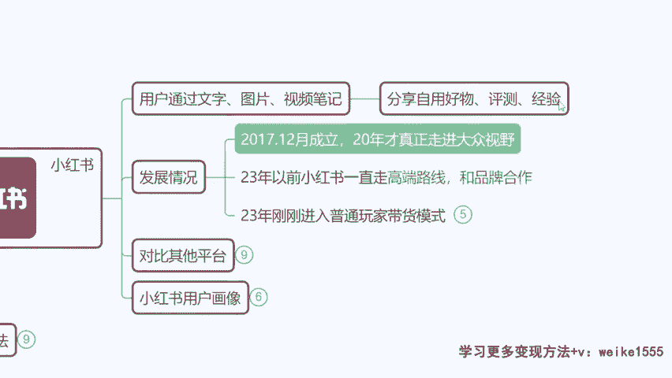
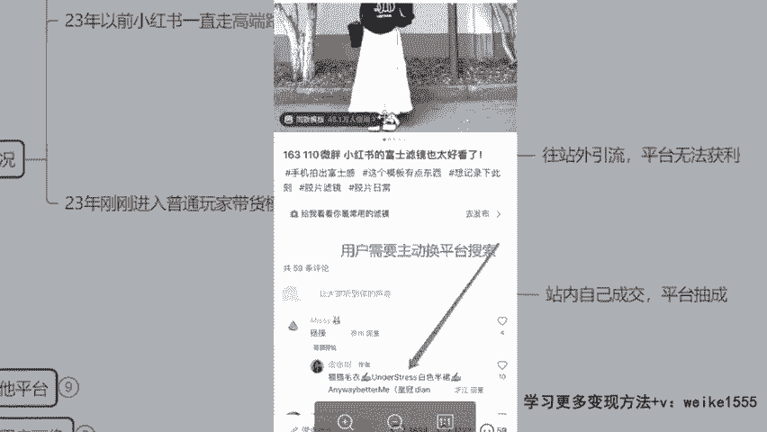
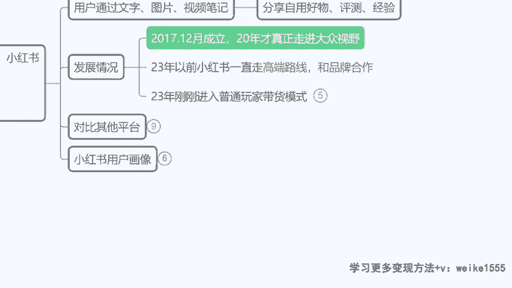
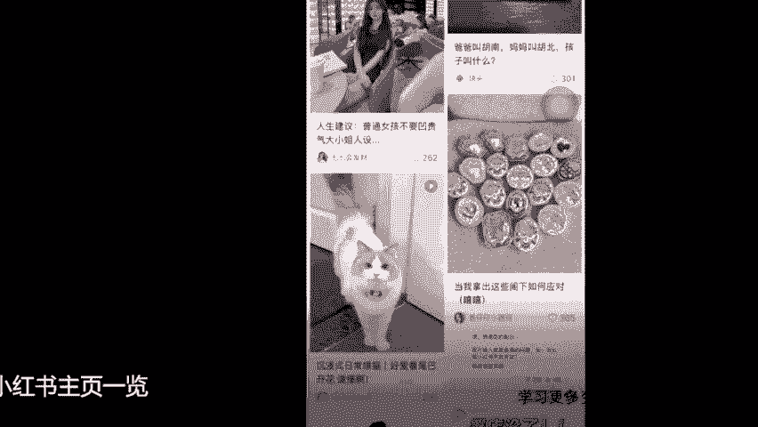
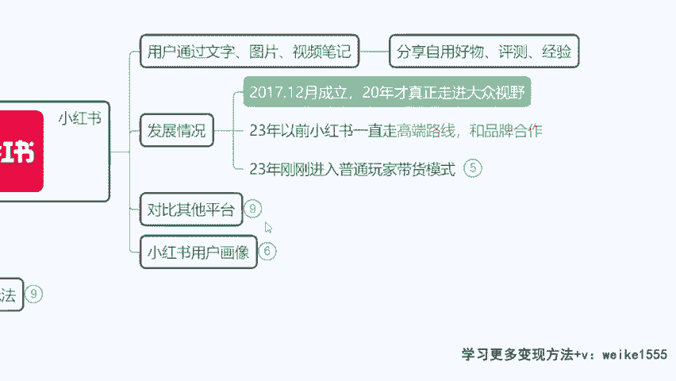

# 【小红书电商教程】B站最良心的最新2024小红书运营全套教程（精华版） - P4：2.小红书发展情况 - 宅舞之韵小使者 - BV1GBvreQEab

啊那像刚才我讲的小树，其实他很早就有了，20年真正进入大众视野之前。

一直走高端路线，所以说小红书一直以来呢他挣不了多少钱，来咱们看一下以前小红书的模式啊。

为什么现在我们有机会作为一个普通人，我没有产品，不会视频剪辑，我都能在小红书挣到钱，而且挣的还不少，原因在哪，来我们看一下以前小红书的模式啊，如果今天你对小红书里面的某一条裙子啊，你觉得我比较感兴趣。

对不对，我想买，那这个时候你看之前在没有电商平台，没有电商化时代的这个小说的时候啊，当时怎么样的，你看，用户要买是吧，商家怎么回复，你去淘宝搜这个皇冠店铺什么，On the stress，白色连衣裙。

对不对，自己去搜这个猫猫毛衣啊，然后呢那你看小红书它提供了一个流量的平台，提供了一个媒介，给你提供了一个打广告的通道，但是呢你跑到淘宝去下单了，小红书分文不正对吧，就是陪伴啊，然后钱都被淘保证了。

所以说小红书要不要转型要啊，在今年开始呢，你看小红书现在的模式就是直接字莹啊，自销了，如果你对这样的一个抓夹，你觉得哇好漂亮对吧，我也喜欢好，那么最下面它会有一个类似于小黄车的啊，直接购物的通道。

对不对，你看购买同款，28块九点进去之后直接进入购买界面，那么你可以在小红书里面直接购物了，那这个时候对于小红书来讲有什么好处呢，假设这个店是你开的对吧，这个产品是你上传的，那么今天你挣了钱。

但凡我们挣的收益啊满了1万以上，那么你剩下的所有的钱，都是必须要给平台缴纳5%的手续费用的，那是不是意味着咱们挣得越多，平台赚的越多呢，对不对，平台自己引流，给自己提供利润价值，那这是小红书。

未来他的一个长期发展的一个方式，但现在啊开店的人还是很少的，在小红书里面带货的还是比较少的啊，所以说我们现在是有大把的机会的，只要我们去做了这个项目，那么利润不会低的啊，对吧啊。

我给大家看一下这个小说他的一个界面啊，我们来分析一下这个小说平台到底是怎么样的，给大家来瞧一眼啊，像有同学还没有下载的。

今天大家都下了吗，来我们看一下啊，小红书相对于其他平台来讲有什么独特之处，你看你刷抖音也好，刷快手也好啊，说是说实话，那些平台给到咱们的内容是很被动的，啥意思呢，就是我要看的东西，不是我主观意识想看的。

他给我推荐一个视频啊，这个视频我不喜欢往下滑，一直滑到我感兴趣的再看，但是小红书呢在你刚注册上来以后，他会让你去关注几个话题，比如说什么明星啊，影视啊对吧，娱乐呀，健身啊，运动啊啊，然后呢美妆啊。

服饰穿搭呀，对不对，让你关注一些这感兴趣的话题，那么关注完了以后，每天推荐来的都一定是你感兴趣的这些内容，对不对，那么同时一大个版面推荐好多个作品，你可以在里面来挑选，你觉得诶我喜欢感兴趣的。

那么我们就选择把它看一下啊，是不是这个就是小红书他的一个好处，所以说对于商家来讲，就是咱们就是商家，因为以后你就是在小红书做生意的啊，对于你来讲有什么优势呢，我们的作品被人看到的几率是不是更大了。

对不对，那么我们是靠什么取胜的，靠你的，你看这个图片加这个文字是不是，而且小红书里面啊，他其实这个平台类似于那种买家秀，发现没小红书类似于一种非常真诚的买家秀，然后呢去分享好的东西。

那这个时候其实有的时候啊，我们就是靠一些不经意间去打广告，你看比如说我们刷到这个美女，你看这么漂亮一个女孩，对不对啊，你打开之后哇，这个女生好好看，拍照的环境都好高大上，她家里一定很有钱白富美啊。

然后呢你划拉划拉发现啊，原来他是个卖美白丸的，看到没有，也许这个照片都不是她本人啊，最后呢告诉你这个美白丸不错，是不是我长这么好看，这么漂亮，都是吃了这个的原因，给你写一大长篇啊。

这个文章告诉你这个美白丸有多好，是不是好，那你看他的这种广告推广，是不是不像抖音那么生硬，不像抖音那么生硬，直接告诉你说啊，我今天是卖美白丸的，这美白丸有多好多好，对不对，不是那种30一上链接。

而是他潜移默化的通过一些侧面的方式啊，通过软文的方式，软广告的方式让你产生购物的一个兴趣。

好来这是小红书是吧。

