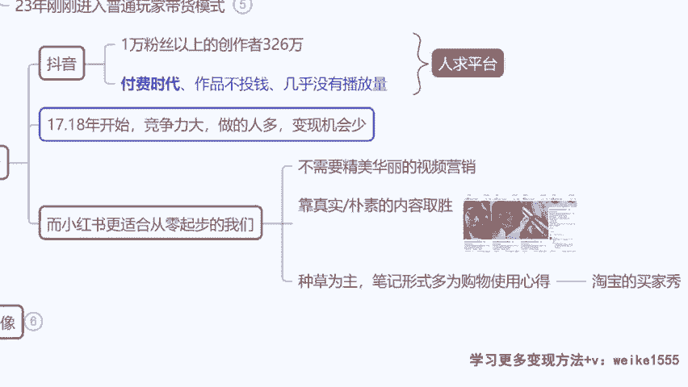
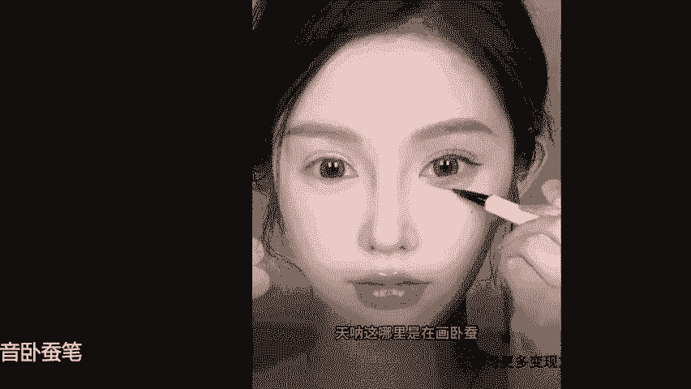
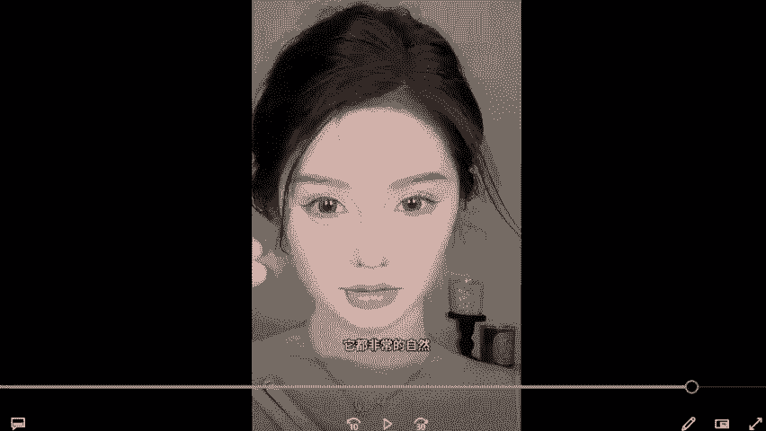
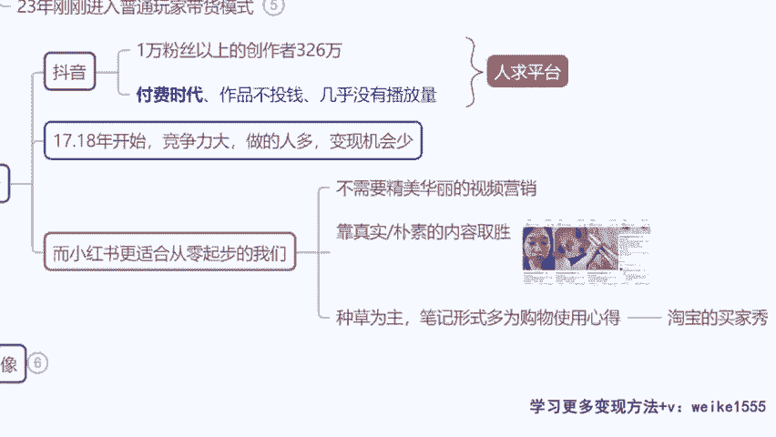

# 【小红书电商教程】B站最良心的最新2024小红书运营全套教程（精华版） - P5：3.小红书对比其他平台的优势 - 宅舞之韵小使者 - BV1GBvreQEab

那你说今天我们既然我们考虑的一个点是，我要去打广告也好，我要去卖货也好，做电商也好，为啥我不去选择这个嗯抖音去做呢，是不是这个抖音不是这么这么好吗，嗯我跟大家来讲，你们看这里啊，现在呢抖音啊。

他是有1万粉丝以上的一个创作者，看到没有，326万，1万粉丝以上的，你怎么去比这里面那么多的是原创的达人啊，不是说抖音不挣钱，抖音当然挣钱，我们不可否认，但是抖音挣钱很难，做过抖音没有。

是不是就是你没有特别强的那种剪辑的手法，你剪不出花里胡哨的一个内容，你很难脱颖而出，就是这样的啊，因为它毕竟存在时间那么久了，我们讲啊，你选个互联网，你要选个副业去做，就最好选互联网。

因为他来钱最快嘛是吧，互联网怎么选，淘宝抖音，不可能这两平台做了那么长时间了，我都15年开始做了，对不对，那你现在只有说我选一个新的赛道，竞争没那么大的机会，多的小红书毋庸置疑，而且我跟我跟大家讲。

你今天走出去，别人问你说做什么项目呢，你说做小红书，他说啊，做小红书没听过，对不对，越是这样冷门的平台赚钱的机会越多，就这样的，因为现在知道的人不多，是不是，而且抖音付费时代嘛，不同流量没有播放量。

没有赚钱的一个机会，但我们看一下啊，你同样的内容，同样的一个主题在小红书发是不是更简单啊，我给你们看一下这个作品的对比啊，像今天我上课以前都还有人在问我，说抖音还有没有搞头啊，我都我都不想回答。

真的不是说咱们抨击别的，不是抨击别的平台，我自己依然在做抖音，我们的整个团队像向太的直播间，是我原来的公司出来的原班人马，我们公司自己出来创业的啊，然后我跟大家讲，我们到现在为止还有在做抖音啊。

我们在抖音的话，我们做抖音的项目，还有大概80多号人，就做抖音那个运营的，但是说实话他投产比不高，所以说我们现在小红书的挪出来的这个人手，还都快赶上这个抖音的人手了，我给你们看一下啊。

就我们拿同样拿作品来对比好不好，你在抖音要做一个爆款。

你得做出什么样的一个水准，天哪我们都拿原创来比啊。

你看我们拿同一款产品小奥汀的一个卧蚕笔，大家来看一下啊，就如果今天我要发一个短视频平台，我无论是做这个微信的视频号，还是说我做这个抖音，还是说做快手，我但凡想脱颖而出，你要的一个要素。

前三秒的视频曝光度，对不对，那你必须得选个美女吧，来我们看一下啊，抖音里面卖这个卧蚕笔，当时单月销量400多单，销量不高，但是播放量有400多万的一个作品，来咱们瞧一眼里是在画卧蚕，简直是在徒手捏卧蚕。

一笔两笔，三笔四笔，无论多少笔都不会手重，不会画脏，再用另一头的提亮，轻轻画几下，卧蚕就蓬起来了，真的是平地起高楼来，我们看到这里啊，大家觉得这个视频好不好，说实话是不是挺好的，这个美女也很漂亮。

对不对，长得真好看啊，但是我说句实话，同学们就这个作品作为抖音来讲，他很优秀，他是个很成功的作品，来我们作为商家来讲，你考虑一下他的成本，第一你能不能自己拍，拍不了对吧，卖这种品牌类产品能不能搬运。

不能搬运好，那么必须要原创，请一个模特给你拍个十几秒的作品，这种颜值的水平啊，最起码是800~1000元一条，对不对，OK你还需要去寄产品给他寄拍，那么现在你看这条作品虽然说很美。

但是他的带货效果不理想，为什么作为消费者来讲，你会怎么考虑哦，我长得一般对吧，我长得又没她那么好看，我觉得她作为一个大美女，用了这个产品之后好看的是应该的是吧，我看完之后我没有代入感。

我并不会觉得我作为一个普通人，我涂完之后也有这么惊人的效果，对不对，作为消费者是这么想的，所以说当时这条作品虽说播放量很高，但是带货效果单月变现才400多单，这属于很低的一个效果，这是抖音啊。

那么我们来对比一下，在小红书里面一篇做的非常棒的，单月变现2000多单的一个作品，他是什么样的啊，咱们来看一眼同样的产品啊，一模一样的产品，这是小红书的图文带货笔记，来咱们看一眼首图。

他放的是一张非常真实的素颜图片，如果今天在小红书首图是这个，你会点开看吗，同学们，我告诉你一定会的对吧，因为抖音呢它是个博眼球的平台，但是小红书他就是一个追求真实的，使用体验的平台啊。

如果他的标题是告诉你，我作为一个方圆脸，都能画出一个无辜狗狗的大眼妆，对不对，我也能画出很漂亮的样子，你想不想点开看看，作为女孩一定小，你想看看她能变得多漂亮，是不是，来第二张对比图，效果很惊人。

眼睛小病人眼睛大，皮肤粗糙，变得很白皙，对不对啊，他告诉你我用的是什么，用的是这个产品，有没有想购买的冲动，作为一个女性消费者，想要购买化妆品的这个情况下来讲，她会心动的，是不是他会心动的。

因为他觉得啊，你长得这么普通，用完之后效果都不错，那我可能比你略胜一筹，我用完是不是会更好看，或者说我长得跟你一样也很普通，你做完能好看，我用完是不是也能好看，对不对，这是消费者的一个正向心理。

所以说在小红书，你看他只是用了这么几张图片，加上一个标题，加上这么几句话，他的点赞达到了3000多个赞，收藏1000多个，在小红书里面，这个是属于非常非常高的点赞率了，那么这一条它属于一个商单。

就是接的这个品牌的广告啊，那么它单月变现呢，是达到了2000多的一个订单的，我们说句实在的，同学们，你们觉得哪个更简单，你们觉得是这个嗯抖音做起来更简单，还是小红书啊，当然我们不用去管说这个老师。

那那我这个图片素材从哪里来，一会教你们啊，就大家发自内心觉得你自己说一说，你觉得哪一种更简单一点，是不是小红书要更简单，好像发起来要更容易一些，更轻松一些。

