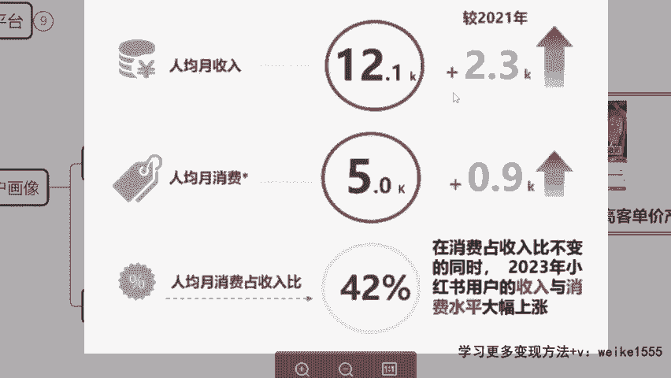
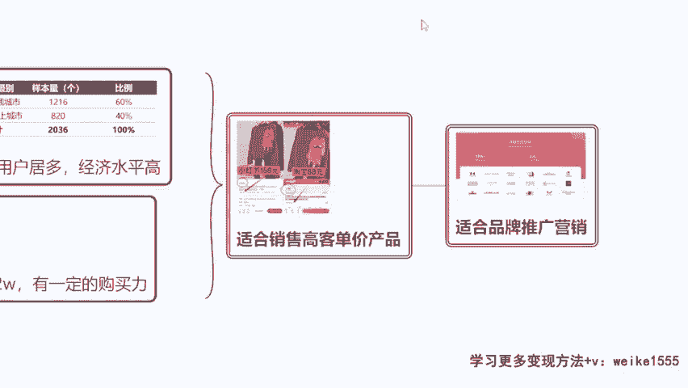

# 【小红书电商教程】B站最良心的最新2024小红书运营全套教程（精华版） - P6：4.小红书用户画像 - 宅舞之韵小使者 - BV1GBvreQEab

啊好的，OK那具体怎么发，来一会教大家啊，我们现在来讲啊，那你看既然我们的小红书做起来更容易，我们就确定了啊，小红书平台咱们锁死了，今天我们确定好就选择小红书平台来做，而且我告诉大家，在小红书里面。

无论是我们打广告还是咱们去卖货，销量高，用户非常的精准，我们来看一下小红书的用户画像啊，在抖音里面其实用户比较杂，我不知道你们听过一个品牌没有叫樊密林，听过吗，凡贝林贵妇膏什么姐姐都爱用。

那个去年代言了乘风破浪的姐姐。

知不知道樊贝林，其实他以前不是一级一线的这个品牌啊，他最早干嘛在美容院里面做这个美容及产品的，在之前是微商产品，他们以前是上不了台面的，甚至不可能在电视里面去打广告的一个产品。

他们什么就是微商品嘛对吧，最早的这个微商做的一个产品，他们怎么起家的，以前在抖音，他们也做推广啊，就有点类似于那种什么传奇今生的口红，但是我不知道大家听没听过这几个啊，微商巨头啊。

就他们当时呢呃他们老总因为跟我比较熟悉，然后跟我也讲过，说诶最早他们在抖音做推流100个一天，比如说一个微信加100个流量过来啊，就加100个客户，那么在抖音里面也许只能成交四五个，而且是四五个。

买的是便宜的，这个水乳套餐，就大概是499599这种套餐，但是在小红书里面，如果他一天加50个微信啊，那么他的成交的人数可以达到十五六单，并且很多人是愿意在刚起步就去充钱的，比如说充5000开会员。

开VIP啊，或者说充1000等等，买这个更高级的这种面霜类的套餐，所以说其实这个平台都是各种微商啊，公认的就是高质量平台，高客群，高客单价平台了，因为我们可以看到官方那个统计。

你看一二线城市小说用户在60%到啊，40%，60%的二三线城市，对不对，人均收入高啊。

他的一个购买力高，你看这个人均收入的一个水平可以达到1万2，单月的一个收入水平，你们现在拖这个后腿没有，有些可能会掉的比较纳闷哦。

小红书单月的这个收入，月薪居然能达到1。2万啊，我现在才几千块钱一个月工资，怎么他们这个平均收入那么高，算我了吗，算你了啊，为什么会这么高呢，因为这里面有大部分是高收入人群，什么89万一个月啊。

十几万一个月啊对吧，甚至说自己开公司，海外留学，每个月生活费人家十几万的都有啊，所以说小红书其实他整个平台已经定性了，他是一个神用的平台，有钱有闲的人。

对不对，钱没处花啊，时间没地方使的，除了刷抖音。

我对小红书也挺感兴趣的，没事我就想看看啊，什么这个好什么东西好，对不对。

什么大牌好的小说，最早积累的全部都是那些有一定购买力的人群，到目前为止，他才慢慢的变得平民化，大众化的，那所以说我们也不用担心说老师，那现在不是普通人也挺多嘛对吧，那这个平台对于我们的优势在哪里。

咱们要知道你既然要在小红书挣钱，你要挣的就是那些有一定经济实力的人的钱，对不对啊，咱们要挣的是有经济实力这一富人钱，我们可以看一下啊，同样的产品在小猪的价格它是更高的，这个是我们自己学生在卖的一个产品。

我们看啊是不是一模一样的毛衣，对不对，他的SSKU主图啊，他虽然说换了图片不一样，但是你往后滑，剩下图片都是一样的，他只是调换了图片摆放的顺序，淘宝里面68块的毛衣卖价88元，看到没，单月卖了100单。

已售出100单啊，但是在小红书卖价高于70高，七十一百五十八元的售价，一个月卖了663单，来看到这个数字没有600多单，为什么你说小红书啊，他不会去比吗，还真不会，咱们挣的就不是那些去比价的人的钱啊。

那你看如果今天你在小红书，你去卖一件五十八六十八的毛衣，人家还不一定会买，为什么他觉得便宜没好货，这么便宜，质量肯定不咋地，对不对，但是你一旦价格保持在毛衣100多，外套三四百块钱的一个价格。

人家是很愿意去买的，对不对，这其实就好比一个什么原理，今天同样的一个风衣，一个大衣啊，我放在商场里面，万象汇去卖高端一点的这个商圈，对不对，我卖4000多，没人会说价格有问题啊。

我甚至卖6000多卖得掉，对不对，但是如果说我换了个地方，我换万达去卖降级了，那么这个时候我只能卖2000多，但是如果说出了这个大门，我换个步行街，我撑死卖1200，对不对。

其实质量款式等等材质一模一样，只不过面对不同的客群。

我得开不同的价格，对症下药，仅此而已啊，明白没，包括在小红书平台。

你看啊，他现在今年一共合作的小红书品牌，17。5万家呀。

那么小红书平台已经成为很多品牌的，这个认可的一个这个平台了是吧，像华帝呀，卢上阿姨呀，沪上哦，沪上阿姨呀，奈雪的茶呀。

奶糖派啊等等，这些都是都是可以的，到时候你们想接商单也好，我们想做电商也好。

机会都很多嗯，你说老师，那我我那我我哪能接那种大品牌，我们接的不是大品牌，不是让你接什么香奈儿迪奥啊，你接的就是一些小品牌，名不见经传的新的品，新的品牌的推广，然后包括整个平台来讲，女性居多啊。

所以说一定的经济实力，包括呢更多的是宝妈，上班族，大学生啊等等，对不对，他们没有说很强的说哎我要存钱的这个理念，他们更多的是想法是我要及时行乐啊。

我当下有多少，我花多少啊。