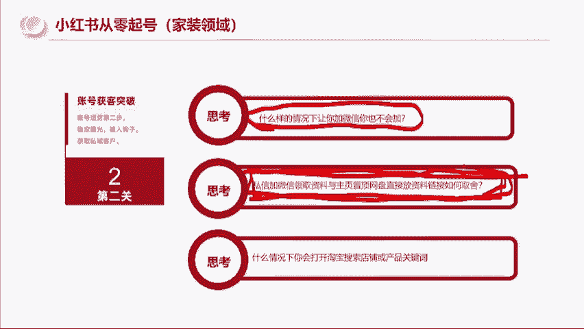

# 【小红书电商教程】B站最良心的最新2024小红书运营全套教程（精华版） - P6：6.小红书从零起号第二步 - 电脑极客科技领航 - BV1M4eoeHE5g

所以到第二步啊，就是第二步是啥了，就是我们通过我们的内容是不是获得了报关，我们怎么样去获取这个客户啊，第一步是获得笔记和获取报关，第二步是获取我们的目标用户，去添加我们的微信啊，因为我是思域玩法。

我下面讲的是思域玩法，但是同样的原理是一样的。

比如说我做私域的玩法，我思考的就是当被一篇笔记。

被人家被吸引了之后啊，他什么情况会进入主页查更多。

然后什么样的内容跟账号，人家会认为不可信。

不靠谱啊，什么样的情况你会希望和作者取得联系啊。

这些问题都是在我做的过程中，我就会反推的，我会我会自己代入。

就比如说我看了十篇笔记，有谁是我想关注的。

有谁是，我一看这个账号，我就觉得这个人靠谱可信。

有谁的账号是我一看，我就觉得这个人有可能是个骗子。

不能信，像刚刚那个我问一下大家啊，你们觉得刚刚那个卖鸭脖的还记得吧。

前面那个搞加加盟的，在别人评论区说。

自己从负债500万到赚了500万的，你们觉得那个人是好人还是马扁。

告诉我好不好，前面那个卖鸭脖的，你们觉得他是好人还是马扁。

他说他自己负债500万，一年赚回来。

他是好人还是马扁。

啊你们说他是马扁是吧，为啥呢，因为。

因为第一这个数据太浮夸了，第二他的主页内容就是搞加盟的。

加盟这个东西麻点的概率很大。

是不是，所以你们就会感觉说你是会想看，但是他这种东西吧。

其实对对一些有过认知的人。

或者说清楚加盟套路的人，是会让他觉得不可靠的好。

那我们再往后思考，就是什么样的情况让你加微信，你也不会加。

以及私信加微信领取资料和主页。

网盘置顶饭资料，你们会如何取舍，哎其实这个其实这个问题啊。

和这个和这个和这个戴老师他的操作是一样的。

如果你们当时你们有没有想过啊。

如果当时你们通过他的抖音账号，进了他的粉丝群。

他说你们要加个人微信才能发资料，你们一定是有一些人不会去加他的。

那戴老师是怎么做的。

他是你们进群，他把链接二维码对吧，发到群里面了。

然后只相当于直接把资料给你们了，所以有的时候你会发现说强制别人加微信。

再给资料和你只要进去我就给你。

我没有说我要强制链接，你的意思是不是后者更加让人家能够看到真诚。

是不是，同样的，你们又可以带着这个思维往后面去思考。

什么样的情况，你去看小红书笔记的时候。

你看着看着你就会打开淘宝店，去搜索店铺或者关键词。

是不是是吧，那有人有有人说他说真不想加人，是不是。

所以就是我们要思考的轨迹是什么，我们要思考的轨迹是人心。

要思考的轨迹是人心，而不是套路，因为戴老师是真心对你们的，他压根就没想加你们，他就是觉得说我知道小红书怎么做的，我想分享他分享了诶，我有一些资料我可以整理给你们，我给你们了对吧。

我想去带一群人去尝试做小红书这个事情，那么谁愿意来谁就来。

所以他是真心的，所以我们今天会相遇，在这里，所以那到我这后面你到做私域的话，你还会遇到什么问题，就是那你加了人之后，你怎么做好友管理，对不对，你要不要建群，群里面的人谁是值得帮助的。

每个人的想法都是不一样的，就即便是咱们的100多个人群，对不对，你会发现啊，有人有不同的价值观的同样的一个群，它的利和弊是什么啊，微信群邀请好友拒绝还是通过这些，就是我在做这件事。

做这个事情的过程中会经常思考的问题。

我之所以能思考出答案，能做出答案。

是因为我先把这些逻辑想明白。

