# 【小红书电商教程】B站最良心的最新2024小红书运营全套教程（精华版） - P7：7.小红书从零起号第三步 - 电脑极客科技领航 - BV1M4eoeHE5g

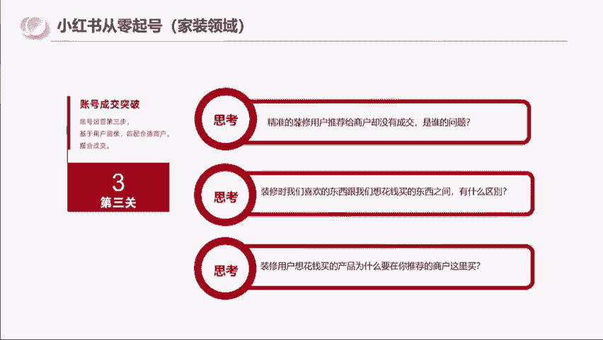

然后我再问大家一个问题啊，这三个问题会跟大家相关，精准的用户推给商家没有成交。

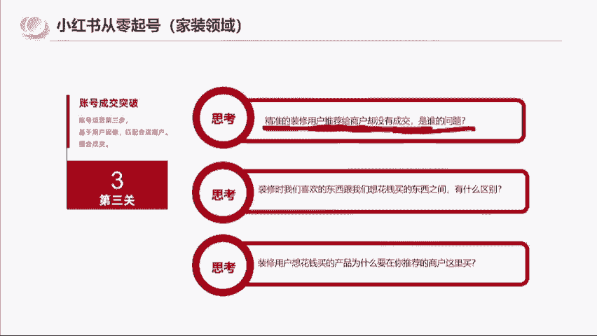

是谁的问题，是用户的问题还是商家的问题。

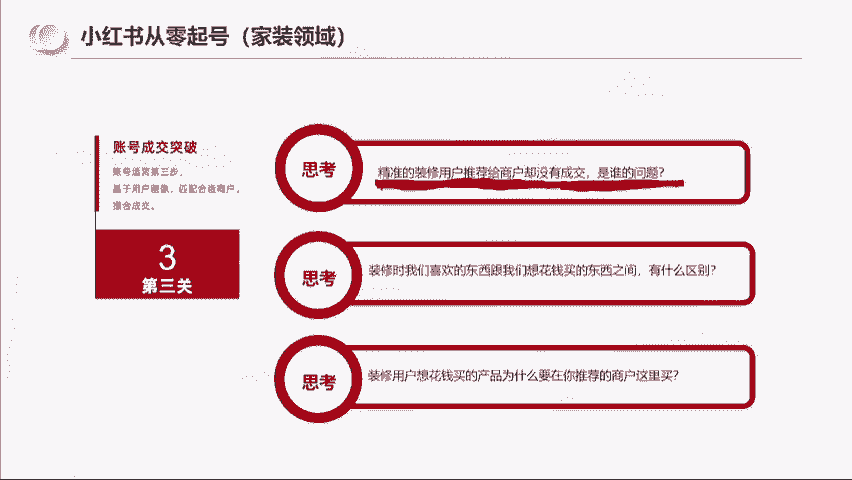

还是博主的问题，博主把精准的用户推给商家。

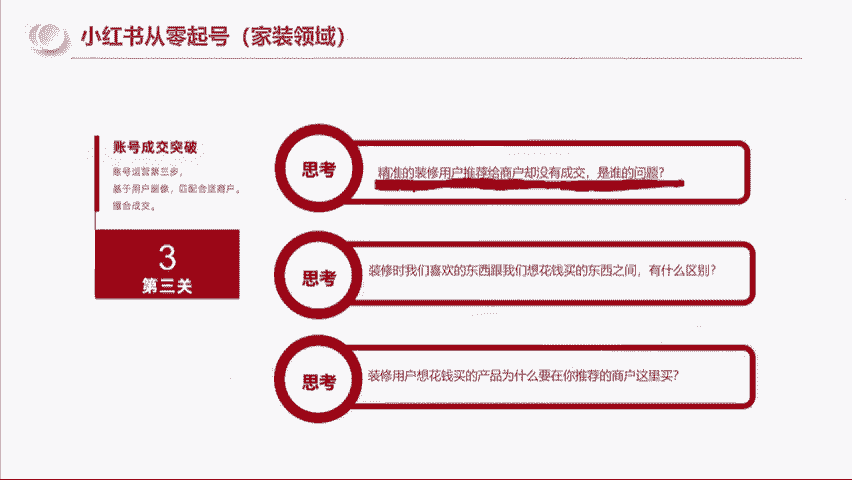

没有成交，是谁的问题，你们能弄明白吗。

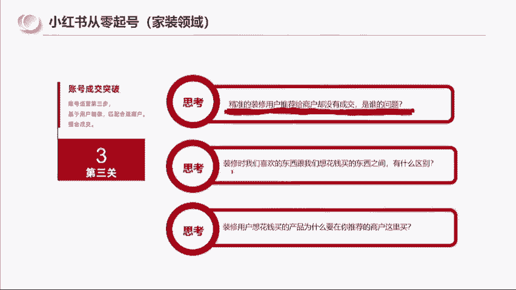

没错啊，是商家的问题，这里我给大家分享一个事情。

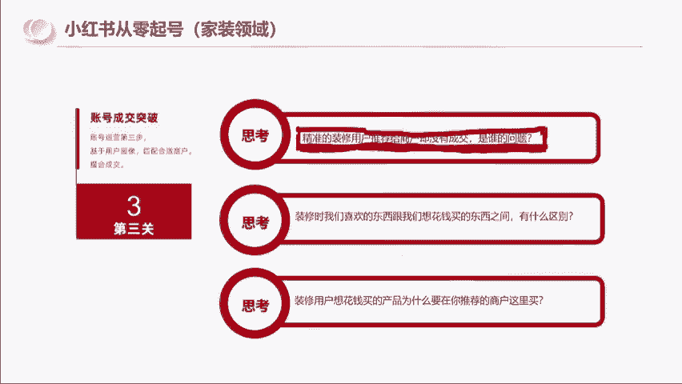

就是我在最开始去做这个模跑模型的时候啊。

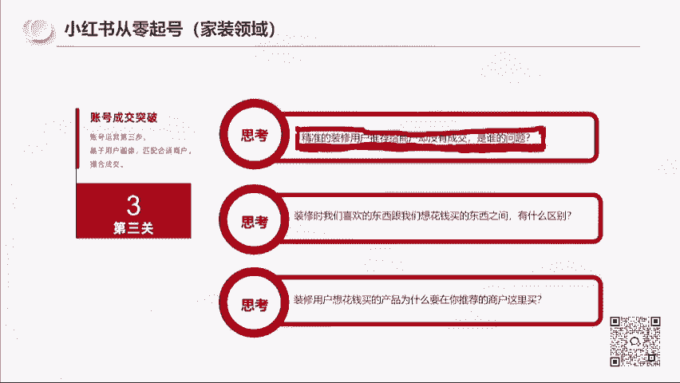

就是首先啊我这个装修的过程中，我所添加的粉丝。

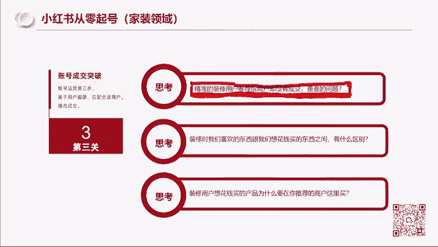

我是真诚的对他们的，所以我在做的事情是帮他们出。

找到好的产品去压了价格，去给他们做成交，并且我跟他们讲的很明确。

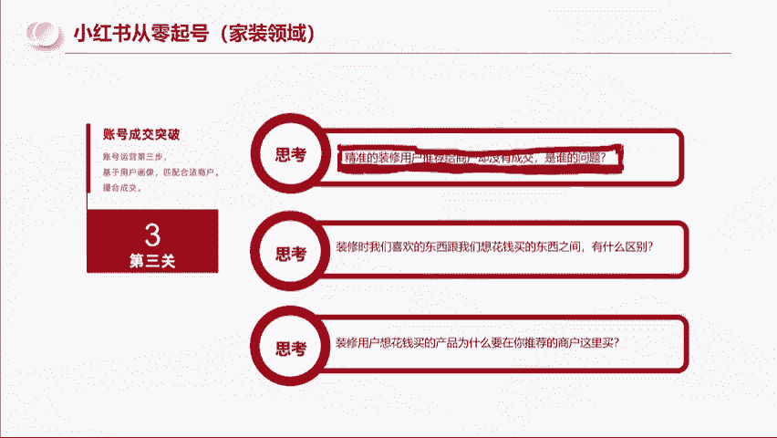

我自己的成交价你不要问我，我肯定比你低，但是我做到一点。

我不赚你们的钱，就是比如说这个市场这个事情，这个东西人家商家正价卖1万啊。

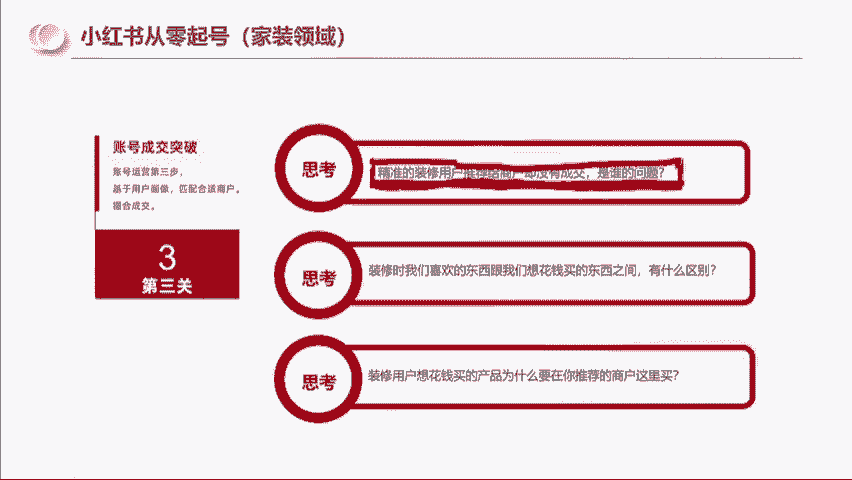

我可以帮你们谈到九千五九千。

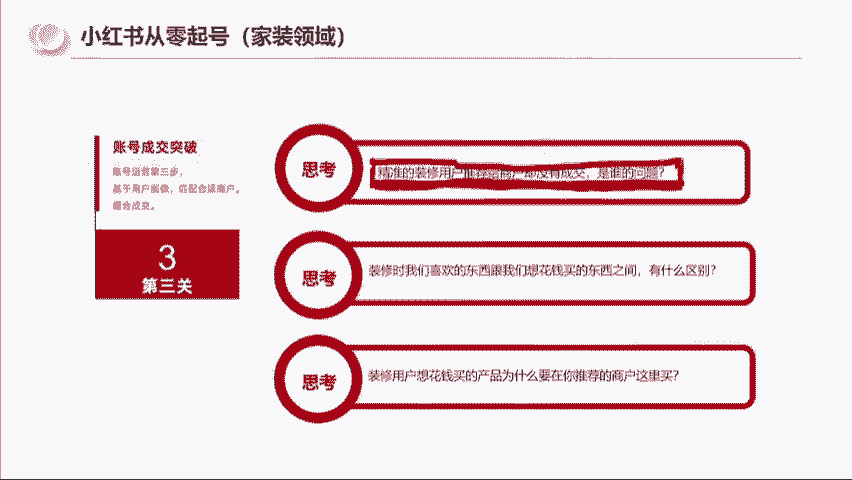

但是你不要问我是多少钱买的，因为我也不想骗你，所以我对他们也是真心的。

那这个地方我想跟大家分享一个什么事，就是说精准的用户给到商家没有成交。

是商家的问题啊，这个大家答案都是对的。

那我也不太去展开，所以如果说你们在小红书拿到了精准的流量。

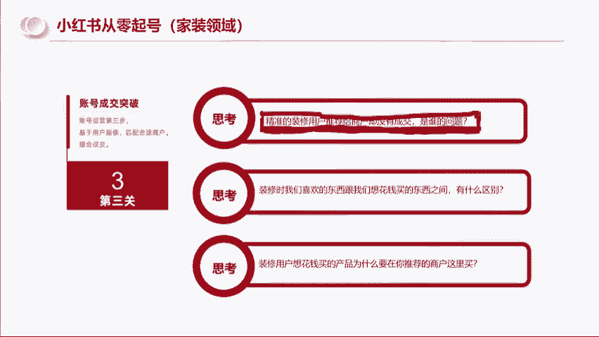

你挂了产品没有成交，那就一定是产品的问题。

明白吧啊以及我还会去思考。

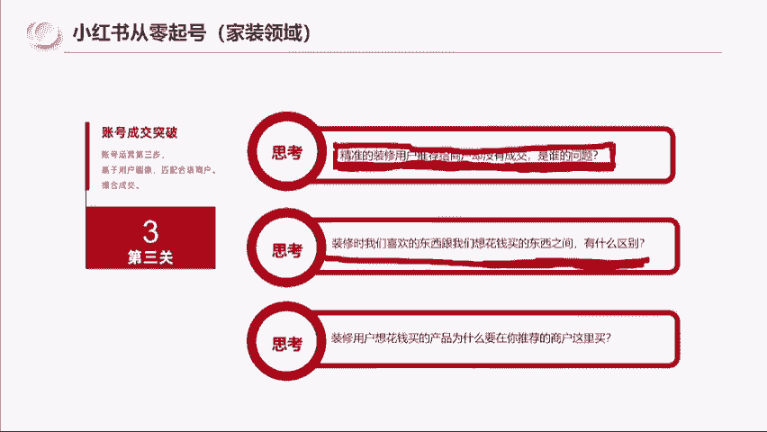

那装修时我们喜欢的东西跟我们想花钱买，买的东西有什么区别。

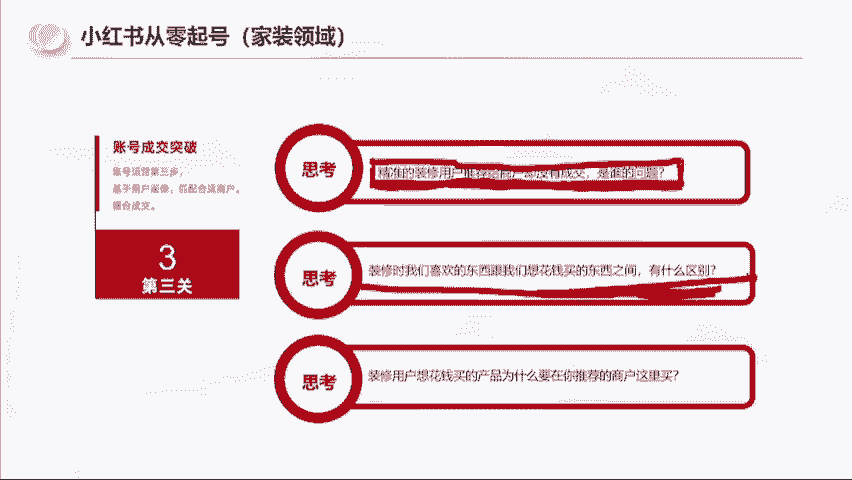

这句话翻译一下是啥，翻译一下，就是比如说我们现在去逛商场。

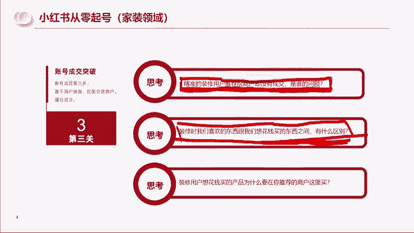

去买衣服，买鞋子，我们最后买回来的是我们最喜欢的那一件吗。

嗯同学们很多时候不是因为我们最喜欢的衣服。

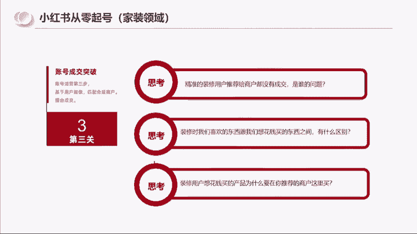

可能你一摸一看吊牌1500，一双鞋子。

你一看1200，但是我们其实是带着预算去买东西的。

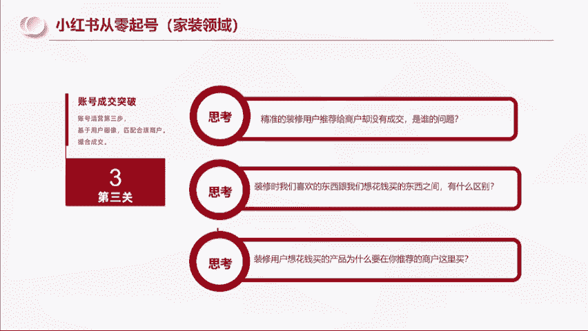

可能我最喜欢的是1200，但是我看了有一双鞋只要六七百。

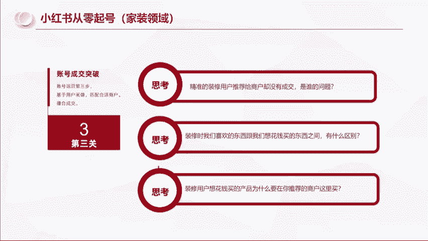

他在我的预算内，所以我会选择买预算范围内的，是不是。

所以我会深刻地去研究说我搞装修的过程中。

我到底看中了什么，我买了什么，为什么，那为什么我要去思考。

因为我要做的是用户成交，不是所有看上的就一定会买。

而我要研究的是成交了什么东西，为什么会成交。

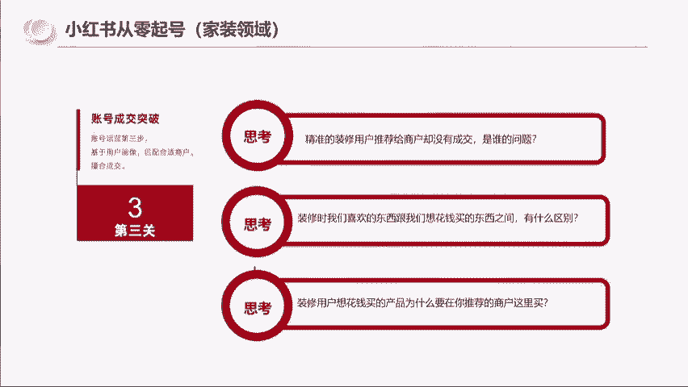

而那些容易被别人看上的喜欢的。

而又成交率很低的，那对我而言就不是好的商品。

那还有一个问题啊，就是装修用户想花钱买产品，那为什么要在我推荐的商户这里买呢。

这是不是跟你们的问题有点像。

小红书的用户在小红书刷笔记，不是只有你们在挂车。

为什么要在你们的笔记下面买呢，这个逻辑你们是要想明白的。

所以我想的很明白，我告诉我粉丝群的人。

我帮你们找的是好产品，而且我把找产品的这个过程我有告诉他们。

比如说我星期一到哪里看到什么东西，我发给他发到群里。

星期二我看了什么发到群里，星期三我发了什么发到群里，然后我告诉大家我选哪一个，以及我能拿到的价格是多少。

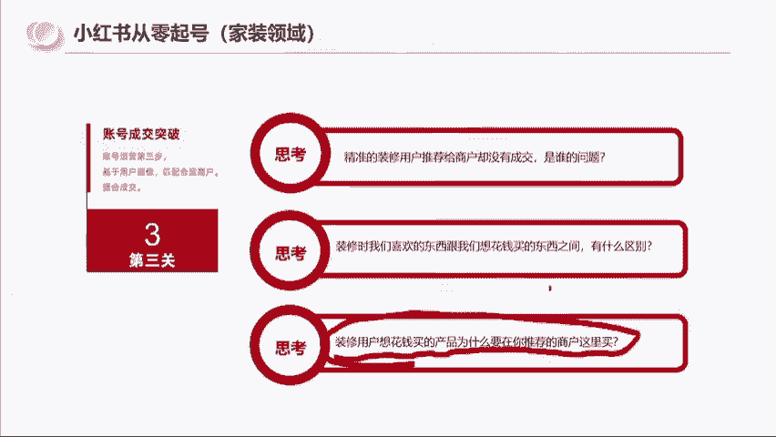

所以我不是说因为装修啊。

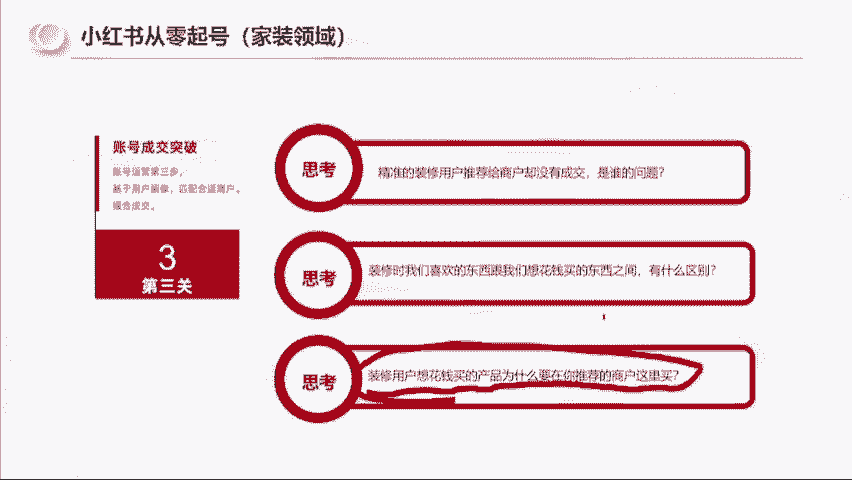

跟你们卖的这些东西都不一样，它是一个非常高客单。

而且非常复杂的东西，所以我会把整个的这个选品的过程。

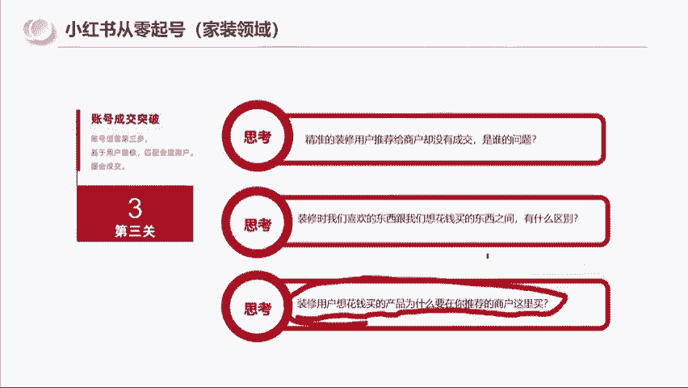

去分享给他们，然后会明确的告诉他们。

这个东西A比B比C的东西，它好在哪。

差在哪，然后再去告诉大家，我为什么买A然后价格是多少。

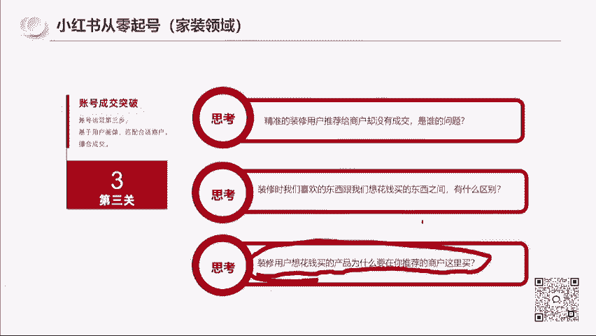

所以在这个过程中啊，像嗯成交的突破，其实对我来说就已经很简单了啊，像这一个粉丝的话，他基本上他家里，这个这个这个这个啊，这里应该是五六个东西，跟着我一起买了四个东西，在我看来他是很赚的。

因为他没有花任何的时间，我跑油都不知道跑了多少箱油，而且还没赚钱。