# 【小红书电商教程】B站最良心的最新2024小红书运营全套教程（精华版） - P8：6.什么类型的作品更有变现潜力 - 宅舞之韵小使者 - BV1GBvreQEab

那现在作为纯小白，我们什么都不会，我该怎么来实操，我该怎么去做的。

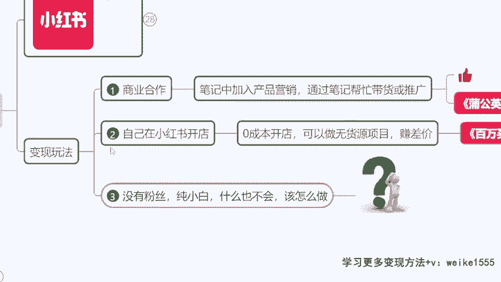

现在开始我们直接来讲啊，我们先来说一下如何发布作品来。

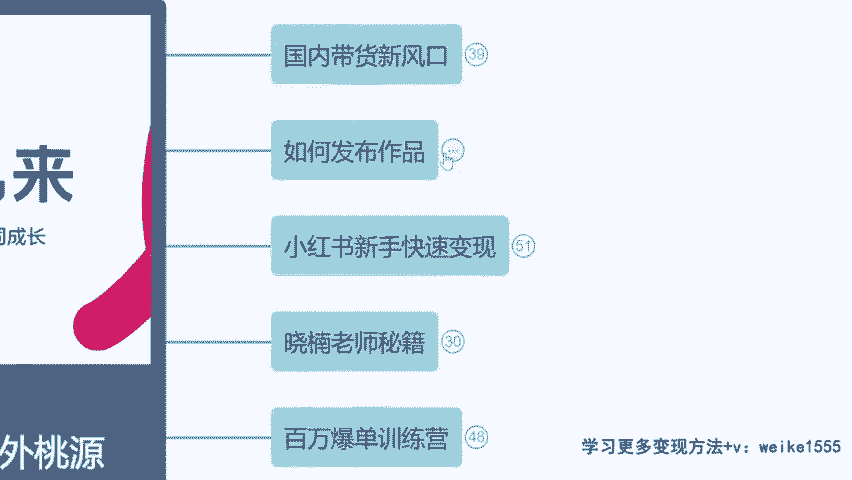

同学们小红书里面的作品呢，刚才我们也看到了，是不是更多的，它是以图片加文字的这个形式为主，那么这个图片怎么来，文字怎么来，一会我们都会说到啊，然后大家就不用在公屏上反复去问这个问题了，那么我现在讲一下。

就是我们发什么类型的作品会更有变现潜力，当然我现在讲的点呢，它是关于电商的，就是如果说之后我们要卖货，那么你的账号必须要很垂直，比如说来我给大家看一下啊。

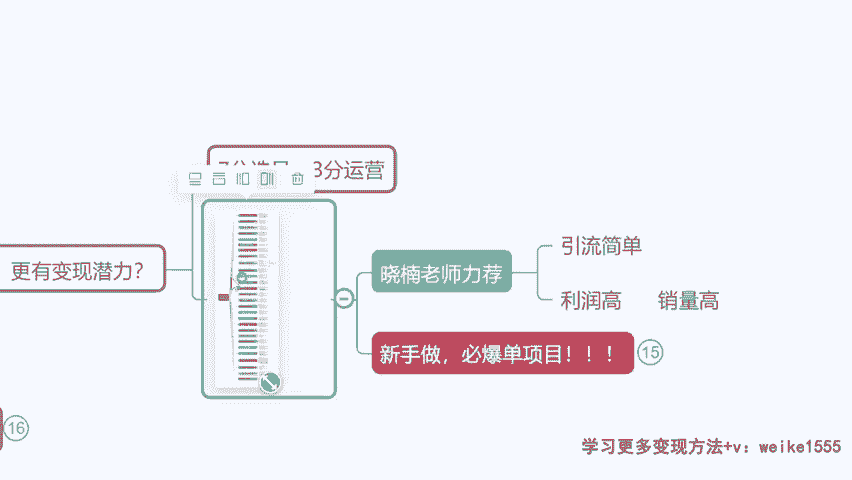

比如说咱们要卖这个呃背心类的。

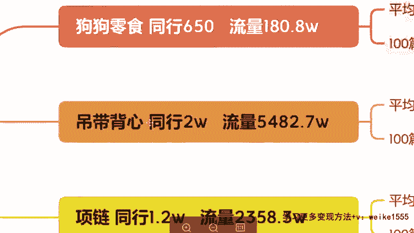

是不是女装背心类的，那么你整个账号最好全发背心，那么你需要这个产品的用户呢就更精准。

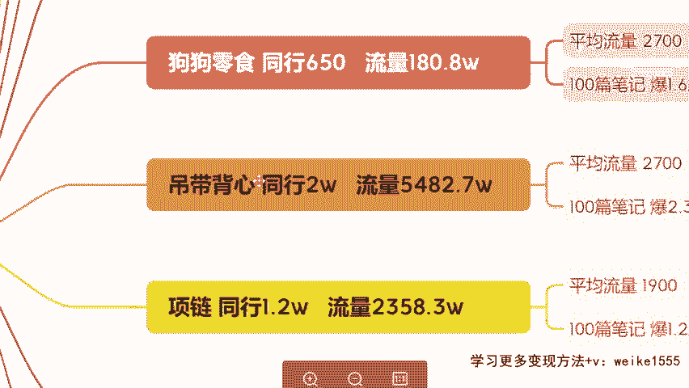

然后包括我要做这个狗狗零食类的，对不对，那么最好呢，你所有的这个作品发的都跟狗狗相关，好这电商类的电商类必须单一性。

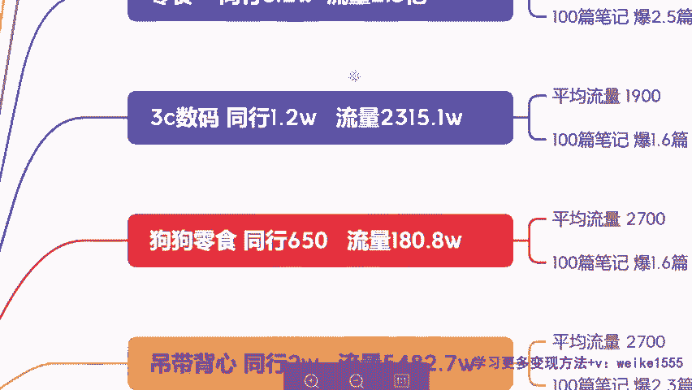

那么如果今天我要做商单类的。

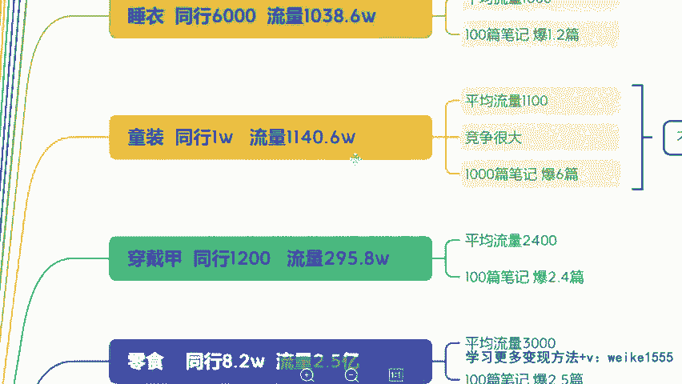

就是我要做一个打广告的账号，那就简单了，你无无所谓做什么类型，只要粉丝达到1000，我管你发的啥作品无所谓啊，都能去带货，都能去打广告，但是记住切记记住一点，有同学呢为了达到千粉。

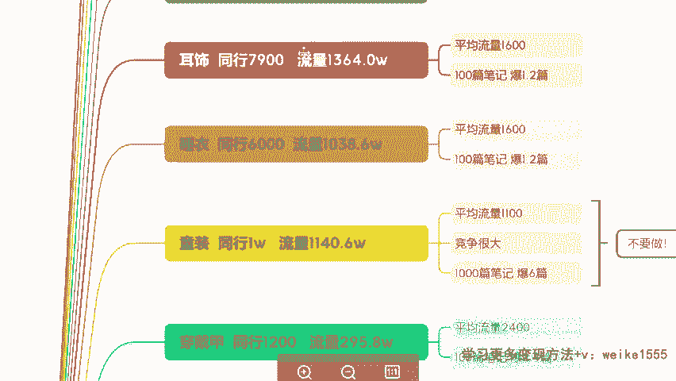

或者说为了涨粉啊，你会这样去做，你会到别人的那个评论区评论一个互粉，互踩是吧，互粉互相关注啊，千万别搞这说啊，所有同学记住了，每个人账号都是这样的，你但凡想涨粉，你跑到别人评论区回复了评论了。

说什么互粉互关这种的通通账号会直接限流。

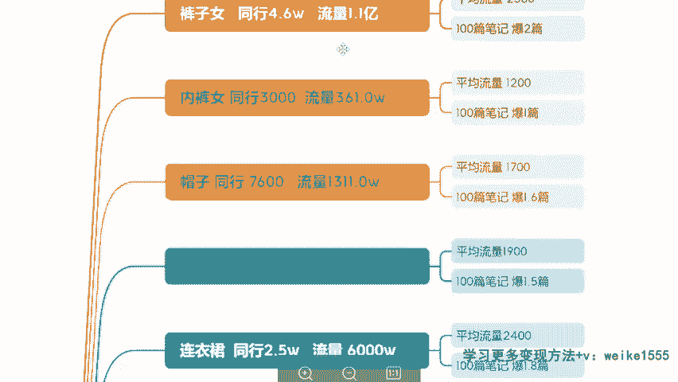

到时候想挣钱一分钱挣不着，别搞这些歪门邪道啊，这个我要强烈强烈给大家去提醒我们。

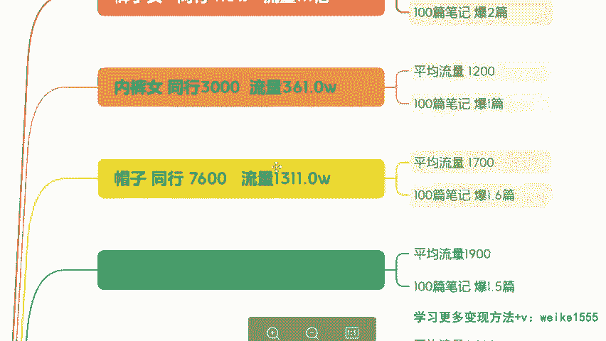

双11的时候就有同学这么干了啊，就有这么干的，封号可严重了，所以说千万不要这样啊，我们就正常发作品就行，来这张图片我是昨天晚上给他整理好的。

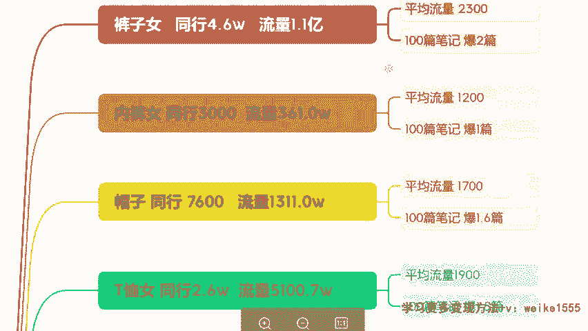

如果需要的话，就是你们之后如果说想做电商类的，是不是我们想之后呢，呃电商类怎么讲呢，它是一个源远流长的一个事情，就挣钱它是持久的，而且比较稳定的，那么商单呢来钱快是吧。

所以说这个呢看大家自己的个人选择啊，电商类的话呢，我们一定要选对类目，选择产品，什么叫做七分靠选品，三分靠运营啊，就是我们这个选品你选对货很重要，这个东西好不好卖，跟我们的产品有关系对吧。

那像这个裤子类就不要去卖了，你看我给大家分析好了，同行太多了是吧。

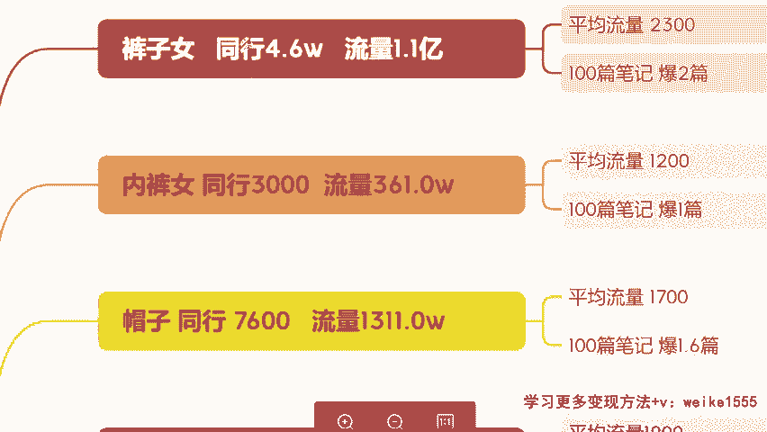

没有必要去卷，没有必要竞争，但内裤类可以，他复功率很高啊。

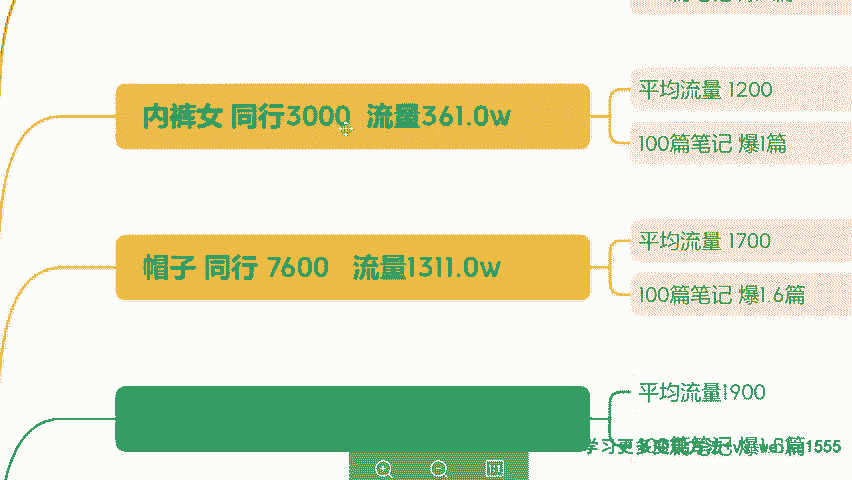

复购率非常高，因为这个东西呢是经常要更换的，一个是更换的一个产品，然后呢T恤类的也不要是吧。

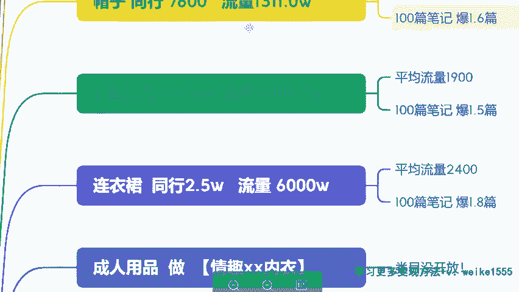

做人太多了，连衣裙做人太多了啊，然后像这个类型的，你们未来可以考虑，但是暂时呢他的限流还是比较严重的啊。

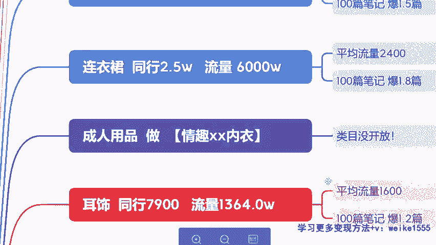

还有哪些呢，耳饰可以，睡衣可以啊，童装就不要做了，很多宝妈上来就说童装行不行。

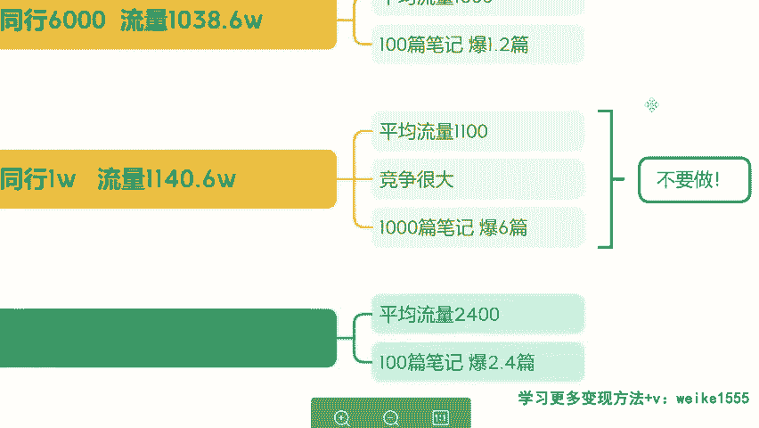

童装不介意啊，童装说实话真不建议啊。

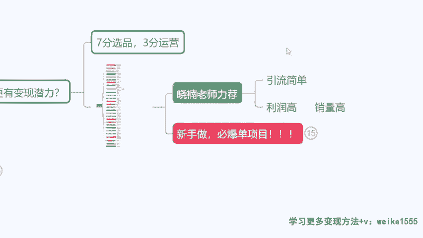

我给大家推荐一下，就是我建议大家做什么类型会更好，一方面呢你要考虑这个作品，它带来的流量高不高，是不是哪种是有高流量的，你看男生爱看什么黑丝，是不是女孩爱看什么显瘦啊，就是这种你要抓住消费者的心理。

你要把这个产品卖给谁，你去写一些他们感兴趣的话题啊。

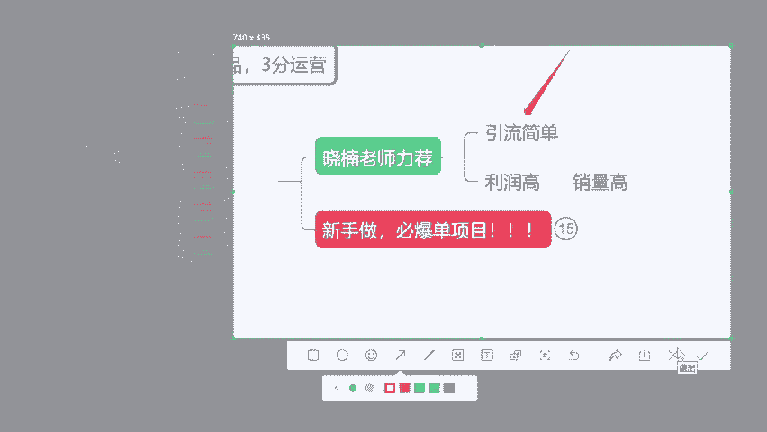

然后包括呢我们选产品呢，选这个要么是利润高啊，我卖一个订单，比如说我能挣个差不多在呃778十，是不是我能有个七八十这个利润，或者说呢销量高，我虽然说这这个单品我就挣十块钱，但是我一天我能卖个1000单。

我能卖个七八百单，这也可以马上给大家推荐几个啊。

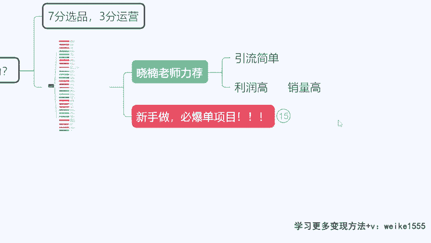

给你们看几个，现在比较热门的一个比较热门的一个项目啊。

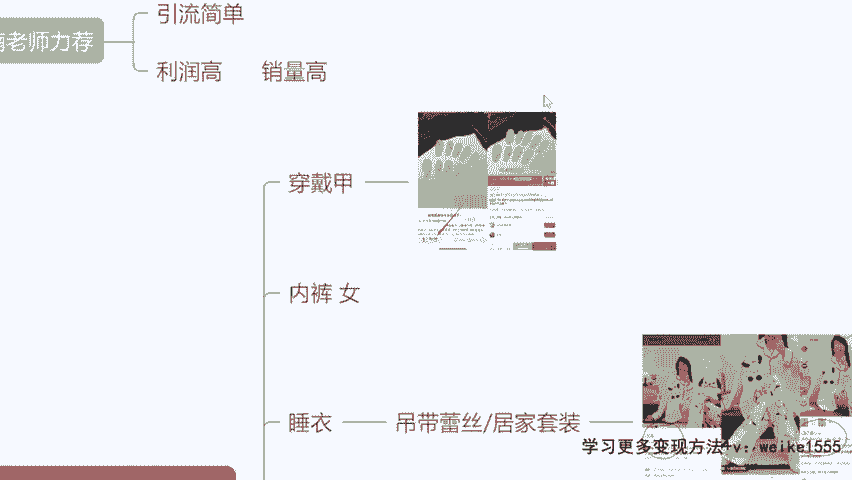

你们可以去选一下，穿戴甲，很建议啊，呃穿戴甲的话应该女生知道比较多是吧，女生爱哦，我们今天课的女生多不多，爱不爱爱不爱做美甲，平时会出门做美甲吗，做个美甲多少钱，同学们做美甲多少钱啊，情趣用品是可以。

但现在还不行，暂时不行，过几个月吧啊，因为现在平台管控有点严格，就发这个东西容易擦边，容易限流，100多是不是几百块钱，大几百啊，就是完全没有图案的，纯色几十块钱带点钻的呀，带点这种彩绘的呀。

一两百是不是啊，两三百的都有好，那如果今天我卖个甲片给你，我告诉你，你不用出去坐三四个小时了，你把这个甲片拿这个甲甲油胶啊，往这个指甲上一贴对吧，只要100出头买不买，作为小数用户来讲，他会买的啊。

他们觉得哇这个东西省时间又好看，比我在外面做的还好，对不对，外面做啊，可能这个买家秀跟卖家秀了，那么你看119元，标题什么高级感，富家千金风美酱，OK直接把用户锁定在这一群小资的女生身上。

那么今天告诉你100多，我们就能买一副这种很精致的美甲，你买不买，用户会下单，对不对，这个单品销量不错，但是实际上来我们看在拼多多这款产品，25块四毛二，看到没，价格差异很大，那你利润高不高。

利润高不高很高啊，我们货可以在拼多多去拿嘛，是不是好来，这是一个啊，睡衣也是，你看同样的材质啊，一模一样的产品，拼多多多少钱，37块八毛一，在我们的小红书卖108块钱。

因为这个货如果你在小红书卖个30多，没人买的，人家觉得哇这个产品肯定质量不咋地，对不对，这款产品单月变现677单，单月变现677单，我们算一下嘛，38块的成本是吧，我卖108的价格，我订单的一个单哦。

我一个单子的这个单价，我的一个利润在70吧，是不是70，我乘以677单，来咱们看一下这个利润4万多一个月对吧，来这个东西就是这样的，因为我们是什么对症下药，不同的用户我们有不同的一个消费形式对吧。

小红书本身我们挣的就是谁的钱，挣的是有一定消费力的这个人群的钱，你说老师，那难道小红书的这个用户，他不会去拼多多比价吗，他要比了价，发现我这卖的贵怎么办，你要赚的就不是那些会去比价人的钱。

咱们要理解这一点啊，你要明白这一点，如果说你要挣的是这一群没有消费力人的钱，你是挣不到他的钱的，你何必为了去取悦他啊，你去做一些他喜欢的一个东西，对不对，因为今天咱们来这不是为了吸引粉丝。

不是为了得到更多人的青睐和认可，我是来挣钱的，咱们要知道这一点，我们是来做商业的，我们是来做呃，我们是来做一个这个商店的，对不对，好，那么看啊，像这种发卡销量高的对吧，我刚刚讲了，销量高。

要么咱们追求利润高，要么追求销量高，八块六毛四，卖19块九单价的一个单品，利润呢最起码在11左右啊，一天一个月你能卖个几千单，那销量这个时候也不会低，对不对，发卡类的，包括像什么宠物用品啊。

像百货类的呀，是不是情侣装类的呀，这个销量都不错啊，就是其实总之一句话，你做的这个产品做的类型，尽可能去贴近这个女性的用户，女孩喜欢啥，咱发啥，女生爱买啥，咱们得去发什么作品，我们去卖什么呢。

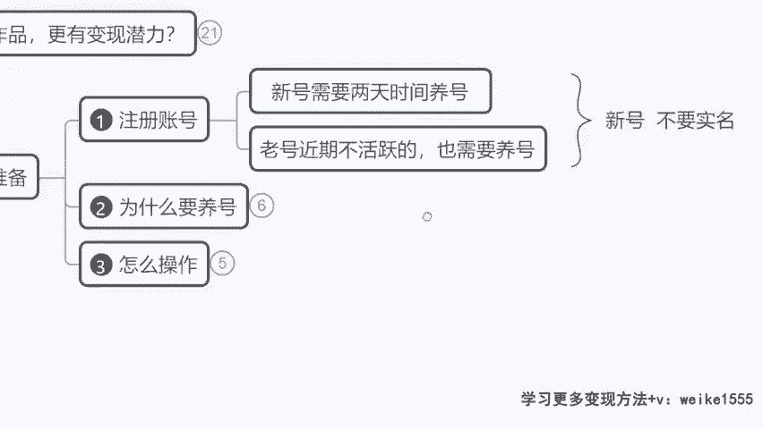