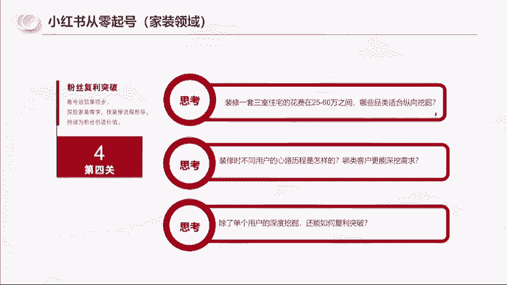
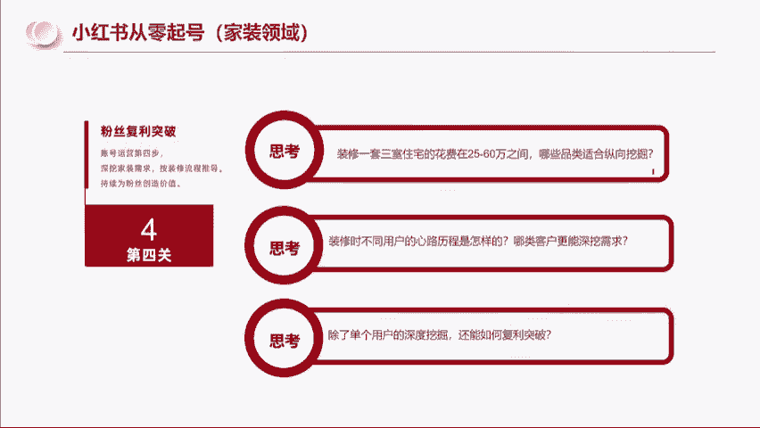

# 【小红书电商教程】B站最良心的最新2024小红书运营全套教程（精华版） - P8：8.小红书从零起号第四步 - 电脑极客科技领航 - BV1M4eoeHE5g

而且这个事情我能做成，其实我还是完成了小红书的这个调性，就是真诚分享。

我是真诚的在做事情，我没有说我是因为谁给的佣金高。

所以我就帮谁卖，我一定是找到好的东西，然后去告诉他们啊。

这个包括这个成交也是一样的啊，这里啊跟大家讲一个细节，就是当我在21年10月份启动账号的时候，到22年4月份啊，我整个这个这张图，这个PPT是去年4月份那个年年审过的，下个月哦，我哦5月18号要去杭州。

是第3年了，那个讲师的认证，我在2月份的时候成交了20万，我在3月份的时候成交了170万，4月份成交118万，这个数据我觉得不重要，重要的我觉得是这个玩意，这个玩意，为什么我要在4月份的时候去开。

我前面的成交证明，你们能想到吗，就是当我有了成交之后，我为什么要在4月份的时候去开成交证明，你们能明白，能理解吗，大家思考一下，为什么我会在4月份的时候去开一个成交证明，因为我要借力打力。

这个其实跟你们做小红书也好，跟你们以后做任何东西都是有关联的，什么意思，其实真正的商战不是说你拿很多的钱，你拿很好的资源去跟别人去拼，真正的商战是什么，我们作为小白起家的，我们作为小白起家的人。

包括你们，你们要在这个互联网上去赚到钱，你们往往是是以小博大，你们是田忌赛马，要在局部劣势中去战，去产生战争的一个赢家，讲人话就是你要在你没有就三家是什么，他可能是你1万单，我给你多少价。

你5000单我给你多少价对吧，比如说我们去辛巴买榴莲是吧，你能拿100吨，我给你多少钱一斤，比如说给你二十五一斤，你只有一一千单，那我给你28，你只有100单，我给你31斤，是不是这样的，那真正的山寨。

你们要掌握到我如何只有100单的情况下，我要争取到他给我1万单的价格，为什么要这样子，因为你只有把价格压低了，你有利润空间了，像你们做电商，你有利润空间了，你人做钱，人做事的动力是跟你赚多少钱有关系的。

你你一个月下来，你上班赚3000，你做小红书赚1000，你第二个也没动力了，你一个月赚3000，你做小红书一个月赚5000，你这个月嗷嗷的，所以说真正的三战是你在用小资源的情况下，去撬动商家的好政策。

所以说我去开这个证明，是要给后面的商家看的，我已经做到这个成绩，你的这个东西我预估我能做几百万，你干不干，所以说我这个门窗的价格是怎么谈的，我上来我就跟他说，我1000个平方，你能做什么价。

我说我家有几套别墅，1000个平方，你给我什么价好，他就给我一个价格，我说我告诉你，我没有两套别墅，我只有30个平方，但是我有一个小红书账号，你相信我按这个价格给我，我给你再找啊，970个品牌。

然后给他做到了，所以这其实是跟大家穿插了一个，真正的你在落地过程中的一个商业经验，那你们去做这个小红书是不是一样的，是不是可以拿到自己的一个基础的成交，再去网上去做，那包括思域的复购怎么去做。

是不是怎么去做复利，真诚，我去看工地对吧，两款瓷砖一和二就是大家会在一和二之间抉择，你可以理解为两个口红的颜色，我会去拍两个照片去分享给别人，所以人家会把我的内容分享给他妈妈看啊。

把他的同事啊分享分享给，包括我看的东西，我都会做很多的东西去分享给他们，就是真诚分享。