# 【小红书电商教程】B站最良心的最新2024小红书运营全套教程（精华版） - P9：7.发视频前的准备 - 宅舞之韵小使者 - BV1GBvreQEab

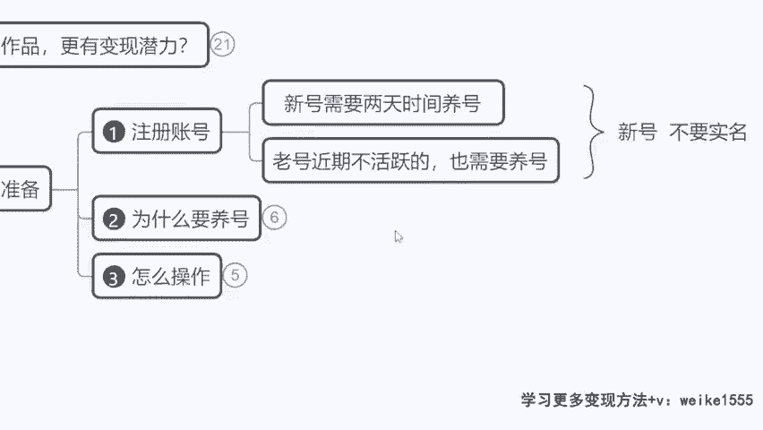

好来现在我们看一下啊，发布视频前的准备，那现在呢假设我们确定好了，我要做一个类型了。

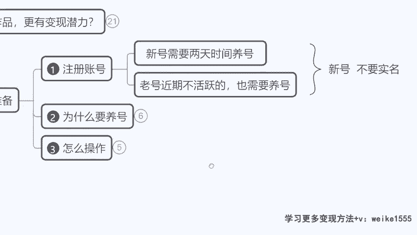

我发视频之前需不需要有所准备呢，需要啊，大家可以对号入座一下啊，你们看一下自己现在是什么样的一个情况，来我说三种情况，第一如果你现在没有小红书账号，咱们今天下了课之后去注册一个，但是先不要去实名认证。

这个号先给他挂在那儿啊，先空在那儿，不要实名，方便之后再注册其他的啊，来OK那么如果现在已经有账号的，是不是有账号，平时天天刷小红书的，今天也刷了，昨天也刷了，每天你刷小红书的时间必在半小时以上。

那么你明天开始就可以直接发作品了，但是如果说我们有账号，可是呢偶尔刷一刷，刷的不勤快，那么我们从明天起养号两天，包括我们刚注册的新号也是一样的啊，养号两天时间，这个养号为什么要养号。

小红书的养号跟抖音养号有啥区别。

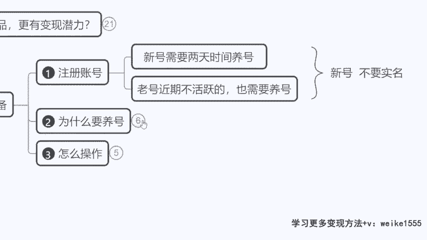

来我们看啊，咱们养号的目的，是为了把我们账号的活跃度给他拉起来。

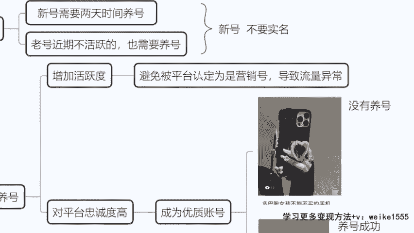

如果你一个新号或者说一个账号，平时我都不怎么用。

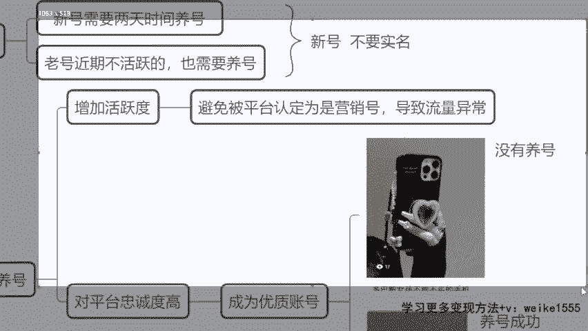

小红说我突然有一天开始去发作品了，对不对，一发呢要么是打广告，要么是卖货，那么平台会直接认定为你这个账号，是个纯纯的营销号啊，你的目的性太强的账号是不符合平台的调性。

因为小红书要走的就是我在不知不觉当中，虽然我在卖货，但是我看起来没有那么的直接，我们还是要委婉一点点，所以说小红书啊，他会打击一切非常明显，直接的营销号。

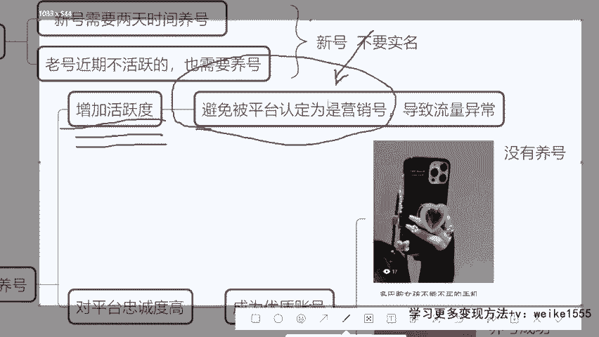

他会给你限流，导致咱们流量异常，那我该怎么办呢。

对吧，这两天我该怎么去准备呢，怎么样让平台对咱们的认可度给他提高呢。

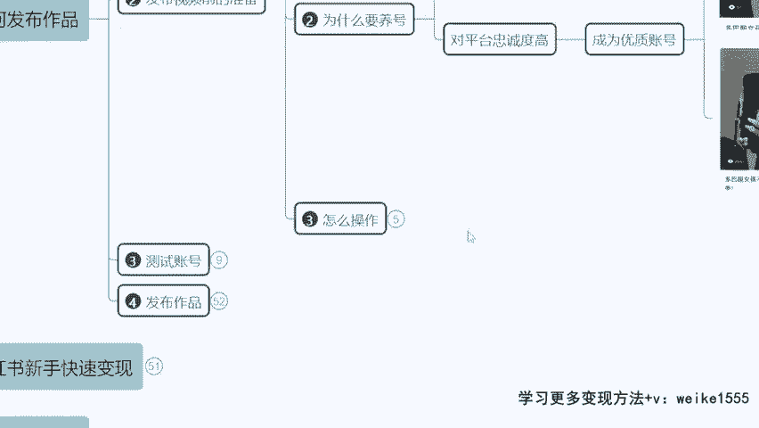

来看一下怎么操作啊，这个所谓的养号不需要说我嗯嗯我搭着一个。

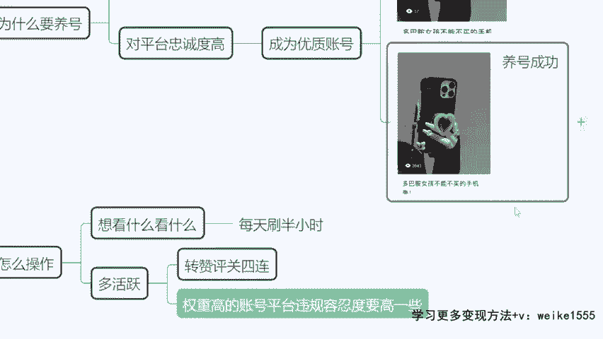

我要做类型我一直看，比如说我我喜欢美食啊。

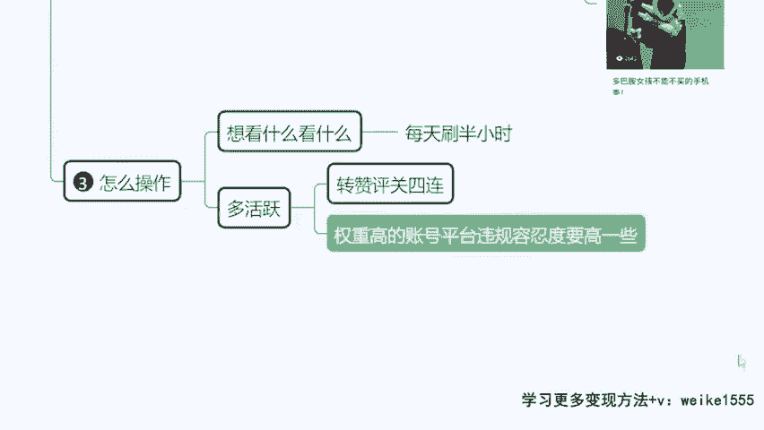

我要做美食，天天看美食，不用这样啊，那比如说呃我直接就按照咱们自己的喜好来。

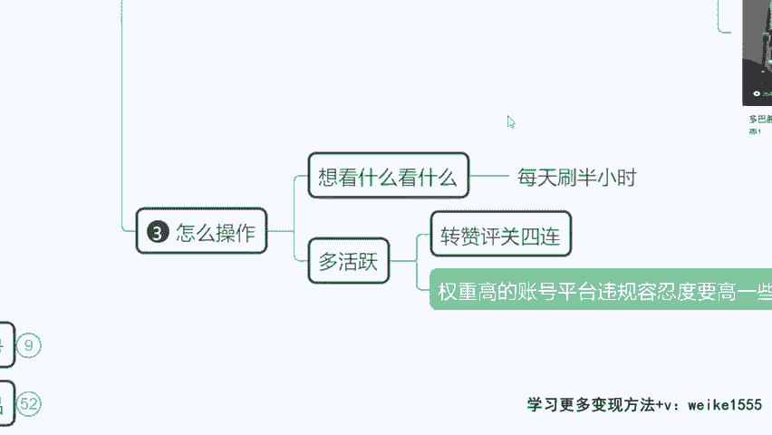

我再推荐你去看，我看到喜欢感兴趣的，你们多选几个去点赞，然后去评论去收藏，重复两天时间，每天刷够半个小时，那这个其实就是在给我们凑一个。

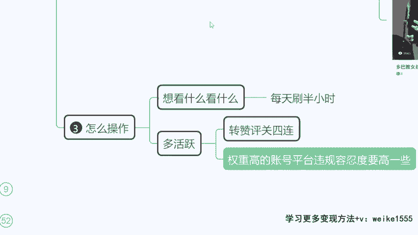

平台的一个活跃度啊，当你两天都这么去做了之后。

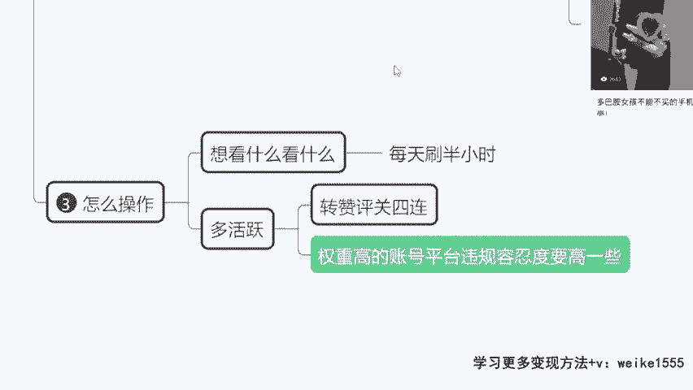

A平台发现你对我平台的认可度确实还不错，是不是每个作品呢有这个转发点赞评论啊，收藏关注五连，对不对，那这个时候平台就会认为说。

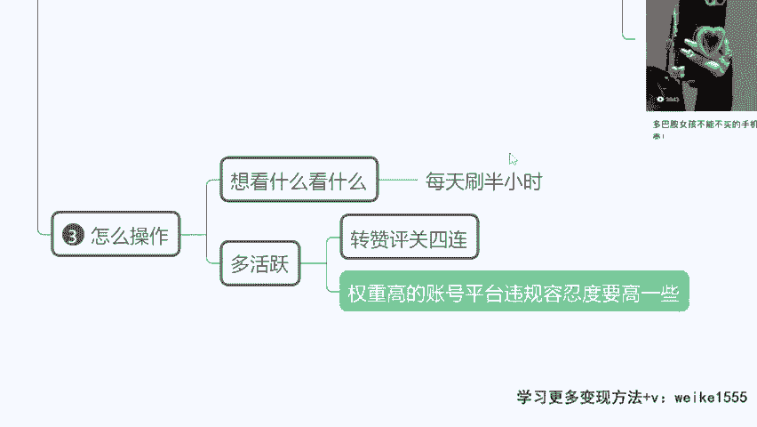

你的账号权重还是比较高的，你的账号的活跃度。

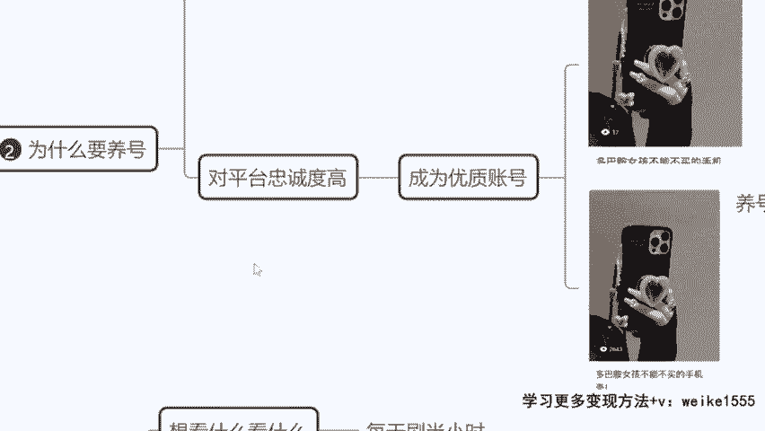

平台的一个忠诚度还是比较好的，是不是，那这个时候呢就会给到咱们优先推流的机会。

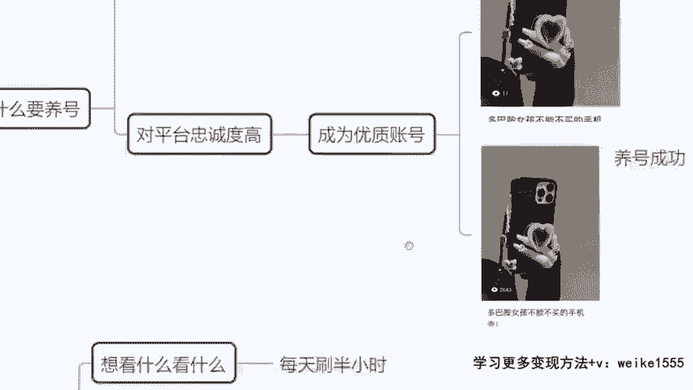

你看如果咱们的账号没有养号的情况下，同样的作品发出去啊，这个作品应该发两个小时了，这个小眼睛就播放量17，对不对，这种播放量属于很少水很少，刚注册的小红说这个橘龙同学说的，放几天才可以放两天。

这两天不是说放，那是要去刷视频，需要去关注，需要去点赞，要活跃的啊，你看如果不去这么做，17对不对，这个号属于直接限流啊，但如果说我们做到位了，你看这儿看到没，重新。

就等于说这个号是我们之前一个学生注销了，重新再发，就直接两小时之内蹦到了2600多个播放量，直接就开单了，直接开单，一个新号立马开单的，就是第一天，就是比如说养号两天啊，养号两天完再发作品。

属于他第一天发作品的时间嘛，对不对，第一天直接开单，发作品，第一天直接开单啊，所以说这个是很关键的，这个是很关键的，因为当我们成为平台优质用户的时候。

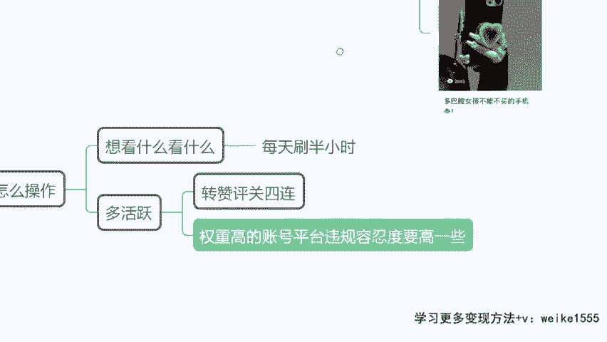

平台给我们的容忍度更高，举个例子啊，今天我发了个作品，我里面用了关键词，比如说我的这个手机壳是最可爱最时尚的，我用了这个罪字，它属于虚假营销对吧，过度营销，那这个时候如果你的账号养号到位。

平台呢会直接给你发警告通知，先把你的作品下架，然后告诉你，你的这个作品当中哪几个字存在违规行，违规行为，要求你立刻整改，半小时之内整改完毕，再重新上传，你的作品还会继续推流，他会给你提示的。

但如果今天你没有去养号，你的做你的这个账号平台的一个忠诚度不高，他直接给你姓刘，不给你任何通知，你发任何一条作品都没有播放量，明白没记住没有。

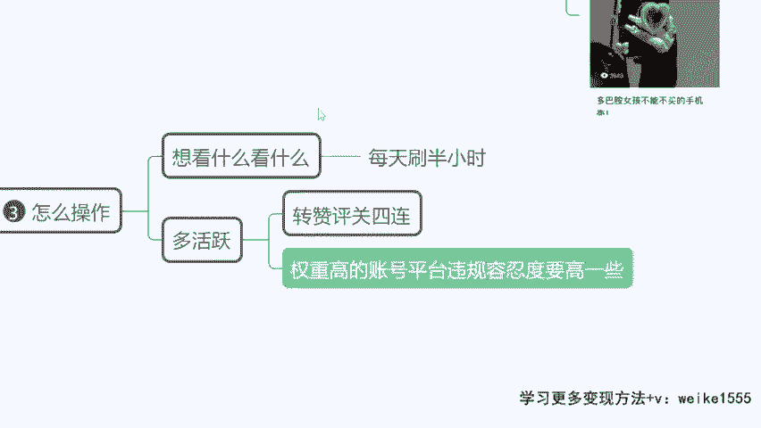

所以说养号很关键，今天明天后天最好，我们多去养几天。

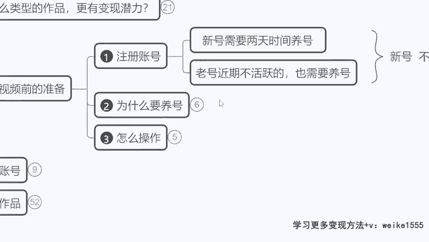