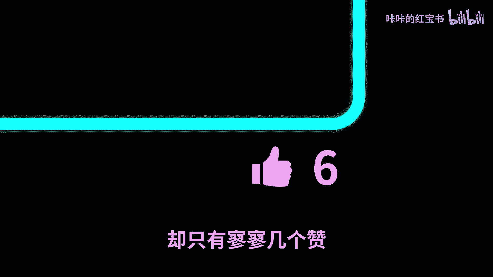
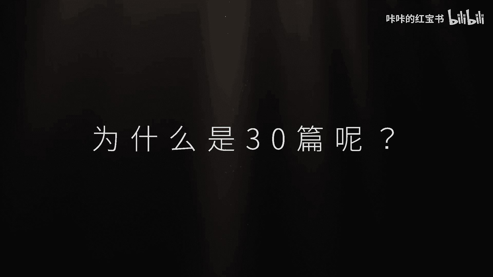
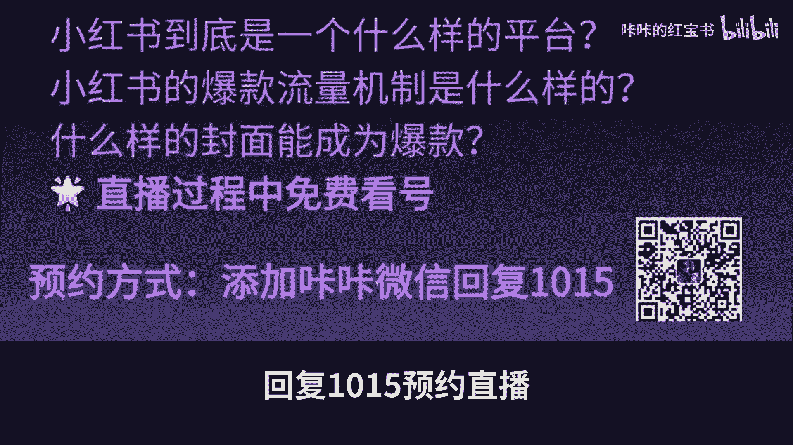

# 【小红书赚钱2024】如果做1个能赚钱的小红书账号就跟「玩游戏」一样简单……从0到1、28天、4个步骤、在2024年快速起号，看这一条视频就够了 - P1 - 咔咔的红宝书 - BV1V525YXEys

点击进入这条视频的你是不是非常纠结，都2024年下半年了。

现在开始做小红书会不会太晚了，我真的能火吗，纯小白我该怎么开始啊，还有还有我该小心哪些坑，我知道你很急，但你先别急，从2016年开始，我就一直在折腾自媒体，这一路上我踩过无数的坑，现在终于总结出了一套。

让你少走弯路的起号秘籍，所以今天我要用最简单粗暴的方式，把我这7年的经验浓缩成四部，手把手教你如何从零到一二十八天。

做一个能赚钱的小红书账号，这个方法同时也是我在我的小红书训练营里，教给我的学员的，所以如果你能看到这条视频的最后，那么恭喜你，你已经成功听完了23餐，50秒的付费内容，第一阶段，倔强青铜。

只要开始就算胜利。

如果你之前从来没有接触过自媒体，甚至完全没有在任何公共平台上发布任何内容，是真正意义上的纯小白，那么你要从第一个阶段开始。

你会自然地开始，有各种想法在你的脑袋里冒出来，但我的定位是什么，到底要在小红书发什么内容啊，我这个人有什么优势啊，我选择的这个赛道里有那么多竞争对手，还要我做吗。

等等等等，你看到没有，第一步已经难住你了，对于新手来说，最大的障碍就是过度思考，我在我的训练营里也发现过类似的现象，虽然我在训练营里，第一节课就教了大家很多定位的方法和小窍门，甚至把我的时间都贡献出来。

给大家做1V1的语音咨询。

就像一个人生导师或者说是心理医生一样，去剖析学员们的能力象限，但是在课程结束之后再来回顾。

还是会有一小部分学员，甚至都完全没有提交过自己的账号信息，或者账号包装是空白的。

所以这让我意识到，对于纯新手的第一个阶段，绝对不是一些术的东西，而是道的东西，那就是克服自己的心理障碍，所以我把第一个阶段命名为倔强青铜，因为在这个阶段的你真的很倔强。

但别担心，在这一周里你要做的非常简单，只要做两件事，一创建一个新的小红书主页，二写三篇文字备忘录，创建一个新的小红书主页，就像每次我们点击进去一个游戏的初始界面，我们总是要对我们的英雄玩成初始人物。

设置英雄叫什么名字是什么，英雄类型是战士，法师还是奶妈，另一个脸是什么肤色，什么发型，穿什么衣服，记住在这个阶段，根本没有人会点击进入你的小红书主页，所以没关系，你可以按照你的喜好去更改你的英雄配置。

不过记住对于小红书来说，七天只能修改三次。

所以英雄请珍惜你的出场配置机会，写三篇文字备忘录。

你可能会想我写备忘录干嘛，如果我要拍的是视频怎么办呢，别担心，你只需要把你想表达的内容写出，你就完成任务了，因为文字是小红书最低的门槛。

我们会经常看到一个，根本没有什么粉丝量的素人账号。

用几句话的小红书笔记，就能收获成千上万的点赞。

甚至还有上万的评论，这就说明小红书跟其他平台不一样，是对普通人最友好的一个平台，为什么只有几句话，风靡很简陋的小红书都能火呢，那我们就来这里分析一下小红书的推送逻辑，每一篇小红书笔记都会被打上一个分。

这个分叫做size值，小红书的笔记size的值等于点赞一分，收藏一分加转发四分，评论四分加关注八分，所以这些虽然次数不多，封面也没有那么好看的，小红书笔记，一般都会击中互联网冲浪者的某根神经。

一旦大家在你的评论区讨论起来，就相当于无限的给你的笔记报金币，那你的笔记就更有可能冲上流量值的，更热门层级，这三篇文字备忘录，也同样可以拿来当视频的脚本。

不要去想我是不是要开始考虑买相机了，是买佳能G7X3还是大疆pocket three，也不要去想用什么软件剪辑，我是不是要学一个final cut还是premiere，就用你每天要用到的手机拍摄。

简单地对着镜头说话，不用编辑，甚至完全不用发布，通过这三条视频的拍摄剪辑和封面的尝试，你会至少摸到一些拍摄的方法，剪辑软件功能和在线设计工具的熟悉。

这将会是一个全新的旷野，你需要去发现，而什么样的食材组合是一堆浆糊，倔强的青铜，在第一个阶段，你可能会考虑担心两个问题，我做的不够好，怎么办，万一我发出来的东西根本没有人点赞怎么办。

如果我熟悉的朋友看到我的账号取消，我怎么办，万一我发出来的内容被很多陌生的网友骂。

怎么办，我现在回顾我最早的时候拍摄的一些视频，完全就是社死状态，整个人像是突然被摆上了讲台，说话状态超级做作又紧张，说的完全不是人话，要掌握任何一项技能，任何人对我说的就是任何人，即使是天才。

一定要经过长年累月的努力才能精通的，那把这个时间拉长，你现在拍摄的三条视频，不过是经年累月的开始，就算是个垃圾又如何呢，鳞片的创始人RAFHOFFMAN曾经说过一句话。

如果你对产品的第一个版本不感到尴尬。

说明你发布的太晚了，在这里我也送给大家一首应景的小诗，上高中的时候，我经常在开小差的时候被老师叫起来回答问题，很多时候神游太空的时候也会被老师点名，高中又是青春期最注重自己形象的时候。

每次在全班50个人面前站起来的，我就是一阵脸通红，但那个时候我就发现，当我坐下来的后半堂，还在为当时回答不出问题懊悔不已的时候，环视全班同学，根本没有人看我和关注我的情绪。

因为关注你自己最多的人就只有你自己而已，我很幸运啊，在2016年最开始接触自媒体的时候，就看了一本书，叫做被讨厌的勇气，在这本书里，我彻底告别了受他人评价之苦，后来我几乎认识的每个朋友。

我都会给他推荐这本书，在这本书里有一个核心的观点就是客体分离，他说别人如何评价你的选择，那是别人的课题，你根本无法左右，决定开始做小红书，并发布三条小红书笔记，你就已经完成了你的课题。

那么他人会如何评价，那是他的课题，与你无关，面对任何问题，我先思考他是否是我可以控制的，如果是，我该怎么着手解决。

我不是，那我为什么还要担心，第二阶段。

任意白银先成为优秀的消费者，斗破第一个倔强青铜的阶段，恭喜你，你已经成功完成了新手村的任务，完成了三条文字内容，接下来在第二个阶段，你需要做一个重要的选择，那就是决定你和小红书这款游戏的关系。

你是想和玩一玩，还是想要当一个职业玩家。

随便玩一玩，指的就是把小红书当成一个，只给陌生人看的朋友圈，在生活中遇到什么有趣的事情，就发一个小红书记录一下，比如旅行之后就写个游记啦，在路上遇到美丽的街景就拍个照片，做个职业玩家。

指的是我要靠小红书赚钱，它将会成为我除了上班之外的副业收入，甚至未来全职的可能性，就跟真正的电竞职业玩家一样，需要每周保持刻意练习，比如一周至少保持一次更新，在这里我要特别说明的是。

我绝对不会像任何不负责任的博主一样，让你盲目all in小红书，当然如果你现在本来还年轻，单身，没有需要照顾的家庭成员，这意味着你的抗风险能力很高，那么也许你可以all in，但如果你已经已婚了。

年纪稍长一些，有家庭成员要照顾，那么意味着你的抗风险能力则没有那么高，那么让你放弃现代工作而选择OE小红书，就显然不是那么明智的决定，所以我的建议是，以上两个选择，根据你的实际情况谨慎选择。

毕竟咱们可以有主业的同时拥有副业嘛，直到副业有起色了，再成为全职博主不迟，虽然有主业的同时保持一份副业，真的很难，需要成为时间管理大师，我就是曾经在有主页的情况下，最高记录同时在做三个副业。

但也正是因为有了这些副业，让我不仅能够对自己有能力，通过产品服务，直接从市场上赚到钱，有了自信复印的起色，还让我有了成为自由职业者的底气，立刻都会想说，好累啊，为什么要这么累，但是要活的不一样。

就不能像普通人那样过，其实网上已经有非常多的教学视频，前人比如咔咔，我就把多年积累的实战经验和避坑指南，都总结好了，并喂到你嘴里，除了视频之外，还有很多图文博客，应有尽有。

而我有一门系统性的小红书的课程，如果你有兴趣，可以点击视频下方的描述框了解详情。

但如果你觉得课程费用太贵，也完全没有关系，这条视频也有免费的建议，找对标，要成为一个好的创作者。

你首先要成为一个好的消费者，巴萨根基的CEO乔纳伊德。

一开始仅仅只是一位配音爱好者，他在配音的时候发现市场上的装备质量差，不环保，并且非常不耐用，为了解决他和其他配乐爱好者的痛点，所以他才开始自己手工制造攀岩钉，今天者才顺便成立了巴塔哥尼亚。

这个全球知名的户外运动品牌，阿拉哥尼亚，早期在攀岩爱好者里面声名大噪的攀岩装备，到后来破圈到硅谷华街制服的服装线，都源自于他的自身需求，每次乔纳伊德发现他的产品不好用的时候。

他都会根据自己作为消费者的实战经验，推动产品的升级，这些产品不仅解决了他自己的需求，还带动了整个市场的变革，同样的，当我们决定成为一名职业玩家后，第一步当然就是了解市场，了解你的同行做市场调研。

简单来说三个字，刷视频，我说的当然不是躺在床上无意识的刷视频，刷时间，而是从创作者的角度去看视频，分析视频，一只看跟你创作的内容相似的账号和视频，二当你决定点开一条视频的时候，问自己是什么。

让我点进了这条视频，是选题，标题还是封面，我可以从中学到什么，并用到了我的笔记里，三如果你在中途想要关掉一条视频的时候。

气象原因问自己为什么哪里可以做得更好，这是我和我的同事在刚加入抖音的时候，就意识到的视角转变，当我们把刷视频当成工作之后，刷视频就变得不再有趣了，因为你看到的不再是表面吸引力的感官刺激，而是底层逻辑。

你甚至会刷的想吐，但这绝对会是成为一个专业内容创作者的开始，我在28天起号时间表中，也同样给到了小红书对标账号分析模板。

以及如何利用对标内容搭建自己的爆款选题库，大家可以自行拿去使用。

第三个阶段坚韧黄金提升内容制作技巧。

经过第一个阶段，我们已经给自己的英雄完成了初始设置。

第二个阶段，了解了整个地图路线以及都有什么怪物，第三个阶段我们将进入到重要的爆装备阶段，也就是内容创作，这个时候你可能会想，这回终于买装备了吧，打光买什么。

是不是得买个灯啊，相机买什么相机好呢，大家还是复试，当然有好的灯光，肤色会更好看，有好的画质，视频的质感也会显得更高，但卡卡看过太多拥有绝佳画质的视频，却只有寥寥几个赞。

而一看就是用手机随便拍拍的渣画质，动不动就几万个赞。

在这个阶段里面，我们当然要尽可能地追求内容创作里的装备，灯光剪辑，音乐选择标题封面，还有制作效率，但不要追求完美主义，小红书之所以在国内各大内容平台里，无能能撼动。

就是因为它相比于其他内容平台更加追求真实，不知道大家有没有玩过塞尔达，最近卡卡就被这个游戏迷得五迷三道的，对于装备阶段有两点比较重要，一不同的场景使用不同的装备，二装备总是需要不断迭代进化。

遇到遥远的怪物们，用弓箭近战，我们用刀剑敲打矿的时候，我们用大锤点火，我们用火把在对应的场景下，使用合适的工具，总是能事半功倍，在内容创作的场景下，我们之前提到的装备都是为了场景。

也就是不同的审题而服务的，比如攻略类的内容就更适合用手账，笔记等图文的形式发布，那感想类的就更适合用视频的形式发布，因为视频能够更好地捕捉口播人的表情和情绪，我认为小红书的核心就在于讲故事。

人类自古以来都是通过故事建立联系的，讲故事就是关于人与人之间的情感连接，在我意识到这一点之后，我开始更加深入地学习如何去讲故事，这是一门艺术，如果你能够掌握讲故事的技巧。

那你真的不需要在表面功夫上花费太多精力，那么问题又来了，讲什么样的故事呢，如何获得审批的灵感呢。

最近我看的一本书，笔记的方法给出了很好的答案，从平常记录三类想法开始。

一这个灵感太棒了，无论是洗澡的时候，走路的时候，还是看书的时候，想到的灵感，把它迅速记录下来，内容的选题往往就来自于生活当中，比如我曾经当情侣博主的时候，跟男朋友吵了一次架。

并尝试使用非暴力沟通力的方法去沟通，发现这种沟通方法确实很实用。

所以这整个过程就被我们记录下来，作为审题，发在了情侣账号当中，获得了不错的流量，后面这个选题又不断的拿来做，效果都和个好，甚至还植入了产品。

帮我赚到了钱，二这个信息很有用，这是我们经常说的利他当你要去旅行的时候，一定会对陌生的地方感觉到很害怕，于是去小红书找攻略，然后根据不同的攻略和自己的经验，你又总结了自己的旅行计划和体验。

这个内容同样就会对后来去同一个目的地的人，会很有用，能帮助到你的内容，一定也能力他记录下这样的瞬间吧，但这种感觉真美好，也许你经常刷到这样的小红书标题，救命啊，这也太好吃了吧，不宣传叉叉叉，你糊涂啊。

这些标题看起来一点难度都没有，完全就是我们日常的口语，可就是这些标题准确地传递了我们当下的情绪，比如记录下打开一个快递的兴奋感，用到一个好用产品的欣喜之情，这样的情绪也会神奇地通过文字。

传递给在看笔记的粉丝引发共鸣，好了，我们知道不同的场景下要使用不同的武器，场景就是通过灵感利他情绪去区分的，具体的场景，灵感也可以根据不同的领域千变万化，而以下的武器却是固定的。

一个成功的小红书账号需要关注三个关键因素。

点击率，赞播比和互动率，点击率就是封面，小红书是双排流，不像抖音，是一个一个往下刷的单排流，所以更多的内容有了展示的机会，而你的内容有了更多的竞争对手。

这样才能让粉丝在大海中选择你的一条鱼，如何提升攻略图的吸引程度，我自己常用的软件就是搞定设计。

这个可不是广告哦，它会定期更新一些热门的小红书模板，直接在线排版设计就可以，标题的话我推荐看一看李诞老师出版的秒赞，这本书里面介绍了非常多如何写好标题的方法，再摸比内容。

假设你的封面和标题已经足够吸引人了，粉丝已经大喊捞针，捞到了你的内容，还要确保这些人看到你的内容之后，还愿意给你点赞或者收藏，这样小红书才会根据这个数据比例。

推荐给更多的用户，回到我之前说到的审题的部分，所以一定要给用户制作有价值的内容，比如有用价值或者请你续价值，留住粉丝，互动率互动除了提供有价值和有情绪的内容，还不够啊，最好还能引发粉丝讨论。

小红书是非常注重互动量的，越多友善的互动，就代表着这个小红书的社区欣欣向荣。

所以完全可以在你的内容里买一些问题，引发讨论，比如如果你发的是失恋指南的利摊类内容，就可以问问粉丝，还有没有哪一些可以治疗失恋的方法。

然后在评论区积极的跟粉丝们讨论起来，不同的场景使用不同的装备还不够，我们玩游戏的时候总会不断的更新装备，内容创作也是一样，在小红书或者任何的平台获得成功，无脑的发一堆视频是没有意义的，即便是现在。

卡卡已经做了这么多不同领域的新号，光是对他自己的账号，在各大平台也积累了大几万的粉丝。

但是每次写脚本和剪辑的时候，我都会尝试让视频提高1%，无论是讲故事，剪辑音乐，选择标题封面，这些都是可能提升的点，我会定期的去看一些优秀博主的视频，看到好的就跟团队讨论，是不是我们的视频也能更好。

当然不用一次吃成一个胖子。

每次提升1%就好，虽然我的视频到现在都还不完美，但却没关系，只要我不断前进，不断改进，它就会产生复利效应，不要过分追求完美，因为每一次视频都是练习的机会，很多人花很多钱买了一门昂贵的小魔术课程。

以为就能保证成功，但如果你不愿意成长，进化并改进的内容，那么任何课程都帮不了你，包括我的课程没错，小红书课程确实能为你提供指导，并缩短你取得成功的时间，但如果不愿意努力，你在任何领域都无法成功。

没有人可以替你承诺，第四阶段超越铂金，用AI高效复制爆款。

不信你，你已经打到最后一关的大boss了，这一个阶段的关键词是超越，这个超越不是超越别人，而是超越自己，因为通过前面的三个阶段，我们已经成功发布了30篇内容了，为什么是30篇呢。

在我的训练营里，我的学员总会在发布之前就给我发消息，看他这个可不可以发呀，我说发发发都能发，是骡子，是马拉出来遛遛。

等你发到了30篇之后再来找我，其实这个30篇可以说是十批，也可以是20篇，也可以是30篇，绝对的数字并不重要，而是我们需要一定的量级才能分析出结果，就像是一个实验，我们首先需要一定的样本。

那样才能得出某个结果，所以我们已经发布了30篇内容了，幸运的话甚至已经有了若干个小爆款，甚至大爆款，这个时候我想要引入一个概念，叫做异常值，所谓异常值就是在这30篇的笔记里，有没有哪一篇的数据不太一样。

比如你平常的笔记也就十几个赞，但是突然有一篇就是100多个赞，那么不要怀疑，直接去模仿这篇内容，也许就是这篇内容的选题，也许是封面，也许是标题，也就是复刻自己，复刻荣耀小红书就是复制爆款。

小红书就是复制爆款，小红书就是复制爆款，重要的事情说了三遍，这个时候我们就可以利用AI来，高效帮我们copy自己文案，可以把自己的爆款文案喂给CHEGBT，KIMI等等的语言类大模型。

让他帮助分析这个标题背后的方法论，并生成更多相似的文案内容，封面可以直接把爆款的封面模式改成模板以后，就直接使用模板更换照片和文字。

就可以既复制了爆款，又省时省力，甚至可以使用我之前在视频里反复教过的，KIMI加KA的批量生成封面的方法。

这样一天就能做完一个星期的封面，然后再安排一个定时发布。

一天就能搞定一个星期的内容，接下来的时间就躺着美滋滋，我在最近一期的视频中分享了，我测评了100多个AI工具之后，也的九个超强AI工具盘点，有兴趣的朋友可以先订阅我的频道。

下次观看保证不迷路，我也会在我的频道中持续更新，利用AI高效制作内容的方法，很多人会在我的评论很犀利的评论哦，原来就是你教大家生产网络垃圾。

但其实为什么要利用AI帮助我们提升生产效率，是因为以往做动画，做视频都是要非常专业的人才能做，没有几十年的功夫，根本连门都无法入，这样就挡住了很多，其实想法很出众，但是苦于没有童子功的内容创作者。

但有了AI的帮助，我们普通人也可以做动画，也可以剪辑视频，完全不受技术的约束，这样才能让我们的大脑更自由，创造力才得以展现，另外用AI帮助我们做一些枯燥乏味，费时间的工作。

是为了让我们的时间花在更值得投入的地方，比如看书，学习吸收思考，比如跟人碰撞合作等等，这些都是AI永远无法取代的塔塔一直相信，只有让自己轻松的事情才会持续不断的去做，这才是真正的长期主义。

这才会是我们在这条内容创作的取经路上，读不断前行的动力，我把今天的四个阶段都整理成为了。

一个可以按图索骥的28天的起号时间表，在2024年使一个小红书账号并不容易，但通过这四个步骤，你完全可以从0~1快速起号并获得成功，记住关键在于勇于开始积极调研，每次1%的迭代和利用AI复制爆款。

如果你有兴趣深入学习，考虑加入相关课程，获取更多的专业指导，看看也同样有28天的系统课程供你参考，另外卡卡将在2024年10月15日，进行一次免费的公开课直播。

停更的日子，凯凯一直忙着在给小红书，爆款训练营的小伙伴们，提供系统和1V1的服务，这一次公开课是完全免费的，在这一次的公开课里，你会听到小红书到底是一个什么样的平台，给予普通人什么样的机会。

小红书的爆款流量机制是什么样的，小红书的美到底在讲什么，详细剖析什么样的内容和封面能成为爆款，从底层逻辑到模板，一次性讲C处，直播过程中，免费看号和提供关于如何做自媒体的问题解答。

可以拿着你的账号来答疑解惑，只不过最后会送上免费的小红书，爆款封面制作手册。

可以添加卡卡的微信，卡卡red book，回复1015预约直播。

期望见到你们，我们聊聊天，感谢您的观看，希望这些建议能帮助你，在小红书的旅途中获得成功，如果您喜欢这个视频。

别忘了点赞和订阅哦。