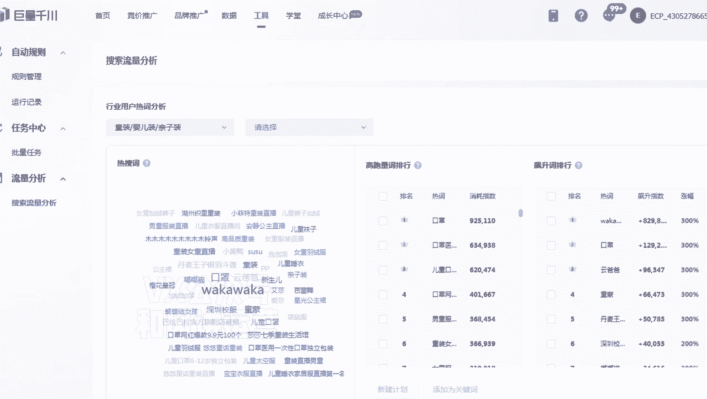

# 【小红书运营】B站最详细的小红书无货源电商实战全流程演示，必爆选品指南，多平台选爆款 - P10：9、小红书商城流量运营-怎么优势关键词 - 乜没sui意 - BV1F1421t75o

这节课给大家讲一下，小红书商城流量的一些运营玩法啊，商城流量运营，商城流量运营是最简单的，就是适合大家去铺货，去做无货源的嗯，搜索和推荐流量，都是在商城里面都有新品的一个复试，所以说建议大家定时去上新。

你不能说是上一批新之后，然后这个店铺不管了，所以说大家要定时去更新，特别是有季节性更替的这种产品啊，然后是首先你要选商品，你要先选词，选词的三个渠道，主要是商城下拉词，第一个多多热卖榜提取。

第三个抖音那个趋势词啊，当然我建议大家去，比如说淘系的嗯，那的生意参谋也可以啊，嗯因为呃抖音嗯，抖音的很多运营者其实是淘系那边啊，淘气专门是拿嗯嗯啊那个说错了啊，不是抖音啊，就是小红书。

小红书的很多那个运营人员其实是淘气，那别的运营，因为小红书这这个平台，其实也也算是一个稍微老的一个平台，但是呃大家一度是拿小红书当成一个呃淘系的，一个嗯一个造次平台或者是一个种草平台。

所以说他们那个很多基因组是相同的嘛，所以淘系的声音参谋的热度，其实能反映那个小红书的一个热度，所以陶艺陶器的声音参谋词也可以拿，具体给大家演示一下啊，第一个商城的下拉词嗯。

比如说咱们先选一个类目嘛。

比如说哎他这边是个V1的类目，咱们直接选择V1啊，额选择V1V1，你看额有V1。

他会推荐一个卫衣女，对不对。

然后继续我再点会再推荐一个卫衣女嗯，加绒啊，加绒我继续再点会卫衣女加绒嗯，加绒宽松对啊，所以说商城是因为用户都是比较懒的，他一般是喜欢点推荐的，所以推荐的词第一个有效，第二个就是额，第一个有效啊。

第一个就是额流量也比较大，它是一个真实的有效的一个词，所以商城的下拉词大家可以直接用，那么下拉词你建议你们去扩展二级和三级，比如说卫衣女，这是一个呃，这是一个核心词，那么魏婴女我再点两次。

比如刚才的加绒和宽松都可以啊，可以点两次，所以尽量是二级三级的扩展词，也不要扩展太多，扩展太多，这个词没什么流量嗯，这第一个呃第一个多多热卖榜提取词啊。

比如说点进去咱们的多多多多这个界面。

然后是随便选个类目，比如选择母婴，母婴的嗯，童装嗯，呃母婴的童装，你看这个地方有一个榜。

有一个排行榜，在这个地方有个排行榜的位置，咱们点击啊。

点击这是多多一个排行榜，排行榜里面就是多多能卖热的一个品，在那个小红书里面基本上差不了，大家都可以在这里面去选，比如说我选择啊童装还是选择童装这个地方。

你看棉服嗯，毛衣打底毛衣卫衣。

然后这个都是热品啊。

所以说我直接选一个类目的话，他会把这个类目里面，最近卖的热的品都推出来啊。

那么我就去选这个，比如说这个棉袄，棉袄是什么样的一个棉袄，我大概点一下，他是男童棉袄好评第一名啊。

畅销嗯，我去看一下啊，我一般点畅销啊。

长的，比如说这个款我第一名的话是男童外套秋冬嗯。

加绒加厚，男童棉服新款，比如说我觉得第一个比较好，对不对，它好评和那个它好，它好评率，还有一个呃它的一个热度都比较高嘛，嗯但是这个这个棉服是什么性质的，它是一个短款加绒加厚棉服。

对不对，短款加绒加厚棉服，大家去提取它的核心关键词啊，就是我用嗯这个词大家也要会提取啊，提取，产品，核心关键词嗯，首先是一个名词，就这个商商品叫什么，一个名词加两个修饰词，这样这样才能去确定一个产品啊。

一般就是就这个逻辑啊，一般一个名词加一个修饰词不足以去确定，长加两个名词才能记得，大路狂加两个名词才能确定这个这个产品。

那么这个产品的话就是第一个啊，男同它的一个核心的关键词是什么。

男同，男同对吧，第一个啊不是它的核心关键词是那个男同，棉袄。

嗯然后它的修饰词是短款。

对啊，因为分短款长款吗，短款呃加厚嗯，第一个修饰词是加厚加绒，加厚加厚都可以啊，那么咱们拿这个词去呃，作为一个多多一个提取的一个热词，去搜这样的产品就行了，这是第一个渠道，第三个是抖音的一个趋势词呃。

给大家演示一下啊，就第一个抖音里面选词分两块啊，第一个是第一个是那个全民广场。

玄民广场建议大家学直接去点击橱窗，然后点全民广场呃。

小米广场，然后点击搜索搜索，然后是把这个搜完之后把这个再删了啊。

删了之后会直接会出来这样一个榜单啊，比如说我是做童装的，童装下面有这么多的热词，都是最近比较容易爆的，整个抖音上就是你看7日热销超多多少件，这个直接给你统计下来，这个这个词很好用的啊，都是这词啊。

这个大家可以去跟一下第一个渠道嗯，你看这是爆麦，然后也有热搜嗯，热搜热搜也有大家选择的童装，然后弱的热搜趋势，趋势是最近刚刚开始开始起来的，所以这种产品嗯相对来说就是比较新一点。

然后这个词是更有效一些啊，这个大家可以做一个参考，这第一种啊，第二种是巨量千川搜索词分析，因为抖音上热的词在小红书里面基本上差不了，所以说如果你有抖店的店铺。

在抖电那个聚2000川里面也给大家去过一遍啊。

这个抖电这个看大家的一个需求啊，如果你们有的话，就用没有的话无所谓啊，点击抖电之后有这个抖电的一个呃巨量千川。

点击巨量千川啊。

呃点击之后，这里面有个工具。

有个搜索额搜索流量分析，那么比如说你们做的是童装嘛，我就把童装选出来啊，玩具童车，嗯大家选童装，然后童装的话。

这里面可以下载那个这个桶装里面所有的词，把它下载下来，然后打开嗯，打开之后呃，这里面有童装的所有的词，有一个竞争度啊，啊大家可以做一个排序嘛，嗯可以做一个排序，比如说我是七天的一个搜索指数嗯。

然后七天的一个消火指数，大家尽量去根据热度，它既有即收缩度也比较高，但是我的竞争度有比较比较，相对来说比较低一点，然后这种词都是一个趋势词，趋势词的话大家多选一点嗯，比如说我这个是口罩云爸爸同盟额。

竞争度一的话，都是竞争度比较小的童装，这种词太大了啊，看一下啊，高品质童装，你看儿童睡衣现在的市场还是还是不大的啊，所以儿童睡衣大家也可以去做嗯，你看市场排名31，但是竞争度才一说明竞争不大啊。

然后儿童太空服啊，这个竞争还稍微高一些，亲自装，儿童裤子加绒，这个也可以啊，嗯所以大家可以在这里面去选择一些，相对来说好的比好的一些词啊，嗯还有一个就是你也可以选一些二级的，比如说我想单独做套装。

这样的词汇更多一些，你看我单独下载儿童套装，儿童套装里面也有这么多的词，嗯选一个竞争不大的啊，女生小时候一定穿过的衣服，这个是个形容词啊，这个你们可以搜一下小龙人，阳光女孩。

你看女女童秋装6~16岁潮款高级感，你看这个词就可以啊，大家可以通过这个词去选一些品啊，啊这是第二第三种啊，第三种选品方式嗯，军粮新传热搜词分析行选品广场热词，第四个声音参谋，声音参谋的话。

这个大家如果是做淘系的，你们可以去看一下啊，声音参谋，这些也是给抖音的趋势词是同理啊，找有有一定市场，市场热度，但竞争不是太大的词啊，然后就这种词去做就可以了啊。

