# 【小红书运营】B站最详细的小红书无货源电商实战全流程演示，必爆选品指南，多平台选爆款 - P11：10、小红书商城流量运营-如何选品 - 乜没sui意 - BV1F1421t75o

这节课给大家讲一下，这就是怎么样去通过怎么样去选品啊，选品分为两方面，第一个我直接是选出来这些优质的商品啊，那么这个优质商品我建议大家去，可以也可以在抖音啊，抖音同理嘛也是两种方式。

第一个我刚刚才说的抖音的一个选品广啊，抖音一个选民广场，选民广场指甲是选一些那个趋势性产品，第二个是呃，第一个也是同理啊，就是多多的热卖榜也可以选选定这个商品啊，鉴定选定这个商品给大家去演示一下嗯。

第一个渠道就是选品广场，嗯咸民广场，咱们还是拿童装为例啊，嗯母婴的童装，这个童装比如说咱们选儿童的外套，额外套你们你们就可以在这里面选嘛，选一些那个呃第一个啊，额选一些呃标准啊，这个标准是统一的。

我建议大家统一啊，第一个嗯销量嗯还可以，这个看类目了，然后评价占比10%以内的，这个都属于趋势品啊，而且还有一个还有一个指标，就是最近三天啊有频繁的频繁的触屏哦，最近三天有频繁的出评判断标准啊，第一岗。

这个销量规定多好，我不规定，因为不同的类目不同，比如说童装的女装的是远远大于童装的，比如说百货的是远远低于服饰的，所以这个没办法界定啊，大家就相对来说它销量不低就行了，然后是评价占比。

比如说它销量是1000个，他评价占比占比要是1000个的话，嗯啧额评价占比不超过百分10%，有1000个的话是100个以内的一个评价，然后最近三天它还在出屏，那说明这种产品就是好产品。

因为它只有成交了才出屏啊，第一个他评价又不多，但是销量销量多，那说明是最近刚刚报的，说明这种产品咱们上家上完家之后，就是大概率也能报，因为他是趋势性产品啊，这是判断标准，那么咱们选择啊。

咱们就在这里面选，你看第一个商品，它的一个。

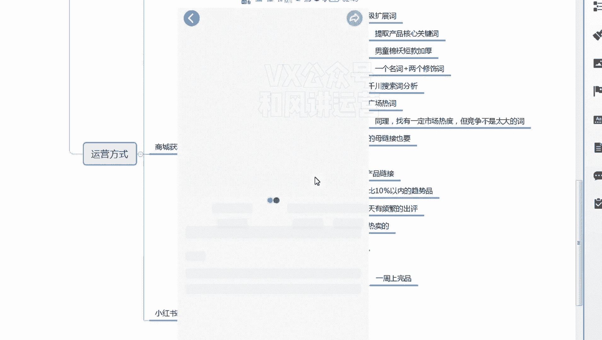

他那个销量是点进详情啊。

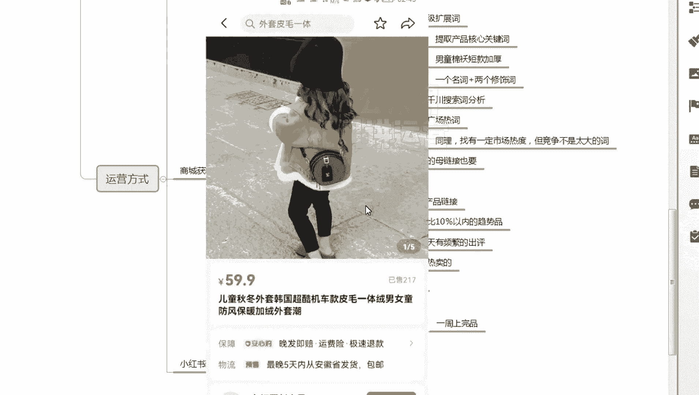

销量217，然后三个这个太少了嗯，太少了，继续再选。

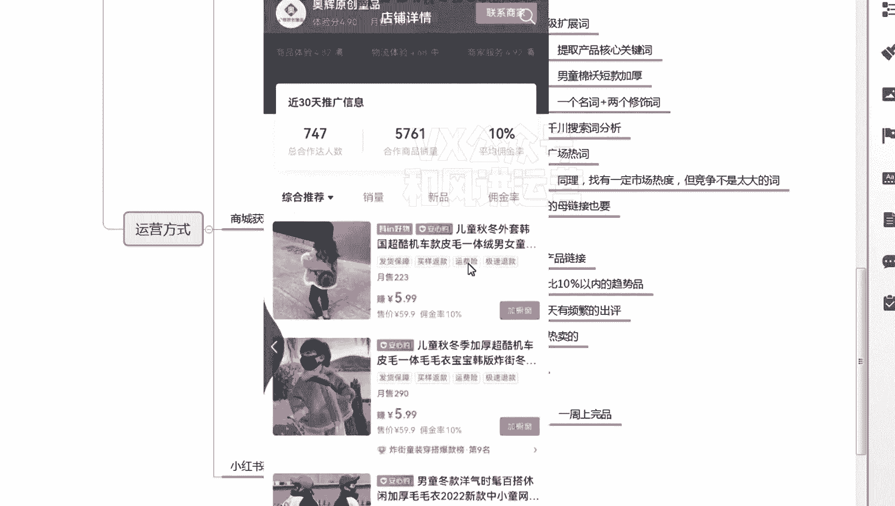

嗯哼销量1000，销量6000多的啊，销量6000的，嗯五千六二百六十三，哎，这个可以啊，这个评价也不多，然后最近三天有没有好评，看一下啊，啊一天一天评价啊，你看这个都挺好呀，这个这个款都可以。

完全可以选，这种是直接选款，因为款已经决定它是趋势品，对不对，那么还有一个就是呃，然后然后这是抖音的一个选款，还有多多的一个选款，多多也是同理啊。

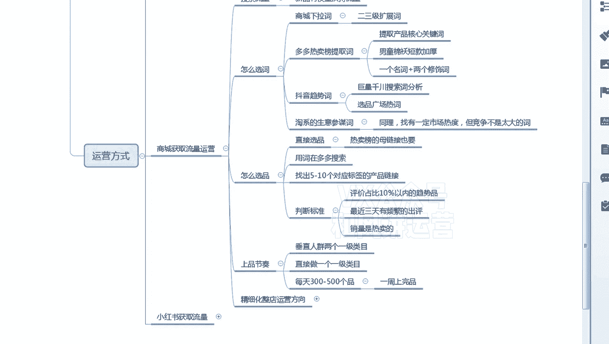

多多咱们进去多多的一个热销榜去看一下，就刚才咱们选词那个爆款。

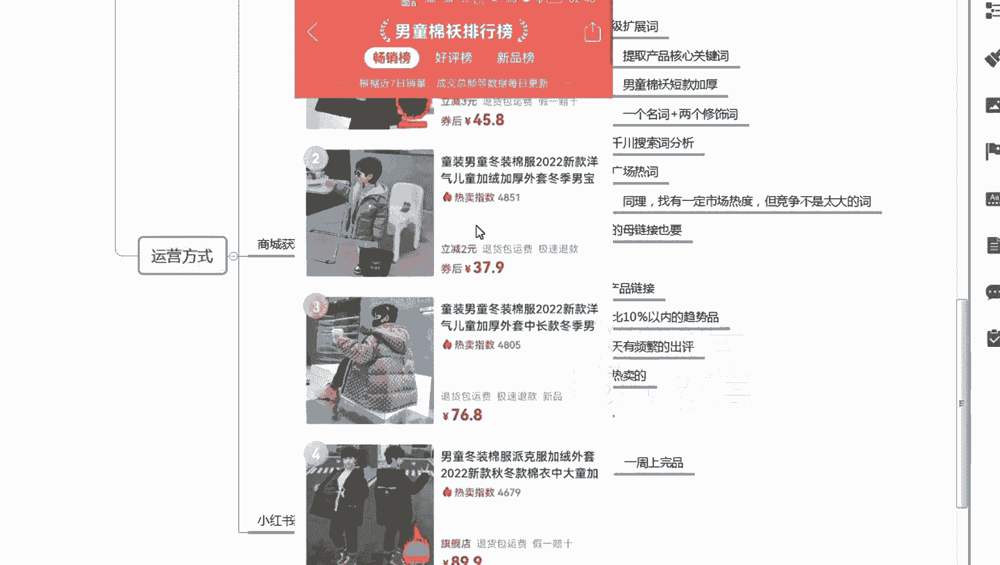

就可以直接把这个款直接直接做了，969039，然后是然后900多你看评价也不多嘛，然后再点进去看啊，这个因为多多的话嗯，也可以看最近最近最新的一个评价，有没有出来啊。

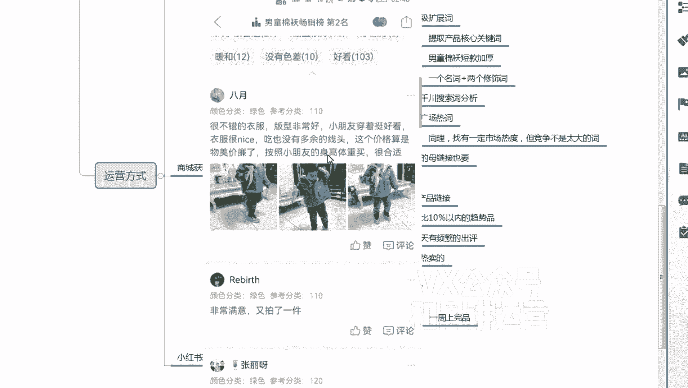

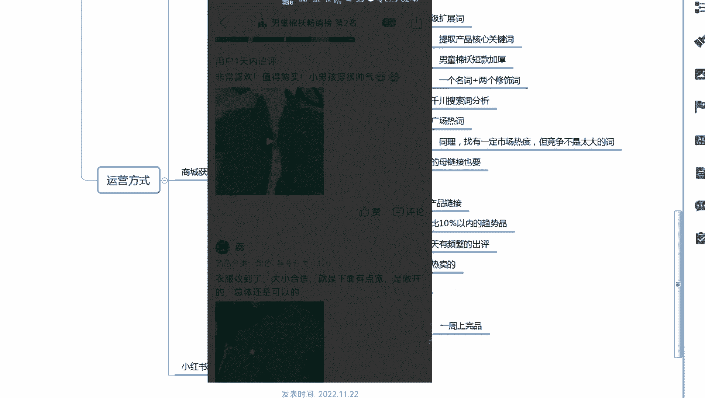

啊多多的评价以后评价时间11月22号，你看都是最新的一个评价啊，所以这个多多也可以的啊，这个评也可以啊，这是直接选品，直接选品的一个判断标准，那么刚才咱们嗯其他的章节已经已经说了，就是选词。

那么选词词选出来之后，怎么样通过词去选品，这个咱们直接是在多多里面搜的啊，直接在多多里面搜啊，比如我刚才是采了一个什么词嗯，男童棉袄短款加厚，因为选品的课程要给选词的课程结合起来啊，选品直接选品。

然后通过词选品，那么这个词如果是通过品去选的，那么这个品大家可以直接直接那个用上，对不对，但是这个词提取了之后，我通过这个词我再去选十个品，5~10个都可以啊，比如说男童棉袄短款加厚。

我把这个词去复制啊，这个职业要多多哦，因为咱们咱们尽量是在多多里面去找货源嘛，男同，棉袄，嗯短款加厚。

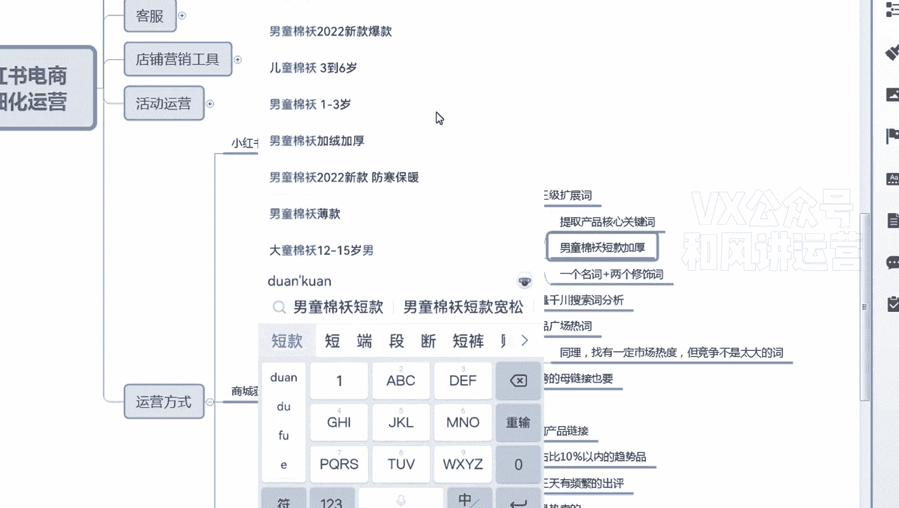

啊搜索，然后在这里面去找十个品。

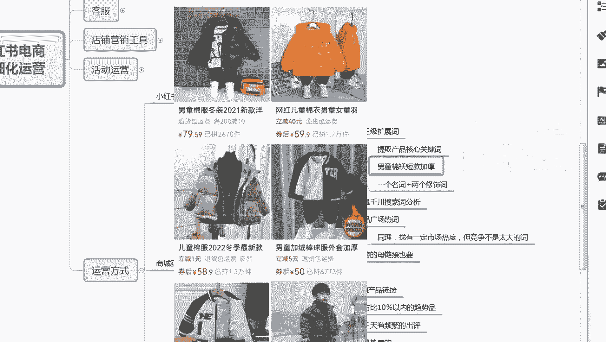

十个品，因为已经决定了嘛，就是他而且他是棉袄啊，符合标准的十个品，5~10个品都可以啊。

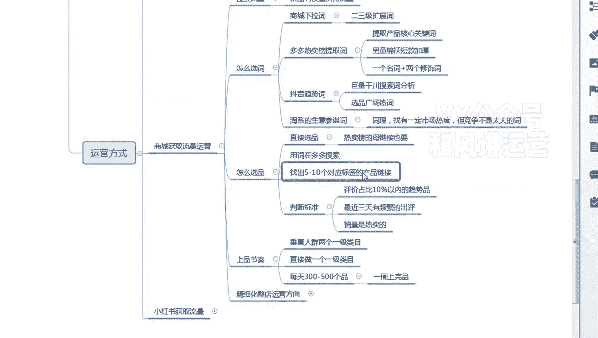

因为标签相同嘛，大家比如说第一个第一个我选择啊。

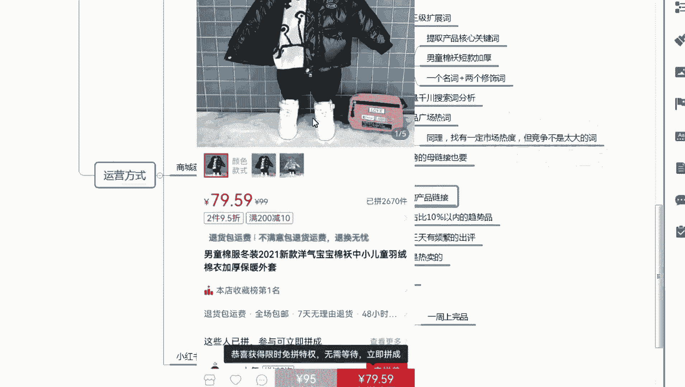

嗯然后是然后是判断标准还是这个啊，选十个品的片段标注也是这个评价占比十以内，三天又频繁出平，销量是热卖的啊，然后这个可以。

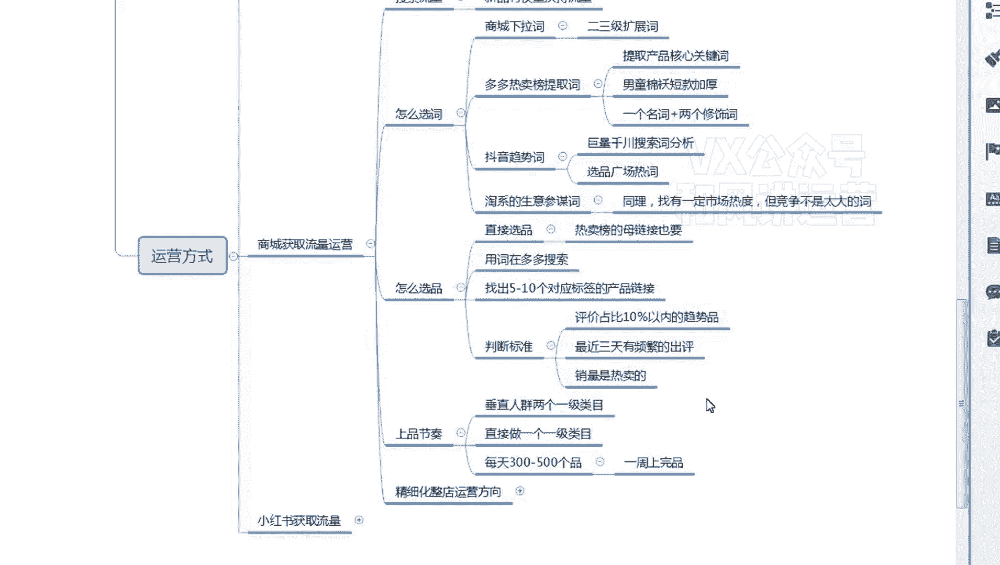

然后选定，限定复制链接。

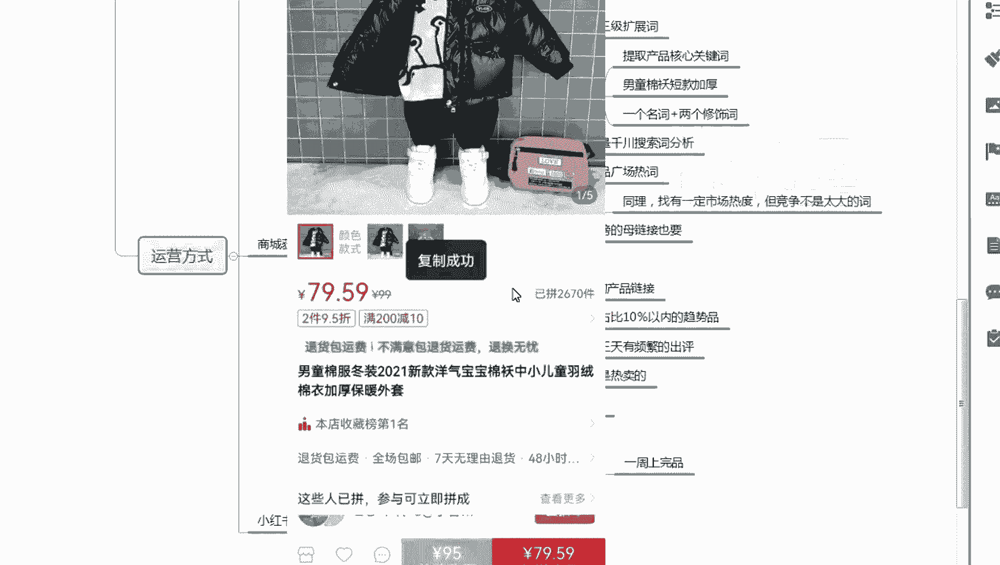

复制链接，然后是发送到你的电脑端，或者是你你手机端是建一个那个建一个excel表。

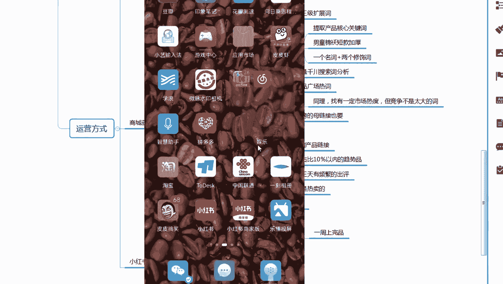

能跟电脑直接同步的都可以啊，就是WPS啊都可以，因为WPS登录你的账号，你的文档可以跟电脑端是同步的啊，你直接复制就行了，假如说第一个可以啊，第一个也可以。

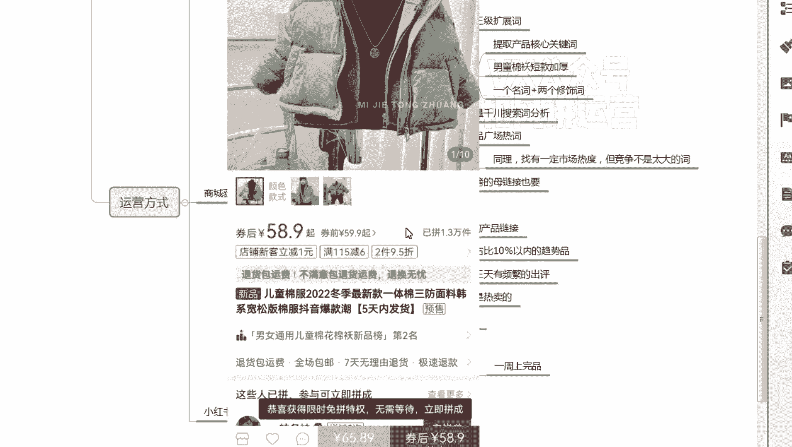

你就直接选嘛，看大概看一下一顶3万19啊，这个评价也不多嘛。

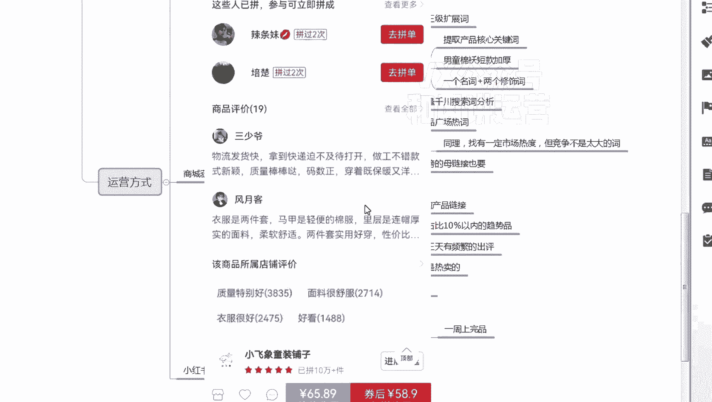

然后直接是选嗯短款加厚啊。

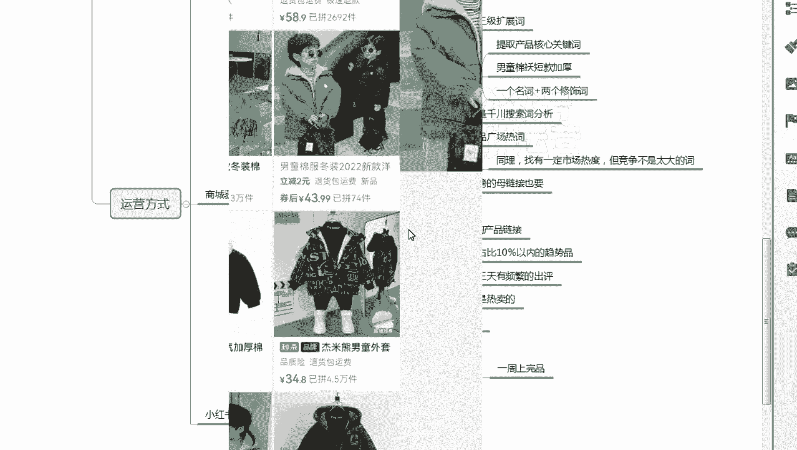

这个可以啊，这个是原款嗯，节选的时候大家看一下啊，就是尽量避免一些同行，就是那些做无货源的呃，基本上评价如果太低的话，我一般都不选，因为这种风险太高了，我一般都会选一些评价还可以的。

基本上有个将近100或100以上的这种评价，四七是十四百%，但他评价只有200多，所以也可以啊，然后点击那个最新的评价啊，嗯这个里面没有最新评价，最新最新评价啊，这个里面的最新评价啊。

大概看一下他最近基本上都是啊，11月22号都是最近的啊，这这个也可以，大家选5~10个，看自己呃。

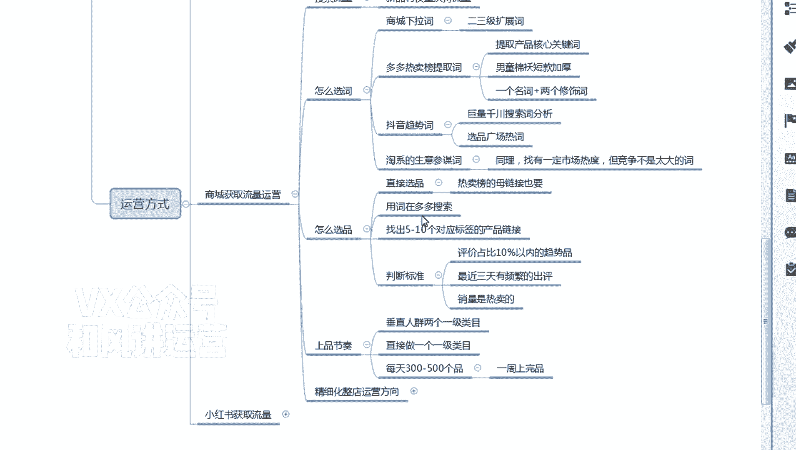