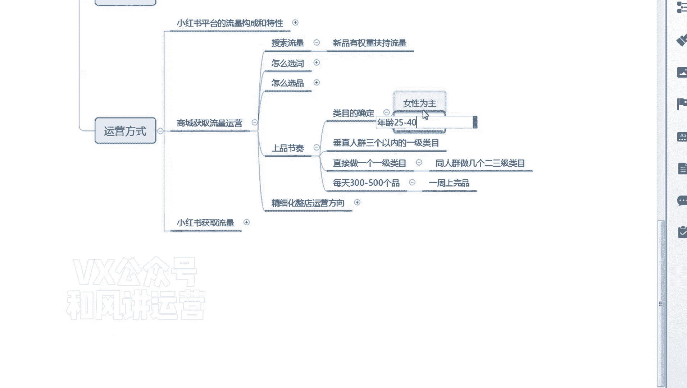

# 【小红书运营】B站最详细的小红书无货源电商实战全流程演示，必爆选品指南，多平台选爆款 - P12：11、小红书商城流量运营-整店运营（铺货） - 乜没sui意 - BV1F1421t75o

嗯这节课给大家讲那个呃，小红书的一个商品的一个节奏。

咱们选品选完之后，嗯先去确定类目啊。

类目确类目的确定的话，建议大家去做一些非标类的啊，啊这个给大家说一下类目的确定啊，因为小红书是额种草平台，他的女性的客户建第一个女性为主啊啊年龄。

25岁到40岁偏多啊。

嗯嗯就是这个用户特性，不是下沉市场啊，嗯跟跟那个淘宝标重叠啊。

都是一些电商的一些老用户，所以说不会说就正儿八经买东西是分享的。

他不会像多多一样，动不动给你来个仅退款啊。

动不动去骗你的运费险啊，这种概率不高啊，嗯所以说建议大家做的类目啊。

第一个就是服饰鞋包的啊。

而且是女装的服饰细胞，不建议带一个偏女性的啊。

不建议大家做男的啊啊第一个啊。

母婴母婴是最建议大家做的啊，母婴大类啊，说母婴童装包括童装啊。

母婴的就是一个婴儿的产品啊，婴儿啊婴儿产品。

然后童装啊，包括童鞋啊。

还有一个就是玩具啊，这都可以啊，都可以，建议大家做啊。

然后美妆护肤啊。

还有一个新奇特的一个啊，百货家居日用百货偏新奇特的啊，新奇特才能种草嘛，是不是啊，不然大家怎么能记住你这个东西呢，产生那个购买欲望嗯，然后是人群方面，就是大家去额一定做垂直人群。

因为他的逻辑跟抖音的逻辑是一样的，大家一定要做垂直，后面推荐流量才能精准，才能给你推到大流量啊，人群尽量做垂直人群，然后是嗯如果人群垂直的情况下，你可以做三个以内的一级类目，这第一种啊，如果人群垂直。

比如说你可以做额，我打个比方吧，如果你做儿童的，那么不是童装嘛，对不对啊，童鞋啊，对不对，同年龄同人群，童鞋还有一个家居服，对不对，是不是都可以啊啊那么这个就可以放在一个店。

那么你也可以直接做一个一级类目，因为你不确定人群的情况下，像某些特殊的东西你不确定，那你只做一个一个人群就可以了，然后你也可以做同人群做几个二三级类目，比如说童装下面我就想做童装的卫衣。

或者是呃或者是那个童装的那个啊，偏亲子装或者童装的家居服，这些都可以，因为你因为你的供应链可能就是这个，那你就做这个呗。

嗯然后每天上300~500个品。

正常情况下之前那个上传的时候有一个限制啊，就是每天的sq啊，只能上5000个啊。

所以说是再加上一些失败的，说一天的话。

目前我们上的是两三百个居多啊，将近300个，比较多啊，300个，然后是嗯一周的话，如果是平均下来三百三百三十七个，是养2000多个，我觉得一一周的话上个2000来个P2000左右啊，少完屏2000左右。

影响影响不大啊，啊基本都能完成啊，然后这样铺货效果非常好的。

你们铺完之后，基本上嗯大多数第二天都直接直接能出单啊，嗯就上完这商品之后就直接出单，但是商城我给大家讲了，他是一个基本盘，他会出的会越来越多，他搜索推荐，但他并没有一个大量的爆发。

他一天就是啊有个额一个十单，二三十单就这样去递增嘛，但是并不会有一个一天打几十或者上百单。

这个体量是没有的啊，但是它比较稳定啊。

大家定时去更新就可以了。

然后上品的话嗯如果是非非季节性产品啊，嗯目前那个抖店的违规特别少，抖变基本上没什么违不知那个小红书啊啊啊，有说漏嘴了，小红书那个目前基本上没什么违规，我们操作下来嗯，所以说额非基层产品不用下架啊。

嗯不用下架，可以常年卖，嗯不需要动销啊。

你们直接上架，然后是第二天基本上都能出单啊，嗯非季节商产品。

季节性产品啊啊过季你定时更新就行了啊。

定时更新更新替换产品嗯，所以说小红书就是上的越多，出单概率越大，大家就播一个概率，因为他是走到推荐和搜索，而且是上新，对新品有呃新品的一个加权，所以说你覆盖的产品越多，代表你的搜索词的啊，搜索词越多。

搜索词越多，你的流量的机会越多，然后是你产品越多，你被推荐的机会越多。

