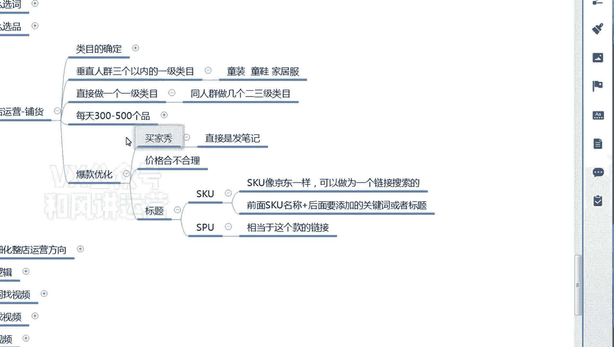

# 【小红书运营】B站最详细的小红书无货源电商实战全流程演示，必爆选品指南，多平台选爆款 - P13：12、小红书商城流量运营-爆款优化 - 乜没sui意 - BV1F1421t75o

好，这节课给大家讲那个，讲那个整店运营里面的铺货嗯，当咱们铺货铺那个铺一定量啊，嗯之后你肯定会有一些那个款会出单啊，就是陆陆续续有些款出单，那么如果联系出单的款，咱们可以做一个这个款的一个优化。

款的优化的话基本上是也是分几块的。

分三个方面啊，第一个转化率的一个优化呃，偏转化率的这种买家秀嘛，咳嗯买家秀咱们做一个买家秀的一个笔记。

是额就是小红书里面的评价，买家秀是需要买这个人发笔记的，他是发的笔记啊，不是单纯的订单的买家秀啊，所以这个稍微有那么一点门槛，你可以自己S都行啊。

嗯第一个就是看嗯跟转化率相关的就是价格。

价格合不合理啊，就你就把这个商品在整体上看一看，详情上有没有违规呀，或者什么东西啊，因为咱们批量铺货基本上嗯那个审查的不严，这里面我多说一句啊，就是我跟大家说这个批量铺货这里面啊。

包括怎么选品选词。

它是一个标准化流程，你们可以根据你们的店铺数量和和人力啊，你们你们可以松一点，也可以紧，可以紧一点，这个做过团队，做过项目的人，应该有经验啊，你们不要就是呃，因为因为也也有学员去问我了吗。

我按你的，我一天铺不了多少货呀，我说为什么铺不了这么多货呀，你们如果目标比较高，比如说我一个人我都管低，我一个人我都管三家店去铺，你一天肯定要找出来品比较多对吧，这个时候比如说你去看图片干嘛的。

就大眼扫一下啊，基本上没什么问题，你你看的多了，你肯定有经验啊，嗯对如果你就仅仅操作一家店，然后是时间又比较充足，你可以稍微细一点嘛，你越细效果越好，你越批量的话呃，单电效果不好，但是你量怼起来了。

效果也一样，可以就这个东西呃可松可紧，你们自己去额去衡量，但是我我我不能给你们讲一个特别呃。

松的一个东西，我肯定要给你们稍微看一眼一点啊。

你们得理解这个意思，对于铺货来说啊，如果电多的话，可以稍微稍微无脑和松一点，然后去卡这个指标啊，嗯那么你开始你肯定不是太严，你要看第一个做到买家秀，第一个价格合不合理，因为铺货的话。

我建议大家的利润都提高一点啊，就不要利润那么低，三十四十%就有点低了，嗯然后这个如果是他连续出单，然后是你觉得流量可以，但转化率偏低的情况下，你可以把价格稍微降一降，降成一个合理的价格就可以了啊。

然后是标题嗯，标题的话目前我先不建议大家去优化，我先不建议优化，因为嗯目前我们这边没怎么优化，我怕优化的话会影响这个单品的一个链接权重，会会不会给你断流呀，或者是怎么着了，嗯这这这个我有待去测试啊。

就我实话实说，所以说大家先不优化，后面我给大家同步，如果优化的情况下怎么优化，因为呃我是我之前讲了嘛。

那个嗯因为咱们是靠呃。

咱们商城有两波流量嘛，第有两个渠道流量，第一个是呃搜索，第一个是那个推荐，那么推荐会偏多一些，如果是搜索的情况下，你是不是要做那个关键词的覆盖吗，关键词覆盖它有两个，第一个SPUPU就是这个链接。

第一个SSKU，你可以在SKU上，因为他因为一个链接的搜索逻辑，它是按京东那一套的，它是按细化到SQU的，所以它每一个sq它也能搜到啊，能被索引到这个理解一下他你看淘宝呃，淘宝不过也有。

但是咱们咱们展现出来就是一个SPU，就一个链接，多多也是嗯，抖音也是，但京东和但类似京东这种，他们搜出来的单位是SKU，不是某一个链接，他们索引的单位是SKU，他们索引的单位的是SQU。

是不是SKU也能参与到搜索当中啊，或者推荐当中，那么这个SKU的话，你是不是要做一些标题覆盖，你可以拿一些这个单品的一些，主要的核心关键词，然后放到前面嗯，给大家举个例子啊。

嗯嗯比如说这个童装，它这个童装这是颜色，这是它的尺码，对不对，颜色参考身高尺码，那么你看颜色，我是不是可以把嗯比如说尺码或者或者颜色，这个这个一栏我后面我后面嗯，比如说我先弄一个，比如红色嘛，对不对。

红色是他真实的SKU呃，真实的颜色，这个选sq选项，但是我后面会加一个啊，加一个，比如说是嗯那个嗯满满月啊，这个这个叫满月套装对，这是他核心词，这个核心词对于他选择这个红色，选择这个颜色没有影响。

它只是为了系统的一个检索和索引，提高你被搜到的概率，这个大家理解一下啊，目前是这个这个逻辑，但是现在我先不建议大家去改，如果我这边大批量的有结果之后，你们再去改。

